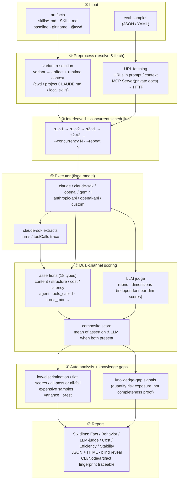

# oh-my-knowledge

[](https://www.npmjs.com/package/oh-my-knowledge)
[](https://github.com/lizhiyao/oh-my-knowledge/actions/workflows/ci.yml)
[](./LICENSE)
[](https://nodejs.org)

**English** | [简体中文](./README.zh.md)

Knowledge-artifact evaluation toolkit — measure your artifact's quality with objective data.

**Fix the model, vary the knowledge artifact, let the data speak.**

## Why this tool

Teams doing knowledge engineering produce lots of knowledge artifacts (skills today, but also prompts, agents, workflows…). When someone asks "why is v2 better than v1", you need objective data instead of gut feeling. `oh-my-knowledge` solves this with controlled experiments: **same model, same test samples, only the knowledge artifact changes.**

## Quick start

```bash
# install
npm i oh-my-knowledge -g

# scaffold an eval project
omk bench init my-eval
cd my-eval

# drop the artifacts you want to compare into skills/
# option 1: plain .md files (skills/v1.md, skills/v2.md)
# option 2: full artifact dirs (skills/my-skill-v1/SKILL.md, ...)
# a single artifact also works — baseline is auto-added as control

# preview the plan
omk bench run --dry-run

# run the evaluation (auto-discovers everything under skills/)
omk bench run
```

## Use inside Claude Code

After installing omk, talk to it in natural language from Claude Code:

```
/omk eval              # evaluate the artifact(s) in the current project
/omk evolve            # auto-iterate to improve an artifact
/omk gen-samples       # generate test cases
```

You can also just say "compare v1 vs v2 for me" or "improve this artifact" — omk picks the right command.

## Features

| Feature | What it does |
|---|---|
| **18 assertion types** | substring, regex, JSON Schema, semantic similarity, custom JS function, and more |
| **Six-dim evaluation** | Fact / Behavior / LLM-judge / Cost / Efficiency / Stability shown independently |
| **Multi-executor** | Claude CLI / Claude SDK / OpenAI / Gemini / any custom command |
| **MCP URL fetching** | pull content from private-doc URLs via an MCP server (SSO-protected knowledge bases, etc.) |
| **Blind A/B** | `--blind` hides variant names; HTML report has a reveal button |
| **Parallel execution** | `--concurrency N` runs N tasks at once |
| **Multi-run variance** | `--repeat N` repeats the eval and computes mean / SD / CI / t-test |
| **Auto analysis** | detects low-discrimination assertions, flat scores, all-pass / all-fail, expensive samples |
| **Traceability** | reports carry CLI version, Node version, artifact fingerprint |
| **EN / ZH switch** | one-click language toggle in the HTML report |

## How it works

Core idea: **fix the model and the samples, vary only the artifact and runtime context**, use interleaved scheduling to cancel time drift, score via assertions + LLM judge (dual channel), then layer on knowledge-gap signals to quantify risk exposure.



**Key design choices:**

- **Interleaved scheduling** removes time drift: different variants of the same sample are dispatched alternately rather than "all of v1 then all of v2", so model load / network jitter can't be mis-attributed to the artifact.
- **variant = artifact + runtime context**: `name@cwd` lets control groups explicitly declare the "project directory" input, separating "project-level accumulated knowledge" from "explicit artifact injection".
- **Dual-channel scoring is complementary**: assertions catch deterministic defects (must call tool X, must contain field Y); the LLM judge catches subjective quality (readability, completeness). Mean is taken when both are present.
- **Knowledge-gap signals** are not part of the score — they are an independent tracking channel that tells you "how much risk exposure this evaluation covered", for convergence tracking, not as a completeness proof.

## Eval sample format

Supports JSON and YAML (`eval-samples.json`, `eval-samples.yaml`, `eval-samples.yml`).

```json
[
  {
    "sample_id": "s001",
    "prompt": "Review this code for security issues",
    "context": "function auth(u, p) { db.query('SELECT * FROM users WHERE name=' + u); }",
    "rubric": "Should identify SQL injection risk and recommend parameterized queries",
    "assertions": [
      { "type": "contains", "value": "SQL injection", "weight": 1 },
      { "type": "contains", "value": "parameterized", "weight": 1 },
      { "type": "not_contains", "value": "looks fine", "weight": 0.5 }
    ],
    "dimensions": {
      "security": "did it identify the injection vulnerability?",
      "actionability": "did it give directly usable fix code?"
    }
  }
]
```

### Fields

| Field | Type | Required | Description |
|---|---|---|---|
| `sample_id` | `string` | **yes** | Unique sample ID |
| `prompt` | `string` | **yes** | User prompt sent to the model |
| `context` | `string` | no | Extra context (e.g. code). Wrapped in a code block and appended to the prompt. URLs are auto-fetched at runtime. |
| `rubric` | `string` | no | Scoring guideline for the LLM judge (1-5 scale) |
| `assertions` | `array` | no | Assertion checks; see [assertion types](#assertion-types) |
| `assertions[].type` | `string` | **yes** | Assertion type |
| `assertions[].value` | `string\|number` | depends | Check value (required for `contains`, `min_length`, `cost_max`, etc.) |
| `assertions[].values` | `array` | depends | String array (required for `contains_all`, `contains_any`) |
| `assertions[].pattern` | `string` | depends | Regex pattern (required for `regex`) |
| `assertions[].flags` | `string` | no | Regex flags (default `"i"`) |
| `assertions[].schema` | `object` | depends | JSON Schema object (required for `json_schema`, via [ajv](https://ajv.js.org/)) |
| `assertions[].reference` | `string` | depends | Reference text (required for `semantic_similarity`) |
| `assertions[].threshold` | `number` | no | Pass threshold for semantic similarity (default 3) |
| `assertions[].fn` | `string` | depends | Path to a custom assertion JS file (required for `custom`) |
| `assertions[].weight` | `number` | no | Weight (default 1) |
| `dimensions` | `object` | no | Multi-dimension scoring; key = dimension name, value = scoring guideline |

### URL auto-fetching

URLs in `prompt` and `context` are auto-fetched before evaluation and inlined into the text. Useful when referencing online docs, API references, etc.:

```json
{
  "sample_id": "s001",
  "prompt": "Generate test cases from this PRD: https://wiki.example.com/prd/feature-x"
}
```

At runtime, URLs are replaced with the actual content. Fetch order: MCP Server first for matching URLs (e.g. SSO-protected private docs), then plain HTTP for the rest. URLs already resolved by MCP are not re-fetched via HTTP.

**Private-doc URLs**: drop a `.mcp.json` config file into the project dir, or pass `--mcp-config <path>`:

```json
{
  "mcpServers": {
    "docs": {
      "command": "npx",
      "args": ["@example/docs-mcp-server"],
      "env": { "DOCS_API_TOKEN": "xxx" },
      "urlPatterns": ["docs.example.com"],
      "fetchTool": {
        "name": "fetch_doc",
        "urlTransform": {
          "regex": "docs\\.example\\.com/([^/]+/[^/]+)/([^/?#]+)",
          "params": { "namespace": "$1", "slug": "$2" }
        },
        "contentExtract": "data.body"
      }
    }
  }
}
```

**Public URLs**: fetched via plain HTTP. If they require auth, make sure the shell already has network access configured (VPN, proxy, etc.).

### Scoring strategy

#### 1. Assertion score

Rule-based local checks; each assertion yields pass/fail.

**Formula:**

- Pass rate = sum of passed assertion weights / total weight (0–1)
- Score = 1 + pass_rate × 4 (mapped to 1–5)
- Example: 3 assertions (weight 1 each), 2 pass → pass rate 2/3 → score = 1 + 0.67 × 4 = **3.67**

#### 2. Rubric / Dimensions score

The judge model (default `haiku`) scores 1–5 against the rubric. In `dimensions` mode, each dimension is scored independently and then averaged.

#### 3. Composite score

| Condition | Formula |
|---|---|
| Only assertions | `assertionScore` |
| Only LLM judge | `llmScore` |
| Both present | `(assertionScore + llmScore) / 2` |
| Neither | `0` |

### Assertion types

**Deterministic assertions (18 total):**

| Type | Description |
|---|---|
| `contains` / `not_contains` | substring must / must-not appear |
| `regex` | regex match |
| `min_length` / `max_length` | length bounds |
| `json_valid` / `json_schema` | JSON validation |
| `starts_with` / `ends_with` | prefix / suffix |
| `equals` / `not_equals` | exact match |
| `word_count_min` / `word_count_max` | word-count bounds |
| `contains_all` / `contains_any` | multi-value match |
| `cost_max` / `latency_max` | cost / latency caps |
| `semantic_similarity` | LLM-based semantic similarity |
| `custom` | custom JS function (30 s timeout) |

### Custom assertion

```js
// my-assertion.mjs
export default function(output, { sample, assertion }) {
  return { pass: output.includes('SQL'), message: 'checked for SQL keyword' };
}
```

## Six-dim evaluation

Reports display results across six independent dimensions (since v0.16 the legacy "quality" dim was split into three layers — Fact / Behavior / LLM-judge — so you see **which layer regressed** instead of a single composite number):

| Dimension | Metric | Description |
|---|---|---|
| 📋 **Fact** | fact-assertion pass rate | rule-verifiable assertions like `contains` / `json_schema` / `fact_check`, mapped to 1-5 |
| 🛠️ **Behavior** | behavior-assertion pass rate | execution-compliance assertions like `tools_called` / `tool_output_contains` / `turns_max` |
| 💬 **LLM-judge** | rubric score | 1-5 scored by the judge model against a predefined rubric; subjective, catches what rules miss |
| 💰 **Cost** | total cost, input/output tokens | API cost based on token usage and model pricing |
| ⚡ **Efficiency** | average latency (ms) | end-to-end latency from request to full response |
| 🛡️ **Stability** | CV (coefficient of variation) | score consistency across repeated runs (`--repeat ≥ 2`); single-run shows `—`, **honestly acknowledging what can't be measured** |

## CLI reference

### `omk bench run`

```bash
omk bench run [options]

options:
  --samples <path>       sample file (default: eval-samples.json, also detects .yaml/.yml)
  --skill-dir <path>     artifact dir (historical flag name, default: skills)
  --variants <a,b>       variant names; auto-discovered from the artifact dir if omitted
                         with a single artifact, baseline is auto-added
                         special values: baseline (empty artifact), git:name (git HEAD),
                         git:ref:name (specific commit), path with "/" (read file directly)
  --model <name>         model under test (default: sonnet)
  --judge-model <name>   judge model (default: haiku)
  --output-dir <path>    output dir (default: ~/.oh-my-knowledge/reports/)
  --no-judge             skip the LLM judge
  --no-cache             disable result cache (on by default; identical inputs reuse)
  --dry-run              preview only
  --blind                blind mode
  --concurrency <n>      parallel tasks (default: 1)
  --timeout <sec>        per-task executor timeout (default: 120)
  --repeat <n>           repeat N times for variance analysis (default: 1)
  --executor <name>      executor (default: claude); supports custom commands
  --skip-preflight       skip pre-evaluation model reachability check
  --mcp-config <path>    MCP config for fetching private-doc URLs via MCP Server
                         (default: .mcp.json in cwd)
  --no-serve             don't auto-start the report server after the run
  --verbose              print per-sample details (duration, tokens, output preview)
  --each                 batch mode: evaluate each artifact independently vs baseline
                         requires {name}.eval-samples.json paired with each artifact
```

### `omk bench run --each` (batch mode)

When `skills/` contains several **independent** artifacts, use `--each` to evaluate each one against baseline and produce a merged report.

```
skills/
├── asset.md                       ← artifact file
├── asset.eval-samples.json        ← paired samples
├── home.md
├── home.eval-samples.json
└── product/                       ← directory format also supported
    ├── SKILL.md
    └── eval-samples.json
```

Pairing rules:

- `{name}.md` → looks for `{name}.eval-samples.json` in the same dir
- `{name}/SKILL.md` → looks for `{name}/eval-samples.json`
- artifacts without paired samples are skipped with a warning

```bash
omk bench run --each
omk bench run --each --dry-run
```

### `omk bench gen-samples` (generate test cases)

Reads an artifact's content and uses an LLM to auto-generate eval-samples. Review and edit them before running eval.

```bash
# generate for a specific artifact (writes eval-samples.json)
omk bench gen-samples skills/my-skill.md

# batch-generate for every artifact under skills/ that lacks samples
omk bench gen-samples --each

# specify sample count
omk bench gen-samples skills/my-skill.md --count 10
```

Options:

```
  --each                 batch-generate for every artifact missing samples
  --count <n>            samples per artifact (default: 5)
  --model <name>         model used for generation (default: sonnet)
  --skill-dir <path>     artifact dir (historical flag name, default: skills), used with --each
```

### `omk bench evolve` (self-iterating improvement)

Lets the AI iterate an artifact automatically: evaluate → analyze weak spots → LLM rewrites → evaluate again → keep if the score went up, drop otherwise → repeat.

```bash
# basic: iterate 5 rounds
omk bench evolve skills/my-skill.md

# set rounds and target score
omk bench evolve skills/my-skill.md --rounds 10 --target 4.5
```

Options:

```
  --rounds <n>           max iteration rounds (default: 5)
  --target <score>       stop early when the score reaches this threshold
  --samples <path>       sample file (default: eval-samples.json)
  --improve-model <name> model used for rewrites (default: sonnet)
```

Each round's output is saved under `skills/evolve/` (`my-skill.r0.md`, `my-skill.r1.md`…), so you can `diff` to see what the AI changed. The best round is written back to the original file.

### `omk bench ci`

Run the evaluation inside CI. Exit code 0 on pass, 1 on fail — can be wired into gates directly.

```bash
omk bench ci [options]
  --threshold <number>   minimum composite score to pass (default: 3.5)
```

### `omk bench report`

Start the report server to browse historical reports, submit feedback, and delete reports.

```bash
omk bench report [options]
  --port <number>        server port (default: 7799)
```

### `omk bench init`

```bash
omk bench init [dir]     # scaffold an eval project
```

## Executors

### Built-in executors

| Executor | When to use | Description |
|---|---|---|
| `claude` | default | invokes `claude -p` via Claude CLI |
| `claude-sdk` | structured output | uses Claude Agent SDK — no stdout parsing, avoids buffer truncation |
| `openai` | cross-vendor comparison | invokes `openai api` CLI |
| `gemini` | cross-vendor comparison | invokes `gemini` CLI |
| `anthropic-api` | no CLI needed | calls Anthropic HTTP API directly (needs `ANTHROPIC_API_KEY`) |
| `openai-api` | no CLI needed | calls OpenAI HTTP API directly (needs `OPENAI_API_KEY`) |

API-direct executors support custom base URLs via env: `ANTHROPIC_BASE_URL`, `OPENAI_BASE_URL`.

### Custom executor

Any shell command can serve as an executor, communicating via stdin/stdout JSON:

```bash
omk bench run --executor "python my_provider.py"
omk bench run --executor "./my-executor.sh"
```

**Protocol:**

- **input** (stdin): JSON `{"model":"...","system":"...","prompt":"..."}`
- **output** (stdout): JSON `{"output":"model reply","inputTokens":0,"outputTokens":0,"costUSD":0}`
- stdout only needs to return the fields you care about; others default to 0. Plain-text output (no tokens/cost parsing) is also fine.
- non-zero exit code counts as failure

### Artifact directory layout

The built-in executors (claude / openai / gemini) support two artifact layouts, mixable in the same run:

```
skills/
├── v1.md                    # option 1: plain .md file
└── my-skill/                # option 2: full artifact dir
    ├── SKILL.md             #   this file is auto-loaded as system prompt
    ├── config.json          #   other files don't participate in eval, kept for completeness
    └── scripts/
```

**Variant resolution rules:**

`variant` is the experiment-group expression. After resolution, OMK produces an `artifact` plus an optional `runtime context` (currently mainly `cwd`).

| Format | Meaning |
|---|---|
| `name` | looks up `name.md` or `name/SKILL.md` in the artifact dir, resolves to one artifact |
| `baseline` | empty artifact, no system prompt — think "nothing at all" |
| `project-env@/path/to/project` | empty artifact, but run in the specified project dir — observe project-level runtime context alone |
| `git:name` | reads the last-committed version of an artifact from git HEAD |
| `git:ref:name` | reads an artifact from a specific commit |
| `./path/to/file.md` | path with `/`: read the file directly as an artifact |
| `variant@/path/to/project` | attach a run dir to any variant; supports `name@cwd`, `git:name@cwd`, `/file.md@cwd` |

When `--variants` is omitted, all `.md` files and subdirs containing `SKILL.md` under the artifact dir are auto-discovered. With a single artifact, `baseline` is auto-added as control.

```bash
# auto-discover all artifacts under skills/
omk bench run

# explicit two variants
omk bench run --variants v1,v2

# compare empty artifact vs explicit artifact
omk bench run --variants baseline,my-skill

# observe project-level runtime context in isolation (recommended with a self-describing label)
omk bench run --variants project-env@/path/to/target-project

# compare "project-level runtime context" vs "explicit artifact injection"
omk bench run --variants project-env@/path/to/target-project,/path/to/target-project/.claude/skills/prd/SKILL.md@/path/to/target-project

# before vs after (old version read from git history)
omk bench run --variants git:my-skill,my-skill

# direct file paths
omk bench run --variants ./old-skill.md,./new-skill.md
```

**Prerequisites:**

- **claude**: install [Claude Code](https://claude.ai/code) and authenticate
- **claude-sdk**: install [Claude Code](https://claude.ai/code) and authenticate (uses Agent SDK, no CLI stdout parsing)
- **anthropic-api**: set the `ANTHROPIC_API_KEY` env var
- **openai**: `pip install openai` and set `OPENAI_API_KEY`
- **openai-api**: set the `OPENAI_API_KEY` env var
- **gemini**: `npm i -g @google/gemini-cli` and authenticate

### Agent evaluation and project-level runtime context

When the executor is `claude-sdk`, OMK supports a first pass of agent-aware evaluation.

A few concepts worth keeping separate:

- `artifact`: the thing being evaluated — baseline, skill, prompt, agent
- `variant`: the CLI expression for an experiment group
- `runtime context`: the runtime environment; currently mainly `cwd`. In project-type agent scenarios it includes the project dir, its `CLAUDE.md`, local skills, and any other environmental factors that affect behavior

In OMK, `agent` is not a catch-all term and neither is `skill`. A cleaner phrasing: **you are comparing how different artifacts behave under different runtime contexts.**

- auto-extracts turns / toolCalls traces
- supports assertions on tool-call behavior
- supports running under a specified `cwd`, so Claude Code auto-loads the project's `CLAUDE.md`, skills, and local runtime context

#### Recommended executor

```bash
omk bench run --executor claude-sdk
```

#### Agent-related assertions

| Assertion | Meaning |
|---|---|
| `tools_called` | must call the specified tool(s) |
| `tools_not_called` | must not call the specified tool(s) |
| `tools_count_min` / `tools_count_max` | tool-call-count bounds |
| `tool_output_contains` | output of a specific tool must contain given content |
| `turns_min` / `turns_max` | turn-count bounds |

#### Three common control setups

**1. Bare-model baseline**

No system prompt and no knowledge-carrying project dir.

```bash
omk bench run \
  --executor claude-sdk \
  --variants baseline
```

**2. Empty artifact + project-level runtime context**

No system prompt, but runs inside a project dir. This is **not** a strict "bare baseline" — it is "empty artifact + project-level runtime context".

```bash
omk bench run \
  --executor claude-sdk \
  --variants project-env@/path/to/target-project
```

**3. Explicit artifact injection**

Inject an external `SKILL.md` as the artifact while also keeping the project dir. Good for contrasting "project-level runtime context" vs "explicit single-artifact injection".

```bash
omk bench run \
  --executor claude-sdk \
  --variants /path/to/target-project/.claude/skills/prd/SKILL.md@/path/to/target-project
```

#### Recommended first-round design

For PRD / complex business-knowledge scenarios, start with these two groups:

```bash
omk bench run \
  --executor claude-sdk \
  --samples skills/evaluate-review/eval-samples.yaml \
  --variants baseline,/path/to/target-project/.claude/skills/prd/SKILL.md@/path/to/target-project
```

If you want to prove whether "the knowledge sitting inside the project directory" is effective on its own, add a third group:

```bash
omk bench run \
  --executor claude-sdk \
  --samples skills/evaluate-review/eval-samples.yaml \
  --variants baseline,project-env@/path/to/target-project,/path/to/target-project/.claude/skills/prd/SKILL.md@/path/to/target-project
```

#### Design tips

- **Always start with `--dry-run`** to confirm samples, variants, and `cwd` are parsed correctly
- **Project-level controls must differ in `cwd`**: the same prompt under different project dirs hits different runtime contexts
- **Try PRD scenarios first**: compared to pure coding, they make it easier to validate knowledge completeness, impact-area detection, and business correctness

### Common model configurations

**Don't have Claude?** Most Chinese LLMs (GLM, Qwen, Moonshot, DeepSeek, etc.) are OpenAI-API compatible — use the `openai-api` executor directly:

```bash
# GLM (Zhipu)
export OPENAI_API_KEY="your Zhipu API key"
export OPENAI_BASE_URL="https://open.bigmodel.cn/api/paas/v4"
omk bench run --executor openai-api --model glm-4-plus \
  --judge-model glm-4-plus --no-cache

# Qwen (Alibaba)
export OPENAI_API_KEY="your Qwen API key"
export OPENAI_BASE_URL="https://dashscope.aliyuncs.com/compatible-mode/v1"
omk bench run --executor openai-api --model qwen-plus \
  --judge-model qwen-plus

# DeepSeek
export OPENAI_API_KEY="your DeepSeek API key"
export OPENAI_BASE_URL="https://api.deepseek.com"
omk bench run --executor openai-api --model deepseek-chat \
  --judge-model deepseek-chat

# Moonshot (Kimi)
export OPENAI_API_KEY="your Moonshot API key"
export OPENAI_BASE_URL="https://api.moonshot.cn/v1"
omk bench run --executor openai-api --model moonshot-v1-8k \
  --judge-model moonshot-v1-8k
```

**Ollama local model:**

```bash
omk bench run --executor "python examples/custom-executor/ollama-executor.py" \
  --model llama3 --no-judge
```

**About the judge model:**

- `--judge-model` picks the model used by the LLM judge (default `haiku`)
- `--judge-executor` picks the executor the judge uses (defaults to `--executor`)
- If you don't have Claude, point `--judge-executor` and `--judge-model` at whatever model you have
- Add `--no-judge` to skip the LLM judge and rely on assertions alone

## Environment variables

| Variable | Description |
|---|---|
| `CCV_PROXY_URL` | proxy requests through cc-viewer for live eval-traffic visualization |
| `OMK_BENCH_PORT` | report server port (default: 7799) |

## Requirements

- Node.js >= 20
- `claude` CLI (for the default executor and LLM judge; see [Claude Code](https://claude.ai/code))
  - not needed if you use other executors (openai / gemini) with `--no-judge`

## Security notice

This tool is designed for **local trusted environments** (dev machines, CI pipelines). The following features execute local code — make sure inputs come from a trusted source:

| Feature | Risk | Scope |
|---|---|---|
| **Custom assertions** (`custom`) | dynamically loads and executes user-specified `.mjs` files | only use assertion files you authored or reviewed |
| **eval-samples.json** | assertion configs can reference external file paths | don't use sample files from untrusted sources |

**Recommendations:**

- Do not expose `omk bench report` on the public internet (no auth)
- Don't use third-party eval-samples you haven't vetted
- Custom assertions have a 30-second timeout but no sandbox isolation
