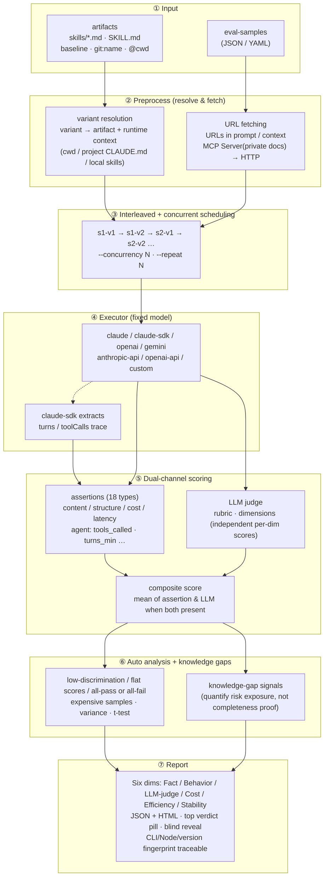

# oh-my-knowledge

[](https://www.npmjs.com/package/oh-my-knowledge)
[](https://github.com/lizhiyao/oh-my-knowledge/actions/workflows/ci.yml)
[](./LICENSE)
[](https://nodejs.org)

**English** | [简体中文](./README.zh.md)

**omk** — LLM evaluation framework with built-in statistical rigor. Bootstrap CI / Krippendorff α / length-debias / saturation curves out of the box. Native support for Claude Code skills, prompts, agents, and RAG.

**Fix the model, vary the knowledge artifact, let the data speak.**

## Why this tool

Teams doing knowledge engineering produce lots of knowledge artifacts (skills today, but also prompts, agents, workflows…). When someone asks "why is v2 better than v1", you need objective data instead of gut feeling. `oh-my-knowledge` solves this with controlled experiments: **same model, same test samples, only the knowledge artifact changes.**

## Key features

- **Controlled-variable offline bench** — fix the model and samples, vary only the artifact; works with Claude Code skills, CLAUDE.md prompts, RAG knowledge bases, or any markdown-based instruction
- **Six-dimension scoring** — separate signals for Fact / Behavior / LLM-judge / Cost / Efficiency / Stability, so a regression in one axis isn't hidden by gains in another
- **Production session observability** — parse Claude Code session JSONL traces, measure per-skill failure rate, latency, token cost, and knowledge-gap signals on real user sessions
- **Knowledge-gap detection** — severity-weighted signals (explicit markers / failed searches / hedging language / repeated failures) quantify risk exposure instead of claiming completeness
- **Pre-merge CI gate** — `omk bench gate` enforces three-layer all-pass (fact + behavior + llm-judge) semantics, catching single-layer regressions a composite score would hide
- **One-line ship/no-ship verdict** — `omk bench verdict <reportId>` aggregates bootstrap CI / three-layer ci-gate / saturation / human α into a six-tier verdict (PROGRESS / CAUTIOUS / REGRESS / NOISE / UNDERPOWERED / SOLO) plus an action recommendation; the exit code reflects whether to ship

### Statistical rigor

The biggest LLM-eval failure mode is "confident bias" — narrow CIs around the wrong answer. omk's statistical layer ships four pieces so conclusions can be externally audited:

- **Bootstrap CI** (`--bootstrap`) — distribution-free confidence intervals. The t-test breaks on ordinal LLM scores; bootstrap resamples raw observations and stays valid at small N (< 30) and on skewed data. Pairwise diff CI not crossing 0 = significant.
- **Human Gold + Krippendorff α** (`--gold-dir`) — bring an external annotation as anchor. CI tells you "is the judge stable", α tells you "is the judge correct" — two complementary axes. omk warns when the gold annotator and the judge are the same model (would inflate α).
- **Length-controlled judge prompt** (default ON) — research shows LLM judges over-weight verbosity. omk's judge prompt explicitly states "length is not a quality signal"; template hash is `v3-cot-length` so older reports (with the legacy hash) are visibly different. `omk bench debias-validate length <reportId>` re-judges with the opposite setting and reports the score shift.
- **Saturation curve** — answers "have I run enough samples?". With `--repeat ≥ 5` we accumulate cumulative N → bootstrap CI; when CI shrink rate stays under 5% across 3 windows, more samples buy nothing. The HTML report inlines the SVG curve plus a verdict.

## Why omk over alternatives

| | omk | promptfoo | DeepEval | RAGAS | LangSmith |
|--|--|--|--|--|--|
| Bootstrap CI | ✓ | ✗ | ✗ | ✗ | ✗ |
| Krippendorff α (judge ↔ human) | ✓ | ✗ | ✗ | ✗ | ✗ |
| Length-debias judge prompt | ✓ default | ✗ | ✗ | ✗ | ✗ |
| Saturation curve | ✓ | ✗ | ✗ | ✗ | ✗ |
| Three-layer scoring isolation | ✓ | ✗ | partial | ✗ | ✗ |
| Per-variant skill isolation (construct validity) | ✓ default | ✗ | ✗ | ✗ | ✗ |
| Native Claude Code skill | ✓ | ✗ | ✗ | ✗ | ✗ |
| Full Chinese docs | ✓ | ✗ | ✗ | ✗ | ✗ |
| Hosted SaaS dashboard | ✗ | ✗ | ✓ | ✗ | ✓ |

omk's moat is **statistical rigor** — every conclusion is auditable by a researcher. If you need a hosted SaaS dashboard, choose LangSmith. If you want quick local prompt iteration without statistics, choose promptfoo. **If you ship to production and someone will ask "why should I trust this number?", choose omk**.

Full comparison with 7 tools across 25+ dimensions: [docs/comparison.md](docs/comparison.md)

## Quick start

```bash
# install
npm i oh-my-knowledge -g

# scaffold an eval project
omk bench init my-eval
cd my-eval

# drop the artifacts you want to compare into skills/
# option 1: plain .md files (skills/v1.md, skills/v2.md)
# option 2: full artifact dirs (skills/my-skill-v1/SKILL.md, ...)
# a single artifact also works — baseline is auto-added as control

# preview the plan
omk bench run --dry-run

# run the evaluation (auto-discovers everything under skills/)
omk bench run

# CLI output language: zh (default) / en — flag wins over env
omk bench run --lang en
OMK_LANG=en omk bench report
```

## Use inside Claude Code

After installing omk, talk to it in natural language from Claude Code:

```
/omk eval              # evaluate the artifact(s) in the current project
/omk evolve            # auto-iterate to improve an artifact
/omk gen-samples       # generate test cases
```

You can also just say "compare v1 vs v2 for me" or "improve this artifact" — omk picks the right command.

## Features

| Feature | What it does |
|---|---|
| **21+ assertion types** | substring, regex, JSON Schema, ROUGE/BLEU/Levenshtein similarity, agent tool-call assertions, semantic similarity, custom JS, and more |
| **Assertion negation + composition** | universal `not: true` field + `assert-set` (any/all) with arbitrary nesting |
| **Six-dim evaluation** | Fact / Behavior / LLM-judge / Cost / Efficiency / Stability shown independently |
| **Statistical rigor** | Bootstrap CI / Krippendorff α / length-debias / saturation curve |
| **Construct-validity isolation** | `--strict-baseline` (default ON) cuts the `~/.claude/skills/` auto-discovery contamination path so baseline doesn't silently see the skill it's being compared against. Double-blocked: main-session skills + subagent Skill tool. eval.yaml `allowedSkills` for per-variant whitelists |
| **One-line verdict** | `omk bench verdict <id>` six-tier verdict + ship recommendation + exit-code routing; HTML pill shares the same rules |
| **RAG metrics** | `faithfulness` / `answer_relevancy` / `context_recall` — anti-hallucination + answer relevance + context coverage; auto-inherits length-debias |
| **Sample diagnostics** | `omk bench diagnose <id>` — 7 issue kinds (low discrimination / duplicates / ambiguous rubric / cost outliers / etc.) + 0-100 healthScore |
| **Failure clustering** | `omk bench failures <id>` — single LLM call clusters failed samples and emits per-cluster fixes |
| **Hard budget caps** | `--budget-usd / --budget-per-sample-usd / --budget-per-sample-ms` — abort on total-cost overrun, flag per-sample overruns; partial report persisted |
| **Multi-executor** | Claude CLI / Claude SDK / OpenAI / Gemini / any custom command |
| **Multi-judge ensemble** | `--judge-models claude:opus,openai:gpt-4o` cross-vendor scoring + agreement metrics |
| **MCP URL fetching** | pull content from private-doc URLs via an MCP server (SSO-protected knowledge bases, etc.) |
| **Blind A/B** | `--blind` hides variant names; HTML report has a reveal button |
| **Parallel execution** | `--concurrency N` runs N tasks at once |
| **Multi-run variance** | `--repeat N` repeats the eval and computes mean / SD / CI / t-test |
| **Auto analysis** | detects low-discrimination assertions, flat scores, all-pass / all-fail, expensive samples |
| **Traceability** | reports carry CLI version, Node version, artifact version fingerprint, judge prompt hash |
| **EN / ZH switch** | one-click language toggle in the HTML report |

## How it works

Core idea: **fix the model and the samples, vary only the artifact and runtime context**, use interleaved scheduling to cancel time drift, score via assertions + LLM judge (dual channel), then layer on knowledge-gap signals to quantify risk exposure.



**Key design choices:**

- **Interleaved scheduling** removes time drift: different variants of the same sample are dispatched alternately rather than "all of v1 then all of v2", so model load / network jitter can't be mis-attributed to the artifact.
- **variant = artifact + runtime context**: `name@cwd` lets control groups explicitly declare the "project directory" input, separating "project-level accumulated knowledge" from "explicit artifact injection".
- **Dual-channel scoring is complementary**: assertions catch deterministic defects (must call tool X, must contain field Y); the LLM judge catches subjective quality (readability, completeness). Mean is taken when both are present.
- **Knowledge-gap signals** are not part of the score — they are an independent tracking channel that tells you "how much risk exposure this evaluation covered", for convergence tracking, not as a completeness proof.

## Eval sample format

Supports JSON and YAML (`eval-samples.json`, `eval-samples.yaml`, `eval-samples.yml`).

```json
[
  {
    "sample_id": "s001",
    "prompt": "Review this code for security issues",
    "context": "function auth(u, p) { db.query('SELECT * FROM users WHERE name=' + u); }",
    "rubric": "Should identify SQL injection risk and recommend parameterized queries",
    "assertions": [
      { "type": "contains", "value": "SQL injection", "weight": 1 },
      { "type": "contains", "value": "parameterized", "weight": 1 },
      { "type": "not_contains", "value": "looks fine", "weight": 0.5 }
    ],
    "dimensions": {
      "security": "did it identify the injection vulnerability?",
      "actionability": "did it give directly usable fix code?"
    }
  }
]
```

### Fields

| Field | Type | Required | Description |
|---|---|---|---|
| `sample_id` | `string` | **yes** | Unique sample ID |
| `prompt` | `string` | **yes** | User prompt sent to the model |
| `context` | `string` | no | Extra context (e.g. code). Wrapped in a code block and appended to the prompt. URLs are auto-fetched at runtime. |
| `rubric` | `string` | no | Scoring guideline for the LLM judge (1-5 scale) |
| `assertions` | `array` | no | Assertion checks; see [assertion types](#assertion-types) |
| `assertions[].type` | `string` | **yes** | Assertion type |
| `assertions[].value` | `string\|number` | depends | Check value (required for `contains`, `min_length`, `cost_max`, etc.) |
| `assertions[].values` | `array` | depends | String array (required for `contains_all`, `contains_any`) |
| `assertions[].pattern` | `string` | depends | Regex pattern (required for `regex`) |
| `assertions[].flags` | `string` | no | Regex flags (default `"i"`) |
| `assertions[].schema` | `object` | depends | JSON Schema object (required for `json_schema`, via [ajv](https://ajv.js.org/)) |
| `assertions[].reference` | `string` | depends | Reference text (required for `semantic_similarity`) |
| `assertions[].threshold` | `number` | no | Pass threshold for semantic similarity (default 3) |
| `assertions[].fn` | `string` | depends | Path to a custom assertion JS file (required for `custom`) |
| `assertions[].weight` | `number` | no | Weight (default 1) |
| `dimensions` | `object` | no | Multi-dimension scoring; key = dimension name, value = scoring guideline |

### URL auto-fetching

URLs in `prompt` and `context` are auto-fetched before evaluation and inlined into the text. Useful when referencing online docs, API references, etc.:

```json
{
  "sample_id": "s001",
  "prompt": "Generate test cases from this PRD: https://wiki.example.com/prd/feature-x"
}
```

At runtime, URLs are replaced with the actual content. Fetch order: MCP Server first for matching URLs (e.g. SSO-protected private docs), then plain HTTP for the rest. URLs already resolved by MCP are not re-fetched via HTTP.

**Private-doc URLs**: drop a `.mcp.json` config file into the project dir, or pass `--mcp-config <path>`:

```json
{
  "mcpServers": {
    "docs": {
      "command": "npx",
      "args": ["@example/docs-mcp-server"],
      "env": { "DOCS_API_TOKEN": "xxx" },
      "urlPatterns": ["docs.example.com"],
      "fetchTool": {
        "name": "fetch_doc",
        "urlTransform": {
          "regex": "docs\\.example\\.com/([^/]+/[^/]+)/([^/?#]+)",
          "params": { "namespace": "$1", "slug": "$2" }
        },
        "contentExtract": "data.body"
      }
    }
  }
}
```

**Public URLs**: fetched via plain HTTP. If they require auth, make sure the shell already has network access configured (VPN, proxy, etc.).

### Scoring strategy

#### 1. Assertion score

Rule-based local checks; each assertion yields pass/fail.

**Formula:**

- Pass rate = sum of passed assertion weights / total weight (0–1)
- Score = 1 + pass_rate × 4 (mapped to 1–5)
- Example: 3 assertions (weight 1 each), 2 pass → pass rate 2/3 → score = 1 + 0.67 × 4 = **3.67**

#### 2. Rubric / Dimensions score

The judge model (default `haiku`) scores 1–5 against the rubric. In `dimensions` mode, each dimension is scored independently and then averaged.

#### 3. Composite score

| Condition | Formula |
|---|---|
| Only assertions | `assertionScore` |
| Only LLM judge | `llmScore` |
| Both present | `(assertionScore + llmScore) / 2` |
| Neither | `0` |

### Assertion types

**Deterministic assertions (21+ total):**

| Type | Description |
|---|---|
| `contains` / `not_contains` | substring must / must-not appear |
| `regex` | regex match |
| `min_length` / `max_length` | length bounds |
| `json_valid` / `json_schema` | JSON validation |
| `starts_with` / `ends_with` | prefix / suffix |
| `equals` / `not_equals` | exact match |
| `word_count_min` / `word_count_max` | word-count bounds |
| `contains_all` / `contains_any` | multi-value match |
| `cost_max` / `latency_max` | cost / latency caps |
| `tools_called` / `tools_not_called` / `tools_count_min` / `tools_count_max` | agent tool-call assertions |
| `tool_output_contains` / `tool_input_contains` | match content of a tool's input or output |
| `turns_min` / `turns_max` | conversation-turn bounds |
| `rouge_n_min` | ROUGE-N recall ≥ threshold (`reference` field holds the gold text; `n` defaults to 1; `threshold` defaults to 0.5) |
| `levenshtein_max` | edit distance ≤ value (for "output should be near-identical to reference") |
| `bleu_min` | BLEU-4 ≥ threshold (unsmoothed; degenerates to 0 on short text) |
| `faithfulness` | output stays grounded in `sample.context` (anti-hallucination); LLM judge 1-5; threshold defaults to 3 |
| `answer_relevancy` | output directly answers `sample.prompt`; catches dodging, topic drift, verbosity; threshold defaults to 3 |
| `context_recall` | gold facts in `sample.context` are actually used in the output; `reference` may explicitly enumerate gold facts; threshold defaults to 3 |
| `semantic_similarity` | LLM-based holistic semantic similarity (complementary to the three RAG metrics above) |
| `custom` | custom JS function (30 s timeout) |

**Universal modifier:**

Any assertion takes `not: true` to invert (replaces paired `not_contains` / `not_equals` etc; legacy types remain as aliases):

```yaml
- type: regex
  pattern: "TODO|FIXME"
  not: true              # output must NOT contain TODO/FIXME
```

**Composition (assert-set):**

`assert-set` combines child assertions with `any` (OR) or `all` (AND) and supports nesting:

```yaml
- type: assert-set
  mode: any              # at least one child must pass (mode: 'all' = all must pass)
  children:
    - { type: contains, value: "parameterized" }
    - { type: contains, value: "prepared statement" }
    - { type: regex, pattern: "bind\\(.*\\?" }
```

Children can independently use `not: true`; nested `assert-set`s can express any boolean shape.

### Custom assertion

```js
// my-assertion.mjs
export default function(output, { sample, assertion }) {
  return { pass: output.includes('SQL'), message: 'checked for SQL keyword' };
}
```

## Six-dim evaluation

Reports display results across six independent dimensions. The three scoring layers — Fact / Behavior / LLM-judge — are shown separately so you see **which layer regressed** instead of a single composite number:

| Dimension | Metric | Description |
|---|---|---|
| 📋 **Fact** | fact-assertion pass rate | rule-verifiable assertions like `contains` / `json_schema` / `fact_check`, mapped to 1-5 |
| 🛠️ **Behavior** | behavior-assertion pass rate | execution-compliance assertions like `tools_called` / `tool_output_contains` / `turns_max` |
| 💬 **LLM-judge** | rubric score | 1-5 scored by the judge model against a predefined rubric; subjective, catches what rules miss |
| 💰 **Cost** | total cost, input/output tokens | API cost based on token usage and model pricing |
| ⚡ **Efficiency** | average latency (ms) | end-to-end latency from request to full response |
| 🛡️ **Stability** | CV (coefficient of variation) | score consistency across repeated runs (`--repeat ≥ 2`); single-run shows `—`, **honestly acknowledging what can't be measured** |

## CLI reference

### `omk bench run`

```bash
omk bench run [options]

options:
  --samples <path>       sample file (default: eval-samples.json, also detects .yaml/.yml)
  --skill-dir <path>     artifact dir (default: skills)
  --control <expr>       control-group variant expression (experiment role = control)
  --treatment <v1,v2>    treatment-group variant expressions, comma-separated
                         at least one of --control / --treatment is required
                         (unless you use --config or --each)
                         special values: baseline (empty artifact), git:name (git HEAD),
                         git:ref:name (specific commit), path with "/" (read file directly)
  --config <path>        YAML/JSON config file (evaluation-as-code); declares
                         samples + variants + model + executor in one file; CLI
                         flags override config fields when both are provided
  --model <name>         model under test (default: sonnet)
  --judge-model <name>   judge model (default: haiku)
  --output-dir <path>    output dir (default: ~/.oh-my-knowledge/reports/)
  --no-judge             skip the LLM judge
  --no-cache             disable result cache (on by default; identical inputs reuse)
  --dry-run              preview only
  --blind                blind mode
  --concurrency <n>      parallel tasks (default: 1)
  --timeout <sec>        per-task executor timeout (default: 120)
  --repeat <n>           repeat N times for variance analysis (default: 1)
  --executor <name>      executor (default: claude); supports custom commands
  --skip-preflight       skip evaluation model reachability check
  --mcp-config <path>    MCP config for fetching private-doc URLs via MCP Server
                         (default: .mcp.json in cwd)
  --no-serve             don't auto-start the report server after the run
  --verbose              print per-sample details (duration, tokens, output preview)
  --each                 batch mode: evaluate each artifact independently vs baseline
                         requires {name}.eval-samples.json paired with each artifact
  --judge-repeat <n>     run the LLM judge N times per (sample × dimension) and report stddev
  --judge-models <list>  multi-judge ensemble: "executor1:model1,executor2:model2"
                         ≥ 2 judges enables ensemble + inter-judge agreement output
  --bootstrap            enable distribution-free CIs: bootstrap CI per variant +
                         pairwise diff CI (CI containing 0 = not significant)
  --bootstrap-samples N  bootstrap resample count (default 1000)
  --gold-dir <path>      after the run, compare scores against the gold dataset
                         (Krippendorff α / κ / Pearson). Result is written to
                         report.meta.humanAgreement and shown in the HTML report
  --no-debias-length     revert to legacy v2-cot judge prompt (no "length is not
                         a quality signal" paragraph) — for byte-compat with
                         legacy reports whose hash predates v3-cot-length
  --budget-usd <num>             total cost cap (USD); on overrun the run aborts and
                                 a partial report is persisted (`report.meta.budgetExhausted = true`)
  --budget-per-sample-usd <num>  per-sample cost cap; offending samples fail individually,
                                 the run continues
  --budget-per-sample-ms <num>   per-sample latency cap (ms); same semantics as cost cap
```

**eval.yaml budget**: declare `budget: { totalUSD?, perSampleUSD?, perSampleMs? }` (all optional, must be ≥ 0). CLI flags of the same name override the config values.

**Difference from `cost_max` / `latency_max` assertions**: assertions are **per-sample scoring rules** (exceeding the cap fails that one assertion, the run continues); budget caps are **workflow-level hard limits** (`totalUSD` overrun aborts the run and persists a partial report; per-sample overruns fail the offending sample but the run continues). Assertions answer "is quality acceptable?"; budgets answer "are cost/time within the envelope?".

### `omk bench run --each` (batch mode)

When `skills/` contains several **independent** artifacts, use `--each` to evaluate each one against baseline and produce a merged report.

```
skills/
├── asset.md                       ← artifact file
├── asset.eval-samples.json        ← paired samples
├── home.md
├── home.eval-samples.json
└── product/                       ← directory format also supported
    ├── SKILL.md
    └── eval-samples.json
```

Pairing rules:

- `{name}.md` → looks for `{name}.eval-samples.json` in the same dir
- `{name}/SKILL.md` → looks for `{name}/eval-samples.json`
- artifacts without paired samples are skipped with a warning

```bash
omk bench run --each
omk bench run --each --dry-run
```

### `omk bench gen-samples` (generate test cases)

Reads an artifact's content and uses an LLM to auto-generate eval-samples. Review and edit them before running eval.

```bash
# generate for a specific artifact (writes eval-samples.json)
omk bench gen-samples skills/my-skill.md

# batch-generate for every artifact under skills/ that lacks samples
omk bench gen-samples --each

# specify sample count
omk bench gen-samples skills/my-skill.md --count 10
```

Options:

```
  --each                 batch-generate for every artifact missing samples
  --count <n>            samples per artifact (default: 5)
  --model <name>         model used for generation (default: sonnet)
  --skill-dir <path>     artifact dir (default: skills), used with --each
```

### `omk bench evolve` (self-iterating improvement)

Lets the AI iterate an artifact automatically: evaluate → analyze weak spots → LLM rewrites → evaluate again → keep if the score went up, drop otherwise → repeat.

```bash
# basic: iterate 5 rounds
omk bench evolve skills/my-skill.md

# set rounds and target score
omk bench evolve skills/my-skill.md --rounds 10 --target 4.5
```

Options:

```
  --rounds <n>           max iteration rounds (default: 5)
  --target <score>       stop early when the score reaches this threshold
  --samples <path>       sample file (default: eval-samples.json)
  --improve-model <name> model used for rewrites (default: sonnet)
```

Each round's output is saved under `skills/evolve/` (`my-skill.r0.md`, `my-skill.r1.md`…), so you can `diff` to see what the AI changed. The best round is written back to the original file.

### `omk bench gate`

Run the evaluation inside CI. Exit code 0 on pass, 1 on fail — can be wired into gates directly.

The gate is **three-layer all-pass**: `avgFactScore >= threshold AND avgBehaviorScore >= threshold AND avgJudgeScore >= threshold`. Any layer below threshold is FAIL, and the output shows which layer broke. This stops cases like `fact 4.5→2.5 but judge 3→5` from passing via composite averaging — if one layer regresses, the gate catches it.

```bash
omk bench gate [options]
  --threshold <number>   per-layer minimum score (default: 3.5); applied
                         independently to fact / behavior / judge
```

### `omk bench report`

Start the report server to browse historical reports, submit feedback, and delete reports.

```bash
omk bench report [options]
  --port <number>        server port (default: 7799)
```

### `omk bench init`

```bash
omk bench init [dir]     # scaffold an eval project
```

### `omk bench gold` (human gold anchor)

Bring a human (or stronger-model proxy) annotation as an external anchor and compute Krippendorff α / weighted κ / Pearson against the LLM judge. Answers "is the judge correct?", complementary to Bootstrap CI's "is the judge stable?".

```bash
omk bench gold init [--out <dir>] [--annotator <id>]   # scaffold a dataset template
omk bench gold validate <dir>                          # check schema (annotator / date / version / score range)
omk bench gold compare <reportId> --gold-dir <dir>     # compare against an existing report; prints α/κ/r + verdict
```

Dataset layout:

```
gold-dir/
├── metadata.yaml      # annotator (must NOT match the omk judge model — would trigger contamination warning) + date + version
└── annotations.yaml   # [{ sample_id, score, reason? }] concatenated by sample_id
```

α thresholds follow Krippendorff (2011): ≥ 0.80 strong agreement; [0.67, 0.80) acceptable; < 0.40 large divergence — investigate rubric / prompt.

Full demo: [examples/gold-dataset/](examples/gold-dataset/)

### `omk bench debias-validate length` (judge length-bias check)

Re-judges every (sample × variant) of an existing report with the OPPOSITE length-debias setting (v3-cot-length ↔ v2-cot) and bootstraps the CI on the score difference. A significant shift = the judge is sensitive to the length-debias instruction (indirect evidence of length bias).

```bash
omk bench debias-validate length <reportId> [options]
  --variant <name>            check a single variant only
  --judge-model <id>          override the report's judge model
  --bootstrap-samples N       bootstrap iterations (default 1000)
  --seed N                    deterministic seed
```

Verdict bucket: none / weak / medium (|0.2-0.5|) / strong (≥ 0.5). Re-judge cost roughly doubles vs the original judge pass.

### `omk bench saturation` (saturation curve)

Answers "have I run enough samples?". Reads the saturation trace from an existing report (no re-run). Verdicts only emit when the original run used `--repeat ≥ 5`; below that, the curve is plotted but no verdict is computed.

```bash
omk bench saturation <reportId> [options]
  --variant <name>             single-variant view
  --method <m>                 slope | bootstrap-ci-width (default) | plateau-height
  --threshold <num>            method-specific cutoff (defaults match the method)
  --window <num>               consecutive windows that must satisfy the threshold (default 3)
```

The HTML report inlines an SVG curve (cumulative N on X, mean ± 95% CI shading on Y, one curve per variant) automatically.

### `omk bench verdict` (one-line ship/no-ship verdict)

Aggregates bootstrap CI / three-layer ci-gate / saturation / human α into one of six verdicts: **PROGRESS** (significant improvement, all three layers pass → exit 0), **CAUTIOUS** (real gain but with a warning — broken gate / trivially small / control regressed → exit 1), **REGRESS** (significant negative shift → exit 1), **NOISE** (CI spans 0, undecidable → exit 1), **UNDERPOWERED** (sample size too small → exit 1), **SOLO** (single variant; exit 0 only if its own three-layer gate passes).

```bash
omk bench verdict <reportId> [options]
  --threshold <num>      three-layer gate threshold (default 3.5, matches `omk bench gate`)
  --trivial-diff <num>   "practically tiny" cutoff (default 0.1)
  --verbose              expand per-pair detail
```

Shares its rule module with the HTML report's verdict pill — CLI and UI cannot disagree.

### `omk bench diagnose` (sample quality diagnostics)

Answers "is the conclusion polluted by bad samples?". Diagnoses 7 sample-quality issues: `flat_scores` (low discrimination), `all_pass` (too easy), `all_fail` (broken — error severity), `near_duplicate` (prompt ROUGE-1 ≥ threshold), `ambiguous_rubric` (high judge stddev across `--judge-repeat ≥ 2`), `cost_outlier` (≥ k× median), `latency_outlier` (≥ k× median), `error_prone` (executor failure).

```bash
omk bench diagnose <reportId> [options]
  --top <n>                   show top N per kind (default 10, 0 = all)
  --duplicate-rouge <num>     near-duplicate ROUGE-1 threshold (default 0.7)
  --ambiguous-stddev <num>    judge-stddev threshold (default 1.0)
  --cost-k <num>              cost-outlier multiplier vs median (default 3)
  --latency-k <num>           latency-outlier multiplier vs median (default 3)
  --flat <num>                flat_scores spread threshold (default 0.5)
```

Output includes a healthScore (0-100, formula `100 - normalized × 20` where `normalized = (errors×8 + warnings×3 + infos×1) / N`). Exit code is 0 only when `healthScore ≥ 70` AND no error-severity issue — CI-friendly.

### `omk bench failures` (failure case LLM clustering)

When 14 of 50 samples failed, reading them one by one is slow. This command sends failed samples to a single LLM call, clusters them into ≤ N groups, and emits per-cluster root cause + fix. "Failed" = `compositeScore < threshold` OR `ok = false`.

```bash
omk bench failures <reportId> [options]
  --judge-executor <name>     executor (default: claude)
  --judge-model <id>          clustering model (default: from report.meta.judgeModel)
  --max-clusters <n>          maximum clusters (default 5)
  --threshold <num>           failure score threshold (default 3)
  --max-feed <n>              max failures fed to LLM (default 50; takes the worst)
```

Tolerant: ```json``` markdown fences, `"sample_id@variant"` string member form, hallucinated members are dropped, single-failure case skips the LLM call, executor errors degrade to unclassified.

### `omk bench diff` (report comparison — single / dual mode)

**Single-arg mode** (within-report sample-level): `omk bench diff <reportId>` — within one report, drill down per-sample comparing `variants[0]` against `variants[1]` (or `--variant <name>`).

**Dual-arg mode** (cross-report variant-level): `omk bench diff <reportId1> <reportId2>` — compare the same variant across two reports (legacy behavior preserved).

```bash
omk bench diff <reportId> [--variant <name>] [--regressions-only] [--threshold 0] [--top N]
omk bench diff <reportId1> <reportId2> [--regressions-only] [--threshold 0]
```

Single-arg output sorts by |Δ| desc; rows where Δ < threshold are highlighted as regressions. `--top N` caps row count, `--regressions-only` shows only negative Δ samples.

## `omk analyze` — production observability

`omk bench run` is **offline evaluation** (fixed controls, repeatable, scored). Production is different — no control group, no ground truth, no repetition, so scoring isn't valid there. `omk analyze` turns existing Claude Code session traces into **skill-health reports** (coverage, gap signals, execution stability, tokens/latency per skill). It gives you clues about **which skill is worth re-evaluating offline**, not a production score.

```bash
# analyze all cc sessions of the current project (auto-infers kb from the trace)
omk analyze ~/.claude/projects/-Users-you-Documents-my-project

# restrict to the last 7 days / 24 hours / 30 minutes
omk analyze ~/.claude/projects/my-project --last 7d

# absolute time window
omk analyze ~/.claude/projects/my-project --from 2026-04-01T00:00:00Z --to 2026-04-15T23:59:59Z

# whitelist specific skills
omk analyze ~/.claude/projects/my-project --skills audit,polish

# override the inferred knowledge-base root
omk analyze ~/.claude/projects/my-project --kb /path/to/project
```

The command writes `~/.oh-my-knowledge/analyses/<timestamp>-skill-health.json`. Browse results alongside bench reports with `omk bench report` — the homepage has a "📊 Skill Health Reports" link, and each skill card also has a "trend →" link to its time-series view. For two reports side-by-side, use the compare selector on `/analyses`.

**What you get per skill:**

- **Knowledge usage** — which KB files this skill actually read (coverage %)
- **Knowledge gaps** — four weighted signals (failed search / model-flagged gap / hedging / repeated miss); hedging goes through an LLM-assisted classifier to filter out business-possibility hedging vs genuine knowledge uncertainty
- **Execution stability** — tool-failure rate; a skill with > 20% failures gets a warning that its gap signals may be environmental noise rather than real knowledge gaps
- **Usage cost** — billable tokens (input+output) separate from cached tokens, total duration

**What this is NOT:**

- Not a general APM (request/response/latency tracing is Langfuse / Datadog territory)
- Not streaming / alerting (batch only — run on a cron if you want periodic snapshots)
- Not a production score (no control group, no ground truth — use `omk bench run` for scoring)

## Executors

### Built-in executors

| Executor | When to use | Description |
|---|---|---|
| `claude` | default | invokes `claude -p` via Claude CLI |
| `claude-sdk` | structured output | uses Claude Agent SDK — no stdout parsing, avoids buffer truncation |
| `openai` | cross-vendor comparison | invokes `openai api` CLI |
| `gemini` | cross-vendor comparison | invokes `gemini` CLI |
| `anthropic-api` | no CLI needed | calls Anthropic HTTP API directly (needs `ANTHROPIC_API_KEY`) |
| `openai-api` | no CLI needed | calls OpenAI HTTP API directly (needs `OPENAI_API_KEY`) |

API-direct executors support custom base URLs via env: `ANTHROPIC_BASE_URL`, `OPENAI_BASE_URL`.

### Custom executor

Any shell command can serve as an executor, communicating via stdin/stdout JSON:

```bash
omk bench run --executor "python my_provider.py"
omk bench run --executor "./my-executor.sh"
```

**Protocol:**

- **input** (stdin): JSON `{"model":"...","system":"...","prompt":"..."}`
- **output** (stdout): JSON `{"output":"model reply","inputTokens":0,"outputTokens":0,"costUSD":0}`
- stdout only needs to return the fields you care about; others default to 0. Plain-text output (no tokens/cost parsing) is also fine.
- non-zero exit code counts as failure

### Artifact directory layout

The built-in executors (claude / openai / gemini) support two artifact layouts, mixable in the same run:

```
skills/
├── v1.md                    # option 1: plain .md file
└── my-skill/                # option 2: full artifact dir
    ├── SKILL.md             #   this file is auto-loaded as system prompt
    ├── config.json          #   other files don't participate in eval, kept for completeness
    └── scripts/
```

**Variant resolution rules:**

`variant` is the experiment-group expression. After resolution, OMK produces an `artifact` plus an optional `runtime context` (currently mainly `cwd`).

| Format | Meaning |
|---|---|
| `name` | looks up `name.md` or `name/SKILL.md` in the artifact dir, resolves to one artifact |
| `baseline` | empty artifact, no system prompt — think "nothing at all" |
| `project-env@/path/to/project` | empty artifact, but run in the specified project dir — observe project-level runtime context alone |
| `git:name` | reads the last-committed version of an artifact from git HEAD |
| `git:ref:name` | reads an artifact from a specific commit |
| `./path/to/file.md` | path with `/`: read the file directly as an artifact |
| `variant@/path/to/project` | attach a run dir to any variant; supports `name@cwd`, `git:name@cwd`, `/file.md@cwd` |

When both `--control` and `--treatment` are omitted, use `--config eval.yaml` or `--each`. With `--each`, `baseline` is auto-added as control and every discovered artifact becomes a treatment.

```bash
# explicit: one control, one or more treatments
omk bench run --control v1 --treatment v2
omk bench run --control baseline --treatment v1,v2,v3

# compare empty artifact vs explicit artifact
omk bench run --control baseline --treatment my-skill

# observe project-level runtime context in isolation (use a self-describing label)
omk bench run --control baseline --treatment project-env@/path/to/target-project

# compare "project-level runtime context" vs "explicit artifact injection"
omk bench run \
  --control project-env@/path/to/target-project \
  --treatment /path/to/target-project/.claude/skills/prd/SKILL.md@/path/to/target-project

# before vs after (old version read from git history)
omk bench run --control git:my-skill --treatment my-skill

# direct file paths
omk bench run --control ./old-skill.md --treatment ./new-skill.md

# config-file driven (evaluation-as-code)
omk bench run --config eval.yaml
```

**Prerequisites:**

- **claude**: install [Claude Code](https://claude.ai/code) and authenticate
- **claude-sdk**: install [Claude Code](https://claude.ai/code) and authenticate (uses Agent SDK, no CLI stdout parsing)
- **anthropic-api**: set the `ANTHROPIC_API_KEY` env var
- **openai**: `pip install openai` and set `OPENAI_API_KEY`
- **openai-api**: set the `OPENAI_API_KEY` env var
- **gemini**: `npm i -g @google/gemini-cli` and authenticate

### Agent evaluation and project-level runtime context

When the executor is `claude-sdk`, OMK supports a first pass of agent-aware evaluation.

A few concepts worth keeping separate:

- `artifact`: the thing being evaluated — baseline, skill, prompt, agent
- `variant`: the CLI expression for an experiment group
- `runtime context`: the runtime environment; currently mainly `cwd`. In project-type agent scenarios it includes the project dir, its `CLAUDE.md`, local skills, and any other environmental factors that affect behavior

In OMK, `agent` is not a catch-all term and neither is `skill`. A cleaner phrasing: **you are comparing how different artifacts behave under different runtime contexts.**

- auto-extracts turns / toolCalls traces
- supports assertions on tool-call behavior
- supports running under a specified `cwd`, so Claude Code auto-loads the project's `CLAUDE.md`, skills, and local runtime context

#### Recommended executor

```bash
omk bench run --executor claude-sdk
```

#### Agent-related assertions

| Assertion | Meaning |
|---|---|
| `tools_called` | must call the specified tool(s) |
| `tools_not_called` | must not call the specified tool(s) |
| `tools_count_min` / `tools_count_max` | tool-call-count bounds |
| `tool_output_contains` | output of a specific tool must contain given content |
| `turns_min` / `turns_max` | turn-count bounds |

#### Three common control setups

**1. Bare-model baseline**

No system prompt and no knowledge-carrying project dir. Requires at least one treatment to compare against:

```bash
omk bench run \
  --executor claude-sdk \
  --control baseline \
  --treatment my-skill
```

**2. Empty artifact + project-level runtime context**

No system prompt, but runs inside a project dir. This is **not** a strict "bare baseline" — it is "empty artifact + project-level runtime context".

```bash
omk bench run \
  --executor claude-sdk \
  --control baseline \
  --treatment project-env@/path/to/target-project
```

**3. Explicit artifact injection**

Inject an external `SKILL.md` as the artifact while also keeping the project dir. Good for contrasting "project-level runtime context" vs "explicit single-artifact injection".

```bash
omk bench run \
  --executor claude-sdk \
  --control project-env@/path/to/target-project \
  --treatment /path/to/target-project/.claude/skills/prd/SKILL.md@/path/to/target-project
```

#### Recommended first-round design

For PRD / complex business-knowledge scenarios, start with:

```bash
omk bench run \
  --executor claude-sdk \
  --samples skills/evaluate-review/eval-samples.yaml \
  --control baseline \
  --treatment /path/to/target-project/.claude/skills/prd/SKILL.md@/path/to/target-project
```

If you want to prove whether "the knowledge sitting inside the project directory" is effective on its own, add a second treatment:

```bash
omk bench run \
  --executor claude-sdk \
  --samples skills/evaluate-review/eval-samples.yaml \
  --control baseline \
  --treatment project-env@/path/to/target-project,/path/to/target-project/.claude/skills/prd/SKILL.md@/path/to/target-project
```

#### Design tips

- **Always start with `--dry-run`** to confirm samples, variants, and `cwd` are parsed correctly
- **Project-level controls must differ in `cwd`**: the same prompt under different project dirs hits different runtime contexts
- **Try PRD scenarios first**: compared to pure coding, they make it easier to validate knowledge completeness, impact-area detection, and business correctness

### Common model configurations

**Don't have Claude?** Most Chinese LLMs (GLM, Qwen, Moonshot, DeepSeek, etc.) are OpenAI-API compatible — use the `openai-api` executor directly:

```bash
# GLM (Zhipu)
export OPENAI_API_KEY="your Zhipu API key"
export OPENAI_BASE_URL="https://open.bigmodel.cn/api/paas/v4"
omk bench run --executor openai-api --model glm-4-plus \
  --judge-model glm-4-plus --no-cache

# Qwen (Alibaba)
export OPENAI_API_KEY="your Qwen API key"
export OPENAI_BASE_URL="https://dashscope.aliyuncs.com/compatible-mode/v1"
omk bench run --executor openai-api --model qwen-plus \
  --judge-model qwen-plus

# DeepSeek
export OPENAI_API_KEY="your DeepSeek API key"
export OPENAI_BASE_URL="https://api.deepseek.com"
omk bench run --executor openai-api --model deepseek-chat \
  --judge-model deepseek-chat

# Moonshot (Kimi)
export OPENAI_API_KEY="your Moonshot API key"
export OPENAI_BASE_URL="https://api.moonshot.cn/v1"
omk bench run --executor openai-api --model moonshot-v1-8k \
  --judge-model moonshot-v1-8k
```

**Ollama local model:**

```bash
omk bench run --executor "python examples/custom-executor/ollama-executor.py" \
  --model llama3 --no-judge
```

**About the judge model:**

- `--judge-model` picks the model used by the LLM judge (default `haiku`)
- `--judge-executor` picks the executor the judge uses (defaults to `--executor`)
- If you don't have Claude, point `--judge-executor` and `--judge-model` at whatever model you have
- Add `--no-judge` to skip the LLM judge and rely on assertions alone

## Environment variables

| Variable | Description |
|---|---|
| `CCV_PROXY_URL` | proxy requests through cc-viewer for live eval-traffic visualization |
| `OMK_BENCH_PORT` | report server port (default: 7799) |

## Requirements

- Node.js >= 20
- `claude` CLI (for the default executor and LLM judge; see [Claude Code](https://claude.ai/code))
  - not needed if you use other executors (openai / gemini) with `--no-judge`

## Security notice

This tool is designed for **local trusted environments** (dev machines, CI pipelines). The following features execute local code — make sure inputs come from a trusted source:

| Feature | Risk | Scope |
|---|---|---|
| **Custom assertions** (`custom`) | dynamically loads and executes user-specified `.mjs` files | only use assertion files you authored or reviewed |
| **eval-samples.json** | assertion configs can reference external file paths | don't use sample files from untrusted sources |

**Recommendations:**

- Do not expose `omk bench report` on the public internet (no auth)
- Don't use third-party eval-samples you haven't vetted
- Custom assertions have a 30-second timeout but no sandbox isolation

---

See [CHANGELOG](./CHANGELOG.md) for release notes. Contributions welcome — see [CONTRIBUTING](./CONTRIBUTING.md).
