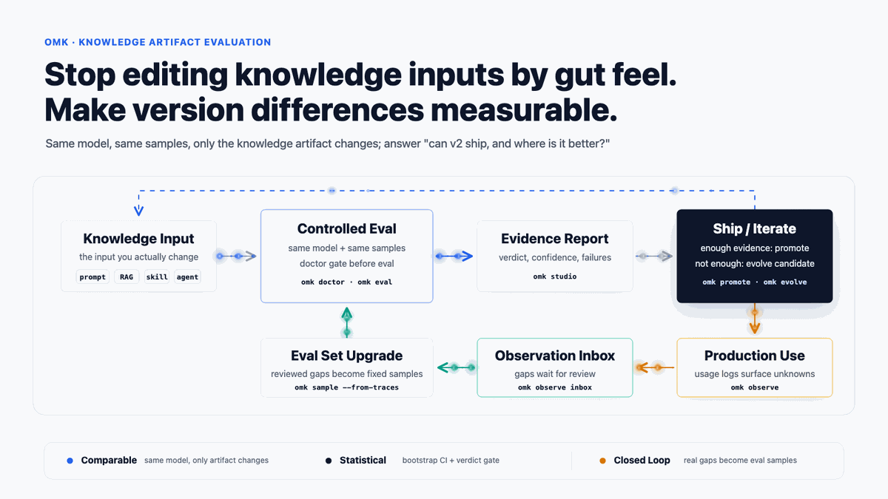

# OMK

[](https://www.npmjs.com/package/oh-my-knowledge)
[](https://www.npmjs.com/package/oh-my-knowledge)
[](https://github.com/lizhiyao/oh-my-knowledge/actions/workflows/ci.yml)
[](./LICENSE)
[](https://nodejs.org)

**English** | [简体中文](./README.zh.md)

**Observe. Measure. Know.**

**OMK makes every knowledge change in your AI application evidence-backed.**

Observe real-world performance, measure version differences, and determine whether the change is effective and the version is ready to ship.

**Same model. Same evaluation samples. Only the knowledge artifact changes.**

**DeepSeek Harness users:** install OMK as a native bundle, reuse the current profile for controlled evaluations, and open persisted DSH task trajectories in Studio. [Set up the DSH host plugin →](docs/reference/executors.md#deepseek-harness-prefer-the-host-plugin)



📖 **Full documentation: [oh-my-knowledge.pages.dev](https://oh-my-knowledge.pages.dev)** (searchable, English / 简体中文)

## What OMK helps you know

| Decision | Command | Evidence you get |
|---|---|---|
| Is this artifact coherent enough to evaluate? | `omk doctor` | structure, dependencies, safety, and measurability checks |
| Is v2 actually better than v1? | `omk eval` | one-line verdict, confidence interval, failed samples, cost |
| Why did it pass or fail? | `omk studio` | report view with scores, diagnostics, and examples |
| Should this version become the accepted one? | `omk promote` / `omk evolve` | evidence-gated accept or generate a better candidate |
| What happened during one real AI task? | `omk observe` / Studio Task Trajectory | a trace-backed view of the request, visible Knowledge, tool calls, results, response, and user correction |
| What did real usage expose? | `omk observe` / `omk sample --from-traces` | production gaps drafted for review; reviewed drafts can become eval samples |

## Quick start

```bash
npm i -g oh-my-knowledge
omk init demo && cd demo
omk eval --control code-review-v1 --treatment code-review-v2 --dry-run
omk eval --control code-review-v1 --treatment code-review-v2
```

Runs out of the box — no edits needed first. `omk init` scaffolds two skill variants and three sample cases; `--dry-run` previews the sealed task plan and estimated calls; `omk eval` runs the controlled A/B and opens the authenticated Core run in Studio. Once it runs, swap in your own skills and cases. To start directly with the first-party 20-case pack, replace the first command with `omk init demo --samples 20`.

Prerequisite: configure one authenticated model runtime (Codex CLI, Claude Code, or an API executor; see [Requirements](#requirements)). Inside a Codex task in the ChatGPT desktop app, omk automatically selects `codex`, reads the model from `~/.codex/config.toml`, and uses the same Codex model as the default judge. Claude is not required.

To make Codex the default in regular terminals, add the preference to your shell profile (for example `~/.zshrc`):

```bash
export OMK_EXECUTOR=codex
# Optional: export OMK_MODEL="your-codex-model"
```

Without `OMK_MODEL`, omk reads the model from `~/.codex/config.toml`. You can still pass `--executor codex --model <codex-model>` per command. Pass `--judge-models` or set `OMK_JUDGE_MODELS` only when you want a different judge.

> The default 3-case pack is a low-cost workflow check, so `UNDERPOWERED` is expected. `--samples 20` selects a first-party, difficulty-stratified starter pack that meets omk's registered sample-size floor. Its provenance is `llm-generated`: use it to learn the statistical workflow, then review and replace it with real domain cases before making a release decision.

> The CLI notifies you when a newer version is available (at most once per 20h); set `OMK_SKIP_UPDATE_CHECK=1` to silence it permanently.

Walkthrough: [5-minute quickstart guide](docs/quickstart-skill-eval.md) (recommended for first-time users; includes demo → own skill → verdict actions). More runnable examples (Skill Map, offline executor, agent runtime, RAG, Observe) live in the repo's [example gallery](examples/README.md).

Deeper: [who omk is for](docs/explanation/who-omk-is-for.md) · [CLI reference](docs/reference/cli.md) · [how it works](docs/explanation/architecture.md) · [eval sample format](docs/reference/eval-sample-format.md) · [executors](docs/reference/executors.md) · [artifact layout](docs/reference/artifact-layout.md)

## Inspect one Codex task

If you only want to see what happened behind one Codex conversation, you do not need to run `observe ingest` first:

```bash
omk studio
```

Studio opens the local Codex conversation overview at `http://127.0.0.1:7799` by default. Select a conversation, then a task, to open **Task Trajectory**. Its four lanes — **Conversation, Actions, Results, and Knowledge** — show the request, AI responses, tool calls, tool returns, and observable context, with drill-downs into normalized events and raw logs.

Running tasks are prioritized and update live. While **Following**, the trajectory advances smoothly as events arrive; after you inspect an earlier point, Studio keeps your position and offers **View updates**. Old logs without a terminal event are marked **End status not recorded** instead of remaining live forever.

Task Trajectory only reconstructs facts observable in the log. It does not reveal or infer hidden reasoning. See [Observe production traces](docs/guides/observe-production.md#inspect-one-task) for the full model.

## The OMK loop

OMK is for authors and maintainers of LLM knowledge artifacts who need a release decision, not for passive end-users of a skill. The main loop is deliberately controlled:

```text
change a prompt / RAG / skill / agent artifact
→ run omk doctor before evaluation
→ run omk eval with the same model and the same samples
→ read the report / Studio evidence
→ promote a proven version or evolve a candidate
→ observe real usage and draft gap-derived samples for review
```

The first value is the pre-ship `doctor → eval` decision. The long-term value is the closed loop: `observe` surfaces production gaps, `sample --from-traces` drafts regression samples for human review, and reviewed drafts can become fixed eval samples that make the next `eval` harder to game.

## Use inside AI Coding Agents

Install the official omk Agent Skill to let your coding agent run omk workflows from natural language:

```bash
omk install omk-agent-skill
```

By default, omk installs only into detected local targets it explicitly supports: Codex/AGENTS when `~/.codex` or `~/.agents` exists, and Claude Code when `~/.claude` exists. Use `--to all` to force every target omk currently knows, or `--dest` for a custom skill root.

### Use inside Claude Code

When the `omk` skill is available in Claude Code, you can invoke it directly:

```bash
/omk eval              # evaluate the artifact(s) in the current project
/omk evolve            # auto-iterate to improve a skill
/omk sample            # generate or fill test cases
```

These slash commands are natural-language entry points — the agent reads the conversation context to figure out which skill to operate on. You can also just say "compare v1 vs v2 for me" or "improve this artifact" and omk picks the right command.

### Use inside Codex

Codex does not support Claude Code style `/omk ...` slash commands. Ask the agent to run the `omk` CLI directly. Inside a Codex task, omk automatically selects the Codex runtime and locally configured model:

```bash
omk eval
omk evolve skills/my-skill.md   # one-shot: doctor → (auto-generate samples if missing) → self-iterate
omk sample skills/my-skill.md
```

You can also describe the goal in natural language, such as "compare v1 vs v2" or "generate test cases for this skill".

`eval`, `doctor`, `sample`, `evolve`, and the LLM-enhanced observe review share the same runtime resolution. Once Codex is selected, the default judge reuses the evaluated Codex model instead of falling back to `claude:haiku`.

> `omk evolve` is a one-shot loop: it runs the doctor gate first, auto-generates eval samples when the target skill has none, then self-iterates. For a brand-new skill, just run `omk evolve skills/foo.md`.

## Why this tool

Knowledge engineering creates a versioning problem: every prompt, RAG recipe, skill, agent, or workflow can change behavior without changing application code. When someone asks "can we ship v2, and why?", a prettier answer or a higher anecdotal success rate is not enough.

omk treats the knowledge artifact as the variable under test: **same model, same evaluation samples, only the artifact changes.** That makes the comparison explainable, repeatable, and suitable for CI or release review.

## Why omk over alternatives

| | omk | promptfoo | DeepEval | LangSmith |
|--|--|--|--|--|
| Bootstrap CI | ✓ default | ✗ | ✗ | ✗ |
| Krippendorff α (judge ↔ human) | ✓ with gold set | ✗ | ✗ | ✗ |
| Length-debias judge prompt | ✓ default | ✗ | ✗ | ✗ |
| Fail-closed evidence coverage | ✓ | ✗ | ✗ | ✗ |
| Three-layer scoring isolation | ✓ | ✗ | partial | ✗ |
| Per-variant skill isolation (construct validity) | ✓ default | ✗ | ✗ | ✗ |
| Native Agent Skill | ✓ | ✗ | ✗ | ✗ |
| Hosted SaaS dashboard | ✗ | ✗ | ✓ | ✓ |

omk's moat is a **default-on safety net**: Bootstrap CI and length-debias are normal measurement behavior, missing evidence fails closed, and explicit Gold comparison provides judge ↔ human alpha calibration. Need a hosted SaaS dashboard? Choose LangSmith. Want quick local prompt iteration without statistics? Choose promptfoo. **Shipping to production and someone will ask "why should I trust this number?" Choose omk.**

RAG-specific evals: see RAGAS (separate niche, complementary to omk). Full comparison with 7 tools across 25+ dimensions: [docs/reference/comparison.md](docs/reference/comparison.md).

## Features

| Feature | What it does |
|---|---|
| **Core release decision** | Six conclusions + stable reason codes + exit-code routing; Studio projects the same authenticated Decision |
| **Five-layer evidence graph** | Assertion / LLM / Judge / Dimension / Composite stay distinct, with coverage, cost, status, and lineage kept orthogonal |
| **Multi-executor** | Claude CLI / Claude SDK / Codex CLI / Codex SDK / DeepSeek Harness / OpenAI / Anthropic API / any custom command |
| **30+ assertion types** | substring, regex, JSON Schema, ROUGE/BLEU/Levenshtein similarity, agent tool-call assertions, semantic similarity, custom JS |
| **Statistical rigor** | Bootstrap comparison families, length-debias, fail-closed evidence coverage, and explicit Gold agreement calibration. [Details →](docs/explanation/statistical-rigor.md) |
| **RAG metrics** | `faithfulness` / `answer_relevancy` / `context_recall` — anti-hallucination + answer relevance + context coverage |
| **LLM health audit** | `omk doctor` grades 7 builtin dimensions; repeats the audit (`--repeat`) and merges findings by k/n consensus |
| **Production observability** | normalize Codex, Claude Code, OpenClaw, and markdown logs into source-neutral Trace IR; measure per-skill outcomes / latency / token use / knowledge-gap signals |
| **Active MCP knowledge feedback (experimental)** | an MCP client actively calls a tool to write user-authorized knowledge feedback into Observation Inbox; it does not monitor conversations, and every record is marked `coverage: partial` |
| **Knowledge-gap detection** | severity-weighted signals quantify risk exposure instead of claiming completeness |
| **Construct-validity isolation** | `--strict-baseline` (default ON) cuts three contamination channels so baseline doesn't silently see the skill it's being compared against |
| **Git & remote sources** | install / eval from a local git ref or a remote git URL (`--git-url`); directory-skills run in a content-addressed **isolated copy** so `references/` assets are real measured input, not just `SKILL.md` |
| **Evidence-gated management** | `omk install` registers a managed record; `omk eval` auto-writes evidence bound by content fingerprint, moving a skill `installed → measurable`; `omk list` surfaces each managed skill's status (installed / measurable / promoted / stale); `omk promote` accepts a version once its evidence passes the gate (default PROGRESS only); `omk rollback` revokes that acceptance, returning the skill to `measurable`. [spec →](docs/specs/evidence-gated-management.md) |
| **Sample design science** | sample schema with `capability` / `difficulty` / `construct` / `provenance` metadata (HF Dataset Cards style); studio surfaces coverage breakdown plus `rubric_clarity_low` / `capability_thin` flags. [docs/specs/sample-design-spec.md](docs/specs/sample-design-spec.md) |
| **Multi-judge ensemble** | `--judge-models claude:opus,openai-api:gpt-4o` cross-vendor scoring + agreement metrics |
| **Multi-run variance** | `--repeat N` publishes independent Core runs and an Evaluation Series variance analysis |
| **MCP URL fetching** | pull content from private-doc URLs via an MCP server (SSO-protected knowledge bases, etc.) |
| **Auto analysis** | detects low-discrimination assertions, flat scores, all-pass / all-fail, expensive samples |
| **Traceability** | reports carry CLI version, Node version, artifact version fingerprint, judge prompt hash |
| **EN / ZH views** | bilingual local Studio views selected through the report URL |

### Run inside an existing DeepSeek Harness

Install OMK as a DSH bundle to reuse the profile's model, credentials, tools, and sandbox:

```bash
dsh plugin --profile web add oh-my-knowledge
dsh --profile web
```

Inside DSH:

- `/omk eval eval.yaml` runs every sample in an isolated DSH session while OMK owns the report and statistics;
- `/omk observe` lists recent terminal sessions;
- `/omk observe <session-id>` reads a consistent snapshot and returns its Studio Task Trajectory URL.

Observe uses the profile's `sessionPersistence` directly, so users do not export or locate JSONL / SQLite files. The first version is offline-only and does not live-follow a session that is still being written. See the [executor guide](docs/reference/executors.md#deepseek-harness-prefer-the-host-plugin) and [observe guide](docs/guides/observe-production.md#inspect-a-task-inside-deepseek-harness).

### Connect an MCP client (experimental)

> **Positioning: OMK MCP is an active knowledge-feedback interface, not a conversation monitor.** OMK MCP alone cannot automatically monitor or subscribe to complete conversations in Codex, ChatGPT, or another client. OMK receives a record only after the client, model, or component actively calls `save_observation` with authorized content. An Agent Skill may automatically recognize a potential feedback moment, but saving it still requires user confirmation and an explicit MCP tool call.

`omk-mcp` is a client-neutral stdio MCP server. Codex and other local MCP clients can start it directly; a private host can compose the exported Streamable HTTP adapter. The client calls `save_observation` only after the user explicitly asks to record feedback, appends the feedback and optional evidence under `.omk/observe/inbox/captures/`, and can render an inline MCP Apps review card for a human verdict and regression-sample draft.

In Codex, explicitly invoke the OMK Skill to submit the current knowledge feedback:

```text
$omk feedback
```

The explicit invocation itself confirms the save. The agent selects the most recent clear issue from the visible conversation and calls `save_observation` with `confirmedByUser: true`; it asks first when the candidate is ambiguous. This shortcut is not a CLI command, and it does not automatically review the observation, draft a sample, or write to a gold set.

```bash
omk-mcp
```

Every record carries `coverageStatus: partial`: OMK observes its tool boundary, submitted feedback, and optional evidence, but not the full conversation, other tool calls, or hidden reasoning. Continuous monitoring requires a host that is authorized to access an event stream and actively forwards those events; that is a host-integration capability, not an OMK MCP capability. Conversation IDs, turn IDs, and idempotency keys are hashed rather than persisted verbatim. For a private-host Streamable HTTP integration, see [Compose the OMK MCP integration](docs/guides/mcp-integration.md).

### Local storage

Project data uses the domain-oriented `.omk/` v2 layout: durable evidence lives under `eval/`, `doctor/`, and `observe/`; governance records live under `governance/`; backups remain recoverable; and only rebuildable work belongs in `state/`. Machine tools, tunnels, caches, and materialized copies stay under `~/.oh-my-knowledge/state/`, never in a project. This release neither reads nor migrates the earlier storage layout.

## Documentation

The full docs are published at **[oh-my-knowledge.pages.dev](https://oh-my-knowledge.pages.dev)** — searchable, with an English / 简体中文 switcher. Key pages:

- **[How it works](docs/explanation/architecture.md)** — input compilation, sealed Core execution, analysis, persistence, and Studio projections
- **[Eval sample format](docs/reference/eval-sample-format.md)** — sample schema, scoring formulas, 30+ assertion types, custom JS assertions
- **[CLI reference](docs/reference/cli.md)** — all top-level commands with bash examples and flag tables
- **[Migrate to the 1.0 preview](docs/guides/v1-preview-migration.md)** — install channel, storage reset, sample protocol, CLI automation, and embedded API changes since 0.54
- **[Evaluation Core cutover](docs/guides/eval-core-cutover.md)** — `BREAKING-SCHEMA` storage, resume, Studio, Gold, managed-evidence, and evolve migration
- **[Embed OMK in a service](docs/guides/eval-runtime.md)** — one `evaluate()` API for Node.js and FaaS hosts
- **[Storage layout v2](docs/specs/storage-layout-spec.md)** — project/global domains, compatibility boundary, and Git policy
- **[Executors](docs/reference/executors.md)** & **[artifact layout](docs/reference/artifact-layout.md)** — built-in / custom executors; how `variant` resolves to an artifact + runtime context
- **[How-to guides](docs/guides/agent-eval.md)** — [evaluate an agent](docs/guides/agent-eval.md) (project runtime context) and [use non-Claude models](docs/guides/non-claude-models.md) (GLM / Qwen / DeepSeek / Moonshot / Ollama)
- **[Observe & inspect task trajectories](docs/guides/observe-production.md)** — browse local Codex conversations, drill into one task, and follow its observable execution live
- **[Quickstart](docs/quickstart-skill-eval.md)** — first-time five-minute walkthrough
- **[Example gallery](https://github.com/lizhiyao/oh-my-knowledge/tree/main/examples)** — a set of runnable examples in the repo, arranged simplest-to-richest
- **[Sample design spec](docs/specs/sample-design-spec.md)** — capability / construct / provenance metadata; industry-gap mapping
- **[Statistical rigor](docs/explanation/statistical-rigor.md)** — why Bootstrap CI / Gold agreement / length-debias / evidence coverage matter
- **[Comparison with 7 tools](docs/reference/comparison.md)** — 25+ dimensions across promptfoo / DeepEval / RAGAS / OpenAI Evals / LangSmith / lm-eval-harness / inspect-ai
- **[Evidence-gated management](docs/specs/evidence-gated-management.md)** — managed records, lifecycle states (installed / measurable / promoted / stale), install → eval → measurable → promote → rollback

## Environment variables

| Variable | Description |
|---|---|
| `OMK_EXECUTOR` | default executor preference, e.g. `codex` / `codex-sdk` / `claude` |
| `OMK_MODEL` | default evaluated model; Codex reads local `config.toml` when unset |
| `OMK_JUDGE_MODELS` | default judge list in `executor:model[,...]` format |
| `CCV_PROXY_URL` | proxy requests through cc-viewer for live eval-traffic visualization |
| `OMK_REPORT_PORT` | report server port (default: 7799) |

## Requirements

- Node.js >= 22
- At least one authenticated model runtime:
  - Codex: install and authenticate the Codex CLI (`npm i -g @openai/codex`); Codex tasks in the ChatGPT desktop app select it automatically
  - Claude: install and authenticate [Claude Code](https://claude.ai/code)
  - API / other executors: configure them as described in [Executors](docs/reference/executors.md)
- Advanced `claude-sdk` / `codex-sdk` executors are optional and are not downloaded by the base OMK install. Install the matching SDK in the same local project or global npm prefix only when you select one; see [Executor prerequisites](docs/reference/executors.md#prerequisites).

## Security notice

This tool is designed for **local trusted environments** (dev machines, CI pipelines). The following features execute local code — make sure inputs come from a trusted source:

| Feature | Risk | Scope |
|---|---|---|
| **Custom assertions** (`custom`) | dynamically loads and executes user-specified `.mjs` files | only use assertion files you authored or reviewed |
| **eval-samples.json** | assertion configs can reference external file paths | don't use sample files from untrusted sources |

**Recommendations:**

- Do not expose the local report server on the public internet (no auth)
- Don't use third-party eval-samples you haven't vetted
- Custom assertions have a 30-second timeout but no sandbox isolation

---

See [GitHub Releases](https://github.com/lizhiyao/oh-my-knowledge/releases) for release notes. Contributions welcome — see [CONTRIBUTING](./CONTRIBUTING.md).
