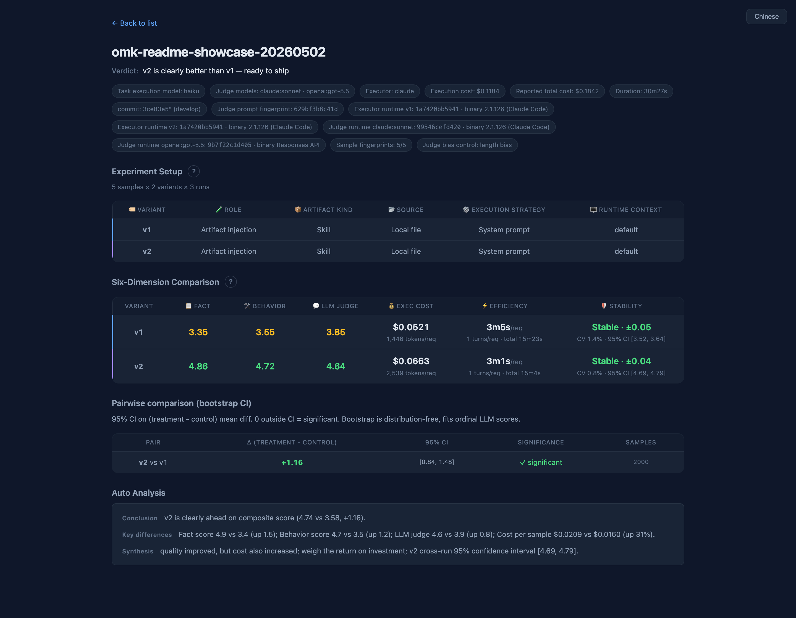

# oh-my-knowledge

[](https://www.npmjs.com/package/oh-my-knowledge)
[](https://www.npmjs.com/package/oh-my-knowledge)
[](https://github.com/lizhiyao/oh-my-knowledge/actions/workflows/ci.yml)
[](./LICENSE)
[](https://nodejs.org)

**English** | [简体中文](./README.zh.md)

**Did your prompt actually get better?**
A/B test your prompts and skills with statistical rigor — bootstrap CI and length-debias on by default, Krippendorff α the moment you add a gold set.

📖 **Full documentation: [oh-my-knowledge.pages.dev](https://oh-my-knowledge.pages.dev)** (searchable, English / 简体中文)



## Quick start

```bash
npm i -g oh-my-knowledge
omk init demo && cd demo
omk eval --control code-review-v1 --treatment code-review-v2
```

Runs out of the box — no edits needed first. `omk init` scaffolds two skill variants and three sample cases; `omk eval` runs the controlled A/B and opens an HTML report with a one-line verdict in about five minutes. Once it runs, swap in your own skills and cases.

Prerequisite: the default executor and judge use the `claude` CLI — install and log in first (see [Requirements](#requirements)); to use another model or run offline (no API key) see [executors](docs/reference/executors.md).

> The first run has only 3 cases, so the verdict will usually be `UNDERPOWERED` (insufficient data) — that's a normal starting point, not an error; grow to ~20+ cases before trusting a ship/no-ship call.

> The CLI notifies you when a newer version is available (at most once per 20h); set `OMK_SKIP_UPDATE_CHECK=1` to silence it permanently.

Walkthrough: [5-minute quickstart guide](docs/quickstart-skill-eval.md) (recommended for first-time users). More runnable examples (A/B, offline executor, batch, evolve, agent, RAG) live in the repo's [example gallery](https://github.com/lizhiyao/oh-my-knowledge/tree/main/examples).

Deeper: [who omk is for](docs/explanation/who-omk-is-for.md) · [CLI reference](docs/reference/cli.md) · [how it works](docs/explanation/architecture.md) · [eval sample format](docs/reference/eval-sample-format.md) · [executors](docs/reference/executors.md) · [artifact layout](docs/reference/artifact-layout.md)

## Use inside AI Coding Agents

Install the official omk Agent Skill to let your coding agent run omk workflows from natural language:

```bash
omk install omk-agent-skill
```

By default, omk installs only into detected local targets it explicitly supports: Codex/AGENTS when `~/.codex` or `~/.agents` exists, and Claude Code when `~/.claude` exists. Use `--to all` to force every target omk currently knows, or `--dest` for a custom skill root.

### Use inside Claude Code

When the `omk` skill is available in Claude Code, you can invoke it directly:

```bash
/omk eval              # evaluate the artifact(s) in the current project
/omk evolve            # auto-iterate to improve a skill
/omk sample            # generate or fill test cases
```

These slash commands are natural-language entry points — the agent reads the conversation context to figure out which skill to operate on. You can also just say "compare v1 vs v2 for me" or "improve this artifact" and omk picks the right command.

### Use inside Codex

Codex does not support Claude Code style `/omk ...` slash commands. Ask the agent to run the `omk` CLI directly:

```bash
omk eval
omk evolve skills/my-skill.md   # one-shot: doctor → (auto-generate samples if missing) → self-iterate
omk sample skills/my-skill.md
```

You can also describe the goal in natural language, such as "compare v1 vs v2" or "generate test cases for this skill".

> `omk evolve` is a one-shot loop: it runs the doctor gate first, auto-generates eval samples when the target skill has none, then self-iterates. For a brand-new skill, just run `omk evolve skills/foo.md`.

## Why this tool

Teams doing knowledge engineering produce lots of knowledge artifacts (skills today, but also prompts, agents, workflows…). When someone asks "why is v2 better than v1", you need objective data instead of gut feeling. `oh-my-knowledge` solves this with controlled experiments: **same model, same test samples, only the knowledge artifact changes.**

## Why omk over alternatives

| | omk | promptfoo | DeepEval | LangSmith |
|--|--|--|--|--|
| Bootstrap CI | ✓ default | ✗ | ✗ | ✗ |
| Krippendorff α (judge ↔ human) | ✓ with gold set | ✗ | ✗ | ✗ |
| Length-debias judge prompt | ✓ default | ✗ | ✗ | ✗ |
| Saturation curve | ✓ | ✗ | ✗ | ✗ |
| Three-layer scoring isolation | ✓ | ✗ | partial | ✗ |
| Per-variant skill isolation (construct validity) | ✓ default | ✗ | ✗ | ✗ |
| Native Agent Skill | ✓ | ✗ | ✗ | ✗ |
| Hosted SaaS dashboard | ✗ | ✗ | ✓ | ✓ |

omk's moat is **default-on safety net** — Bootstrap CI and length-debias aren't advanced flags; they're the default, and judge ↔ human α comes free the moment you add a gold set. Other tools let you opt into confidence intervals; omk makes them unavoidable. Need a hosted SaaS dashboard? Choose LangSmith. Want quick local prompt iteration without statistics? Choose promptfoo. **Shipping to production and someone will ask "why should I trust this number?" Choose omk.**

RAG-specific evals: see RAGAS (separate niche, complementary to omk). Full comparison with 7 tools across 25+ dimensions: [docs/reference/comparison.md](docs/reference/comparison.md).

## Features

| Feature | What it does |
|---|---|
| **One-line verdict** | `omk eval` six-tier verdict + ship recommendation + exit-code routing; HTML pill shares the same rules |
| **Six-dim evaluation** | Fact / Behavior / LLM-judge / Cost / Efficiency / Stability shown independently |
| **Multi-executor** | Claude CLI / Claude SDK / Codex CLI / Codex SDK / OpenAI / Gemini / Anthropic API / any custom command |
| **30+ assertion types** | substring, regex, JSON Schema, ROUGE/BLEU/Levenshtein similarity, agent tool-call assertions, semantic similarity, custom JS |
| **Statistical rigor** | Bootstrap CI / length-debias / saturation curve on by default; Krippendorff α auto-computed with a gold set. [Details →](docs/explanation/statistical-rigor.md) |
| **RAG metrics** | `faithfulness` / `answer_relevancy` / `context_recall` — anti-hallucination + answer relevance + context coverage |
| **LLM health audit** | `omk doctor` grades 7 builtin dimensions; `--static-only` runs offline without an LLM |
| **Production observability** | parse Claude Code session JSONL traces; measure per-skill failure rate / latency / cost / knowledge-gap signals |
| **Knowledge-gap detection** | severity-weighted signals quantify risk exposure instead of claiming completeness |
| **Construct-validity isolation** | `--strict-baseline` (default ON) cuts three contamination channels so baseline doesn't silently see the skill it's being compared against |
| **Git & remote sources** | install / eval from a local git ref or a remote git URL (`--git-url`); directory-skills run in a content-addressed **isolated copy** so `references/` assets are real measured input, not just `SKILL.md` |
| **Evidence-gated management** | `omk install` registers a managed record; `omk eval` auto-writes evidence bound by content fingerprint, moving a skill `installed → measurable`; `omk list` surfaces each managed skill's status (installed / measurable / promoted / stale); `omk promote` accepts a version once its evidence passes the gate (default PROGRESS only); `omk rollback` revokes that acceptance, returning the skill to `measurable`. [spec →](docs/specs/evidence-gated-management.md) |
| **Sample design science** | sample schema with `capability` / `difficulty` / `construct` / `provenance` metadata (HF Dataset Cards style); studio surfaces coverage breakdown plus `rubric_clarity_low` / `capability_thin` flags. [docs/specs/sample-design-spec.md](docs/specs/sample-design-spec.md) |
| **Multi-judge ensemble** | `--judge-models claude:opus,openai-api:gpt-4o` cross-vendor scoring + agreement metrics |
| **Multi-run variance** | `--repeat N` repeats the eval and computes mean / SD / CI / t-test |
| **MCP URL fetching** | pull content from private-doc URLs via an MCP server (SSO-protected knowledge bases, etc.) |
| **Auto analysis** | detects low-discrimination assertions, flat scores, all-pass / all-fail, expensive samples |
| **Traceability** | reports carry CLI version, Node version, artifact version fingerprint, judge prompt hash |
| **EN / ZH switch** | one-click language toggle in the HTML report |

## Documentation

The full docs are published at **[oh-my-knowledge.pages.dev](https://oh-my-knowledge.pages.dev)** — searchable, with an English / 简体中文 switcher. Key pages:

- **[How it works](docs/explanation/architecture.md)** — interleaved scheduling, variant resolution, dual-channel scoring, six-dim report
- **[Eval sample format](docs/reference/eval-sample-format.md)** — sample schema, scoring formulas, 30+ assertion types, custom JS assertions
- **[CLI reference](docs/reference/cli.md)** — all top-level commands with bash examples and flag tables
- **[Executors](docs/reference/executors.md)** & **[artifact layout](docs/reference/artifact-layout.md)** — built-in / custom executors; how `variant` resolves to an artifact + runtime context
- **[How-to guides](docs/guides/agent-eval.md)** — [evaluate an agent](docs/guides/agent-eval.md) (project runtime context) and [use non-Claude models](docs/guides/non-claude-models.md) (GLM / Qwen / DeepSeek / Moonshot / Ollama)
- **[Quickstart](docs/quickstart-skill-eval.md)** — first-time five-minute walkthrough
- **[Example gallery](https://github.com/lizhiyao/oh-my-knowledge/tree/main/examples)** — a set of runnable examples in the repo, arranged simplest-to-richest
- **[Sample design spec](docs/specs/sample-design-spec.md)** — capability / construct / provenance metadata; industry-gap mapping
- **[Statistical rigor](docs/explanation/statistical-rigor.md)** — why bootstrap CI / α / length-debias / saturation matter
- **[Comparison with 7 tools](docs/reference/comparison.md)** — 25+ dimensions across promptfoo / DeepEval / RAGAS / OpenAI Evals / LangSmith / lm-eval-harness / inspect-ai
- **[Evidence-gated management](docs/specs/evidence-gated-management.md)** — managed records, lifecycle states (installed / measurable / promoted / stale), install → eval → measurable → promote → rollback

## Environment variables

| Variable | Description |
|---|---|
| `CCV_PROXY_URL` | proxy requests through cc-viewer for live eval-traffic visualization |
| `OMK_REPORT_PORT` | report server port (default: 7799) |

## Requirements

- Node.js >= 22
- `claude` CLI (for the default executor and LLM judge; see [Claude Code](https://claude.ai/code))
  - not needed if you use other executors (openai-api / anthropic-api / gemini) with `--no-judge`

## Security notice

This tool is designed for **local trusted environments** (dev machines, CI pipelines). The following features execute local code — make sure inputs come from a trusted source:

| Feature | Risk | Scope |
|---|---|---|
| **Custom assertions** (`custom`) | dynamically loads and executes user-specified `.mjs` files | only use assertion files you authored or reviewed |
| **eval-samples.json** | assertion configs can reference external file paths | don't use sample files from untrusted sources |

**Recommendations:**

- Do not expose the local report server on the public internet (no auth)
- Don't use third-party eval-samples you haven't vetted
- Custom assertions have a 30-second timeout but no sandbox isolation

---

See [GitHub Releases](https://github.com/lizhiyao/oh-my-knowledge/releases) for release notes. Contributions welcome — see [CONTRIBUTING](./CONTRIBUTING.md).
