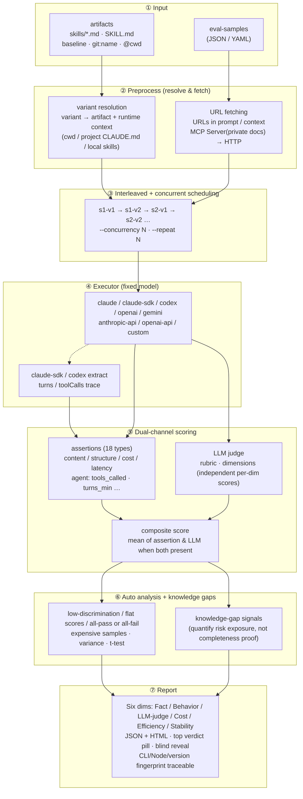

# oh-my-knowledge

[](https://www.npmjs.com/package/oh-my-knowledge)
[](https://www.npmjs.com/package/oh-my-knowledge)
[](https://github.com/lizhiyao/oh-my-knowledge/actions/workflows/ci.yml)
[](./LICENSE)
[](https://nodejs.org)

**English** | [简体中文](./README.zh.md)

**omk** — The knowledge you give your LLM — what's it actually worth?
omk answers with objective data, not gut feeling.

**Evaluation framework for LLM knowledge inputs** — prompts, RAG corpora, skills, agent workflows. Fix the model, vary the artifact.

<a id="statistical-rigor"></a>
> Built-in: Bootstrap CI · Krippendorff α (judge ↔ human) · length-debias · saturation curves · construct-validity isolation. [Why these matter →](docs/statistical-rigor.md)


## Quick start

```bash
npm i oh-my-knowledge -g
omk init my-eval && cd my-eval
# edit skills/code-review-v1/SKILL.md and skills/code-review-v2/SKILL.md with your two versions
omk eval --control code-review-v1 --treatment code-review-v2    # → HTML report with verdict in 5 minutes
```

Walkthrough: [5-minute quickstart guide](docs/quickstart-skill-eval.md) (recommended for first-time users).

Deeper: [use inside Claude Code / Codex](#use-inside-ai-coding-agents) · [`omk eval` flags](#omk-eval) · [artifact directory layout](#artifact-directory-layout) · [`--lang` / `OMK_LANG`](#environment-variables)

## Use inside AI Coding Agents

### Use inside Claude Code

When the `omk` skill is available in Claude Code, you can invoke it directly like this:

```bash
/omk eval              # evaluate the artifact(s) in the current project
/omk evolve            # auto-iterate to improve a skill
/omk sample            # generate or fill test cases
```

These slash commands are natural-language entry points — the agent reads the conversation context to figure out which skill to operate on, so you usually don't pass the path explicitly. (See the Codex section below for the literal `omk evolve <skill>` CLI form.) You can also just say "compare v1 vs v2 for me" or "improve this artifact" and omk picks the right command.

### Use inside Codex

Codex does not support Claude Code style `/omk ...` slash commands by default. In Codex, the usual pattern is to ask the agent to run the `omk` CLI directly, for example:

```bash
omk eval
omk evolve skills/my-skill.md
omk sample skills/my-skill.md
```

You can also describe the goal in natural language, such as "compare v1 vs v2" or "generate test cases for this skill".

## Why this tool

Teams doing knowledge engineering produce lots of knowledge artifacts (skills today, but also prompts, agents, workflows…). When someone asks "why is v2 better than v1", you need objective data instead of gut feeling. `oh-my-knowledge` solves this with controlled experiments: **same model, same test samples, only the knowledge artifact changes.**

## Key features

- **LLM health audit** — `omk doctor` runs a single LLM session that emits a multi-dimension report; 7 builtin dimensions (trigger & boundary / doc clarity / instruction precision / dependency / tool conventions / security & compliance / example completeness) each get a *healthy / sub-healthy / unhealthy / N-A* grade plus findings and suggestions; dimensions are extensible, and `--html` produces a visual report. Pass `--static-only` for an offline mode (CI nodes without an LLM, debugging without network) that runs the static checks only (readability / metadata / dependencies / samples contract). `omk eval` still runs static readability / metadata / dependency gates internally to protect eval quality (separation of roles: doctor = audit, eval = evaluate)
- **Controlled-variable offline eval** — fix the model and samples, vary only the artifact; works with Claude Code skills, CLAUDE.md prompts, RAG knowledge bases, or any markdown-based instruction
- **Six-dimension scoring** — separate signals for Fact / Behavior / LLM-judge / Cost / Efficiency / Stability, so a regression in one axis isn't hidden by gains in another
- **Production session observability** — parse Claude Code session JSONL traces, measure per-skill failure rate, latency, token cost, and knowledge-gap signals on real user sessions
- **Knowledge-gap detection** — severity-weighted signals (explicit markers / failed searches / hedging language / repeated failures) quantify risk exposure instead of claiming completeness
- **Pre-merge CI gate** — `omk eval` enforces three-layer all-pass (fact + behavior + llm-judge) semantics, catching single-layer regressions a composite score would hide
- **One-line ship/no-ship verdict** — `omk eval` aggregates bootstrap CI / three-layer ci-gate / saturation / human α into a six-tier verdict (PROGRESS / CAUTIOUS / REGRESS / NOISE / UNDERPOWERED / SOLO) plus an action recommendation; the exit code reflects whether to ship

## Why omk over alternatives

| | omk | promptfoo | DeepEval | LangSmith |
|--|--|--|--|--|
| Bootstrap CI | ✓ default | ✗ | ✗ | ✗ |
| Krippendorff α (judge ↔ human) | ✓ default | ✗ | ✗ | ✗ |
| Length-debias judge prompt | ✓ default | ✗ | ✗ | ✗ |
| Saturation curve | ✓ | ✗ | ✗ | ✗ |
| Three-layer scoring isolation | ✓ | ✗ | partial | ✗ |
| Per-variant skill isolation (construct validity) | ✓ default | ✗ | ✗ | ✗ |
| Native Claude Code skill | ✓ | ✗ | ✗ | ✗ |
| Hosted SaaS dashboard | ✗ | ✗ | ✓ | ✓ |

omk's moat is **default-on safety net** — Bootstrap CI, judge ↔ human α, and length-debias aren't advanced flags; they're the default. Other tools let you opt into confidence intervals; omk makes them unavoidable. Need a hosted SaaS dashboard? Choose LangSmith. Want quick local prompt iteration without statistics? Choose promptfoo. **Shipping to production and someone will ask "why should I trust this number?" Choose omk.**

RAG-specific evals: see RAGAS (separate niche, complementary to omk). Full comparison with 7 tools across 25+ dimensions: [docs/comparison.md](docs/comparison.md).

## Features

| Feature | What it does |
|---|---|
| **One-line verdict** | `omk eval` six-tier verdict + ship recommendation + exit-code routing; HTML pill shares the same rules |
| **Six-dim evaluation** | Fact / Behavior / LLM-judge / Cost / Efficiency / Stability shown independently |
| **Multi-executor** | Claude CLI / Claude SDK / Codex CLI / Codex SDK / OpenAI / Gemini / any custom command |
| **21+ assertion types** | substring, regex, JSON Schema, ROUGE/BLEU/Levenshtein similarity, agent tool-call assertions, semantic similarity, custom JS, and more |
| **Statistical rigor** | Bootstrap CI / Krippendorff α / length-debias / saturation curve — all on by default. [Details →](docs/statistical-rigor.md) |
| **RAG metrics** | `faithfulness` / `answer_relevancy` / `context_recall` — anti-hallucination + answer relevance + context coverage; auto-inherits length-debias |
| **Hard budget caps** | `--budget-usd / --budget-per-sample-usd / --budget-per-sample-ms` — abort on total-cost overrun, flag per-sample overruns; partial report persisted |
| **Construct-validity isolation** | `--strict-baseline` (default ON) cuts three contamination channels so baseline doesn't silently see the skill it's being compared against: (1) SDK skill auto-discovery, (2) subagent Skill tool, (3) cwd file-system access via the `skills/<name>/` symlink that's normally there for the treatment variant. eval.yaml `allowedSkills` for per-variant whitelists |
| **Sample design science** | Sample schema with `capability` / `difficulty` / `construct` / `provenance` metadata fields (HF Dataset Cards style); studio surfaces coverage breakdown plus `rubric_clarity_low` / `capability_thin` flags. `omk sample` auto-stamps provenance on generated cases. See [docs/sample-design-spec.md](docs/sample-design-spec.md) for the 8 industry-gap mapping |
| **Multi-judge ensemble** | `--judge-models claude:opus,openai:gpt-4o` cross-vendor scoring + agreement metrics |
| **MCP URL fetching** | pull content from private-doc URLs via an MCP server (SSO-protected knowledge bases, etc.) |
| **Blind A/B** | `--blind` hides variant names; HTML report has a reveal button |
| **Multi-run variance** | `--repeat N` repeats the eval and computes mean / SD / CI / t-test |
| **Parallel execution** | `--concurrency N` runs N tasks at once |
| **Assertion negation + composition** | universal `not: true` field + `assert-set` (any/all) with arbitrary nesting |
| **Auto analysis** | detects low-discrimination assertions, flat scores, all-pass / all-fail, expensive samples |
| **Traceability** | reports carry CLI version, Node version, artifact version fingerprint, judge prompt hash |
| **EN / ZH switch** | one-click language toggle in the HTML report |

## How it works

Core idea: **fix the model and the samples, vary only the artifact and runtime context**, use interleaved scheduling to cancel time drift, score via assertions + LLM judge (dual channel), then layer on knowledge-gap signals to quantify risk exposure.


```mermaid
flowchart TD
    subgraph Input["① Input"]
        S["eval-samples<br/>(JSON / YAML)"]
        A["artifacts<br/>skills/*.md · SKILL.md<br/>baseline · git:name · @cwd"]
    end

    subgraph Prep["② Preprocess (resolve & fetch)"]
        V["variant resolution<br/>variant → artifact + runtime context<br/>(cwd / project CLAUDE.md / local skills)"]
        U["URL fetching<br/>URLs in prompt / context<br/>MCP Server(private docs) → HTTP"]
    end

    subgraph Schedule["③ Interleaved + concurrent scheduling"]
        Q["s1-v1 → s1-v2 → s2-v1 → s2-v2 …<br/>--concurrency N · --repeat N"]
    end

    subgraph Exec["④ Executor (fixed model)"]
        E["claude / claude-sdk / codex / openai / gemini<br/>anthropic-api / openai-api / custom"]
        T["claude-sdk / codex extract<br/>turns / toolCalls trace"]
        E -.-> T
    end

    subgraph Score["⑤ Dual-channel scoring"]
        AS["assertions (18 types)<br/>content / structure / cost / latency<br/>agent: tools_called · turns_min …"]
        LS["LLM judge<br/>rubric · dimensions (independent per-dim scores)"]
        CS["composite score<br/>mean of assertion & LLM when both present"]
        AS --> CS
        LS --> CS
    end

    subgraph Analyze["⑥ Auto analysis + knowledge gaps"]
        D["low-discrimination / flat scores / all-pass or all-fail<br/>expensive samples · variance · t-test"]
        G["knowledge-gap signals<br/>(quantify risk exposure, not completeness proof)"]
    end

    subgraph Report["⑦ Report"]
        R["Six dims: Fact / Behavior / LLM-judge / Cost / Efficiency / Stability<br/>JSON + HTML · top verdict pill · blind reveal<br/>CLI/Node/version fingerprint traceable"]
    end

    S --> U
    A --> V
    V --> Q
    U --> Q
    Q --> E
    T --> AS
    E --> AS
    E --> LS
    CS --> D
    CS --> G
    D --> R
    G --> R
```

**Key design choices:**

- **Interleaved scheduling** removes time drift: different variants of the same sample are dispatched alternately rather than "all of v1 then all of v2", so model load / network jitter can't be mis-attributed to the artifact.
- **variant = artifact + runtime context**: `name@cwd` lets control groups explicitly declare the "project directory" input, separating "project-level accumulated knowledge" from "explicit artifact injection".
- **Dual-channel scoring is complementary**: assertions catch deterministic defects (must call tool X, must contain field Y); the LLM judge catches subjective quality (readability, completeness). Mean is taken when both are present.
- **Knowledge-gap signals** are not part of the score — they are an independent tracking channel that tells you "how much risk exposure this evaluation covered", for convergence tracking, not as a completeness proof.

## Eval sample format

Supports JSON and YAML (`eval-samples.json`, `eval-samples.yaml`, `eval-samples.yml`).

```json
[
  {
    "sample_id": "s001",
    "prompt": "Review this code for security issues",
    "context": "function auth(u, p) { db.query('SELECT * FROM users WHERE name=' + u); }",
    "rubric": "Should identify SQL injection risk and recommend parameterized queries",
    "assertions": [
      { "type": "contains", "value": "SQL injection", "weight": 1 },
      { "type": "contains", "value": "parameterized", "weight": 1 },
      { "type": "not_contains", "value": "looks fine", "weight": 0.5 }
    ],
    "dimensions": {
      "security": "did it identify the injection vulnerability?",
      "actionability": "did it give directly usable fix code?"
    }
  }
]
```

### Fields

| Field | Type | Required | Description |
|---|---|---|---|
| `sample_id` | `string` | **yes** | Unique sample ID |
| `prompt` | `string` | **yes** | User prompt sent to the model |
| `context` | `string` | no | Extra context (e.g. code). Wrapped in a code block and appended to the prompt. URLs are auto-fetched at runtime. |
| `rubric` | `string` | no | Scoring guideline for the LLM judge (1-5 scale) |
| `assertions` | `array` | no | Assertion checks; see [assertion types](#assertion-types) |
| `assertions[].type` | `string` | **yes** | Assertion type |
| `assertions[].value` | `string\|number` | depends | Check value (required for `contains`, `min_length`, `cost_max`, etc.) |
| `assertions[].values` | `array` | depends | String array (required for `contains_all`, `contains_any`) |
| `assertions[].pattern` | `string` | depends | Regex pattern (required for `regex`) |
| `assertions[].flags` | `string` | no | Regex flags (default `"i"`) |
| `assertions[].schema` | `object` | depends | JSON Schema object (required for `json_schema`, via [ajv](https://ajv.js.org/)) |
| `assertions[].reference` | `string` | depends | Reference text (required for `semantic_similarity`) |
| `assertions[].threshold` | `number` | no | Pass threshold for semantic similarity (default 3) |
| `assertions[].fn` | `string` | depends | Path to a custom assertion JS file (required for `custom`) |
| `assertions[].weight` | `number` | no | Weight (default 1) |
| `dimensions` | `object` | no | Multi-dimension scoring; key = dimension name, value = scoring guideline |

### URL auto-fetching

URLs in `prompt` and `context` are auto-fetched before evaluation and inlined into the text. Useful when referencing online docs, API references, etc.:

```json
{
  "sample_id": "s001",
  "prompt": "Generate test cases from this PRD: https://wiki.example.com/prd/feature-x"
}
```

At runtime, URLs are replaced with the actual content. Fetch order: MCP Server first for matching URLs (e.g. SSO-protected private docs), then plain HTTP for the rest. URLs already resolved by MCP are not re-fetched via HTTP.

**Private-doc URLs**: drop a `.mcp.json` config file into the project dir, or pass `--mcp-config <path>`:

```json
{
  "mcpServers": {
    "docs": {
      "command": "npx",
      "args": ["@example/docs-mcp-server"],
      "env": { "DOCS_API_TOKEN": "xxx" },
      "urlPatterns": ["docs.example.com"],
      "fetchTool": {
        "name": "fetch_doc",
        "urlTransform": {
          "regex": "docs\\.example\\.com/([^/]+/[^/]+)/([^/?#]+)",
          "params": { "namespace": "$1", "slug": "$2" }
        },
        "contentExtract": "data.body"
      }
    }
  }
}
```

**Public URLs**: fetched via plain HTTP. If they require auth, make sure the shell already has network access configured (VPN, proxy, etc.).

### Scoring strategy

#### 1. Assertion score

Rule-based local checks; each assertion yields pass/fail.

**Formula:**

- Pass rate = sum of passed assertion weights / total weight (0–1)
- Score = 1 + pass_rate × 4 (mapped to 1–5)
- Example: 3 assertions (weight 1 each), 2 pass → pass rate 2/3 → score = 1 + 0.67 × 4 = **3.67**

#### 2. Rubric / Dimensions score

The judge model (default `haiku`) scores 1–5 against the rubric. In `dimensions` mode, each dimension is scored independently and then averaged.

#### 3. Composite score

| Condition | Formula |
|---|---|
| Only assertions | `assertionScore` |
| Only LLM judge | `llmScore` |
| Both present | `(assertionScore + llmScore) / 2` |
| Neither | `0` |

### Assertion types

**Deterministic assertions (21+ total):**

| Type | Description |
|---|---|
| `contains` / `not_contains` | substring must / must-not appear |
| `regex` | regex match |
| `min_length` / `max_length` | length bounds |
| `json_valid` / `json_schema` | JSON validation |
| `starts_with` / `ends_with` | prefix / suffix |
| `equals` / `not_equals` | exact match |
| `word_count_min` / `word_count_max` | word-count bounds |
| `contains_all` / `contains_any` | multi-value match |
| `cost_max` / `latency_max` | cost / latency caps |
| `tools_called` / `tools_not_called` / `tools_count_min` / `tools_count_max` | agent tool-call assertions |
| `tool_output_contains` / `tool_input_contains` | match content of a tool's input or output |
| `turns_min` / `turns_max` | conversation-turn bounds |
| `rouge_n_min` | ROUGE-N recall ≥ threshold (`reference` field holds the gold text; `n` defaults to 1; `threshold` defaults to 0.5) |
| `levenshtein_max` | edit distance ≤ value (for "output should be near-identical to reference") |
| `bleu_min` | BLEU-4 ≥ threshold (unsmoothed; degenerates to 0 on short text) |
| `faithfulness` | output stays grounded in `sample.context` (anti-hallucination); LLM judge 1-5; threshold defaults to 3 |
| `answer_relevancy` | output directly answers `sample.prompt`; catches dodging, topic drift, verbosity; threshold defaults to 3 |
| `context_recall` | gold facts in `sample.context` are actually used in the output; `reference` may explicitly enumerate gold facts; threshold defaults to 3 |
| `semantic_similarity` | LLM-based holistic semantic similarity (complementary to the three RAG metrics above) |
| `custom` | custom JS function (30 s timeout) |

**Universal modifier:**

Any assertion takes `not: true` to invert (replaces paired `not_contains` / `not_equals` etc; legacy types remain as aliases):

```yaml
- type: regex
  pattern: "TODO|FIXME"
  not: true              # output must NOT contain TODO/FIXME
```

**Composition (assert-set):**

`assert-set` combines child assertions with `any` (OR) or `all` (AND) and supports nesting:

```yaml
- type: assert-set
  mode: any              # at least one child must pass (mode: 'all' = all must pass)
  children:
    - { type: contains, value: "parameterized" }
    - { type: contains, value: "prepared statement" }
    - { type: regex, pattern: "bind\\(.*\\?" }
```

Children can independently use `not: true`; nested `assert-set`s can express any boolean shape.

### Custom assertion

```js
// my-assertion.mjs
export default function(output, { sample, assertion }) {
  return { pass: output.includes('SQL'), message: 'checked for SQL keyword' };
}
```

## Six-dim evaluation

Reports display results across six independent dimensions. The three scoring layers — Fact / Behavior / LLM-judge — are shown separately so you see **which layer regressed** instead of a single composite number:

| Dimension | Metric | Description |
|---|---|---|
| 📋 **Fact** | fact-assertion pass rate | rule-verifiable assertions like `contains` / `json_schema` / `fact_check`, mapped to 1-5 |
| 🛠️ **Behavior** | behavior-assertion pass rate | execution-compliance assertions like `tools_called` / `tool_output_contains` / `turns_max` |
| 💬 **LLM-judge** | rubric score | 1-5 scored by the judge model against a predefined rubric; subjective, catches what rules miss |
| 💰 **Cost** | total cost, input/output tokens | API cost based on token usage and model pricing |
| ⚡ **Efficiency** | average latency (ms) | end-to-end latency from request to full response |
| 🛡️ **Stability** | CV (coefficient of variation) | score consistency across repeated runs (`--repeat ≥ 2`); single-run shows `—`, **honestly acknowledging what can't be measured** |

## CLI reference

omk exposes a workflow CLI for knowledge artifacts. Seven top-level commands cover the full loop: `init` (scaffold) · `doctor` (static check) · `eval` (offline A/B) · `observe` (online trace) · `evolve` (auto-iterate a skill) · `sample` (generate or fill test cases) · `studio` (local web UI for reports & analysis).

### `omk init`

```bash
omk init [dir]
```

<!-- omk:cli:init:flags:start -->

**Flags:**

```text
  --lang <value>  Output language zh|en. Priority: CLI > OMK_LANG env > zh.
```

For full descriptions: `omk init --help`.

<!-- omk:cli:init:flags:end -->

Scaffolds an evaluation project with two starter skill variants and an `eval-samples.json` file.

### `omk doctor`

```bash
omk doctor                              # audit current dir / ./skills
omk doctor skills/v1.md                 # audit one skill file
omk doctor skills/ --html report.html   # produce a visual HTML report
omk doctor skills/ --json > r.json      # JSON for CI / external tools
omk doctor --gate; echo $?              # silent gate; exit 1 on fatal failures, warnings do not block
omk doctor --static-only                # offline mode: static checks only, no LLM call
```

<!-- omk:cli:doctor:flags:start -->

**Flags:**

```text
  --executor <value>  Executor name, default claude. Pass a test fixture path to use in tests.
  --gate              Silent mode: only emit stderr summary on fail. Exit code carries the signal.
  --html <value>      HTML report output path. Coexists with --json / --gate.
  --json              JSON output to stdout, for CI / external script consumption.
  --lang <value>      Output language zh|en. Priority: CLI > OMK_LANG env > zh.
  --model <value>     LLM model name, default sonnet.
  --samples <value>   Samples file path (.json/.yaml). Auto-detects from target / cwd if omitted.
  --static-only       Offline static mode: only 4 static rules, no LLM call.
  --timeout <value>   Single-session LLM timeout sec, default 600 (10 min).
```

For full descriptions: `omk doctor --help`.

<!-- omk:cli:doctor:flags:end -->

LLM health audit: a single LLM session emits per-dimension grades, findings, and suggestions for the 7 builtin dimensions; the HTML report sorts dimensions fail→warn→pass→skipped with errors first within each dim. Dimensions are extensible — call `registerHealthDimension` in your own code and the new section is folded into the same LLM call's prompt and report (order = registration order).

Static-only mode (`--static-only`): for CI nodes without claude / codex installed, or local debugging without network — runs the four static rules (readability / metadata / dependencies / samples contract) with zero LLM calls and zero cost. Output goes through the same `DoctorReport` shape and combines with `--json` / `--gate` / `--html`.

`omk eval` still runs its own static readability / metadata / dependency / samples-contract gates internally to protect eval quality; that path is separate from this user-facing `omk doctor` command and the two roles do not overlap.

### `omk eval`

```bash
omk eval --control baseline --treatment my-skill                # single-skill necessity test (baseline = reserved "no skill" variant)
omk eval --control code-review-v1 --treatment code-review-v2    # multi-variant A/B
omk eval --config eval.yaml
omk eval --batch
omk eval gold compare <report-id> --gold-dir gold-dataset
```

Runs the offline evaluation, applies the verdict gate, persists the report, and returns a ship/no-ship exit code. Bootstrap CI is enabled by default on this workflow.

<!-- omk:cli:eval:flags:start -->

**Flags:**

```text
  --batch                         Batch mode: baseline vs each skill
  --blind                         Blind judge mode
  --bootstrap                     Add bootstrap CI
  --bootstrap-samples <value>     Bootstrap resamples, default 1000
  --budget-per-sample-ms <value>  Per-sample time cap ms (must be > 0; omit for no cap)
  --budget-per-sample-usd <value> Per-sample budget cap USD (must be > 0; omit for no cap)
  --budget-usd <value>            Total budget cap USD (must be > 0; omit for no cap)
  --concurrency <value>           Concurrency, default 1
  --config <value>                eval.yaml path
  --control <value>               Control variant expr
  --dry-run                       Plan only, no real exec
  --effort <value>                Executor LLM reasoning effort low/medium/high/xhigh/max (default low; reports across efforts not strictly comparable).
  --executor <value>              Executor: claude / claude-sdk / codex / codex-sdk / openai-api / gemini / custom (default claude).
  --gold-dir <value>              Gold dataset dir
  --judge-models <value>          Judge config: executor:model[,...]. e.g. claude:haiku or claude:opus,openai:gpt-4o (≥ 2 = ensemble). Default <executor>:haiku.
  --judge-repeat <value>          Judge each dim N times
  --lang <value>                  Output language zh|en. Priority: CLI > OMK_LANG env > zh.
  --layered-stats                 Emit layered stats
  --mcp-config <value>            MCP config path
  --model <value>                 Evaluated model
  --no-cache                      Skip executor cache
  --no-debias-length              Disable length-debias (default on)
  --no-diagnostic                 Disable diagnostic LLM call (on by default; emits "what went wrong + how to fix" advice for failed samples).
  --no-gate                       Disable verdict gate
  --no-judge                      Skip LLM judge
  --no-serve                      Do not start report server
  --no-strict-baseline            Disable baseline isolation
  --output-dir <value>            Report output dir
  --repeat <value>                Repeat each sample N times
  --report-only                   Produce the report and print verdict, but always exit 0 (no CI gate).
  --resume <value>                Resume a previous failed run
  --retry <value>                 Per-sample retry count
  --samples <value>               Samples file path. Defaults to eval-samples.json (also .yaml/.yml); auto-discovers <skill>/.omk/samples.json under --skill-dir.
  --skill-dir <value>             Skill dir, default skills
  --skip-connectivity             Skip LLM connectivity preflight
  --skip-doctor                   Escape hatch: skip the doctor health-check gate (on by default). Use when sandbox mocks supply deps; caller owns garbage-in risk.
  --strict-baseline               Force baseline isolation (default true)
  --threshold <value>             Verdict threshold, default 3.5
  --timeout <value>               Per-sample timeout sec, default 120
  --treatment <value>             Treatment variants, comma-separated
  --trivial-diff <value>          Trivial diff tolerance; 0 disables tolerance
  --verbose                       Verbose logging
```

For full descriptions: `omk eval --help`.

<!-- omk:cli:eval:flags:end -->

The HTML report has two tabs:
- **📊 Score view** — the verdict-driven A/B comparison (fact / behavior / judge layers, bootstrap CI, length-debias).
- **✅ Functional view** — each sample as a unit test: design (prompt / rubric / mocks / environment) + execution trace + assertion results + actionable diagnostic. Diagnostic emits root cause (skill_doc_unclear / llm_misread / sample_design / tripwire_intentional / ...), workflow checks (rubric step ✓/✗ with evidence), and failure-mode tags (工作流跳步 / 硬编码值 / 幻觉输出 / 工具误用 / 环境拦截 / 误读约束 / 其他). For the sandbox-mock semantics behind `mocks` / `environment` / `tripwire` / `mocksStrict`, see [docs/sample-design-spec.md §三](./docs/sample-design-spec.md).

### `omk observe`

`omk observe` ships two workflows: the default skill-health report, and the new observe inbox for human review.

#### A. Skill-health report (default)

```bash
omk observe ~/.claude/projects/-Users-you-Documents-my-project
omk observe ~/.claude/projects/my-project --last 7d
omk observe ~/.claude/projects/my-project --from 2026-04-01T00:00:00Z --to 2026-04-15T23:59:59Z
omk observe ~/.claude/projects/my-project --skills audit,polish
omk observe ~/.claude/projects/my-project --kb /path/to/project
```

<!-- omk:cli:observe:flags:start -->

**Flags:**

```text
  --from <value>        Start time ISO, overrides --last
  --kb <value>          KB root, enables KB-aware analysis
  --lang <value>        Output language zh|en. Priority: CLI > OMK_LANG env > zh.
  --last <value>        Time window (7d / 24h / 30m)
  --output-dir <value>  Analysis output directory
  --skills <value>      Filter to specific skills, comma-separated
  --to <value>          End time ISO
```

For full descriptions: `omk observe --help`.

<!-- omk:cli:observe:flags:end -->

Turns real Claude Code session traces into skill-health reports: knowledge usage, gap signals, execution stability, tokens, and latency. This is production observation, not production scoring.

#### B. observe inbox: reviewer loop

Parses, aggregates, and de-noises real session traces into a per-observation list a human can review. The whole pipeline is local-only and LLM-free.

```bash
# 1. Parse traces, aggregate signals, write to .omk/observations/
omk observe ingest ~/.claude/projects/my-project
omk observe ingest ~/.claude/projects/my-project --output-dir ./custom-dir

# 2. Read the inbox (default: top 20, sorted by severity / confidence / lastSeen)
omk observe inbox
omk observe inbox --limit 50
omk observe inbox --skill audit                    # filter by skill
omk observe inbox --by-skill                       # rollup view (one row per skill)
omk observe inbox --explore 10                     # sample 10 long-tail items from medium/low
omk observe inbox --explore 10 --include-noise     # explicitly include the noise bucket
omk observe inbox --json                           # JSON output for automation

# 3. Inspect a single observation with its event triplet (surrounding messages)
omk observe show <inbox_id>
```

Every observation carries:

- `confidence` and `attributionConfidence` — signal credibility plus skill-attribution credibility, displayed side by side
- `severityReasonCode` — stable structured reason code for the assigned severity; human-readable reasons are generated by CLI / studio rendering
- `messageWindow` — 3 messages before / trigger / 3 messages after, plus `resolutionAfter` (whether the agent recovered)
- `evidence.{messageIndex,messageUuid,toolUseId}` — anchors for round-tripping back to the original jsonl

Supported trace formats: Claude Code session JSONL (`.jsonl`), OpenClaw session JSONL (`.jsonl`), and markdown conversation logs (`.log`).

### `omk evolve`

```bash
omk evolve <skill>                  # multi-round auto-iteration on a skill
omk evolve skills/foo.md --rounds 10 --target 4.5
```

<!-- omk:cli:evolve:flags:start -->

**Flags:**

```text
  --concurrency <value>    Eval concurrency, default 1
  --effort <value>         Reasoning effort: low/medium/high/xhigh/max
  --executor <value>       Executor name, default claude
  --improve-model <value>  LLM that rewrites the skill, default sonnet
  --judge-models <value>   Judge model (single judge required), executor:model format. Default claude:haiku
  --lang <value>           Output language zh|en. Priority: CLI > OMK_LANG env > zh.
  --model <value>          Evaluated LLM, default sonnet
  --no-diagnostic          Disable diagnostic LLM call
  --rounds <value>         Max iteration rounds, default 5
  --samples <value>        Samples file, default eval-samples.json
  --skip-connectivity      Skip LLM connectivity preflight
  --skip-doctor            Skip doctor gate (escape hatch; user takes garbage-in risk)
  --target <value>         Target composite score; stop when reached. If omitted, runs all rounds.
  --timeout <value>        Per-sample timeout sec, default 120
```

For full descriptions: `omk evolve --help`.

<!-- omk:cli:evolve:flags:end -->

Auto-iterates a skill through repeated eval → judge → rewrite loops until it hits `--target` or exhausts `--rounds`. Cost scales with `rounds × samples × variants`; a typical run takes minutes to tens of minutes. Original skill files are versioned under `skills/evolve/*.r0.md`.

### `omk sample`

```bash
omk sample <skill>                  # generate or fill eval-samples test cases for one skill
omk sample --batch                  # generate for skills missing eval-samples
```

<!-- omk:cli:sample:flags:start -->

**Flags:**

```text
  --batch                Batch mode: scan --skill-dir, generate samples for any skill missing them.
  --count <value>        Number of samples to generate. Defaults to LLM auto-selection by skill type.
  --fix                  Fix mode: auto-fix sample_design failures using the latest eval report.
  --focus <value>        Generation focus (NL hint). Steers LLM toward certain sample types.
  --lang <value>         Output language zh|en. Priority: CLI > OMK_LANG env > zh.
  --model <value>        Generation LLM model name, default opus.
  --reports-dir <value>  Reports dir (fix mode), default ~/.oh-my-knowledge/reports.
  --skill-dir <value>    Skill root dir, default skills. Used by batch mode.
  --treatment <value>    Treatment name (fix mode), defaults to skill-path inference.
```

For full descriptions: `omk sample --help`.

<!-- omk:cli:sample:flags:end -->

One-shot generation. Auto-stamps `provenance` on generated cases. Generated assertions use English, numbers, or code tokens so they compare cleanly across bilingual outputs.

### `omk studio`

```bash
omk studio
omk studio --port 7799
omk studio --host 0.0.0.0                          # LAN access (default: 127.0.0.1)
omk studio --reports-dir ~/.oh-my-knowledge/reports
omk studio --observations-dir .omk/observations    # observe inbox data directory
omk studio --no-open
```

<!-- omk:cli:studio:flags:start -->

**Flags:**

```text
  --analyses-dir <value>      Analyses dir (optional)
  --dev                       Dev mode: child process with hot reload
  --host <value>              Listen host, default localhost. Use 0.0.0.0 to expose to LAN
  --lang <value>              Output language zh|en. Priority: CLI > OMK_LANG env > zh.
  --no-open                   Do not auto-open browser
  --observations-dir <value>  Observations dir (optional)
  --port <value>              Listen port, default 7799. Pass 0 for OS-assigned
  --reports-dir <value>       Reports dir, default ~/.oh-my-knowledge/reports
```

For full descriptions: `omk studio --help`.

<!-- omk:cli:studio:flags:end -->

Starts the local knowledge workbench for browsing reports and observation analyses. Verdict, sample diffs, regressions, saturation curves, and per-sample drill-downs all live in the studio UI — there is no CLI export / analysis subcommand. For CI gates, use `omk eval`'s exit code (0 on `PROGRESS`, non-zero otherwise) or `jq` over the report JSON.

Studio is skill-centric — the list page (`/`) shows skill cards with health band / 0-100 reference score / open-issue count / trend; the detail page (`/skills/<name>`) puts a prioritized issue checklist on the left (skill issues / sample issues / tool advisories), and a chart.js health trend plus three compact stage cards (doctor / eval / observe) on the right, with modals for deeper drill-down. The legacy run list moved to `/runs`. Visit `/observations/inbox` for the observe inbox dashboard: per-skill rollup view, reviewer action list, observability funnel, and a per-observation detail panel with the event triplet (surrounding messages).

## Executors

### Built-in executors

| Executor | When to use | Description |
|---|---|---|
| `claude` | default | invokes `claude -p` via Claude CLI |
| `claude-sdk` | structured output | uses Claude Agent SDK — no stdout parsing, avoids buffer truncation |
| `codex` | OpenAI agent CLI | invokes `codex exec --json` (`@openai/codex` npm); best-effort tool trace; **costUSD not reported** (codex CLI does not emit USD; check usage externally) |
| `codex-sdk` | OpenAI agent SDK | uses `@openai/codex-sdk` with its bundled `@openai/codex` binary and streamed SDK events; **costUSD not reported** |
| `gemini` | cross-vendor comparison | invokes `gemini` CLI |
| `anthropic-api` | no CLI needed | calls Anthropic HTTP API directly (needs `ANTHROPIC_API_KEY`) |
| `openai-api` | no CLI needed | calls OpenAI HTTP API directly (needs `OPENAI_API_KEY`) |

API-direct executors support custom base URLs via env: `ANTHROPIC_BASE_URL`, `OPENAI_BASE_URL`.

Codex construct-validity notes: (1) `codex` uses the `codex` binary on `PATH`; `codex-sdk` uses the bundled `@openai/codex` binary resolved by `@openai/codex-sdk`. Reports persist per-variant `meta.executorRuntimes`, `meta.executorRuntime`, and per-judge `meta.judgeModels[].runtime` fingerprints (binary or SDK version + capability snapshot), and strict comparability checks warn when runtime fingerprints cannot be audited. If runtime fingerprints differ, treat results as an executor-runtime comparison, not only prompt/template behavior. (2) Both executors isolate user-level config: `codex` passes `--ephemeral` + `--ignore-user-config`; `codex-sdk` redirects `$CODEX_HOME` to a per-process tmp dir (auth.json symlinked through). User-level `~/.codex/config.toml` does not leak into eval runs in either case.

### Custom executor

Any shell command can serve as an executor, communicating via stdin/stdout JSON:

```bash
omk eval --executor "python my_provider.py"
omk eval --executor "./my-executor.sh"
```

**Protocol:**

- **input** (stdin): JSON `{"model":"...","system":"...","prompt":"..."}`
- **output** (stdout): JSON `{"output":"model reply","inputTokens":0,"outputTokens":0,"costUSD":0}`
- stdout only needs to return the fields you care about; others default to 0. Plain-text output (no tokens/cost parsing) is also fine.
- non-zero exit code counts as failure

### Artifact directory layout

The built-in executors (claude / openai / gemini) support two artifact layouts, mixable in the same run:

```
skills/
├── v1.md                    # option 1: plain .md file
└── my-skill/                # option 2: full artifact dir
    ├── SKILL.md             #   this file is auto-loaded as system prompt
    ├── config.json          #   other files don't participate in eval, kept for completeness
    └── scripts/
```

**Variant resolution rules:**

`variant` is the experiment-group expression. After resolution, OMK produces an `artifact` plus an optional `runtime context` (currently mainly `cwd`).

| Format | Meaning |
|---|---|
| `name` | looks up `name.md` or `name/SKILL.md` in the artifact dir, resolves to one artifact |
| `baseline` | empty artifact, no system prompt — think "nothing at all" |
| `project-env@/path/to/project` | empty artifact, but run in the specified project dir — observe project-level runtime context alone |
| `git:name` | reads the last-committed version of an artifact from git HEAD |
| `git:ref:name` | reads an artifact from a specific commit |
| `./path/to/file.md` | path with `/`: read the file directly as an artifact |
| `variant@/path/to/project` | attach a run dir to any variant; supports `name@cwd`, `git:name@cwd`, `/file.md@cwd` |

When both `--control` and `--treatment` are omitted, use `--config eval.yaml` or `--batch`. With `--batch`, `baseline` is auto-added as control and every discovered artifact becomes a treatment.

```bash
# explicit: one control, one or more treatments
omk eval --control v1 --treatment v2
omk eval --control baseline --treatment v1,v2,v3

# compare empty artifact vs explicit artifact
omk eval --control baseline --treatment my-skill

# observe project-level runtime context in isolation (use a self-describing label)
omk eval --control baseline --treatment project-env@/path/to/target-project

# compare "project-level runtime context" vs "explicit artifact injection"
omk eval \
  --control project-env@/path/to/target-project \
  --treatment /path/to/target-project/.claude/skills/prd/SKILL.md@/path/to/target-project

# before vs after (old version read from git history)
omk eval --control git:my-skill --treatment my-skill

# direct file paths
omk eval --control ./old-skill.md --treatment ./new-skill.md

# config-file driven (evaluation-as-code)
omk eval --config eval.yaml
```

**Prerequisites:**

- **claude**: install [Claude Code](https://claude.ai/code) and authenticate
- **claude-sdk**: install [Claude Code](https://claude.ai/code) and authenticate (uses Agent SDK, no CLI stdout parsing)
- **anthropic-api**: set the `ANTHROPIC_API_KEY` env var
- **openai**: `pip install openai` and set `OPENAI_API_KEY`
- **openai-api**: set the `OPENAI_API_KEY` env var
- **gemini**: `npm i -g @google/gemini-cli` and authenticate

### Agent evaluation and project-level runtime context

When the executor is `claude-sdk`, OMK supports a first pass of agent-aware evaluation.

A few concepts worth keeping separate:

- `artifact`: the thing being evaluated — baseline, skill, prompt, agent
- `variant`: the CLI expression for an experiment group
- `runtime context`: the runtime environment; currently mainly `cwd`. In project-type agent scenarios it includes the project dir, its `CLAUDE.md`, local skills, and any other environmental factors that affect behavior

In OMK, `agent` is not a catch-all term and neither is `skill`. A cleaner phrasing: **you are comparing how different artifacts behave under different runtime contexts.**

- auto-extracts turns / toolCalls traces
- supports assertions on tool-call behavior
- supports running under a specified `cwd`, so Claude Code auto-loads the project's `CLAUDE.md`, skills, and local runtime context

#### Recommended executor

```bash
omk eval --executor claude-sdk
```

#### Agent-related assertions

| Assertion | Meaning |
|---|---|
| `tools_called` | must call the specified tool(s) |
| `tools_not_called` | must not call the specified tool(s) |
| `tools_count_min` / `tools_count_max` | tool-call-count bounds |
| `tool_output_contains` | output of a specific tool must contain given content |
| `turns_min` / `turns_max` | turn-count bounds |

#### Three common control setups

**1. Bare-model baseline**

No system prompt and no knowledge-carrying project dir. Requires at least one treatment to compare against:

```bash
omk eval \
  --executor claude-sdk \
  --control baseline \
  --treatment my-skill
```

**2. Empty artifact + project-level runtime context**

No system prompt, but runs inside a project dir. This is **not** a strict "bare baseline" — it is "empty artifact + project-level runtime context".

```bash
omk eval \
  --executor claude-sdk \
  --control baseline \
  --treatment project-env@/path/to/target-project
```

**3. Explicit artifact injection**

Inject an external `SKILL.md` as the artifact while also keeping the project dir. Good for contrasting "project-level runtime context" vs "explicit single-artifact injection".

```bash
omk eval \
  --executor claude-sdk \
  --control project-env@/path/to/target-project \
  --treatment /path/to/target-project/.claude/skills/prd/SKILL.md@/path/to/target-project
```

#### Recommended first-round design

For PRD / complex business-knowledge scenarios, start with:

```bash
omk eval \
  --executor claude-sdk \
  --samples skills/evaluate-review/eval-samples.yaml \
  --control baseline \
  --treatment /path/to/target-project/.claude/skills/prd/SKILL.md@/path/to/target-project
```

If you want to prove whether "the knowledge sitting inside the project directory" is effective on its own, add a second treatment:

```bash
omk eval \
  --executor claude-sdk \
  --samples skills/evaluate-review/eval-samples.yaml \
  --control baseline \
  --treatment project-env@/path/to/target-project,/path/to/target-project/.claude/skills/prd/SKILL.md@/path/to/target-project
```

#### Design tips

- **Always start with `--dry-run`** to confirm samples, variants, and `cwd` are parsed correctly
- **Project-level controls must differ in `cwd`**: the same prompt under different project dirs hits different runtime contexts
- **Try PRD scenarios first**: compared to pure coding, they make it easier to validate knowledge completeness, impact-area detection, and business correctness

### Common model configurations

**Don't have Claude?** Most Chinese LLMs (GLM, Qwen, Moonshot, DeepSeek, etc.) are OpenAI-API compatible — use the `openai-api` executor directly:

```bash
# GLM (Zhipu)
export OPENAI_API_KEY="your Zhipu API key"
export OPENAI_BASE_URL="https://open.bigmodel.cn/api/paas/v4"
omk eval --executor openai-api --model glm-4-plus \
  --judge-models openai-api:glm-4-plus --no-cache

# Qwen (Alibaba)
export OPENAI_API_KEY="your Qwen API key"
export OPENAI_BASE_URL="https://dashscope.aliyuncs.com/compatible-mode/v1"
omk eval --executor openai-api --model qwen-plus \
  --judge-models openai-api:qwen-plus

# DeepSeek
export OPENAI_API_KEY="your DeepSeek API key"
export OPENAI_BASE_URL="https://api.deepseek.com"
omk eval --executor openai-api --model deepseek-chat \
  --judge-models openai-api:deepseek-chat

# Moonshot (Kimi)
export OPENAI_API_KEY="your Moonshot API key"
export OPENAI_BASE_URL="https://api.moonshot.cn/v1"
omk eval --executor openai-api --model moonshot-v1-8k \
  --judge-models openai-api:moonshot-v1-8k
```

**Ollama local model:**

```bash
omk eval --executor "python examples/custom-executor/ollama-executor.py" \
  --model llama3 --no-judge
```

**About the judge:**

- `--judge-models <list>` picks the LLM judge(s). Format: `executor:model[,executor:model]`. Default: `${executor}:haiku` (or claude:haiku when no `--executor` set)
- 1 entry = single judge; ≥ 2 entries = multi-judge ensemble + inter-judge agreement
- If you don't have Claude, point `--judge-models` at whatever you have, e.g. `--judge-models openai-api:glm-4-plus`
- Add `--no-judge` to skip the LLM judge and rely on assertions alone

## Environment variables

| Variable | Description |
|---|---|
| `CCV_PROXY_URL` | proxy requests through cc-viewer for live eval-traffic visualization |
| `OMK_REPORT_PORT` | report server port (default: 7799) |

## Requirements

- Node.js >= 20
- `claude` CLI (for the default executor and LLM judge; see [Claude Code](https://claude.ai/code))
  - not needed if you use other executors (openai / gemini) with `--no-judge`

## Security notice

This tool is designed for **local trusted environments** (dev machines, CI pipelines). The following features execute local code — make sure inputs come from a trusted source:

| Feature | Risk | Scope |
|---|---|---|
| **Custom assertions** (`custom`) | dynamically loads and executes user-specified `.mjs` files | only use assertion files you authored or reviewed |
| **eval-samples.json** | assertion configs can reference external file paths | don't use sample files from untrusted sources |

**Recommendations:**

- Do not expose the local report server on the public internet (no auth)
- Don't use third-party eval-samples you haven't vetted
- Custom assertions have a 30-second timeout but no sandbox isolation

---

See [GitHub Releases](https://github.com/lizhiyao/oh-my-knowledge/releases) for release notes. Contributions welcome — see [CONTRIBUTING](./CONTRIBUTING.md).
