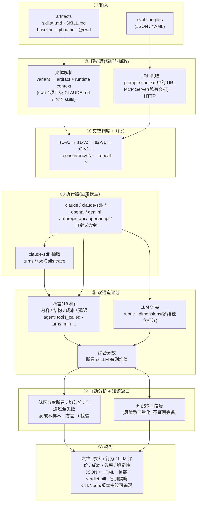

# oh-my-knowledge

[](https://www.npmjs.com/package/oh-my-knowledge)
[](https://github.com/lizhiyao/oh-my-knowledge/actions/workflows/ci.yml)
[](./LICENSE)
[](https://nodejs.org)

[English](./README.md) | **简体中文**

知识载体评测工具 — 用客观数据衡量你的 artifact 质量。

**固定模型，只变知识载体，数据说话。**

## 为什么需要这个工具

做知识工程的团队会产出大量知识载体（当前常见是 skill，也包括 prompt、agent、workflow 等）。当被问到"v2 比 v1 好在哪"时，需要客观数据而非主观判断。`oh-my-knowledge` 通过控制变量实验解决这个问题：相同模型、相同测试样本，只改变知识载体。

## 核心能力

- **控制变量离线评测** — 固定模型和样本，只变知识载体；兼容 Claude Code skill、CLAUDE.md prompt、RAG 知识库等任何 markdown 形式的指令
- **六维独立打分** — Fact / Behavior / LLM-judge / Cost / Efficiency / Stability 分别出信号，单一维度的回退不会被其他维度的收益掩盖
- **线上 session 观测** — 解析 Claude Code session JSONL，在真实用户会话上测量各 skill 的失败率、耗时、token 成本和知识缺口信号
- **知识缺口识别** — 严重度加权的信号（显式标记 / 搜索失败 / hedging 用语 / 反复失败）量化风险敞口,不宣称完备性
- **合并前 CI 门** — `omk bench ci` 强制三层 all-pass（fact + behavior + llm-judge），抓复合分掩盖的单层回退
- **一行 ship/no-ship 结论** — `omk bench verdict <reportId>` 聚合 bootstrap CI / 三层 ci-gate / saturation / human α,给六档 verdict（PROGRESS / CAUTIOUS / REGRESS / NOISE / UNDERPOWERED / SOLO）+ 行动建议;exit code 反映是否可 ship

### 统计严谨性
LLM 评测最容易踩的坑是"自信的偏差"——CI 很窄但结论错。omk 的统计层做四件事让结论可被外部审计：

- **Bootstrap CI** (`--bootstrap`) — 不假设分布的置信区间。t 检验在 LLM 序数评分上失效，bootstrap 直接重采样原始数据，对小 N（< 30）和偏态分布都稳。pairwise diff CI 不含 0 = 显著差异。
- **Human Gold + Krippendorff α** (`--gold-dir`) — 引入外部标注作为锚点。CI 解决"评委稳不稳"，α 解决"评委对不对"——两个维度互补。omk 自动检测污染（gold annotator 与 judge 同模型时警告）。
- **Length-controlled judge prompt** (默认开启) — 研究证实 LLM 评委隐性偏向更长的回答。omk 的 judge prompt 加显式段落"长度不是质量信号"，template hash 为 v3-cot-length，跟旧版本的报告 hash 肉眼可辨。`omk bench debias-validate length <reportId>` 重判检测偏差幅度。
- **Saturation curve** — 回答"我跑够样本了吗"。`--repeat ≥ 5` 时累积 N → 均值 + bootstrap CI 序列，CI 宽度衰减率 < 5% 持续 3 个窗口判定饱和——再多样本对结论无实质收益。HTML 报告内联 SVG 曲线 + verdict。

## 快速开始

```bash
# 安装
npm i oh-my-knowledge -g

# 生成评测项目脚手架
omk bench init my-eval
cd my-eval

# 把要对比的 artifact 放到 skills/ 目录
# 方式一：直接放 .md 文件（skills/v1.md, skills/v2.md）
# 方式二：放完整 artifact 目录（skills/my-skill-v1/SKILL.md, ...）
# 只放一个 artifact 也行，会自动加 baseline 对照

# 预览评测计划
omk bench run --dry-run

# 运行评测（自动发现 skills/ 目录下的所有 artifact）
omk bench run
```

## 在 Claude Code 中使用

安装 omk 后，在 Claude Code 中直接用自然语言交互：

```
/omk eval              # 评测当前项目的 artifact
/omk evolve            # 自动迭代改进 artifact
/omk gen-samples       # 生成测试用例
```

或直接说"帮我评测 v1 和 v2 的差异"、"改进一下这个 artifact"，omk 会自动理解意图并调用对应命令。

## 特性

| 特性 | 说明 |
|------|------|
| **21+ 种断言** | 包含子串、正则、JSON Schema、ROUGE/BLEU/Levenshtein 相似度、Agent 工具调用、语义相似度、自定义函数等 |
| **断言取反 + 组合** | 通用 `not: true` 字段 + `assert-set` (any/all) 任意嵌套 |
| **六维评估** | 事实 / 行为 / LLM 评价 / 成本 / 效率 / 稳定性独立展示 |
| **统计严谨性** | Bootstrap CI / Krippendorff α / Length-debias / Saturation curve |
| **Verdict 一行结论** | `omk bench verdict <id>` 六档判定 + ship 建议 + exit code 路由,与 HTML 报告 verdict pill 共享规则 |
| **RAG metrics** | `faithfulness` / `answer_relevancy` / `context_recall` 三 metric — 反幻觉 + 切题度 + context 覆盖,自动继承 length-debias |
| **样本质量诊断** | `omk bench diagnose <id>` 7 类 issue（区分度低 / 重复 / 歧义 / 成本异常 / 全 fail 等）+ healthScore 0-100 |
| **失败聚类 + 根因** | `omk bench failures <id>` 单 LLM 调用聚类失败样本 + 每 cluster 给修复建议 |
| **预算硬阈值** | `--budget-usd / --budget-per-sample-usd / --budget-per-sample-ms` 总成本 + 单样本成本/耗时上限,超出中止保留 partial report |
| **多执行器** | 支持 Claude CLI / Claude SDK / OpenAI / Gemini 及自定义命令 |
| **多评委 ensemble** | `--judge-models claude:opus,openai:gpt-4o` 跨厂商评分 + agreement 度量 |
| **MCP URL 获取** | 通过 MCP Server 获取私有文档 URL 内容（SSO 保护的知识库等） |
| **盲测 A/B** | `--blind` 隐藏变体名称，HTML 报告有揭晓按钮 |
| **并行执行** | `--concurrency N` 并行 N 个任务 |
| **多轮方差分析** | `--repeat N` 重复 N 次，计算均值/标准差/置信区间/t 检验 |
| **自动分析** | 检测低区分度断言、均匀分数、全通过/全失败、高成本样本 |
| **可追溯性** | 报告含 CLI 版本、Node 版本、artifact 版本指纹、judge prompt hash |
| **中英切换** | HTML 报告右上角一键切换语言 |

## 工作原理

核心思路:**固定模型 + 固定样本,只变 artifact 和 runtime context**,通过交错调度消除时间漂移,用断言 + LLM 评委双通道评分,再叠加知识缺口信号量化风险敞口。



**关键设计:**

- **交错调度**消除时间漂移:同一样本的不同 variant 交替发出,而非 v1 全跑完再跑 v2,避免模型负载/网络波动被错误归因给 artifact。
- **variant = artifact + runtime context**:`name@cwd` 让对照组可以显式声明"项目目录"这个隐性输入,把"项目级沉淀"和"显式 artifact 注入"拆开测。
- **双通道评分互补**:断言抓确定性缺陷(必须调用某工具/必须包含某字段),LLM 评委抓主观质量(可读性/完整性),两者都存在时取均值。
- **知识缺口信号**不是评分的一部分,而是一个独立追踪项:它告诉你"这次评测覆盖了多少风险敞口",用于追踪收敛,而非断言知识"完备"。

## 评测样本格式

支持 JSON 和 YAML（`eval-samples.json`、`eval-samples.yaml`、`eval-samples.yml`）。

```json
[
  {
    "sample_id": "s001",
    "prompt": "审查这段代码的安全性",
    "context": "function auth(u, p) { db.query('SELECT * FROM users WHERE name=' + u); }",
    "rubric": "应识别 SQL 注入风险并建议参数化查询",
    "assertions": [
      { "type": "contains", "value": "SQL 注入", "weight": 1 },
      { "type": "contains", "value": "参数化", "weight": 1 },
      { "type": "not_contains", "value": "没有问题", "weight": 0.5 }
    ],
    "dimensions": {
      "security": "是否识别出注入漏洞",
      "actionability": "是否给出可直接使用的修复代码"
    }
  }
]
```

### 字段说明

| 字段 | 类型 | 必填 | 说明 |
|------|------|------|------|
| `sample_id` | `string` | **是** | 样本唯一标识 |
| `prompt` | `string` | **是** | 发送给模型的用户提示词 |
| `context` | `string` | 否 | 附加上下文（代码片段等），会被包裹在代码块中拼接到 prompt 后。也支持 URL，运行时自动抓取内容 |
| `rubric` | `string` | 否 | LLM 评委的评分标准（1-5 分） |
| `assertions` | `array` | 否 | 断言检查列表，详见[断言类型](#断言类型) |
| `assertions[].type` | `string` | **是** | 断言类型 |
| `assertions[].value` | `string\|number` | 视类型 | 检查值（`contains`、`min_length`、`cost_max` 等必填） |
| `assertions[].values` | `array` | 视类型 | 字符串数组（`contains_all`、`contains_any` 必填） |
| `assertions[].pattern` | `string` | 视类型 | 正则表达式（`regex` 必填） |
| `assertions[].flags` | `string` | 否 | 正则标志（默认 `"i"`） |
| `assertions[].schema` | `object` | 视类型 | JSON Schema 对象（`json_schema` 必填，基于 [ajv](https://ajv.js.org/)） |
| `assertions[].reference` | `string` | 视类型 | 参考文本（`semantic_similarity` 必填） |
| `assertions[].threshold` | `number` | 否 | 语义相似度通过阈值（默认 3） |
| `assertions[].fn` | `string` | 视类型 | 自定义断言 JS 文件路径（`custom` 必填） |
| `assertions[].weight` | `number` | 否 | 权重（默认 1） |
| `dimensions` | `object` | 否 | 多维度评分，key 为维度名，value 为评分标准文本 |

### URL 自动抓取

`prompt` 和 `context` 中的 URL 会在评测前自动抓取内容并内联到文本中。适用于引用在线文档、API 文档等场景：

```json
{
  "sample_id": "s001",
  "prompt": "请根据以下 PRD 文档生成测试用例：https://wiki.example.com/prd/feature-x"
}
```

运行时，URL 会被替换为实际文档内容。获取顺序：先通过 MCP Server 获取匹配的 URL（如 SSO 保护的私有文档），再通过 HTTP 获取剩余 URL。MCP 已成功的 URL 不会重复 HTTP 抓取。

**私有文档 URL**：在项目目录放一个 `.mcp.json` 配置文件，或通过 `--mcp-config` 指定路径：

```json
{
  "mcpServers": {
    "docs": {
      "command": "npx",
      "args": ["@example/docs-mcp-server"],
      "env": { "DOCS_API_TOKEN": "xxx" },
      "urlPatterns": ["docs.example.com"],
      "fetchTool": {
        "name": "fetch_doc",
        "urlTransform": {
          "regex": "docs\\.example\\.com/([^/]+/[^/]+)/([^/?#]+)",
          "params": { "namespace": "$1", "slug": "$2" }
        },
        "contentExtract": "data.body"
      }
    }
  }
}
```

**公网 URL**：直接 HTTP 获取，如果需要认证请确保命令行环境已配置好网络访问（VPN、代理等）。

### 评分策略

#### 1. 断言评分

基于规则的本地检查，每个断言产生通过/失败结果。

**计算方式：**

- 通过率 = 通过断言的权重之和 / 总权重（0~1）
- 分数 = 1 + 通过率 × 4（映射到 1~5 分）
- 示例：3 个断言（权重各 1），2 个通过 → 通过率 = 2/3 → 分数 = 1 + 0.67 × 4 = **3.67**

#### 2. Rubric / Dimensions 评分

评委模型（默认 `haiku`）按标准打 1-5 分。`dimensions` 模式下各维度独立评分后取平均。

#### 3. 综合分数

| 条件 | 公式 |
|------|------|
| 仅断言 | `assertionScore` |
| 仅 LLM | `llmScore` |
| 两者都有 | `(assertionScore + llmScore) / 2` |
| 都没有 | `0` |

### 断言类型

**确定性断言（21+ 种）：**

| 类型 | 说明 |
|------|------|
| `contains` / `not_contains` | 包含/不包含子串 |
| `regex` | 正则匹配 |
| `min_length` / `max_length` | 长度范围 |
| `json_valid` / `json_schema` | JSON 校验 |
| `starts_with` / `ends_with` | 前缀/后缀匹配 |
| `equals` / `not_equals` | 精确匹配 |
| `word_count_min` / `word_count_max` | 词数范围 |
| `contains_all` / `contains_any` | 多值匹配 |
| `cost_max` / `latency_max` | 成本/延迟限制 |
| `tools_called` / `tools_not_called` / `tools_count_min` / `tools_count_max` | Agent 工具调用断言 |
| `tool_output_contains` / `tool_input_contains` | 工具输入/输出内容匹配 |
| `turns_min` / `turns_max` | 多轮对话轮数限制 |
| `rouge_n_min` | ROUGE-N recall ≥ threshold（`reference` 字段填参考答案，`n` 默认 1，`threshold` 默认 0.5） |
| `levenshtein_max` | 编辑距离 ≤ value（用于"输出跟参考几乎一致"场景） |
| `bleu_min` | BLEU-4 ≥ threshold（unsmoothed，短文本会塌陷到 0） |
| `faithfulness` | 输出是否被 `sample.context` 支持(反幻觉);LLM judge 1-5 评分,threshold 默认 3 |
| `answer_relevancy` | 输出是否切题回答 `sample.prompt`;能抓住跑题、回避、冗余;threshold 默认 3 |
| `context_recall` | `sample.context` 关键事实在输出中的覆盖率;`reference` 可显式指定 gold facts;threshold 默认 3 |
| `semantic_similarity` | LLM 语义相似度（与 reference 的整体相似度,与 RAG 三 metric 互补） |
| `custom` | 自定义 JS 函数（30s 超时） |

**通用修饰：**

任何断言加 `not: true` 即反向（替代 `not_contains` / `not_equals` 等成对类型；老类型保留作 alias）：

```yaml
- type: regex
  pattern: "TODO|FIXME"
  not: true              # 必须不含 TODO/FIXME
```

**断言组合（— assert-set）：**

`assert-set` 类型让多个断言以 `any`（OR）或 `all`（AND）逻辑组合，可嵌套：

```yaml
- type: assert-set
  mode: any              # 任一通过即过 (mode: 'all' 则需全部通过)
  children:
    - { type: contains, value: "参数化" }
    - { type: contains, value: "prepared statement" }
    - { type: regex, pattern: "bind\\(.*\\?" }
```

子断言可独立带 `not: true`；嵌套 assert-set 可表达任意布尔逻辑。

### 自定义断言

```js
// my-assertion.mjs
export default function(output, { sample, assertion }) {
  return { pass: output.includes('SQL'), message: '检查了 SQL 关键字' };
}
```

## 六维评估指标

评测报告从六个维度独立展示结果。其中评分三层(事实 / 行为 / LLM 评价)分开展示,让你看到**是哪一层拉胯**,而不是只看到一个合成分:

| 维度 | 指标 | 说明 |
|------|------|------|
| 📋 **事实** | 事实类断言通过率 | `contains` / `json_schema` / `fact_check` 等规则可验证断言的 1-5 分映射 |
| 🛠️ **行为** | 行为类断言通过率 | `tools_called` / `tool_output_contains` / `turns_max` 等执行合规类断言 |
| 💬 **LLM 评价** | rubric 评分 | 由评委模型按预先写好的评分规则（rubric）打的 1-5 分，主观但能抓规则断言之外的"整体好不好" |
| 💰 **成本** | 总成本、输入/输出 Token 数 | 基于 Token 消耗和模型定价的 API 费用 |
| ⚡ **效率** | 平均延迟 (ms) | 从发送请求到收到完整响应的端到端耗时 |
| 🛡️ **稳定性** | CV（变异系数） | 跨重复运行（`--repeat ≥ 2`）分数一致性；单轮评测显示 `—`，**诚实交代测不到什么** |

## CLI 参考

### `omk bench run`

```bash
omk bench run [选项]

选项：
  --samples <路径>       样本文件（默认：eval-samples.json，自动检测 .yaml/.yml）
  --skill-dir <路径>     artifact 目录（默认：skills）
  --control <expr>       对照组变体表达式（experiment role = control）
  --treatment <v1,v2>    实验组变体表达式,逗号分隔
                         除非用 --config 或 --each,--control / --treatment 两者至少传一个
                         特殊值：baseline（空 artifact）、git:name（git 历史版本）、
                         git:ref:name（指定 commit）、含 / 的路径（直接读取文件）
  --config <路径>        YAML/JSON 配置文件（evaluation-as-code）;在一个文件里声明
                         samples + variants + model + executor;CLI 参数会覆盖 config
  --model <名称>         被测模型（默认：sonnet）
  --judge-model <名称>   评委模型（默认：haiku）
  --output-dir <路径>    输出目录（默认：~/.oh-my-knowledge/reports/）
  --no-judge             跳过 LLM 评分
  --no-cache             禁用结果缓存（默认开启，相同输入自动复用）
  --dry-run              仅预览
  --blind                盲测模式
  --concurrency <n>      并行任务数（默认：1）
  --timeout <秒>         单个任务的执行器超时时间（默认：120）
  --repeat <n>           重复 N 次做方差分析（默认：1）
  --executor <名称>      执行器（默认：claude），支持自定义命令
  --skip-preflight       跳过评测前的模型连通性检查
  --mcp-config <路径>    MCP 配置文件，用于通过 MCP Server 获取私有文档 URL 内容
                         （默认：当前目录的 .mcp.json）
  --no-serve             评测完成后不自动启动报告服务
  --verbose              打印每个样本的详细执行结果（耗时、tokens、输出预览）
  --each                 批量评测：每个 artifact 独立和 baseline 对比
                         需要每个 artifact 配对 {name}.eval-samples.json
  --judge-repeat <n>     每条 sample × dimension 跑 LLM 评委 N 次,输出 stddev (评委自一致性)
  --judge-models <list>  多评委 ensemble: "executor1:model1,executor2:model2"
                         ≥ 2 个 judge 触发 ensemble + inter-judge agreement 输出
  --bootstrap            启用 distribution-free CI:每个 variant 加 bootstrap CI,
                         pairwise diff CI 含 0 = 不显著
  --bootstrap-samples N  bootstrap 重采样次数 (默认 1000)
  --gold-dir <路径>      跑完自动对比 human gold 算 Krippendorff α / κ / Pearson,
                         结果写入 report.meta.humanAgreement,HTML 报告显示「人工锚点」
  --no-debias-length     退回 v2-cot 评委 prompt (不含"长度不是质量信号"段落),
                         用于复现旧版本（v3-cot-length 之前）的报告 hash
  --budget-usd <num>             总成本上限 (USD);超出中止评测,partial report 仍持久化
                                 (`report.meta.budgetExhausted = true`)
  --budget-per-sample-usd <num>  单样本成本上限;超出该样本失败但评测继续
  --budget-per-sample-ms <num>   单样本耗时上限 (ms);超出该样本失败但评测继续
```

**eval.yaml 预算字段**: `budget: { totalUSD?, perSampleUSD?, perSampleMs? }`,所有字段可选且必须 ≥ 0。CLI 同名 flag 覆盖配置值。

**和 `cost_max` / `latency_max` 断言的区别**: 断言是**单样本评分维度**(超出直接打 0 分,run 继续);budget 是**工作流级硬阈值**(`totalUSD` 超出整个 run abort 保留 partial report,per-sample 超出该样本失败但 run 继续)。一个回答"质量是否达标",一个回答"花钱/时间是否在预算内"。

### `omk bench run --each`（批量评测）

当 skills/ 下放了多个**独立的** artifact 时，使用 `--each` 逐个评测，每个 artifact 独立和 baseline 对比，生成一份合并报告。

```
skills/
├── asset.md                       ← artifact 文件
├── asset.eval-samples.json        ← 配对的测试集
├── home.md
├── home.eval-samples.json
└── product/                       ← 目录格式也支持
    ├── SKILL.md
    └── eval-samples.json
```

配对规则：

- `{name}.md` → 查找同目录下的 `{name}.eval-samples.json`
- `{name}/SKILL.md` → 查找 `{name}/eval-samples.json`
- 没有配对 eval-samples 的 artifact 会被跳过并打印警告

```bash
omk bench run --each
omk bench run --each --dry-run
```

### `omk bench gen-samples`（生成测评用例）

读取 artifact 内容，通过 LLM 自动生成 eval-samples。生成后请审查编辑再跑评测。

```bash
# 为指定 artifact 生成测试集（输出到 eval-samples.json）
omk bench gen-samples skills/my-skill.md

# 为 skills/ 下所有缺少测试集的 artifact 批量生成
omk bench gen-samples --each

# 指定生成数量
omk bench gen-samples skills/my-skill.md --count 10
```

选项：

```
  --each                 为所有缺少 eval-samples 的 artifact 批量生成
  --count <n>            每个 artifact 生成的样本数（默认：5）
  --model <名称>         生成用的模型（默认：sonnet）
  --skill-dir <路径>     artifact 目录（默认：skills），配合 --each 使用
```

### `omk bench evolve`（自我循环改进）

让 AI 自动迭代 artifact：评测 → 分析弱点 → LLM 改进 → 再评测 → 分数涨了留、没涨扔 → 重复。

```bash
# 基本用法：迭代 5 轮
omk bench evolve skills/my-skill.md

# 指定轮数和目标分数
omk bench evolve skills/my-skill.md --rounds 10 --target 4.5
```

选项：

```
  --rounds <n>           最大迭代轮数（默认：5）
  --target <分数>        目标分数，达到即停
  --samples <路径>       样本文件（默认：eval-samples.json）
  --improve-model <名称> 改进用模型（默认：sonnet）
```

每轮产出保存在 `skills/evolve/` 目录（`my-skill.r0.md`、`my-skill.r1.md`...），可以 diff 查看 AI 改了什么。最佳版本自动写回原始文件。

### `omk bench ci`

在自动化流水线中运行评测。评分达标则退出码为 0(通过),否则为 1(失败),可直接用于卡点判断。

门禁是**三层 all-pass**:`avgFactScore >= threshold AND avgBehaviorScore >= threshold AND avgJudgeScore >= threshold`,任一层低于阈值即 FAIL,输出显示是哪一层破了 gate。这样能把"事实 4.5→2.5 但 judge 3→5"这种合成分均值不变但事实层崩盘的 case 暴露出来 — 任何一层退化都会被卡住。

```bash
omk bench ci [选项]
  --threshold <数值>     各层最低分数(默认:3.5);独立应用于
                         fact / behavior / judge 三层
```

### `omk bench report`

启动报告服务，浏览历史报告、提交反馈、删除报告。

```bash
omk bench report [选项]
  --port <端口号>        服务端口（默认：7799）
```

### `omk bench init`

```bash
omk bench init [目录]    # 生成评测项目脚手架
```

### `omk bench gold`（人工锚点）

人工标注（或更强模型代理）作为外部锚点，与 LLM 评委的分数对比 Krippendorff α / 加权 κ / Pearson。回答"评委对不对"，与 Bootstrap CI 的"评委稳不稳"互补。

```bash
omk bench gold init [--out <dir>] [--annotator <id>]   # 生成数据集模板
omk bench gold validate <dir>                          # 校验 schema (annotator/时间/版本/score 范围)
omk bench gold compare <reportId> --gold-dir <dir>     # 与已有 report 对比,输出 verdict + α/κ/r
```

dataset 目录结构：

```
gold-dir/
├── metadata.yaml      # annotator (注意不要与 omk judge 同模型,会触发污染警告) + 时间 + 版本
└── annotations.yaml   # [{ sample_id, score, reason? }] 按 sample_id 拼接
```

α 阈值参考 Krippendorff (2011)：≥ 0.80 高度一致；[0.67, 0.80) 可接受；< 0.40 偏差大需排查 rubric / prompt。

完整 demo: [examples/gold-dataset/](examples/gold-dataset/)

### `omk bench debias-validate length`（评委长度偏差检测）

重判已有 report 的所有 (sample × variant)，用相反的 length-debias 设置（v3-cot-length ↔ v2-cot），bootstrap CI 算两次差值。差异显著 = 评委对长度敏感（length bias 间接证据）。

```bash
omk bench debias-validate length <reportId> [选项]
  --variant <name>            只测一个 variant
  --judge-model <id>          override report 的 judge model
  --bootstrap-samples N       bootstrap 迭代数 (默认 1000)
  --seed N                    确定性种子
```

verdict 分四档：未检测 / 弱 / 中（差值 |0.2-0.5|）/ 强（差值 ≥ 0.5）。重判 cost 大致翻倍。

### `omk bench saturation`（饱和曲线）

回答"我跑够样本了吗"。从已有 report 读取 saturation trace 输出判定，无需重跑评测。需要原 run 跑了 `--repeat ≥ 5` 才会有 verdict（低 repeat 只画曲线）。

```bash
omk bench saturation <reportId> [选项]
  --variant <name>             只看一个 variant
  --method <m>                 slope | bootstrap-ci-width (默认) | plateau-height
  --threshold <num>            方法相关阈值 (默认随 method)
  --window <num>               连续多少窗口满足才判饱和 (默认 3)
```

HTML 报告会内联 SVG 饱和曲线（横 N，纵 mean ± 95% CI 阴影带，per-variant 一条），自动渲染。

### `omk bench verdict`（一行 ship/no-ship 结论）

聚合 bootstrap CI / 三层 ci-gate / saturation / human α 给一行结论。Verdict 六档:**PROGRESS**（显著改进 + 三层全过 → exit 0）/ **CAUTIOUS**（改进真实但有警告:gate 破/幅度太小/控制组本身崩 → exit 1）/ **REGRESS**（显著回退 → exit 1）/ **NOISE**（CI 跨 0,无法判定 → exit 1）/ **UNDERPOWERED**（样本不足 → exit 1）/ **SOLO**（单变体,仅自身三层 gate 过才 exit 0）。

```bash
omk bench verdict <reportId> [选项]
  --threshold <num>      三层 gate 阈值 (默认 3.5,匹配 omk bench ci)
  --trivial-diff <num>   "幅度太小"阈值 (默认 0.1)
  --verbose              展开 per-pair 详情
```

与 HTML 报告顶部的 verdict pill 共享规则模块,CLI 与 UI 不会矛盾。

### `omk bench diagnose`（样本质量诊断）

回答"测评结论是否被坏样本污染"。诊断 7 类样本质量问题:`flat_scores`（区分度低）/ `all_pass`（太简单）/ `all_fail`（broken,error 级）/ `near_duplicate`（prompt ROUGE-1 ≥ 阈值）/ `ambiguous_rubric`（judge stddev 大,需要 `--judge-repeat ≥ 2`）/ `cost_outlier`（≥ k× median）/ `latency_outlier`（≥ k× median）/ `error_prone`（执行失败）。

```bash
omk bench diagnose <reportId> [选项]
  --top <n>                   每类显示前 N 个 (默认 10,0=全部)
  --duplicate-rouge <num>     near-duplicate ROUGE-1 阈值 (默认 0.7)
  --ambiguous-stddev <num>    歧义 judge stddev 阈值 (默认 1.0)
  --cost-k <num>              成本异常倍数 vs median (默认 3)
  --latency-k <num>           耗时异常倍数 vs median (默认 3)
  --flat <num>                flat_scores 分差阈值 (默认 0.5)
```

输出含 healthScore（0-100,公式 `100 - normalized × 20`,其中 `normalized = (errors×8 + warnings×3 + infos×1) / N`）。exit code 0 仅当 `healthScore ≥ 70` 且无 error 级 issue,适合 CI 链。

### `omk bench failures`（失败 case LLM 聚类）

跑完 14 条失败,逐个看太慢。本命令把失败样本喂给单次 LLM 调用,自动聚到 ≤ N 个 cluster,每个 cluster 给根因 + 修复建议。失败定义:`compositeScore < threshold` 或 `ok = false`。

```bash
omk bench failures <reportId> [选项]
  --judge-executor <name>     执行器 (默认 claude)
  --judge-model <id>          聚类用 model (默认沿用 report.meta.judgeModel)
  --max-clusters <n>          最多多少 cluster (默认 5)
  --threshold <num>           算失败的分数阈值 (默认 3)
  --max-feed <n>              最多喂给 LLM 多少条 (默认 50,超出取最差)
```

容错:tolerate ```json``` markdown fence、`"sample_id@variant"` 字符串成员形式、hallucinated 成员自动剔除、单条失败跳过 LLM 直接列出、executor 错误降级到 unclassified。

### `omk bench diff`（报告对比 — 单参 / 双参双模式）

**单参模式**(within-report sample-level 钻取): `omk bench diff <reportId>` — 在同一份报告内对比两个 variant 的逐样本得分,默认对比 `variants[0]` vs `variants[1]`。

**双参模式**(cross-report variant-level): `omk bench diff <reportId1> <reportId2>` — 跨报告对比同一 variant 的整体均值漂移(向后兼容旧用法)。

```bash
omk bench diff <reportId> [--variant <name>] [--regressions-only] [--threshold 0] [--top N]
omk bench diff <reportId1> <reportId2> [--regressions-only] [--threshold 0]
```

单参模式表格按 |Δ| 排序,Δ < threshold 高亮 regression。`--top N` 限制行数,`--regressions-only` 过滤到只看回退。

## `omk analyze` — 生产观测

`omk bench run` 是**离线评测**(固定对照、可复现、可评分)。生产环境不一样 — 没对照组、没标准答案、没重复,所以评分在那里不成立。`omk analyze` 把已有的 Claude Code session trace 转成**skill 健康度报告**(按 skill 维度的覆盖率、缺口信号、执行稳定性、tokens/延迟)。它给的是"哪个 skill 值得拉回离线再测一遍"的线索,不是生产评分。

```bash
# 分析当前项目的所有 cc session(kb 路径从 trace 里自动推断)
omk analyze ~/.claude/projects/-Users-you-Documents-my-project

# 限定时间窗:最近 7 天 / 24 小时 / 30 分钟
omk analyze ~/.claude/projects/my-project --last 7d

# 绝对时间窗
omk analyze ~/.claude/projects/my-project --from 2026-04-01T00:00:00Z --to 2026-04-15T23:59:59Z

# 白名单特定 skill
omk analyze ~/.claude/projects/my-project --skills audit,polish

# 显式指定知识库根目录(覆盖自动推断)
omk analyze ~/.claude/projects/my-project --kb /path/to/project
```

命令产出 `~/.oh-my-knowledge/analyses/<timestamp>-skill-health.json`。启 `omk bench report` 后,首页右上有"📊 Skill 健康度日报"入口;每张 skill card 上有"查看趋势 →"链接;`/analyses` 列表页顶部有 Compare 选择器,可以选两份报告生成 diff。

**每个 skill 你能看到:**

- **知识使用** — 这个 skill 实际读了哪些 KB 文件(coverage %)
- **知识盲区** — 四类加权信号(搜索未命中 / 模型标记缺口 / 表达不确定 / 反复未命中);hedging 经 LLM 二次判定过滤"业务可能性"和"知识不确定"
- **执行稳定性** — 工具失败率;失败率 > 20% 的 skill 会标警告,提示"gap 信号可能是环境问题而非真实知识缺口"
- **使用成本** — billable tokens(input+output)和 cached tokens 分列,总耗时

**这不是什么:**

- 不是通用 APM(请求级 latency/cost tracing 是 Langfuse / Datadog 的领域)
- 不是 streaming / alert(只做 batch — 想要周期快照用 cron)
- 不是生产评分(没对照组没标答 — 评分回到 `omk bench run`)

## 执行器

### 内置执行器

| 执行器 | 适用场景 | 说明 |
|--------|----------|------|
| `claude` | 默认 | 通过 `claude -p` 调用 Claude CLI |
| `claude-sdk` | 结构化输出 | 通过 Claude Agent SDK 调用，无 stdout 解析，避免 buffer 截断 |
| `openai` | 跨厂商对比 | 通过 `openai api` CLI 调用 |
| `gemini` | 跨厂商对比 | 通过 `gemini` CLI 调用 |
| `anthropic-api` | 无需 CLI | 直接调用 Anthropic HTTP API（需 `ANTHROPIC_API_KEY`） |
| `openai-api` | 无需 CLI | 直接调用 OpenAI HTTP API（需 `OPENAI_API_KEY`） |

API 直调执行器支持通过环境变量自定义 Base URL：`ANTHROPIC_BASE_URL`、`OPENAI_BASE_URL`。

### 自定义执行器

任何 shell 命令都可以作为执行器，通过 stdin/stdout JSON 协议通信：

```bash
omk bench run --executor "python my_provider.py"
omk bench run --executor "./my-executor.sh"
```

**协议约定：**

- **输入**（stdin）：JSON `{"model":"...","system":"...","prompt":"..."}`
- **输出**（stdout）：JSON `{"output":"模型回复","inputTokens":0,"outputTokens":0,"costUSD":0}`
- stdout 中只需返回有值的字段，其余默认为 0；也可以直接输出纯文本（不解析 token/成本）
- 非零退出码视为执行失败

### Artifact 目录结构

默认执行器（claude/openai/gemini）支持两种 artifact 布局，同一次评测中可混用：

```
skills/
├── v1.md                    # 方式一：直接放 .md 文件
└── my-skill/                # 方式二：完整 artifact 目录
    ├── SKILL.md             #   工具自动读取此文件作为 system prompt
    ├── config.json          #   其他文件不参与评测，仅保留完整性
    └── scripts/
```

**Variant 解析规则：**

`variant` 是实验分组表达式。解析之后，OMK 会得到一个 `artifact` 与可选的 `runtime context`（当前主要是 `cwd`）。

| 格式 | 含义 |
|------|------|
| `name` | 从 artifact 目录查找 `name.md` 或 `name/SKILL.md`，解析为一个 artifact |
| `baseline` | 空 artifact，不使用 system prompt；可直接理解为“什么都没有” |
| `project-env@/path/to/project` | 空 artifact，但在指定项目目录运行，用于单独观察项目级 runtime context |
| `git:name` | 从 git HEAD 读取一个 artifact 的上次提交版本 |
| `git:ref:name` | 从 git 指定 commit 读取一个 artifact |
| `./path/to/file.md` | 含 `/` 的路径，直接读取文件作为 artifact |
| `variant@/path/to/project` | 给任意变体附加运行目录，支持 `name@cwd`、`git:name@cwd`、`/file.md@cwd` |

`--control` 和 `--treatment` 都不传时,用 `--config eval.yaml` 或 `--each`。`--each` 模式下会自动用 `baseline` 作对照组,每个被发现的 artifact 作实验组。

```bash
# 显式:一个 control,一个或多个 treatment
omk bench run --control v1 --treatment v2
omk bench run --control baseline --treatment v1,v2,v3

# 对比空 artifact 和显式 artifact 的效果差异
omk bench run --control baseline --treatment my-skill

# 单独观察项目级 runtime context 的影响(用自描述标签)
omk bench run --control baseline --treatment project-env@/path/to/target-project

# 对比"项目级 runtime context"与"显式 artifact 注入"
omk bench run \
  --control project-env@/path/to/target-project \
  --treatment /path/to/target-project/.claude/skills/prd/SKILL.md@/path/to/target-project

# 对比修改前后(旧版本从 git 历史读取)
omk bench run --control git:my-skill --treatment my-skill

# 直接指定文件路径
omk bench run --control ./old-skill.md --treatment ./new-skill.md

# 配置文件驱动(evaluation-as-code)
omk bench run --config eval.yaml
```

**前置要求：**

- **claude**：安装 [Claude Code](https://claude.ai/code) 并认证
- **claude-sdk**：安装 [Claude Code](https://claude.ai/code) 并认证（使用 Agent SDK，无需 CLI stdout 解析）
- **anthropic-api**：设置 `ANTHROPIC_API_KEY` 环境变量
- **openai**：`pip install openai` 并设置 `OPENAI_API_KEY`
- **openai-api**：设置 `OPENAI_API_KEY` 环境变量
- **gemini**：`npm i -g @google/gemini-cli` 并认证

### Agent 评测与项目级 Runtime Context

当执行器使用 `claude-sdk` 时，OMK 现在已经支持第一版 agent-aware evaluation。

这里建议把几个概念分开理解：

- `artifact`：被评测对象，例如 baseline、skill、prompt、agent
- `variant`：CLI 里的实验分组表达式
- `runtime context`：运行时上下文，当前主要是 `cwd`；在项目型 agent 场景下，它就包含项目目录、`CLAUDE.md`、本地 skills 等会影响行为的环境因素

在 OMK 里，`agent` 不是所有对象的总称，`skill` 也不是所有对象的总称。更稳妥的说法是：你在比较不同 artifact 在不同 runtime context 下的表现。

- 自动抽取 turns / toolCalls trace
- 支持基于工具调用行为的断言
- 支持在指定 `cwd` 下运行，让 Claude Code 自动加载项目内的 `CLAUDE.md`、skills 和本地 runtime context

#### 推荐执行器

```bash
omk bench run --executor claude-sdk
```

#### 支持的 agent 相关断言

| 断言 | 含义 |
|------|------|
| `tools_called` | 必须调用指定工具 |
| `tools_not_called` | 禁止调用指定工具 |
| `tools_count_min` / `tools_count_max` | 工具调用次数上下界 |
| `tool_output_contains` | 指定工具输出必须包含关键内容 |
| `turns_min` / `turns_max` | 交互轮次上下界 |

#### 三种常见对照组

**1. 裸模型 baseline**

不注入 system prompt,也不进入带知识的项目目录。至少需要一个 treatment 做对比:

```bash
omk bench run \
  --executor claude-sdk \
  --control baseline \
  --treatment my-skill
```

**2. 空 artifact + 项目级 runtime context**

不注入 system prompt,但在项目目录运行。它不是严格意义上的"裸 baseline",而是"空 artifact + 项目级 runtime context"。

```bash
omk bench run \
  --executor claude-sdk \
  --control baseline \
  --treatment project-env@/path/to/target-project
```

**3. 显式 artifact 注入**

直接把某个外部 `SKILL.md` 作为 artifact 注入,同时保留项目目录上下文。适合对比"项目级 runtime context"与"显式单 artifact 注入"之间的差异。

```bash
omk bench run \
  --executor claude-sdk \
  --control project-env@/path/to/target-project \
  --treatment /path/to/target-project/.claude/skills/prd/SKILL.md@/path/to/target-project
```

#### 推荐的第一轮对照设计

对于 PRD / 复杂业务知识场景,建议从下面开始:

```bash
omk bench run \
  --executor claude-sdk \
  --samples skills/evaluate-review/eval-samples.yaml \
  --control baseline \
  --treatment /path/to/target-project/.claude/skills/prd/SKILL.md@/path/to/target-project
```

如果你想证明"项目目录中的知识沉淀本身"是否有效,加第二个 treatment:

```bash
omk bench run \
  --executor claude-sdk \
  --samples skills/evaluate-review/eval-samples.yaml \
  --control baseline \
  --treatment project-env@/path/to/target-project,/path/to/target-project/.claude/skills/prd/SKILL.md@/path/to/target-project
```

#### 设计建议

- **先用 `--dry-run`**：确认样本、variant 和 `cwd` 被正确解析
- **项目级对照必须区分 `cwd`**：相同 prompt 在不同项目目录下会走不同 runtime context
- **优先先跑 PRD 场景**：相比 Coding，更容易验证知识完整性、影响面识别和业务正确性

### 常见模型配置示例

**没有 Claude？** 大多数国产模型（GLM、通义千问、Moonshot、DeepSeek 等）都兼容 OpenAI API 格式，可以直接使用 `openai-api` 执行器：

```bash
# GLM（智谱）
export OPENAI_API_KEY="你的智谱 API Key"
export OPENAI_BASE_URL="https://open.bigmodel.cn/api/paas/v4"
omk bench run --executor openai-api --model glm-4-plus \
  --judge-model glm-4-plus --no-cache

# 通义千问
export OPENAI_API_KEY="你的通义 API Key"
export OPENAI_BASE_URL="https://dashscope.aliyuncs.com/compatible-mode/v1"
omk bench run --executor openai-api --model qwen-plus \
  --judge-model qwen-plus

# DeepSeek
export OPENAI_API_KEY="你的 DeepSeek API Key"
export OPENAI_BASE_URL="https://api.deepseek.com"
omk bench run --executor openai-api --model deepseek-chat \
  --judge-model deepseek-chat

# Moonshot（Kimi）
export OPENAI_API_KEY="你的 Moonshot API Key"
export OPENAI_BASE_URL="https://api.moonshot.cn/v1"
omk bench run --executor openai-api --model moonshot-v1-8k \
  --judge-model moonshot-v1-8k
```

**Ollama 本地模型：**

```bash
omk bench run --executor "python examples/custom-executor/ollama-executor.py" \
  --model llama3 --no-judge
```

**关于评委模型：**

- `--judge-model` 指定 LLM 评委使用的模型，默认 `haiku`
- `--judge-executor` 指定评委使用的执行器（默认与 `--executor` 相同）
- 如果你没有 Claude，用 `--judge-executor` 和 `--judge-model` 指向你可用的模型
- 加 `--no-judge` 可跳过 LLM 评委，仅使用断言评分

## 环境变量

| 变量 | 说明 |
|------|------|
| `CCV_PROXY_URL` | 将请求代理到 cc-viewer，实时可视化评测流量 |
| `OMK_BENCH_PORT` | 报告服务端口（默认：7799） |

## 系统要求

- Node.js >= 20
- `claude` CLI（用于默认执行器和 LLM 评委，安装方式见 [Claude Code](https://claude.ai/code)）
  - 使用其他执行器（openai/gemini）且加 `--no-judge` 时可不装

## 安全说明

本工具设计用于**本地可信环境**（开发机、CI 流水线）。以下功能会执行本地代码，请确保输入来源可信：

| 功能 | 风险说明 | 适用范围 |
|------|----------|----------|
| **自定义断言** (`custom`) | 动态加载并执行用户指定的 `.mjs` 文件 | 仅使用自己编写或审查过的断言文件 |
| **eval-samples.json** | 断言配置中可引用外部文件路径 | 不要使用不可信来源的样本文件 |

**建议：**

- 不要在公网服务中暴露 `omk bench report` 服务（无认证）
- 不要用不可信的第三方 eval-samples 文件
- 自定义断言有 30 秒执行超时，但无沙箱隔离

---

版本变更记录见 [CHANGELOG](./CHANGELOG.md)。欢迎贡献 — 详见 [CONTRIBUTING](./CONTRIBUTING.md)。
