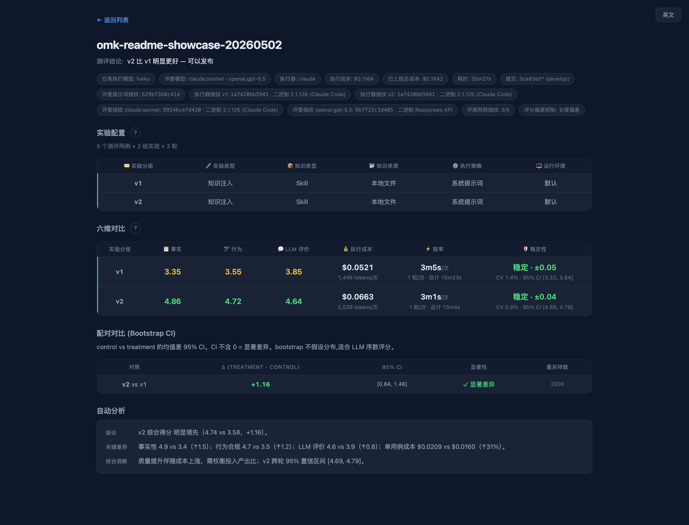

# oh-my-knowledge

[](https://www.npmjs.com/package/oh-my-knowledge)
[](https://www.npmjs.com/package/oh-my-knowledge)
[](https://github.com/lizhiyao/oh-my-knowledge/actions/workflows/ci.yml)
[](./LICENSE)
[](https://nodejs.org)

[English](./README.md) | **简体中文**

**你改完 prompt，真的变好了吗？**
用统计严谨性 A/B 测试你的 prompt 和 skill —— Bootstrap 置信区间、长度去偏默认开，配一份人工 gold 就自动算 Krippendorff α。

📖 **完整文档：[oh-my-knowledge.pages.dev/zh](https://oh-my-knowledge.pages.dev/zh/)**（可搜索，可切换英文）



## 快速开始

```bash
npm i -g oh-my-knowledge
omk init demo && cd demo
omk eval --control code-review-v1 --treatment code-review-v2
```

开箱即跑：`omk init` 脚手架好两版 skill 和三条评测用例，不用先改任何文件，`omk eval` 跑控制变量 A/B，约 5 分钟出 HTML 报告 + 一行 verdict；跑通后再把 skill 和用例换成你自己的。

前置：默认执行器与评委用 `claude` CLI，需先安装并登录（见[系统要求](#系统要求)）；想用别的模型或离线跑（无需 API key）见[执行器](docs/zh/reference/executors.md)。

> 首跑只有 3 条用例，verdict 多半是「数据不足（UNDERPOWERED）」——这是正常起点而非出错；把用例加到约 20 条以上，再看「可发布」结论。

> 命令行有新版本时会自动提示（每 20 小时最多一次）；想永久关闭该提醒，设环境变量 `OMK_SKIP_UPDATE_CHECK=1` 即可。

手把手教程：[5 分钟快速上手](docs/zh/quickstart-skill-eval.md)（推荐第一次跑评测的用户）。更多可跑示例（Skill Map、A/B、离线执行器、agent runtime、RAG）见仓库的[示例画廊](https://github.com/lizhiyao/oh-my-knowledge/tree/main/examples)。

深入：[为谁、解决什么](docs/zh/explanation/who-omk-is-for.md) · [CLI 参考](docs/zh/reference/cli.md) · [工作原理](docs/zh/explanation/architecture.md) · [评测用例格式](docs/zh/reference/eval-sample-format.md) · [执行器](docs/zh/reference/executors.md) · [artifact 布局](docs/zh/reference/artifact-layout.md)

## 在 AI Coding Agent 中使用

安装 omk 官方 Agent Skill 后，可以直接用自然语言让 coding agent 跑 omk 工作流：

```bash
omk install omk-agent-skill
```

默认只会安装到本机已检测到、且 omk 明确支持的目标：检测到 `~/.codex` 或 `~/.agents` 时写入 Codex/AGENTS，检测到 `~/.claude` 时写入 Claude Code。要强制写入当前 omk 已知的全部目标，用 `--to all`；要指定自定义 skill 根目录，用 `--dest`。

### 在 Claude Code 中使用

当 `omk` skill 已在 Claude Code 中可用时，可以直接这样调用：

```bash
/omk eval              # 评测当前项目的 artifact
/omk evolve            # 多轮自动迭代改进 skill
/omk sample            # 生成或补齐评测用例
```

这些 slash command 是自然语言入口 —— agent 会从对话上下文里推断要操作哪个 skill。也可以直接说「帮我评测 v1 和 v2 的差异」、「改进一下这个 artifact」，omk 会自动理解意图并调用对应命令。

### 在 Codex 中使用

Codex 默认不支持 `/omk ...` 这种 Claude Code 风格的 slash command。通常直接让 agent 执行 `omk` CLI，例如：

```bash
omk eval
omk evolve skills/my-skill.md   # 一键:体检 →(无用例则自动生成)→ 自迭代
omk sample skills/my-skill.md
```

也可以直接用自然语言描述目标，例如「比较 v1 和 v2 的评测差异」、「为这个 skill 生成评测用例」。

> `omk evolve` 是一键闭环：默认先跑 doctor 体检，目标 skill 没有评测用例时会自动生成一批，再进入多轮自迭代。全新 skill 直接 `omk evolve skills/foo.md` 即可。

## 为什么需要这个工具

做知识工程的团队会产出大量知识载体（当前常见是 skill，也包括 prompt、agent、workflow 等）。当被问到「v2 比 v1 好在哪」时，需要客观数据而非主观判断。`oh-my-knowledge` 通过控制变量实验解决这个问题：**相同模型、相同评测用例，只改变知识载体。**

## 为什么选 omk

| | omk | promptfoo | DeepEval | LangSmith |
|--|--|--|--|--|
| Bootstrap 置信区间 | ✓ 默认 | ✗ | ✗ | ✗ |
| Krippendorff α（评委 ↔ 人工） | ✓ 加 gold 即开 | ✗ | ✗ | ✗ |
| 长度去偏的评委 prompt | ✓ 默认 | ✗ | ✗ | ✗ |
| 饱和曲线 | ✓ | ✗ | ✗ | ✗ |
| 三层独立评分 | ✓ | ✗ | 部分 | ✗ |
| 用例隔离(construct validity) | ✓ 默认 | ✗ | ✗ | ✗ |
| 原生 Agent Skill | ✓ | ✗ | ✗ | ✗ |
| 托管 SaaS 看板 | ✗ | ✗ | ✓ | ✓ |

omk 的护城河是 **default-on 安全网** —— Bootstrap CI / 长度去偏不是 advanced flag，是默认行为；评委 ↔ 人工 α 只要给一份 gold 集就自动算。其他工具让你**手动**接置信区间；omk 让你**默认无法忽略**它。需要 SaaS 看板？选 LangSmith。要快速 prompt 迭代不要统计层？选 promptfoo。**要发到生产且会被问「为什么应该相信这个数字」？选 omk。**

RAG 专项评测请看 RAGAS（独立 niche，跟 omk 互补）。完整对比（7 个工具 × 25+ 维度）： [docs/zh/reference/comparison.md](docs/zh/reference/comparison.md)

## 特性

| 特性 | 说明 |
|------|------|
| **Verdict 一行结论** | `omk eval` 六档判定 + ship 建议 + exit code 路由，与 HTML 报告 verdict pill 共享规则 |
| **六维评估** | 事实 / 行为 / LLM 评价 / 成本 / 效率 / 稳定性独立展示 |
| **多执行器** | 支持 Claude CLI / Claude SDK / Codex CLI / Codex SDK / OpenAI / Gemini / Anthropic API 及自定义命令 |
| **30+ 种断言** | 包含子串、正则、JSON Schema、ROUGE/BLEU/Levenshtein 相似度、Agent 工具调用、语义相似度、自定义函数等 |
| **统计严谨性** | Bootstrap CI / 长度去偏 / 饱和曲线默认开，Krippendorff α 提供 gold 集即自动计算。[详情 →](docs/zh/explanation/statistical-rigor.md) |
| **RAG metrics** | `faithfulness` / `answer_relevancy` / `context_recall` 三 metric — 反幻觉 + 切题度 + context 覆盖 |
| **LLM 健康度审计** | `omk doctor` 给 7 个内置维度独立打分；`--static-only` 可离线无 LLM 调用 |
| **线上 session 观测** | 解析 Claude Code session JSONL，测量各 skill 的失败率、耗时、token 成本、知识缺口信号 |
| **知识缺口识别** | 严重度加权的信号量化风险敞口，不宣称完备性 |
| **用例隔离 (construct validity)** | `--strict-baseline`（默认开）三堵 baseline 拿到被测 skill 的污染路径 |
| **Git / 远端源** | install / eval 支持本地 git ref 或远端 git URL（`--git-url`）；目录-skill 在内容寻址**隔离副本**里执行，`references/` 资产是真实测量输入，不只是 `SKILL.md` |
| **证据门控管理** | `omk install` 登记受管记录；`omk eval` 按内容指纹自动写入证据，把 skill 从 `installed` 推到 `measurable`；`omk list` 查看各受管 skill 的状态（installed / measurable / promoted / stale）；`omk promote` 在证据过门禁（默认仅 PROGRESS）后把该版本接受为当前版本；`omk rollback` 撤销这次接受，让 skill 回到 `measurable`。[规范 →](docs/zh/specs/evidence-gated-management.md) |
| **用例设计科学性** | Sample schema 加 `capability` / `difficulty` / `construct` / `provenance` 元数据字段（HF Dataset Cards 风），studio 输出 coverage 分桶 + `rubric_clarity_low` / `capability_thin` issue。[docs/zh/specs/sample-design-spec.md](docs/zh/specs/sample-design-spec.md) |
| **多评委 ensemble** | `--judge-models claude:opus,openai-api:gpt-4o` 跨厂商评分 + agreement 度量 |
| **多轮方差分析** | `--repeat N` 重复 N 次，计算均值/标准差/置信区间/t 检验 |
| **MCP URL 获取** | 通过 MCP Server 获取私有文档 URL 内容（SSO 保护的知识库等） |
| **自动分析** | 检测低区分度断言、均匀分数、全通过/全失败、高成本用例 |
| **可追溯性** | 报告含 CLI 版本、Node 版本、artifact 版本指纹、judge prompt hash |
| **中英切换** | HTML 报告右上角一键切换语言 |

## 文档

完整文档已发布到 **[oh-my-knowledge.pages.dev/zh](https://oh-my-knowledge.pages.dev/zh/)** —— 可搜索，可切换英文。重点页面：

- **[工作原理](docs/zh/explanation/architecture.md)** —— 交错调度、variant 解析、双通道评分、六维报告
- **[评测用例格式](docs/zh/reference/eval-sample-format.md)** —— sample schema、评分公式、30+ 断言类型、自定义 JS 断言
- **[CLI 参考](docs/zh/reference/cli.md)** —— 顶层命令的 bash 示例和 flag 表
- **[执行器](docs/zh/reference/executors.md)** & **[artifact 布局](docs/zh/reference/artifact-layout.md)** —— 内置 / 自定义执行器；variant 如何解析为 artifact + runtime context
- **[操作指南](docs/zh/guides/agent-eval.md)** —— [评测 agent](docs/zh/guides/agent-eval.md)（项目 runtime context）与[使用非 Claude 模型](docs/zh/guides/non-claude-models.md)（GLM / 通义 / DeepSeek / Moonshot / Ollama）
- **[快速上手](docs/zh/quickstart-skill-eval.md)** —— 第一次跑评测的 5 分钟教程
- **[示例画廊](https://github.com/lizhiyao/oh-my-knowledge/tree/main/examples)** —— 仓库里一组可直接跑的示例，按由简到全排成上手路径
- **[用例设计规范](docs/zh/specs/sample-design-spec.md)** —— capability / construct / provenance 元数据；行业 gap 映射
- **[统计严谨性](docs/zh/explanation/statistical-rigor.md)** —— 为什么 Bootstrap CI / α / 长度去偏 / 饱和曲线重要
- **[7 工具对比](docs/zh/reference/comparison.md)** —— promptfoo / DeepEval / RAGAS / OpenAI Evals / LangSmith / lm-eval-harness / inspect-ai 等 25+ 维度横评
- **[证据门控管理](docs/zh/specs/evidence-gated-management.md)** —— 受管记录、生命周期状态（installed / measurable / promoted / stale）、install → eval → measurable → promote → rollback

## 环境变量

| 变量 | 说明 |
|------|------|
| `CCV_PROXY_URL` | 通过 cc-viewer 代理请求，实时可视化评测流量 |
| `OMK_REPORT_PORT` | 报告服务端口（默认 7799） |

## 系统要求

- Node.js >= 22
- `claude` CLI（默认执行器和 LLM 评委需要，参考 [Claude Code](https://claude.ai/code)）
  - 如果使用其它执行器（openai-api / anthropic-api / gemini）+ `--no-judge` 则可不需要

## 安全说明

本工具设计用于**本地可信环境**（开发机、CI 流水线）。以下功能会执行本地代码，请确保输入来源可信：

| 功能 | 风险 | 适用场景 |
|------|------|----------|
| **自定义断言**（`custom`） | 动态加载并执行用户指定的 `.mjs` 文件 | 仅使用自己编写或审查过的断言文件 |
| **eval-samples.json** | 断言配置可引用外部文件路径 | 不要使用来源不明的用例文件 |

**建议：**

- 不要将本地报告服务暴露到公网（无身份认证）
- 不使用未经审查的第三方 eval-samples
- 自定义断言有 30 秒超时，但无沙箱隔离

---

发布日志见 [GitHub Releases](https://github.com/lizhiyao/oh-my-knowledge/releases)。欢迎贡献 —— 见 [CONTRIBUTING](./CONTRIBUTING.md)。
