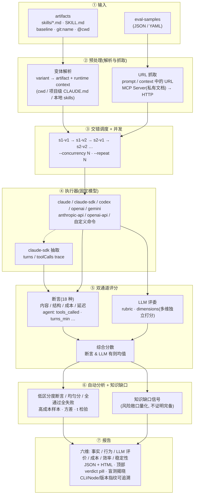

# oh-my-knowledge

[](https://www.npmjs.com/package/oh-my-knowledge)
[](https://www.npmjs.com/package/oh-my-knowledge)
[](https://github.com/lizhiyao/oh-my-knowledge/actions/workflows/ci.yml)
[](./LICENSE)
[](https://nodejs.org)

[English](./README.md) | **简体中文**

**omk** — 你给 LLM 的知识，价值在哪里？
omk 帮你用客观数据回答，而不是凭感觉。

**面向 LLM 知识输入(prompt / RAG / skill / agent)的评测框架** —— 固定模型，只变知识载体。

<a id="statistical-rigor"></a>
> 默认带：Bootstrap 置信区间 · Krippendorff α（评委 ↔ 人工）· 长度去偏 · 饱和曲线 · 用例隔离(construct validity)。[这些为什么重要 →](docs/zh/statistical-rigor.md)


## 快速开始

```bash
npm i oh-my-knowledge -g
omk init my-eval && cd my-eval
# 编辑 skills/code-review-v1/SKILL.md 和 skills/code-review-v2/SKILL.md,填入你的两版内容
omk eval --control code-review-v1 --treatment code-review-v2    # → 5 分钟出 HTML 报告 + verdict
```

深入：[在 Claude Code / Codex 中调用](#在-ai-coding-agent-中使用) · [`omk eval` 全 flag](#omk-eval) · [artifact 目录结构](#artifact-目录结构) · [`--lang` / `OMK_LANG`](#环境变量)

## 在 AI Coding Agent 中使用

### 在 Claude Code 中使用

当 `omk` skill 已在 Claude Code 中可用时，可以直接这样调用：

```bash
/omk eval              # 评测当前项目的 artifact
/omk improve skill     # 自动迭代改进 artifact
/omk improve samples   # 生成评测用例
```

或直接说"帮我评测 v1 和 v2 的差异"、"改进一下这个 artifact"，omk 会自动理解意图并调用对应命令。

### 在 Codex 中使用

Codex 默认不支持 `/omk ...` 这种 Claude Code 风格的 slash command。通常直接让 agent 执行 `omk` CLI，例如：

```bash
omk eval
omk improve skill skills/my-skill.md
omk improve samples skills/my-skill.md
```

也可以直接用自然语言描述目标，例如"比较 v1 和 v2 的评测差异"、"为这个 skill 生成评测用例"。

## 为什么需要这个工具

做知识工程的团队会产出大量知识载体（当前常见是 skill，也包括 prompt、agent、workflow 等）。当被问到"v2 比 v1 好在哪"时，需要客观数据而非主观判断。`oh-my-knowledge` 通过控制变量实验解决这个问题：相同模型、相同评测用例，只改变知识载体。

## 核心能力

- **评测前置健康检查** — `omk doctor` 在 `omk eval` 之前**强制**运行，检查 skill 可读性、元数据合法性、依赖完整性、samples 契约——纯静态零 LLM 调用，类比 SE 工具栈的 lint + typecheck。executor / judge 连通性是独立阶段，可用 `--skip-connectivity` 单独跳过
- **控制变量离线评测** — 固定模型和用例，只变知识载体；兼容 Claude Code skill、CLAUDE.md prompt、RAG 知识库等任何 markdown 形式的指令
- **六维独立打分** — Fact / Behavior / LLM-judge / Cost / Efficiency / Stability 分别出信号，单一维度的回退不会被其他维度的收益掩盖
- **线上 session 观测** — 解析 Claude Code session JSONL，在真实用户会话上测量各 skill 的失败率、耗时、token 成本和知识缺口信号
- **知识缺口识别** — 严重度加权的信号（显式标记 / 搜索失败 / hedging 用语 / 反复失败）量化风险敞口，不宣称完备性
- **合并前 CI 门** — `omk eval` 强制三层 all-pass（fact + behavior + llm-judge），抓复合分掩盖的单层回退
- **一行 ship/no-ship 结论** — `omk eval` 聚合 bootstrap CI / 三层 ci-gate / saturation / human α，给六档 verdict(PROGRESS / CAUTIOUS / REGRESS / NOISE / UNDERPOWERED / SOLO)+ 行动建议；exit code 反映是否可 ship

## 为什么选 omk

| | omk | promptfoo | DeepEval | LangSmith |
|--|--|--|--|--|
| Bootstrap 置信区间 | ✓ 默认 | ✗ | ✗ | ✗ |
| Krippendorff α（评委 ↔ 人工） | ✓ 默认 | ✗ | ✗ | ✗ |
| 长度去偏的评委 prompt | ✓ 默认 | ✗ | ✗ | ✗ |
| 饱和曲线 | ✓ | ✗ | ✗ | ✗ |
| 三层独立评分 | ✓ | ✗ | 部分 | ✗ |
| 用例隔离(construct validity) | ✓ 默认 | ✗ | ✗ | ✗ |
| 原生 Claude Code skill | ✓ | ✗ | ✗ | ✗ |
| 托管 SaaS 看板 | ✗ | ✗ | ✓ | ✓ |

omk 的护城河是 **default-on 安全网** —— Bootstrap CI / 评委 ↔ 人工 α / 长度去偏不是 advanced flag，是默认行为。其他工具让你**手动**接置信区间；omk 让你**默认无法忽略**它。需要 SaaS 看板？选 LangSmith。要快速 prompt 迭代不要统计层？选 promptfoo。**要发到生产且会被问"为什么应该相信这个数字"？选 omk。**

RAG 专项评测请看 RAGAS（独立 niche，跟 omk 互补）。完整对比（7 个工具 × 25+ 维度）： [docs/zh/comparison.md](docs/zh/comparison.md)

## 特性

| 特性 | 说明 |
|------|------|
| **Verdict 一行结论** | `omk eval` 六档判定 + ship 建议 + exit code 路由，与 HTML 报告 verdict pill 共享规则 |
| **六维评估** | 事实 / 行为 / LLM 评价 / 成本 / 效率 / 稳定性独立展示 |
| **多执行器** | 支持 Claude CLI / Claude SDK / Codex CLI / Codex SDK / OpenAI / Gemini 及自定义命令 |
| **21+ 种断言** | 包含子串、正则、JSON Schema、ROUGE/BLEU/Levenshtein 相似度、Agent 工具调用、语义相似度、自定义函数等 |
| **统计严谨性** | Bootstrap CI / Krippendorff α / 长度去偏 / 饱和曲线 —— 全部默认开。[详情 →](docs/zh/statistical-rigor.md) |
| **用例质量诊断** | `omk improve <id>` 7 类 issue（区分度低 / 重复 / 歧义 / 成本异常 / 全 fail 等）+ healthScore 0-100 |
| **失败聚类 + 根因** | `omk improve failures <id>` 单 LLM 调用聚类失败用例 + 每 cluster 给修复建议 |
| **RAG metrics** | `faithfulness` / `answer_relevancy` / `context_recall` 三 metric — 反幻觉 + 切题度 + context 覆盖，自动继承长度去偏 |
| **预算硬阈值** | `--budget-usd / --budget-per-sample-usd / --budget-per-sample-ms` 总成本 + 单用例成本/耗时上限，超出中止保留 partial report |
| **用例隔离 (construct validity)** | `--strict-baseline` （默认开） 三堵 baseline 拿到被测 skill 的污染路径：(1) SDK skill auto-discovery (2) subagent Skill 工具调用 (3) cwd 文件系统（避免 baseline 顺 `skills/<name>/` symlink 直接 Read 到 SKILL.md）。eval.yaml `allowedSkills` 支持 per-variant 白名单 |
| **用例设计科学性 (sample design science)** | Sample schema 加 `capability` / `difficulty` / `construct` / `provenance` 元数据字段（HF Dataset Cards 风）。`omk improve` 输出 coverage 分桶 + 检测 `rubric_clarity_low` / `capability_thin` 两类新 issue。`omk improve samples` 自动给生成的用例打 provenance。详见 [docs/sample-design-spec.md](docs/sample-design-spec.md)，含 8 条行业 gap(HELM / MMLU-Pro / Construct Validity / IRT / Dataset Cards / Adversarial)的 omk v1 映射 |
| **多评委 ensemble** | `--judge-models claude:opus,openai:gpt-4o` 跨厂商评分 + agreement 度量 |
| **MCP URL 获取** | 通过 MCP Server 获取私有文档 URL 内容（SSO 保护的知识库等） |
| **盲测 A/B** | `--blind` 隐藏变体名称，HTML 报告有揭晓按钮 |
| **多轮方差分析** | `--repeat N` 重复 N 次，计算均值/标准差/置信区间/t 检验 |
| **并行执行** | `--concurrency N` 并行 N 个任务 |
| **断言取反 + 组合** | 通用 `not: true` 字段 + `assert-set` (any/all) 任意嵌套 |
| **自动分析** | 检测低区分度断言、均匀分数、全通过/全失败、高成本用例 |
| **可追溯性** | 报告含 CLI 版本、Node 版本、artifact 版本指纹、judge prompt hash |
| **中英切换** | HTML 报告右上角一键切换语言 |

## 工作原理

核心思路：**固定模型 + 固定样本，只变 artifact 和 runtime context**，通过交错调度消除时间漂移，用断言 + LLM 评委双通道评分，再叠加知识缺口信号量化风险敞口。


```mermaid
flowchart TD
    subgraph Input["① 输入"]
        S["eval-samples<br/>(JSON / YAML)"]
        A["artifacts<br/>skills/*.md · SKILL.md<br/>baseline · git:name · @cwd"]
    end

    subgraph Prep["② 预处理(解析与抓取)"]
        V["变体解析<br/>variant → artifact + runtime context<br/>(cwd / 项目级 CLAUDE.md / 本地 skills)"]
        U["URL 抓取<br/>prompt / context 中的 URL<br/>MCP Server(私有文档) → HTTP"]
    end

    subgraph Schedule["③ 交错调度 + 并发"]
        Q["s1-v1 → s1-v2 → s2-v1 → s2-v2 …<br/>--concurrency N · --repeat N"]
    end

    subgraph Exec["④ 执行器(固定模型)"]
        E["claude / claude-sdk / codex / openai / gemini<br/>anthropic-api / openai-api / 自定义命令"]
        T["claude-sdk 抽取<br/>turns / toolCalls trace"]
        E -.-> T
    end

    subgraph Score["⑤ 双通道评分"]
        AS["断言(18 种)<br/>内容 / 结构 / 成本 / 延迟<br/>agent: tools_called · turns_min …"]
        LS["LLM 评委<br/>rubric · dimensions(多维独立打分)"]
        CS["综合分数<br/>断言 & LLM 有则均值"]
        AS --> CS
        LS --> CS
    end

    subgraph Analyze["⑥ 自动分析 + 知识缺口"]
        D["低区分度断言 / 均匀分 / 全通过全失败<br/>高成本样本 · 方差 · t 检验"]
        G["知识缺口信号<br/>(风险敞口量化, 不证明完备)"]
    end

    subgraph Report["⑦ 报告"]
        R["六维: 事实 / 行为 / LLM 评价 / 成本 / 效率 / 稳定性<br/>JSON + HTML · 顶部 verdict pill · 盲测揭晓<br/>CLI/Node/版本指纹可追溯"]
    end

    S --> U
    A --> V
    V --> Q
    U --> Q
    Q --> E
    T --> AS
    E --> AS
    E --> LS
    CS --> D
    CS --> G
    D --> R
    G --> R
```

**关键设计：**

- **交错调度**消除时间漂移：同一样本的不同 variant 交替发出，而非 v1 全跑完再跑 v2，避免模型负载/网络波动被错误归因给 artifact。
- **variant = artifact + runtime context**：`name@cwd` 让对照组可以显式声明"项目目录"这个隐性输入，把"项目级沉淀"和"显式 artifact 注入"拆开测。
- **双通道评分互补**：断言抓确定性缺陷（必须调用某工具/必须包含某字段），LLM 评委抓主观质量（可读性/完整性），两者都存在时取均值。
- **知识缺口信号**不是评分的一部分，而是一个独立追踪项：它告诉你"这次评测覆盖了多少风险敞口"，用于追踪收敛，而非断言知识"完备"。

## 评测样本格式

支持 JSON 和 YAML（`eval-samples.json`、`eval-samples.yaml`、`eval-samples.yml`）。

```json
[
  {
    "sample_id": "s001",
    "prompt": "审查这段代码的安全性",
    "context": "function auth(u, p) { db.query('SELECT * FROM users WHERE name=' + u); }",
    "rubric": "应识别 SQL 注入风险并建议参数化查询",
    "assertions": [
      { "type": "contains", "value": "SQL 注入", "weight": 1 },
      { "type": "contains", "value": "参数化", "weight": 1 },
      { "type": "not_contains", "value": "没有问题", "weight": 0.5 }
    ],
    "dimensions": {
      "security": "是否识别出注入漏洞",
      "actionability": "是否给出可直接使用的修复代码"
    }
  }
]
```

### 字段说明

| 字段 | 类型 | 必填 | 说明 |
|------|------|------|------|
| `sample_id` | `string` | **是** | 样本唯一标识 |
| `prompt` | `string` | **是** | 发送给模型的用户提示词 |
| `context` | `string` | 否 | 附加上下文（代码片段等），会被包裹在代码块中拼接到 prompt 后。也支持 URL，运行时自动抓取内容 |
| `rubric` | `string` | 否 | LLM 评委的评分标准（1-5 分） |
| `assertions` | `array` | 否 | 断言检查列表，详见[断言类型](#断言类型) |
| `assertions[].type` | `string` | **是** | 断言类型 |
| `assertions[].value` | `string\|number` | 视类型 | 检查值（`contains`、`min_length`、`cost_max` 等必填） |
| `assertions[].values` | `array` | 视类型 | 字符串数组（`contains_all`、`contains_any` 必填） |
| `assertions[].pattern` | `string` | 视类型 | 正则表达式（`regex` 必填） |
| `assertions[].flags` | `string` | 否 | 正则标志（默认 `"i"`） |
| `assertions[].schema` | `object` | 视类型 | JSON Schema 对象（`json_schema` 必填，基于 [ajv](https://ajv.js.org/)） |
| `assertions[].reference` | `string` | 视类型 | 参考文本（`semantic_similarity` 必填） |
| `assertions[].threshold` | `number` | 否 | 语义相似度通过阈值（默认 3） |
| `assertions[].fn` | `string` | 视类型 | 自定义断言 JS 文件路径（`custom` 必填） |
| `assertions[].weight` | `number` | 否 | 权重（默认 1） |
| `dimensions` | `object` | 否 | 多维度评分，key 为维度名，value 为评分标准文本 |

### URL 自动抓取

`prompt` 和 `context` 中的 URL 会在评测前自动抓取内容并内联到文本中。适用于引用在线文档、API 文档等场景：

```json
{
  "sample_id": "s001",
  "prompt": "请根据以下 PRD 文档生成评测用例：https://wiki.example.com/prd/feature-x"
}
```

运行时，URL 会被替换为实际文档内容。获取顺序：先通过 MCP Server 获取匹配的 URL（如 SSO 保护的私有文档），再通过 HTTP 获取剩余 URL。MCP 已成功的 URL 不会重复 HTTP 抓取。

**私有文档 URL**：在项目目录放一个 `.mcp.json` 配置文件，或通过 `--mcp-config` 指定路径：

```json
{
  "mcpServers": {
    "docs": {
      "command": "npx",
      "args": ["@example/docs-mcp-server"],
      "env": { "DOCS_API_TOKEN": "xxx" },
      "urlPatterns": ["docs.example.com"],
      "fetchTool": {
        "name": "fetch_doc",
        "urlTransform": {
          "regex": "docs\\.example\\.com/([^/]+/[^/]+)/([^/?#]+)",
          "params": { "namespace": "$1", "slug": "$2" }
        },
        "contentExtract": "data.body"
      }
    }
  }
}
```

**公网 URL**：直接 HTTP 获取，如果需要认证请确保命令行环境已配置好网络访问（VPN、代理等）。

### 评分策略

#### 1. 断言评分

基于规则的本地检查，每个断言产生通过/失败结果。

**计算方式：**

- 通过率 = 通过断言的权重之和 / 总权重（0~1）
- 分数 = 1 + 通过率 × 4（映射到 1~5 分）
- 示例：3 个断言（权重各 1），2 个通过 → 通过率 = 2/3 → 分数 = 1 + 0.67 × 4 = **3.67**

#### 2. Rubric / Dimensions 评分

评委模型（默认 `haiku`）按标准打 1-5 分。`dimensions` 模式下各维度独立评分后取平均。

#### 3. 综合分数

| 条件 | 公式 |
|------|------|
| 仅断言 | `assertionScore` |
| 仅 LLM | `llmScore` |
| 两者都有 | `(assertionScore + llmScore) / 2` |
| 都没有 | `0` |

### 断言类型

**确定性断言（21+ 种）：**

| 类型 | 说明 |
|------|------|
| `contains` / `not_contains` | 包含/不包含子串 |
| `regex` | 正则匹配 |
| `min_length` / `max_length` | 长度范围 |
| `json_valid` / `json_schema` | JSON 校验 |
| `starts_with` / `ends_with` | 前缀/后缀匹配 |
| `equals` / `not_equals` | 精确匹配 |
| `word_count_min` / `word_count_max` | 词数范围 |
| `contains_all` / `contains_any` | 多值匹配 |
| `cost_max` / `latency_max` | 成本/延迟限制 |
| `tools_called` / `tools_not_called` / `tools_count_min` / `tools_count_max` | Agent 工具调用断言 |
| `tool_output_contains` / `tool_input_contains` | 工具输入/输出内容匹配 |
| `turns_min` / `turns_max` | 多轮对话轮数限制 |
| `rouge_n_min` | ROUGE-N recall ≥ threshold（`reference` 字段填参考答案，`n` 默认 1，`threshold` 默认 0.5） |
| `levenshtein_max` | 编辑距离 ≤ value（用于"输出跟参考几乎一致"场景） |
| `bleu_min` | BLEU-4 ≥ threshold（unsmoothed，短文本会塌陷到 0） |
| `faithfulness` | 输出是否被 `sample.context` 支持（反幻觉）；LLM judge 1-5 评分，threshold 默认 3 |
| `answer_relevancy` | 输出是否切题回答 `sample.prompt`；能抓住跑题、回避、冗余；threshold 默认 3 |
| `context_recall` | `sample.context` 关键事实在输出中的覆盖率；`reference` 可显式指定 gold facts；threshold 默认 3 |
| `semantic_similarity` | LLM 语义相似度（与 reference 的整体相似度，与 RAG 三 metric 互补） |
| `custom` | 自定义 JS 函数（30s 超时） |

**通用修饰：**

任何断言加 `not: true` 即反向（替代 `not_contains` / `not_equals` 等成对类型；老类型保留作 alias）：

```yaml
- type: regex
  pattern: "TODO|FIXME"
  not: true              # 必须不含 TODO/FIXME
```

**断言组合（— assert-set）：**

`assert-set` 类型让多个断言以 `any`（OR）或 `all`（AND）逻辑组合，可嵌套：

```yaml
- type: assert-set
  mode: any              # 任一通过即过 (mode: 'all' 则需全部通过)
  children:
    - { type: contains, value: "参数化" }
    - { type: contains, value: "prepared statement" }
    - { type: regex, pattern: "bind\\(.*\\?" }
```

子断言可独立带 `not: true`；嵌套 assert-set 可表达任意布尔逻辑。

### 自定义断言

```js
// my-assertion.mjs
export default function(output, { sample, assertion }) {
  return { pass: output.includes('SQL'), message: '检查了 SQL 关键字' };
}
```

## 六维评估指标

评测报告从六个维度独立展示结果。其中评分三层（事实 / 行为 / LLM 评价）分开展示，让你看到**是哪一层拉胯**，而不是只看到一个合成分：

| 维度 | 指标 | 说明 |
|------|------|------|
| 📋 **事实** | 事实类断言通过率 | `contains` / `json_schema` / `fact_check` 等规则可验证断言的 1-5 分映射 |
| 🛠️ **行为** | 行为类断言通过率 | `tools_called` / `tool_output_contains` / `turns_max` 等执行合规类断言 |
| 💬 **LLM 评价** | rubric 评分 | 由评委模型按预先写好的评分规则（rubric）打的 1-5 分，主观但能抓规则断言之外的"整体好不好" |
| 💰 **成本** | 总成本、输入/输出 Token 数 | 基于 Token 消耗和模型定价的 API 费用 |
| ⚡ **效率** | 平均延迟 (ms) | 从发送请求到收到完整响应的端到端耗时 |
| 🛡️ **稳定性** | CV（变异系数） | 跨重复运行（`--repeat ≥ 2`）分数一致性；单轮评测显示 `—`，**诚实交代测不到什么** |

## CLI 参考

omk 的公开 CLI 按知识载体工作流组织：初始化、健康检查、离线评测、线上观测、改进建议、证据导出、本地工作台。

### `omk init`

```bash
omk init [目录]
```

生成一个评测项目脚手架，包含两版 starter skill 和 `eval-samples.json`。

### `omk doctor`

```bash
omk doctor                    # 检查当前目录或 ./skills
omk doctor skills/v1.md       # 检查单个 skill 文件
omk doctor skills/ --json     # 输出 JSON 给 CI 消费
omk doctor --gate; echo $?    # 静默门禁，fatal 时 exit 1
```

纯静态检查：skill 可读性、frontmatter、directory-skill 结构、依赖提示、samples 契约。`omk eval` 前也会自动强制执行。

### `omk eval`

```bash
omk eval --control code-review-v1 --treatment code-review-v2
omk eval --config eval.yaml
omk eval --batch
omk eval gold compare <report-id> --gold-dir gold-dataset
omk eval debias length <report-id>
```

运行离线评测，应用 verdict gate，持久化报告，并用 exit code 表示 ship/no-ship。这个工作流默认开启 bootstrap CI。

常用选项：

```text
  --samples <路径>       样本文件（默认：eval-samples.json，也自动检测 .yaml/.yml）
  --skill-dir <路径>     artifact 目录（默认：skills）
  --control <expr>       对照组 variant 表达式
  --treatment <v1,v2>    实验组 variants，逗号分隔
  --config <路径>        YAML/JSON 评测配置
  --model <名称>         任务执行模型（默认：sonnet）
  --judge-models <list>  评委配置，例如 claude:haiku 或 claude:opus,openai:gpt-4o
  --executor <名称>      claude / claude-sdk / codex / codex-sdk / openai-api / gemini / custom
  --no-judge             跳过 LLM 评委
  --dry-run              仅预览
  --blind                盲测模式
  --concurrency <n>      并行任务数
  --timeout <秒>         单任务超时
  --repeat <n>           重复 N 次做方差分析
  --batch                每个 artifact 独立和 baseline 对比
  --bootstrap-samples N  bootstrap 重采样次数（默认 1000）
  --threshold <number>   verdict 分层门禁阈值（默认 3.5）
  --trivial-diff <num>   实际可忽略 diff 阈值（默认 0.1）
  --report-only          生成报告并打印 verdict，但始终 exit 0
  --no-gate              --report-only 的别名
  --skip-connectivity    跳过模型连通性检查；doctor 仍强制执行
  --no-serve             评测后不自动启动报告服务
```

### `omk observe`

```bash
omk observe ~/.claude/projects/-Users-you-Documents-my-project
omk observe ~/.claude/projects/my-project --last 7d
omk observe ~/.claude/projects/my-project --from 2026-04-01T00:00:00Z --to 2026-04-15T23:59:59Z
omk observe ~/.claude/projects/my-project --skills audit,polish
omk observe ~/.claude/projects/my-project --kb /path/to/project
```

把真实 Claude Code session trace 转成 skill 健康度报告：知识使用、gap 信号、执行稳定性、token 和耗时。这是生产观测，不是生产评分。

### `omk improve`

```bash
omk improve <report-id>             # 样本诊断和修复计划
omk improve plan <report-id>        # 显式 repair-plan 形式
omk improve failures <report-id>    # 聚类失败样本并给根因
omk improve samples [skill]         # 生成或补齐 eval samples
omk improve skill <skill>           # 通过评测循环迭代 skill
```

在 `omk eval` 或 `omk observe` 之后用它决定下一步改什么。自动生成的 sample assertions 使用英文、数字或代码 token，便于跨中英文输出比较。

### `omk export`

```bash
omk export <report-id> --format html
omk export <report-id> --format markdown --out report.md
omk export <report-id> --format github-summary
omk export diff <report-id> --regressions-only
omk export verdict <report-id>
omk export saturation <report-id>
```

导出可贴到 PR、CI summary 和审计材料里的证据。HTML 会写 standalone report 文件；markdown 和 GitHub summary 默认输出到 stdout，除非传 `--out`。样本/报告差异、已持久化 verdict、saturation 检查也都归在 export 子树下。

### `omk studio`

```bash
omk studio
omk studio --port 7799
omk studio --reports-dir ~/.oh-my-knowledge/reports
omk studio --no-open
```

启动本地知识工作台，用来浏览报告和观测分析。

## 执行器

### 内置执行器

| 执行器 | 适用场景 | 说明 |
|--------|----------|------|
| `claude` | 默认 | 通过 `claude -p` 调用 Claude CLI |
| `claude-sdk` | 结构化输出 | 通过 Claude Agent SDK 调用，无 stdout 解析，避免 buffer 截断 |
| `codex` | OpenAI agent CLI | 通过 `codex exec --json` 调用，需本地装好登录的 codex（`@openai/codex`）；best-effort tool trace，**costUSD 不报**（codex 自身不输出 USD，需外部账单核算） |
| `codex-sdk` | OpenAI agent SDK | 通过 `@openai/codex-sdk` 调用其自带的 `@openai/codex` binary 和 SDK 事件流；**costUSD 不报** |
| `gemini` | 跨厂商对比 | 通过 `gemini` CLI 调用 |
| `anthropic-api` | 无需 CLI | 直接调用 Anthropic HTTP API（需 `ANTHROPIC_API_KEY`） |
| `openai-api` | 无需 CLI | 直接调用 OpenAI HTTP API（需 `OPENAI_API_KEY`） |

API 直调执行器支持通过环境变量自定义 Base URL：`ANTHROPIC_BASE_URL`、`OPENAI_BASE_URL`。

Codex construct-validity 说明：（1）`codex` 使用 `PATH` 上找到的 `codex` binary；`codex-sdk` 使用 `@openai/codex-sdk` 解析到的自带 `@openai/codex` binary。报告会持久化 per-variant `meta.executorRuntimes`、`meta.executorRuntime`，以及每个评委的 `meta.judgeModels[].runtime` 指纹（binary 或 SDK 版本 + 能力快照），strict comparability checks 会在 runtime 指纹无法审计时提示。runtime 指纹不一致时，结果应解释为 executor runtime 对比，而不只是 prompt/template 行为对比。（2）两个 executor 都隔离用户级 config：`codex` 传 `--ephemeral` + `--ignore-user-config`，`codex-sdk` 把 `$CODEX_HOME` 重定向到 per-process tmp 目录（auth.json 通过 symlink 透传）。用户的 `~/.codex/config.toml` 不会渗入任意一个 executor 的 eval。

### 自定义执行器

任何 shell 命令都可以作为执行器，通过 stdin/stdout JSON 协议通信：

```bash
omk eval --executor "python my_provider.py"
omk eval --executor "./my-executor.sh"
```

**协议约定：**

- **输入**（stdin）：JSON `{"model":"...","system":"...","prompt":"..."}`
- **输出**（stdout）：JSON `{"output":"模型回复","inputTokens":0,"outputTokens":0,"costUSD":0}`
- stdout 中只需返回有值的字段，其余默认为 0；也可以直接输出纯文本（不解析 token/成本）
- 非零退出码视为执行失败

### Artifact 目录结构

默认执行器（claude/openai/gemini）支持两种 artifact 布局，同一次评测中可混用：

```
skills/
├── v1.md                    # 方式一：直接放 .md 文件
└── my-skill/                # 方式二：完整 artifact 目录
    ├── SKILL.md             #   工具自动读取此文件作为 system prompt
    ├── config.json          #   其他文件不参与评测，仅保留完整性
    └── scripts/
```

**Variant 解析规则：**

`variant` 是实验分组表达式。解析之后，OMK 会得到一个 `artifact` 与可选的 `runtime context`（当前主要是 `cwd`）。

| 格式 | 含义 |
|------|------|
| `name` | 从 artifact 目录查找 `name.md` 或 `name/SKILL.md`，解析为一个 artifact |
| `baseline` | 空 artifact，不使用 system prompt；可直接理解为“什么都没有” |
| `project-env@/path/to/project` | 空 artifact，但在指定项目目录运行，用于单独观察项目级 runtime context |
| `git:name` | 从 git HEAD 读取一个 artifact 的上次提交版本 |
| `git:ref:name` | 从 git 指定 commit 读取一个 artifact |
| `./path/to/file.md` | 含 `/` 的路径，直接读取文件作为 artifact |
| `variant@/path/to/project` | 给任意变体附加运行目录，支持 `name@cwd`、`git:name@cwd`、`/file.md@cwd` |

`--control` 和 `--treatment` 都不传时，用 `--config eval.yaml` 或 `--batch`。`--batch` 模式下会自动用 `baseline` 作对照组，每个被发现的 artifact 作实验组。

```bash
# 显式:一个 control,一个或多个 treatment
omk eval --control v1 --treatment v2
omk eval --control baseline --treatment v1,v2,v3

# 对比空 artifact 和显式 artifact 的效果差异
omk eval --control baseline --treatment my-skill

# 单独观察项目级 runtime context 的影响(用自描述标签)
omk eval --control baseline --treatment project-env@/path/to/target-project

# 对比"项目级 runtime context"与"显式 artifact 注入"
omk eval \
  --control project-env@/path/to/target-project \
  --treatment /path/to/target-project/.claude/skills/prd/SKILL.md@/path/to/target-project

# 对比修改前后(旧版本从 git 历史读取)
omk eval --control git:my-skill --treatment my-skill

# 直接指定文件路径
omk eval --control ./old-skill.md --treatment ./new-skill.md

# 配置文件驱动(evaluation-as-code)
omk eval --config eval.yaml
```

**前置要求：**

- **claude**：安装 [Claude Code](https://claude.ai/code) 并认证
- **claude-sdk**：安装 [Claude Code](https://claude.ai/code) 并认证（使用 Agent SDK，无需 CLI stdout 解析）
- **anthropic-api**：设置 `ANTHROPIC_API_KEY` 环境变量
- **openai**：`pip install openai` 并设置 `OPENAI_API_KEY`
- **openai-api**：设置 `OPENAI_API_KEY` 环境变量
- **gemini**：`npm i -g @google/gemini-cli` 并认证

### Agent 评测与项目级 Runtime Context

当执行器使用 `claude-sdk` 时，OMK 现在已经支持第一版 agent-aware evaluation。

这里建议把几个概念分开理解：

- `artifact`：被评测对象，例如 baseline、skill、prompt、agent
- `variant`：CLI 里的实验分组表达式
- `runtime context`：运行时上下文，当前主要是 `cwd`；在项目型 agent 场景下，它就包含项目目录、`CLAUDE.md`、本地 skills 等会影响行为的环境因素

在 OMK 里，`agent` 不是所有对象的总称，`skill` 也不是所有对象的总称。更稳妥的说法是：你在比较不同 artifact 在不同 runtime context 下的表现。

- 自动抽取 turns / toolCalls trace
- 支持基于工具调用行为的断言
- 支持在指定 `cwd` 下运行，让 Claude Code 自动加载项目内的 `CLAUDE.md`、skills 和本地 runtime context

#### 推荐执行器

```bash
omk eval --executor claude-sdk
```

#### 支持的 agent 相关断言

| 断言 | 含义 |
|------|------|
| `tools_called` | 必须调用指定工具 |
| `tools_not_called` | 禁止调用指定工具 |
| `tools_count_min` / `tools_count_max` | 工具调用次数上下界 |
| `tool_output_contains` | 指定工具输出必须包含关键内容 |
| `turns_min` / `turns_max` | 交互轮次上下界 |

#### 三种常见对照组

**1. 裸模型 baseline**

不注入 system prompt，也不进入带知识的项目目录。至少需要一个 treatment 做对比：

```bash
omk eval \
  --executor claude-sdk \
  --control baseline \
  --treatment my-skill
```

**2. 空 artifact + 项目级 runtime context**

不注入 system prompt，但在项目目录运行。它不是严格意义上的"裸 baseline"，而是"空 artifact + 项目级 runtime context"。

```bash
omk eval \
  --executor claude-sdk \
  --control baseline \
  --treatment project-env@/path/to/target-project
```

**3. 显式 artifact 注入**

直接把某个外部 `SKILL.md` 作为 artifact 注入，同时保留项目目录上下文。适合对比"项目级 runtime context"与"显式单 artifact 注入"之间的差异。

```bash
omk eval \
  --executor claude-sdk \
  --control project-env@/path/to/target-project \
  --treatment /path/to/target-project/.claude/skills/prd/SKILL.md@/path/to/target-project
```

#### 推荐的第一轮对照设计

对于 PRD / 复杂业务知识场景，建议从下面开始：

```bash
omk eval \
  --executor claude-sdk \
  --samples skills/evaluate-review/eval-samples.yaml \
  --control baseline \
  --treatment /path/to/target-project/.claude/skills/prd/SKILL.md@/path/to/target-project
```

如果你想证明"项目目录中的知识沉淀本身"是否有效，加第二个 treatment：

```bash
omk eval \
  --executor claude-sdk \
  --samples skills/evaluate-review/eval-samples.yaml \
  --control baseline \
  --treatment project-env@/path/to/target-project,/path/to/target-project/.claude/skills/prd/SKILL.md@/path/to/target-project
```

#### 设计建议

- **先用 `--dry-run`**：确认样本、variant 和 `cwd` 被正确解析
- **项目级对照必须区分 `cwd`**：相同 prompt 在不同项目目录下会走不同 runtime context
- **优先先跑 PRD 场景**：相比 Coding，更容易验证知识完整性、影响面识别和业务正确性

### 常见模型配置示例

**没有 Claude？** 大多数国产模型（GLM、通义千问、Moonshot、DeepSeek 等）都兼容 OpenAI API 格式，可以直接使用 `openai-api` 执行器：

```bash
# GLM（智谱）
export OPENAI_API_KEY="你的智谱 API Key"
export OPENAI_BASE_URL="https://open.bigmodel.cn/api/paas/v4"
omk eval --executor openai-api --model glm-4-plus \
  --judge-models openai-api:glm-4-plus --no-cache

# 通义千问
export OPENAI_API_KEY="你的通义 API Key"
export OPENAI_BASE_URL="https://dashscope.aliyuncs.com/compatible-mode/v1"
omk eval --executor openai-api --model qwen-plus \
  --judge-models openai-api:qwen-plus

# DeepSeek
export OPENAI_API_KEY="你的 DeepSeek API Key"
export OPENAI_BASE_URL="https://api.deepseek.com"
omk eval --executor openai-api --model deepseek-chat \
  --judge-models openai-api:deepseek-chat

# Moonshot（Kimi）
export OPENAI_API_KEY="你的 Moonshot API Key"
export OPENAI_BASE_URL="https://api.moonshot.cn/v1"
omk eval --executor openai-api --model moonshot-v1-8k \
  --judge-models openai-api:moonshot-v1-8k
```

**Ollama 本地模型：**

```bash
omk eval --executor "python examples/custom-executor/ollama-executor.py" \
  --model llama3 --no-judge
```

**关于评委：**

- `--judge-models <list>` 指定评委，格式 `executor:model[,executor:model]`。默认 `${executor}:haiku`（没设 `--executor` 时为 `claude:haiku`）
- 1 条 = 单评委；≥ 2 条 = 多评委 ensemble + inter-judge agreement
- 没有 Claude 时把 `--judge-models` 指向你可用的模型，例如 `--judge-models openai-api:glm-4-plus`
- 加 `--no-judge` 可跳过 LLM 评委，仅使用断言评分

## 环境变量

| 变量 | 说明 |
|------|------|
| `CCV_PROXY_URL` | 将请求代理到 cc-viewer，实时可视化评测流量 |
| `OMK_REPORT_PORT` | 报告服务端口（默认：7799） |

## 系统要求

- Node.js >= 20
- `claude` CLI（用于默认执行器和 LLM 评委，安装方式见 [Claude Code](https://claude.ai/code)）
  - 使用其他执行器（openai/gemini）且加 `--no-judge` 时可不装

## 安全说明

本工具设计用于**本地可信环境**（开发机、CI 流水线）。以下功能会执行本地代码，请确保输入来源可信：

| 功能 | 风险说明 | 适用范围 |
|------|----------|----------|
| **自定义断言** (`custom`) | 动态加载并执行用户指定的 `.mjs` 文件 | 仅使用自己编写或审查过的断言文件 |
| **eval-samples.json** | 断言配置中可引用外部文件路径 | 不要使用不可信来源的样本文件 |

**建议：**

- 不要在公网服务中暴露本地报告服务（无认证）
- 不要用不可信的第三方 eval-samples 文件
- 自定义断言有 30 秒执行超时，但无沙箱隔离

---

版本变更记录见 [GitHub Releases](https://github.com/lizhiyao/oh-my-knowledge/releases)。欢迎贡献 — 详见 [CONTRIBUTING](./CONTRIBUTING.md)。
