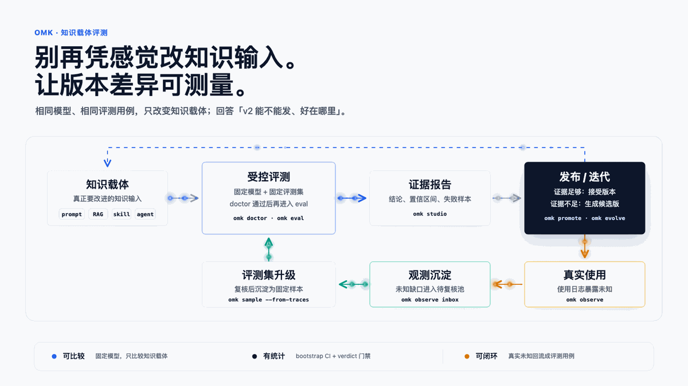

# OMK

[](https://www.npmjs.com/package/oh-my-knowledge)
[](https://www.npmjs.com/package/oh-my-knowledge)
[](https://github.com/lizhiyao/oh-my-knowledge/actions/workflows/ci.yml)
[](./LICENSE)
[](https://nodejs.org)

[English](./README.md) | **简体中文**

**Observe. Measure. Know.**

**OMK，让 AI 应用的知识改动有据可依。**

观测真实表现，量出版本差异，判断改动是否有效、版本能否发布。

**相同模型，相同评测用例，只改变知识载体。**

**DeepSeek Harness 用户：** OMK 可作为原生 bundle 安装，复用当前 profile 做受控评测，并在 Studio 打开已持久化的 DSH 任务轨迹。[接入 DSH 宿主插件 →](docs/zh/reference/executors.md#deepseek-harness优先使用宿主插件)



📖 **完整文档：[oh-my-knowledge.pages.dev/zh](https://oh-my-knowledge.pages.dev/zh/)**（可搜索，可切换英文）

## OMK 让你知道什么

| 决策问题 | 命令 | 你会得到的证据 |
|------|------|------|
| 这份知识载体是否清楚到值得评测？ | `omk doctor` | 结构、依赖、安全性、可测性检查 |
| v2 是否真的优于 v1？ | `omk eval` | 一行 verdict、置信区间、失败样本、成本 |
| 它为什么通过或失败？ | `omk studio` | 分数、诊断、样本证据的报告视图 |
| 这个版本是否应成为接受版本？ | `omk promote` / `omk evolve` | 基于证据接受，或生成更好的候选版 |
| 一次真实 AI 任务中发生了什么？ | `omk observe` / Studio 任务轨迹 | 请求、可见知识、工具调用与结果、回答和用户纠正的可核验轨迹 |
| 真实使用暴露了哪些知识缺口？ | `omk observe` / `omk sample --from-traces` | 将线上缺口生成待复核草稿，复核后再沉淀为评测样本 |

## 快速开始

```bash
npm i -g oh-my-knowledge
omk init demo && cd demo
omk eval --control code-review-v1 --treatment code-review-v2 --dry-run
omk eval --control code-review-v1 --treatment code-review-v2
```

开箱即跑：`omk init` 脚手架好两版 skill 和三条评测用例，不用先改任何文件；`--dry-run` 预览 sealed task plan 与预估调用次数；`omk eval` 跑控制变量 A/B，并在 Studio 打开经过认证的 Core run。跑通后再把 skill 和用例换成你自己的。希望首次就使用官方 20 条完整起步集时，把第一条命令换成 `omk init demo --samples 20`。

前置：准备一个已认证的模型 runtime（Codex CLI、Claude Code 或 API 执行器，见[系统要求](#系统要求)）。在 ChatGPT desktop 的 Codex 任务里，omk 会自动使用 `codex`，从 `~/.codex/config.toml` 读取模型，并默认用同一个 Codex 模型担任评委，不依赖 Claude。

普通终端想固定使用 Codex，可以把偏好加入 shell 配置，例如 `~/.zshrc`：

```bash
export OMK_EXECUTOR=codex
# 可选：export OMK_MODEL="你的 Codex 模型"
```

不设置 `OMK_MODEL` 时，omk 会读取 `~/.codex/config.toml` 的模型。也可以继续逐次显式传 `--executor codex --model <codex-model>`。自定义评委时再传 `--judge-models` 或设置 `OMK_JUDGE_MODELS`。

> 默认 3 条用例是低成本流程检查，出现「数据不足（UNDERPOWERED）」符合预期。`--samples 20` 会选择经过难度分层的官方起步用例集，达到 omk 注册的样本量下限。其来源明确标记为 `llm-generated`：它适合学习统计流程，发布判断前仍应人工复核并替换为真实领域用例。

> 命令行有新版本时会自动提示（每 20 小时最多一次）；想永久关闭该提醒，设环境变量 `OMK_SKIP_UPDATE_CHECK=1` 即可。

手把手教程：[5 分钟快速上手](docs/zh/quickstart-skill-eval.md)（推荐第一次跑评测的用户，覆盖 demo → 自己的 skill → verdict 动作）。更多可跑示例（Skill Map、离线执行器、agent runtime、RAG、Observe）见仓库的[示例画廊](examples/README.zh.md)。

深入：[为谁、解决什么](docs/zh/explanation/who-omk-is-for.md) · [CLI 参考](docs/zh/reference/cli.md) · [工作原理](docs/zh/explanation/architecture.md) · [评测用例格式](docs/zh/reference/eval-sample-format.md) · [执行器](docs/zh/reference/executors.md) · [知识载体布局](docs/zh/reference/artifact-layout.md)

## 先看清一次 Codex 任务

只想知道一次 Codex 对话背后发生了什么，不需要先运行 `observe ingest`：

```bash
omk studio
```

Studio 默认在 `http://127.0.0.1:7799` 打开本机 Codex 对话总览。先选择一段对话，再选择其中一次任务，即可进入「任务轨迹」：按**对话、执行、结果、知识**四条泳道查看请求、AI 回答、工具调用、工具返回和可见上下文，并可下钻到规范化事件与原始日志。

进行中的任务会优先显示并实时更新。保持「跟随中」时，轨迹会随新事件平滑前进；手动查看历史位置后，页面保留当前位置并提示「查看更新」。旧日志如果没有记录结束事件，会标记为「未记录结束状态」，不会一直冒充进行中。

任务轨迹只还原日志中可观测的事实，不展示或推断隐藏思维。完整说明见[观测与任务轨迹](docs/zh/guides/observe-production.md#查看一次任务)。

## OMK 的闭环

OMK 主要给 LLM 知识载体的作者 / 维护者用，帮他们做发布判断；它不是给被动安装 skill 的普通使用者用的。主流程刻意保持受控：

```text
改了一份 prompt / RAG / skill / agent 知识载体
→ 先跑 omk doctor
→ 用相同模型、相同评测用例跑 omk eval
→ 看 report / Studio 里的证据
→ 证据足够则 promote，证据不足则 evolve 候选版
→ observe 真实使用，把缺口生成待复核评测草稿
```

第一价值是发布前的 `doctor → eval` 判断。长期价值是闭环：`observe` 暴露真实使用里的知识缺口，`sample --from-traces` 先生成待人工复核的评测用例草稿，复核后的草稿再沉淀为固定评测样本，下一次 `eval` 就更难被偶然样本骗过。

## 在 AI Coding Agent 中使用

安装 omk 官方 Agent Skill 后，可以直接用自然语言让 coding agent 跑 omk 工作流：

```bash
omk install omk-agent-skill
```

默认只会安装到本机已检测到、且 omk 明确支持的目标：检测到 `~/.codex` 或 `~/.agents` 时写入 Codex/AGENTS，检测到 `~/.claude` 时写入 Claude Code。要强制写入当前 omk 已知的全部目标，用 `--to all`；要指定自定义 skill 根目录，用 `--dest`。

### 在 Claude Code 中使用

当 `omk` skill 已在 Claude Code 中可用时，可以直接这样调用：

```bash
/omk eval              # 评测当前项目的知识载体
/omk evolve            # 多轮自动迭代改进 skill
/omk sample            # 生成或补齐评测用例
```

这些 slash command 是自然语言入口 —— agent 会从对话上下文里推断要操作哪个 skill。也可以直接说「帮我评测 v1 和 v2 的差异」、「改进一下这个知识载体」，omk 会自动理解意图并调用对应命令。

### 在 Codex 中使用

Codex 默认不支持 `/omk ...` 这种 Claude Code 风格的 slash command。直接让 agent 执行 `omk` CLI 即可；在 Codex 任务里，omk 会自动选择 Codex runtime 和本机配置的模型：

```bash
omk eval
omk evolve skills/my-skill.md   # 一键:体检 →(无用例则自动生成)→ 自迭代
omk sample skills/my-skill.md
```

也可以直接用自然语言描述目标，例如「比较 v1 和 v2 的评测差异」、「为这个 skill 生成评测用例」。

`eval`、`doctor`、`sample`、`evolve` 和 observe 的 LLM 增强复盘共用同一套 runtime 解析。Codex 被选中后，默认评委沿用被测 Codex 模型，不会回落到 `claude:haiku`。

> `omk evolve` 是一键闭环：默认先跑 doctor 体检，目标 skill 没有评测用例时会自动生成一批，再进入多轮自迭代。全新 skill 直接 `omk evolve skills/foo.md` 即可。

## 为什么需要这个工具

知识工程带来的是一个版本治理问题：prompt、RAG 配方、skill、agent、workflow 都会改变模型行为，但这些改动未必体现在应用代码里。当有人追问「v2 能不能发、为什么」时，回答更顺眼、体感更好，远远不够。

omk 把知识载体当作被测变量：**相同模型、相同评测用例，只改变知识载体。** 这样得到的对比才可解释、可复跑，也适合进入 CI 或发布评审。

## 为什么选 omk

| | omk | promptfoo | DeepEval | LangSmith |
|--|--|--|--|--|
| Bootstrap 置信区间 | ✓ 默认 | ✗ | ✗ | ✗ |
| Krippendorff α（评委 ↔ 人工） | ✓ 加 gold 即开 | ✗ | ✗ | ✗ |
| 长度去偏的评委 prompt | ✓ 默认 | ✗ | ✗ | ✗ |
| 缺失证据失败关闭 | ✓ | ✗ | ✗ | ✗ |
| 三层独立评分 | ✓ | ✗ | 部分 | ✗ |
| 用例隔离(construct validity) | ✓ 默认 | ✗ | ✗ | ✗ |
| 原生 Agent Skill | ✓ | ✗ | ✗ | ✗ |
| 托管 SaaS 看板 | ✗ | ✗ | ✓ | ✓ |

omk 的护城河是 **default-on 安全网**：Bootstrap CI 与长度去偏属于正常测量行为，缺失证据失败关闭，显式 Gold comparison 提供评委 ↔ 人工 alpha 校准。需要 SaaS 看板？选 LangSmith。要快速 prompt 迭代不要统计层？选 promptfoo。**要发到生产且会被问「为什么应该相信这个数字」？选 omk。**

RAG 专项评测请看 RAGAS（独立 niche，跟 omk 互补）。完整对比（7 个工具 × 25+ 维度）： [docs/zh/reference/comparison.md](docs/zh/reference/comparison.md)

## 特性

| 特性 | 说明 |
|------|------|
| **Core 发布决定** | 六种结论 + 稳定 reason code + exit code 路由；Studio 投影同一份经过认证的 Decision |
| **五层 evidence graph** | Assertion / LLM / Judge / Dimension / Composite 保持独立，coverage、成本、状态与 lineage 与分数正交 |
| **多执行器** | 支持 Claude CLI / Claude SDK / Codex CLI / Codex SDK / DeepSeek Harness / OpenAI / Anthropic API 及自定义命令 |
| **30+ 种断言** | 包含子串、正则、JSON Schema、ROUGE/BLEU/Levenshtein 相似度、Agent 工具调用、语义相似度、自定义函数等 |
| **统计严谨性** | Bootstrap comparison family、长度去偏、缺失证据失败关闭与显式 Gold agreement 校准。[详情 →](docs/zh/explanation/statistical-rigor.md) |
| **RAG metrics** | `faithfulness` / `answer_relevancy` / `context_recall` 三 metric — 反幻觉 + 切题度 + context 覆盖 |
| **LLM 健康度审计** | `omk doctor` 给 7 个内置维度独立打分；重复采样（`--repeat`）+ k/n 共识归并 |
| **线上 session 观测** | 将 Codex、Claude Code、OpenClaw 与 markdown 日志统一为 source-neutral Trace IR，测量各 skill 的执行结果、耗时、token 使用和知识缺口信号 |
| **MCP 主动知识反馈（实验性）** | 由 MCP 客户端主动调用工具，把用户明确授权的 knowledge 反馈写入 Observation Inbox；不监听对话，并固定标记 `coverage: partial` |
| **知识缺口识别** | 严重度加权的信号量化风险敞口，不宣称完备性 |
| **用例隔离 (construct validity)** | `--strict-baseline`（默认开）三堵 baseline 拿到被测 skill 的污染路径 |
| **Git / 远端源** | install / eval 支持本地 git ref 或远端 git URL（`--git-url`）；目录-skill 在内容寻址**隔离副本**里执行，`references/` 资产是真实测量输入，不只是 `SKILL.md` |
| **证据门控管理** | `omk install` 登记受管记录；`omk eval` 按内容指纹自动写入证据，把 skill 从 `installed` 推到 `measurable`；`omk list` 查看各受管 skill 的状态（installed / measurable / promoted / stale）；`omk promote` 在证据过门禁（默认仅 PROGRESS）后把该版本接受为当前版本；`omk rollback` 撤销这次接受，让 skill 回到 `measurable`。[规范 →](docs/zh/specs/evidence-gated-management.md) |
| **用例设计科学性** | Sample schema 加 `capability` / `difficulty` / `construct` / `provenance` 元数据字段（HF Dataset Cards 风），studio 输出 coverage 分桶 + `rubric_clarity_low` / `capability_thin` issue。[docs/zh/specs/sample-design-spec.md](docs/zh/specs/sample-design-spec.md) |
| **多评委 ensemble** | `--judge-models claude:opus,openai-api:gpt-4o` 跨厂商评分 + agreement 度量 |
| **多轮方差分析** | `--repeat N` 发布相互独立的 Core run 与 Evaluation Series 方差分析 |
| **MCP URL 获取** | 通过 MCP Server 获取私有文档 URL 内容（SSO 保护的知识库等） |
| **自动分析** | 检测低区分度断言、均匀分数、全通过/全失败、高成本用例 |
| **可追溯性** | 报告含 CLI 版本、Node 版本、知识载体版本指纹、judge prompt hash |
| **中英视图** | 通过报告 URL 选择中英文的本地 Studio 视图 |

### 在已有 DeepSeek Harness 中运行

OMK 可以作为 DSH bundle 安装到现有 profile，直接复用其模型、凭证、工具与 sandbox：

```bash
dsh plugin --profile web add oh-my-knowledge
dsh --profile web
```

进入 DSH 后：

- `/omk eval eval.yaml`：每条用例使用独立 DSH session，报告仍由 OMK 生成；
- `/omk observe`：列出最近已结束的 session；
- `/omk observe <session-id>`：只读摄取一致快照，并返回 Studio 任务轨迹链接。

observe 直接使用 profile 的 `sessionPersistence`，无需导出或定位 JSONL／SQLite 文件；首版不实时跟随正在写入的 session。详见[执行器文档](docs/zh/reference/executors.md#deepseek-harness优先使用宿主插件)与[观测指南](docs/zh/guides/observe-production.md#在-deepseek-harness-中查看任务轨迹)。

### 连接 MCP 客户端（实验性）

> **定位：OMK MCP 是主动知识反馈接口，不是对话监听器。** 仅靠 OMK MCP 无法自动监听或订阅 Codex、ChatGPT 等客户端的完整对话。只有客户端、模型或 component 主动调用 `save_observation` 并提交授权内容后，OMK 才能收到并保存这条反馈。Agent Skill 可以自动识别潜在反馈时机，但识别结果仍须经过用户确认和一次显式 MCP 工具调用。

`omk-mcp` 提供与客户端无关的 stdio MCP Server。Codex 等本地 MCP 客户端可直接启动它，私有宿主也可组合导出的 Streamable HTTP adapter。客户端只在用户明确要求记录时调用 `save_observation`，把反馈和可选证据追加到 `.omk/observe/inbox/captures/`，并可渲染对话内 MCP Apps 复核卡片，供人工确认问题和生成 regression sample 草稿。

在 Codex 中可以显式调用 OMK Skill 快捷提交当前知识反馈：

```text
$omk feedback
```

这次显式调用本身视为保存确认。Agent 会从当前可见对话中选择最近一个明确问题，以 `confirmedByUser: true` 调用 `save_observation`；候选不明确时会先追问。该快捷入口不是 CLI 命令，也不会自动复核、生成 sample 或写入 gold set。

```bash
omk-mcp
```

每条记录都固定携带 `coverageStatus: partial`：已观测的是 OMK 工具边界、用户提交的反馈及可选证据；未观测的是完整对话、其他工具调用和隐藏推理。需要持续监听时，必须由有权访问事件流的宿主系统主动转交事件，这属于宿主集成能力，不属于 OMK MCP 自身能力。对话 ID、turn ID 与幂等键只用于生成哈希，不会原样落盘。私有宿主的 Streamable HTTP 组合方式见[组合 OMK MCP 集成](docs/zh/guides/mcp-integration.md)。

### 本地存储

项目数据采用领域化的 `.omk/` v2 布局：持久证据进入 `eval/`、`doctor/`、`observe/`，治理记录进入 `governance/`，备份保持可恢复，只有可重建工作进入 `state/`。机器工具、隧道、缓存和物化副本只能进入 `~/.oh-my-knowledge/state/`，不得写进项目。本期不读取、也不迁移旧存储布局。

## 文档

完整文档已发布到 **[oh-my-knowledge.pages.dev/zh](https://oh-my-knowledge.pages.dev/zh/)** —— 可搜索，可切换英文。重点页面：

- **[工作原理](docs/zh/explanation/architecture.md)** —— 输入编译、sealed Core 执行、分析、持久化与 Studio projection
- **[评测用例格式](docs/zh/reference/eval-sample-format.md)** —— sample schema、评分公式、30+ 断言类型、自定义 JS 断言
- **[CLI 参考](docs/zh/reference/cli.md)** —— 顶层命令的 bash 示例和 flag 表
- **[Evaluation Core 生产切换](docs/zh/guides/evaluation-core-cutover.md)** —— `BREAKING-SCHEMA` 存储、resume、Studio、Gold、受管证据与 evolve 迁移
- **[存储布局 v2](docs/zh/specs/storage-layout-spec.md)** —— 项目／全局领域、迁移兼容与 Git 策略
- **[执行器](docs/zh/reference/executors.md)** & **[知识载体布局](docs/zh/reference/artifact-layout.md)** —— 内置 / 自定义执行器；variant 如何解析为 artifact + runtime context
- **[操作指南](docs/zh/guides/agent-eval.md)** —— [评测 agent](docs/zh/guides/agent-eval.md)（项目 runtime context）与[使用非 Claude 模型](docs/zh/guides/non-claude-models.md)（GLM / 通义 / DeepSeek / Moonshot / Ollama）
- **[观测与任务轨迹](docs/zh/guides/observe-production.md)** —— 浏览本机 Codex 对话，下钻一次任务，并实时跟随可观测执行过程
- **[快速上手](docs/zh/quickstart-skill-eval.md)** —— 第一次跑评测的 5 分钟教程
- **[示例画廊](https://github.com/lizhiyao/oh-my-knowledge/tree/main/examples)** —— 仓库里一组可直接跑的示例，按由简到全排成上手路径
- **[用例设计规范](docs/zh/specs/sample-design-spec.md)** —— capability / construct / provenance 元数据；行业 gap 映射
- **[统计严谨性](docs/zh/explanation/statistical-rigor.md)** —— 为什么 Bootstrap CI / Gold agreement / 长度去偏 / evidence coverage 重要
- **[7 工具对比](docs/zh/reference/comparison.md)** —— promptfoo / DeepEval / RAGAS / OpenAI Evals / LangSmith / lm-eval-harness / inspect-ai 等 25+ 维度横评
- **[证据门控管理](docs/zh/specs/evidence-gated-management.md)** —— 受管记录、生命周期状态（installed / measurable / promoted / stale）、install → eval → measurable → promote → rollback

## 环境变量

| 变量 | 说明 |
|------|------|
| `OMK_EXECUTOR` | 默认执行器偏好，例如 `codex` / `codex-sdk` / `claude` |
| `OMK_MODEL` | 默认被测模型；Codex 未设置时读取本机 `config.toml` |
| `OMK_JUDGE_MODELS` | 默认评委列表，格式 `executor:model[,...]` |
| `CCV_PROXY_URL` | 通过 cc-viewer 代理请求，实时可视化评测流量 |
| `OMK_REPORT_PORT` | 报告服务端口（默认 7799） |

## 系统要求

- Node.js >= 22
- 至少一个已认证的模型 runtime：
  - Codex：安装并登录 Codex CLI（`npm i -g @openai/codex`）；ChatGPT desktop 的 Codex 任务会自动选择它
  - Claude：安装并登录 [Claude Code](https://claude.ai/code)
  - API / 其它执行器：按[执行器文档](docs/zh/reference/executors.md)配置
- 高级 `claude-sdk`／`codex-sdk` 执行器是可选能力，OMK 基础安装不再下载它们。仅在明确选择对应 SDK 时，才在 OMK 所在的本地项目或全局 npm prefix 安装；详见[执行器前置要求](docs/zh/reference/executors.md#前置要求)。

## 安全说明

本工具设计用于**本地可信环境**（开发机、CI 流水线）。以下功能会执行本地代码，请确保输入来源可信：

| 功能 | 风险 | 适用场景 |
|------|------|----------|
| **自定义断言**（`custom`） | 动态加载并执行用户指定的 `.mjs` 文件 | 仅使用自己编写或审查过的断言文件 |
| **eval-samples.json** | 断言配置可引用外部文件路径 | 不要使用来源不明的用例文件 |

**建议：**

- 不要将本地报告服务暴露到公网（无身份认证）
- 不使用未经审查的第三方 eval-samples
- 自定义断言有 30 秒超时，但无沙箱隔离

---

发布日志见 [GitHub Releases](https://github.com/lizhiyao/oh-my-knowledge/releases)。欢迎贡献 —— 见 [CONTRIBUTING](./CONTRIBUTING.md)。
