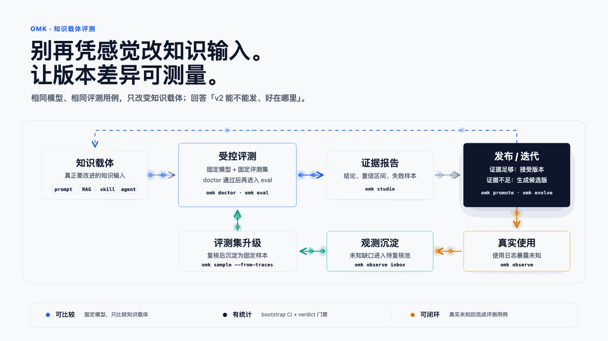

# OMK

[](https://www.npmjs.com/package/oh-my-knowledge)
[](https://www.npmjs.com/package/oh-my-knowledge)
[](https://github.com/lizhiyao/oh-my-knowledge/actions/workflows/ci.yml)
[](./LICENSE)
[](https://nodejs.org)

[English](./README.md) | **简体中文**

**Observe. Measure. Know.** 让 AI 应用的知识改动有据可依。

OMK 是面向 AI 应用作者与维护者的知识观测、评测与改进工具体系。查看真实任务如何执行，从工作日志提炼可复核的知识内容，再测量 prompt、RAG、skill、agent 或 workflow 的载体改动是否有效，为采纳、回退和继续改进提供证据。

**Observe** 保留真实表现与来源，**Measure** 固定模型与用例，控制并记录运行条件，比较知识载体，**Know** 让决定可以回到证据核对。已有两版载体时，可以直接开始评测；不必先收集日志。

当前 1.0 仍处于 **Beta 迭代期**，接口与存储契约可能继续变化。从旧版本升级前，请先阅读[迁移指南](docs/zh/guides/v1-preview-migration.md)。



图示描述可组合的工作路径：复核知识后可在 Studio 生成并保存 skill 或 prompt，再检查改动效果；完整关联与自动闭环仍有待实现部分。

## 选择使用方式

| 入口 | 适合什么场景 |
|---|---|
| **CLI** | 在终端、coding agent 或 CI 中执行检查、评测、观测与迭代工作流 |
| **Studio** | 在本地工作台浏览任务轨迹、复核知识内容，查看报告与原始证据 |
| **eval-runtime** | 通过 Node.js API 将执行、评分与版本比较嵌入自己的服务或平台；无需通过 CLI 或启动 Studio |
| **DSH 插件** | 在 DeepSeek Harness 内用 `/omk eval` 和 `/omk observe`，复用当前 profile 的模型、凭证、工具与 sandbox；见[宿主插件接入](docs/zh/reference/executors.md#deepseek-harness-优先使用宿主插件) |

## 从你的目标开始

| 想做什么 | 入口 | 得到什么 |
|---|---|---|
| 看清一次真实任务 | [Studio 与任务轨迹](docs/zh/guides/observe-production.md) | 对话、执行、结果、知识四条泳道，以及可核对的原始记录 |
| 把工作经验沉淀为知识 | [从日志提炼知识](docs/zh/guides/extract-knowledge.md) | 带来源和适用条件的候选知识，支持修订、保留和舍弃 |
| 记录已确认的知识问题 | [MCP 主动反馈](docs/zh/guides/mcp-integration.md) | 待复核 observation；确认真实问题后再草拟用例 |
| 判断一版改动是否值得采用 | [评测快速上手](docs/zh/quickstart-skill-eval.md) | 版本判定、不确定性、失败用例和评分依据 |
| 验证 Agent 是否真正完成任务 | [本地任务验收](docs/zh/guides/local-tasks.md) | 修改文件、独立验收结果，以及失败／超时／取消后的现场证据 |
| 自动尝试改进 skill | [迭代改进](docs/zh/guides/auto-improve-skills.md) | 经受控比较筛选的候选版本 |
| 将评测接入服务或平台 | [Node.js 服务](docs/zh/guides/eval-runtime.md) · [平台宿主](docs/zh/guides/platform-host-integration.md) | 可组合的执行、评分与比较接口 |

## 快速开始

安装需要 Node.js >=22。调用模型前还需配置已认证的 runtime，详见[系统要求](#系统要求)。

```bash
npm i -g oh-my-knowledge@next
```

本地任务验收需要 `1.0.0-beta.13` 或更新版本。安装后用 `omk --version` 核对版本，再按[本地任务指南](docs/zh/guides/local-tasks.md)运行可信示例。

### 先看已有任务

```bash
omk studio
```

打开命令返回的本地地址，从本机 Codex 对话进入任务轨迹；无需先 ingest，也不调用模型。进行中的任务支持实时跟随。Claude Code、OpenClaw 与 markdown 日志通过 `omk observe` 进入观测报告，见[观测指南](docs/zh/guides/observe-production.md)。

需要沉淀经验时，在知识页面选择“从对话选择”，选定对话和轮次，核对消息与工作区后再生成。生成会调用模型；保留候选表示愿意维护，不等于已证实，也不会自动写入 AGENTS.md 或 skill。点击“生成知识载体”，即可核对并明确保存 skill 或 prompt。步骤见[提炼指南](docs/zh/guides/extract-knowledge.md)。

### 或者，直接比较两版 skill

```bash
omk init demo
cd demo
omk eval --control code-review-v1 --treatment code-review-v2 --dry-run
```

检查计划和预估调用次数后，执行评测（会调用模型）：

```bash
omk eval --control code-review-v1 --treatment code-review-v2
```

脚手架包含两版 skill 和三条用例。默认小样本用于检查流程，出现 `UNDERPOWERED` 符合预期。官方起步用例标记为 `llm-generated`；即使用 `omk init demo-full --samples 20` 创建完整起步集，也只是达到默认启发式证据下限，不等于完成功效规划或具备发布证据。实际使用前应人工复核并替换为真实领域用例。

[完整教程](docs/zh/quickstart-skill-eval.md)介绍模型选择、换成自己的 skill 和结果解读；[示例画廊](examples/README.zh.md)提供更多可运行场景。

### 验证文件是否真的改对了

本地任务从声明的文件快照执行两版知识，采集文件并交给独立验收程序检查；失败、超时或取消也保存声明文件和部分日志。它测量明确提供知识内容后的效果，不测宿主原生 skill 发现。任务与验收程序必须可信，工作区副本不是安全沙箱。

[带 npm 依赖的购物车案例](examples/local-task/project/README.zh.md)记录了一次真实 Codex 运行：treatment 修改目标源码并通过六项检查，要求不编辑的负对照通过三项。该案例证明执行与验收链路可用，不证明知识版本的普遍收益；模型、用量和耗时见案例记录。[本地任务指南](docs/zh/guides/local-tasks.md)提供安装、配置与证据读取入口。

## 在 Agent 与 DSH 中使用

### Agent Skill 与 MCP

```bash
omk install omk-agent-skill
```

安装 Skill 后，可以对 coding agent 说：“用 omk 比较这两版 skill，先预览计划。”安装目标与使用方法见[快速上手](docs/zh/quickstart-skill-eval.md#在-agent-中使用)。

[MCP 集成](docs/zh/guides/mcp-integration.md)提供用户授权的主动知识反馈入口。它仅记录提交到工具边界的部分证据，不自动监听完整对话。

### DeepSeek Harness 插件

已有 DSH 环境时，把 OMK 加入现有 profile。以支持命令适配的 `web` profile 为例：

```bash
dsh plugin --profile web add oh-my-knowledge
dsh --profile web
```

在 DSH 内执行：

```text
/omk eval eval.yaml
/omk observe
/omk observe <session-id>
```

评测复用当前宿主的模型、凭证、工具和 sandbox，并为每条用例创建隔离 session。观测读取已结束 session 的快照并返回 Studio 任务轨迹地址；目前不实时跟随正在运行的 DSH session。配置要求与插件当前限制见[DSH 接入](docs/zh/reference/executors.md#deepseek-harness-优先使用宿主插件)。

## 如何使用证据

知识内容是一条可复核的事实、经验或方法；知识载体是承载内容的 prompt、文档、skill 等。候选知识是内容的待复核状态，候选版本是拟采用的载体版本，两者不能混为一谈。

1. **观测与复核**：在 Studio 核对任务与来源；提炼知识或确认 observation，留下适用条件和处理理由。
2. **形成可测改动**：在 Studio 将保留知识生成到 skill 或 prompt，核对后保存，也可编辑其它载体；把可复现的问题整理为正式用例；候选不会自动生效。
3. **受控比较**：`doctor` 做前置检查，`eval` 比较 control 与 treatment，检查 Decision、覆盖、失败样本与成本。
4. **采纳或继续改进**：复核评测证据，在自己的发布流程中决定是否采纳；`evolve` 通过 A/B 门禁筛选候选版本，写回前再次比较。

这是可组合的工作路径，不是强制的单向状态机。一次评测通过也不等于知识已写入或版本已发布。

固定配置不能保证外部模型服务或重跑结果完全一致。结论受用例、评分准则和执行环境约束。观测信号不等于因果结论，生成的样本也不能直接充当独立发布验证集。原理与限制见[统计严谨性](docs/zh/explanation/statistical-rigor.md)和[三阶段工作流](docs/zh/explanation/three-stage-workflow.md)。

项目评测与观测证据保存在 `.omk/`，本地任务默认写入 `.omk/eval`，也可通过 `--output` 指定报告与诊断目录。机器级状态位于 `~/.oh-my-knowledge/`；提炼的知识内容保存在显式选择的知识工作区。当前版本不读取或迁移旧存储布局；升级前备份，按[迁移指南](docs/zh/guides/v1-preview-migration.md)重新建立证据。

## 文档

[完整文档与导航](docs/zh/README.md) · [在线文档](https://oh-my-knowledge.pages.dev/zh/) · [CLI 参考](docs/zh/reference/cli.md) · [用例格式](docs/zh/reference/eval-sample-format.md) · [执行器](docs/zh/reference/executors.md) · [OMK 如何理解知识](docs/zh/explanation/knowledge.md)

## 环境变量

| 变量 | 说明 |
|------|------|
| `OMK_EXECUTOR` | 默认执行器偏好，例如 `codex` / `codex-sdk` / `claude` |
| `OMK_MODEL` | 默认被测模型；Codex 未设置时读取本机 `config.toml` |
| `OMK_JUDGE_MODELS` | 默认评委列表，格式 `executor:model[,...]` |
| `CCV_PROXY_URL` | 通过 cc-viewer 代理请求，实时可视化评测流量 |
| `OMK_REPORT_PORT` | 报告服务端口（默认 7799） |

## 系统要求

- Node.js >= 22
- 至少一个已认证的模型 runtime：
  - Codex：安装并登录 Codex CLI（`npm i -g @openai/codex`）；ChatGPT desktop 的 Codex 任务会自动选择它
  - Claude：安装并登录 [Claude Code](https://claude.ai/code)
  - API / 其它执行器：按[执行器文档](docs/zh/reference/executors.md)配置
- 高级 `claude-sdk`／`codex-sdk` 执行器是可选能力，OMK 基础安装不再下载它们。仅在明确选择对应 SDK 时，才在 OMK 所在的本地项目或全局 npm prefix 安装；详见[执行器前置要求](docs/zh/reference/executors.md#前置要求)。

## 安全说明

本工具设计用于**本地可信环境**（开发机、CI 流水线）。以下功能会执行本地代码，请确保输入来源可信：

| 功能 | 风险 | 适用场景 |
|------|------|----------|
| **自定义断言**（`custom`） | 动态加载并执行用户指定的 `.mjs` 文件 | 仅使用自己编写或审查过的断言文件 |
| **本地任务与验收程序** | 执行器与独立验收会运行本地代码，原始产物／日志可能含敏感信息 | 仅运行已审查的任务，核对文件清单与输出目录；副本不提供安全沙箱 |
| **eval-samples.json** | 断言配置可引用外部文件路径 | 不要使用来源不明的用例文件 |

**建议：**

- 不要将本地报告服务暴露到公网（无身份认证）
- 不使用未经审查的第三方 eval-samples
- 自定义断言有 30 秒超时，但无沙箱隔离

---

发布日志见 [GitHub Releases](https://github.com/lizhiyao/oh-my-knowledge/releases)。欢迎贡献 —— 见 [CONTRIBUTING](./CONTRIBUTING.md)。
