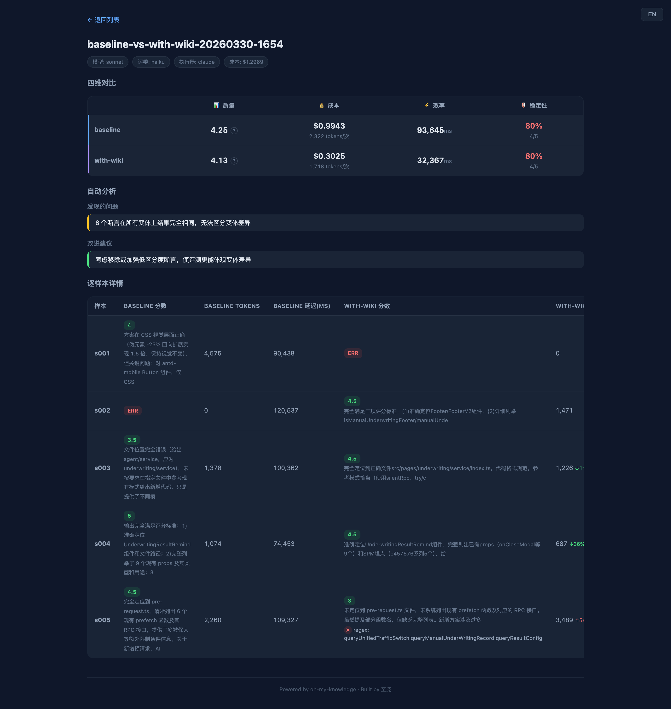
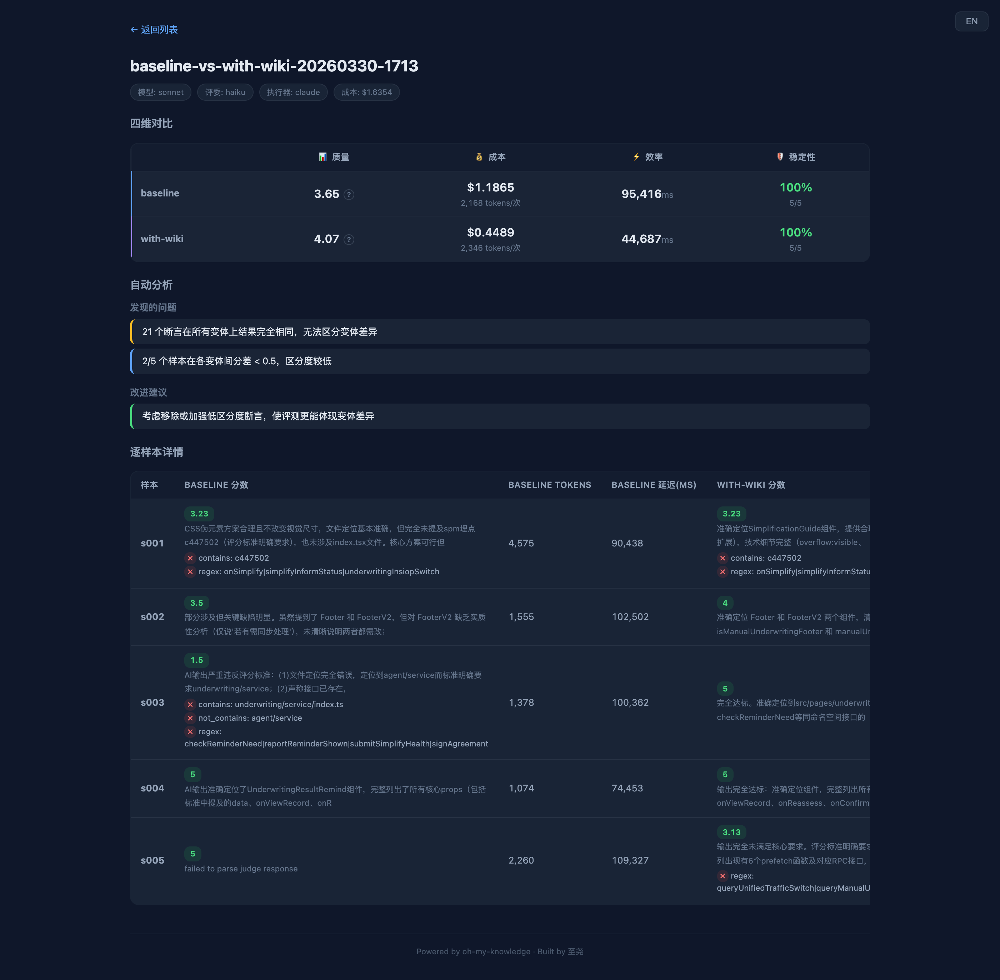

# 实战：用 OMK 评测一个代码地图 Skill 到底有没有用

> **核心结论**：与其靠直觉判断 Skill 的好坏，不如用数据说话。本文记录了一次真实的 Skill 评测与自动迭代过程。

## 1. 背景：一个实际问题

最近，团队给 `smart-notify-v2` 项目（保险健康告知业务前端）的 `underwriting` 模块编写了一份**代码地图 Skill**。

这份 Skill 详细记录了模块下每个文件的职责、Props、SPM 埋点和依赖关系，初衷是想给 AI 编码助手提供一份全局的”导航手册”。它的结构大致长这样（摘录部分）：

```markdown
## src/pages/underwriting/components/Footer/index.tsx (Footer 健告首页底部)
  concerns: 左右双按钮|管家入口|小宝入口|人核底部|评估中标签
  props: isStaticInform|handleRightButton|handleLeftButton|insiopConfig|isManualUnderwritingFooter|manualUnderwritingStatus|...
  spm: c104281(健告首页底部Footer)|c104281.d216271(左侧按钮)|c104281.d216272(右侧按钮)
  dep: InsisConsultant|InsbutlerFooterEntry

## src/pages/underwriting/service/index.ts
  concerns: platform配置|健告数据查询|健告确认提交|智能评估|万流开关|...
  getInformDataWithTrace → fiainsinformcore.IntelligentHealthInformQueryFacade.query
  checkReminderNeed → com.alipay.inshealthybff.needle.smartNotify.checkReminderNeed
  signAgreement → com.alipay.inshealthybff.needle.smartNotify.signAgreement
  ...（共 17 个接口映射）

## src/pages/underwriting/components/SimplificationGuide/index.tsx (SimplificationGuide 个性化服务引导)
  concerns: 简化健告|疲劳度控制|展开折叠|协议勾选|右上角菜单
  props: onSimplify|underwritingInsiopSwitch|simplifyInformStatus
  spm: c447502(个性化引导组件)|c447502.d656115(简化健告成功)|c447502.d647623(右上角个性化服务)|...
```

可以看到，每个文件条目记录了**关注点（concerns）、对外接口（props/exports）、埋点编号（spm）和依赖关系（dep）**。完整的 Skill 涵盖了 underwriting 模块下全部 15+ 个文件。

但写完之后，我们需要回答一个问题：
**这份代码地图到底有没有用？AI 带着它干活，真的比不带 Skill（裸跑）更好吗？具体好多少？**

为了得到客观的结论，我们使用 [oh-my-knowledge (OMK)](https://npmjs.com/packages/oh-my-knowledge/meta) 跑了一轮量化评测。

---

## 2. 构建评测用例 (Eval Samples)

评测的第一步是准备测试集。我们需要一份 `eval-samples.json`，来描述具体的开发任务以及判断标准。

一条完整的测试用例包含三个核心要素：

1. **`prompt`**：模拟真实的开发需求指令。
2. **`rubric`**：给大模型裁判 (Judge) 提供的评分标准（1-5 分）。
3. **`assertions`**：确定性的断言规则（例如：必须包含某路径、不能包含某关键词等）。

基于 `underwriting` 模块的真实开发场景，我们准备了 5 条覆盖不同维度的用例：

```json
[
  {
    "sample_id": "s001",
    "prompt": "\"简化健告\"按钮热区扩大：扩展按钮整体大小不变，可点击范围向外扩展1.5倍",
    "cwd": "/path/to/smart-notify-v2",
    "rubric": "应准确定位到 SimplificationGuide 组件（index.tsx 和 index.module.less），提到该组件的 spm 埋点（c447502），给出合理的 CSS 热区扩展方案，不改变视觉尺寸",
    "assertions": [
      { "type": "contains", "value": "SimplificationGuide", "weight": 2 },
      { "type": "regex", "pattern": "index\\.tsx|index\\.module\\.less", "weight": 1 },
      { "type": "regex", "pattern": "padding|::before|::after|inset|伪元素", "weight": 1 },
      { "type": "contains", "value": "c447502", "weight": 1.5 },
      { "type": "regex", "pattern": "onSimplify|simplifyInformStatus|underwritingInsiopSwitch", "weight": 1 }
    ]
  },
  {
    "sample_id": "s002",
    "prompt": "健告页底部 Footer 的「左侧按钮」需要在人工核保场景下隐藏，请说明需要修改哪些文件，涉及哪些关键 props 和 spm 埋点",
    "cwd": "/path/to/smart-notify-v2",
    "rubric": "应准确定位到 Footer 组件和 FooterV2，说明两者都需要改，提到 isManualUnderwritingFooter / manualUnderwritingStatus 等 props，提及 spm 埋点 c104281 及子埋点 d216271、d216272",
    "assertions": [
      { "type": "regex", "pattern": "Footer(/index\\.tsx)?|FooterV2", "weight": 2 },
      { "type": "regex", "pattern": "manualUnderwriting|isManualUnderwritingFooter", "weight": 1.5 },
      { "type": "contains", "value": "c104281", "weight": 1 },
      { "type": "regex", "pattern": "d216271|d216272", "weight": 1.5 },
      { "type": "contains_any", "values": ["FooterV2", "d383821", "d383820"], "weight": 1 }
    ]
  },
  {
    "sample_id": "s003",
    "prompt": "我需要在健告页新增一个 RPC 接口调用，接口名为 com.alipay.inshealthybff.needle.smartNotify.queryDiseaseCategories，请告诉我应该在哪个文件添加，并参考现有接口的写法给出代码",
    "cwd": "/path/to/smart-notify-v2",
    "rubric": "应明确定位到 src/pages/underwriting/service/index.ts（而非 agent/service），参考现有同命名空间接口的模式给出代码",
    "assertions": [
      { "type": "contains", "value": "underwriting/service/index.ts", "weight": 2.5 },
      { "type": "contains", "value": "queryDiseaseCategories", "weight": 1 },
      { "type": "regex", "pattern": "inshealthybff|smartNotify", "weight": 1 },
      { "type": "not_contains", "value": "agent/service", "weight": 2 },
      { "type": "regex", "pattern": "checkReminderNeed|reportReminderShown|submitSimplifyHealth|signAgreement", "weight": 1.5 }
    ]
  },
  {
    "sample_id": "s004",
    "prompt": "核保结果二次提醒弹框需要新增一个\"跳过\"按钮，点击后关闭弹框。请说明需要改哪个组件，现有的 props 和 spm 埋点有哪些",
    "cwd": "/path/to/smart-notify-v2",
    "rubric": "应准确定位到 UnderwritingResultRemind 组件，完整列出已有 props 和 spm 埋点（c457576 及 d670111、d670108、d670110、d670109），并给出合理的实现方案",
    "assertions": [
      { "type": "contains", "value": "UnderwritingResultRemind", "weight": 2 },
      { "type": "regex", "pattern": "onCloseModal|onClose", "weight": 1 },
      { "type": "contains", "value": "c457576", "weight": 1 },
      { "type": "regex", "pattern": "d670111|d670108|d670110|d670109", "weight": 2 },
      { "type": "regex", "pattern": "onViewRecord|onReassess|onConfirmNoProblem|onInformDisease", "weight": 1.5 }
    ]
  },
  {
    "sample_id": "s005",
    "prompt": "健告页有哪些预请求（pre-request），分别调用了什么接口？我想新增一个预请求来提前获取简化健告状态",
    "cwd": "/path/to/smart-notify-v2",
    "rubric": "应定位到 pre-request.ts，列出现有 6 个 prefetch 函数及对应 RPC 接口，并给出新增预请求的合理方案",
    "assertions": [
      { "type": "contains", "value": "pre-request", "weight": 2 },
      { "type": "regex", "pattern": "prefetch|预请求", "weight": 1 },
      { "type": "regex", "pattern": "queryUnifiedTrafficSwitch|queryManualUnderWritingRecord|queryResultConfig", "weight": 1.5 },
      { "type": "regex", "pattern": "prefetchGetUnifiedSwitch|prefetchGetManualRecord|prefetchGetInsiopData|prefetchGetDataWithTrace", "weight": 2 },
      { "type": "regex", "pattern": "prefetchGetInsiopSwitch|prefetchQueryUnderwritingChatStatus", "weight": 1.5 }
    ]
  }
]
```

> **设计思路**：这 5 条用例涵盖了 CSS 修改、组件定位、RPC 新增、预请求梳理等不同任务类型，并设置了多重断言权重，以确保结果具有足够的区分度。
>
> 如果不想手写用例，OMK 也支持自动生成：`omk bench gen-samples skills/my-skill.md`，它会分析 Skill 内容，自动生成匹配的测试用例。

目前的目录结构：

```text
eval-underwriting/
├── eval-samples.json       # 测试用例
└── skills/
    └── with-wiki.md        # 待评测的代码地图 Skill
```

*(OMK 运行评测时，会自动生成一个不带任何 Skill 的 `baseline` 作为对照组。)*

---

## 3. 首次评测与用例优化

准备就绪后，执行评测命令：

```bash
omk bench run --samples eval-samples.json --skill-dir skills --concurrency 3
```

几分钟后，浏览器展示了对比报告：



但首次评测的数据显示：**裸跑的综合得分（4.25）居然略高于带代码地图的得分（4.13）。**

经过分析 Case 详情，我们发现了两个导致数据失真的问题：

1. **超时导致数据丢失**：默认 120s 的超时时间偏短，两边各有一条耗时较长的推理超时，导致 20% 的样本失效。
2. **断言区分度不足**：15 个断言里有 8 个是两边都能轻易通过的基础校验，拉不开差距。

### 优化评测配置

为了获取真实数据，我们进行了两项调整：

**1. 调整运行参数**

```bash
omk bench run \
  --timeout 300 \    # 放宽超时时间至 5 分钟
  --repeat 3 \       # 每条用例跑 3 轮取平均值，降低随机波动
  --concurrency 3
```

**2. 增强断言的严格程度**
针对“有 Skill”和“没 Skill”的预期差异，重写断言：

```json
// 优化前：只要提到 service 目录即可
{ "type": "contains", "value": "service/index.ts" }

// 优化后：必须精确定位到 underwriting 模块，且不能出现在 agent 模块
{ "type": "contains", "value": "underwriting/service/index.ts", "weight": 2.5 },
{ "type": "not_contains", "value": "agent/service", "weight": 2 }
```

### 优化后的真实数据 (3 轮均值)

再次运行后，数据变得清晰：



| 维度 | baseline (裸跑) | with-wiki (代码地图) | 差异 |
|------|:---:|:---:|:---:|
| **综合得分** | 3.65 | **4.07** | **+11%** |
| **平均耗时** | ~97s | **~64s** | **快 34%** |
| **平均轮次** | 5.4 轮 | **2.3 轮** | **少 57%** |
| **平均费用** | ~$1.28 | **~$0.73** | **省 43%** |

**结论：代码地图 Skill 在得分、耗时、交互轮次、费用四个维度上均优于裸跑。**

### Case 差异分析

| 评测用例 | baseline | with-wiki | 分析说明 |
|------|:---:|:---:|:---|
| s001 (CSS 修改) | **3.82** | 2.82 | 简单任务被冗长的地图信息干扰，反而降低了表现。 |
| s002 (组件梳理) | 4.50 | 4.17 | 表现接近，均能通过全局搜索找到。 |
| **s003 (新增 RPC)** | 2.17 | **4.67** | **核心优势**：裸跑迷失在 `agent/service` 中；代码地图精准导航至 `underwriting`。 |
| s004 (组件改造) | 4.83 | 4.83 | 表现持平。 |
| s005 (预请求梳理) | **4.00** | 3.09 | **新发现问题**：AI 拿到地图后直接凭地图输出，不再去读取真实源码验证细节。 |

**小结**：代码地图的主要价值在于**复杂路由与目录的精准定位**（如 s003），但也会带来负面影响，例如在简单任务上分心（s001），或在需要阅读源码时产生依赖地图的“偷懒”行为（s005）。

---

## 4. 自动迭代进化 (Auto Evolve)

评测暴露了当前代码地图的两个弱点。与其人工调整 Prompt，我们尝试使用 OMK 的自进化功能来修复：

```bash
omk bench evolve skills/with-wiki.md --rounds 5 --timeout 300
```

`evolve` 命令会自动执行以下流程：

1. 提取低分 Case（s001, s005）的失败日志。
2. 让大模型分析错误原因，并修改 `with-wiki.md`。
3. 使用修改后的 Skill 重新运行全量测试。
4. 若总分提升则保留修改，否则回滚。

### 迭代结果

| 迭代轮次 | 综合得分 | 较基线变化 | 状态 |
|:---:|:---:|:---:|:---|
| Round 0 (原始) | 3.87 | — | 基线 |
| **Round 1** | **4.75** | **+23%** | **Accept** |
| Round 2 | 4.54 | -4% | Reject (回滚至 R1) |
| Round 3 | 4.74 | -0.2% | Reject (无法超越 R1) |

仅在第 1 轮迭代，综合得分就从 3.87 提升到了 4.75。

### 修改内容分析

对比原始文件和 R1 版本的 Skill，我们发现 AI 自动在文件末尾增加了一份《使用规范》：

```markdown
## 使用规范（修改前必读）

### 涉及组件修改时
每个组件的 spm 字段列出了该组件全部埋点码。修改或新增组件交互时，
必须完整列出所有相关 spm 码，不能只引用部分。

### 涉及新增/修改 API 请求时
必须先查阅 pre-request.ts 和 service/index.ts，
新接口须参照已有函数的调用模式。

### 涉及路由/上下文参数时
查阅 constants/index.ts。
```

这些补充规则直接针对了之前发现的问题：

- “必须先查阅...” 解决了 AI 在 s005 中不读源码的问题。
- “必须完整列出...” 提升了输出的严谨度。

---

## 5. 总结

从“裸跑”到人工编写的初版 Skill，再到 AI 自动进化的最终版，整体数据对比如下：

| 阶段 | 综合得分 | 耗时 | 费用 |
|------|:---:|:---:|:---:|
| 1. 裸跑 (无 Skill) | 3.65 | ~97s | ~$1.28 |
| 2. 人工初版 Skill | 4.07 | ~64s | ~$0.73 |
| **3. Evolve 进化版** | **4.75** | **~32s** | **~$0.43** |

通过本次评测，我们得到了几点工程实践上的启发：

1. **评测用例的断言设计很关键**：断言应该针对“引入该 Skill 后预期的行为差异”来设计，而非宽泛的文本匹配，否则无法测出真实差异。
2. **代码地图 Skill 的核心是提供“导航”**：给 AI 提供庞大的文档容易使其分心。好的项目级代码地图应该像目录索引，指引 AI 去阅读具体的文件，而不是在 Prompt 中穷举所有细节。
3. **数据驱动优于直觉调试**：利用自动化工具进行评估和迭代，能够更高效地提升 Prompt 质量，且规则更符合大模型的理解模式。

---

## 快速上手

如需在项目中接入评测，只需执行以下命令：

```bash
# 全局安装
npm i oh-my-knowledge -g

# 运行评测
omk bench run --timeout 300

# 自动迭代改进
omk bench evolve skills/my-skill.md --rounds 5
```

---

## 附录：s003 用例输出对比

> 摘录差距最大的用例（s003：新增 RPC 接口）的实际模型输出，以直观展示代码地图的定位作用。

### 用户需求
>
> 我需要在健告页新增一个 RPC 接口调用，接口名为 `com.alipay.inshealthybff.needle.smartNotify.queryDiseaseCategories`，请告诉我应该在哪个文件添加，并参考现有接口的写法给出代码。

### baseline（裸跑）表现：1.5 / 5
>
> 该接口已经存在于 `src/pages/agent/service/index.ts` 中，不需要再新增。
> 完整代码位于该文件第 235-261 行...

**裁判评语**：文件定位错误（定位到了 `agent` 模块）；错误判断接口已存在；未能参考指定的同命名空间接口。

### with-wiki（代码地图）表现：5 / 5
>
> 应该在 **`src/pages/underwriting/service/index.ts`** 文件末尾添加。
> 理由：该文件是健告模块所有 RPC 调用的统一出口，且新接口的命名空间 `inshealthybff.needle.smartNotify` 与文件中多个现有接口完全一致...

**裁判评语**：准确定位目标文件，准确参考同命名空间接口的模式，代码可直接使用，符合项目约定。
