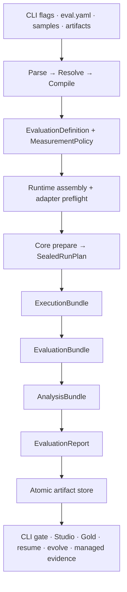
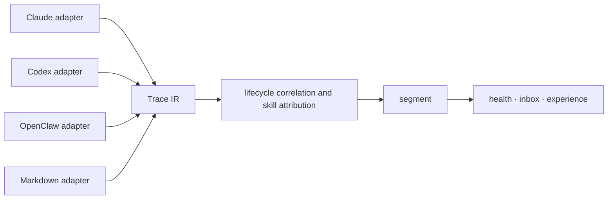

# How it works

OMK keeps one source of truth for evaluation: a host compiles local inputs into a host-neutral measurement contract, Evaluation Core seals and executes that contract, and every CLI or Studio view is projected from validated Core artifacts.



## The important boundaries

- **The host owns effects.** File discovery, Git materialization, credentials, environment access, progress text, report directories, Studio, and browser opening stay outside Core.
- **Core owns measurement meaning.** Dataset projection, Target behavior, evaluator instruments, metrics, sampling units, comparison families, analysis parameters, missing-evidence policy, budgets, and Decision policy are sealed before the first Target call.
- **Runtime identity is evidence.** Provider, model, effort, tools, sandbox, protocol, skill isolation, and fingerprint assurance are explicit. An adapter that cannot satisfy a declared capability fails before measurement instead of silently dropping it.
- **Gold is isolated.** Executors see only execution inputs. Evaluators receive only their declared evaluation projection. Gold remains analysis-only and cannot leak into generation or scoring.
- **Events are observational.** Slow, absent, or failing progress consumers cannot change authoritative Bundles or the final Report.
- **Persistence is immutable.** Each run publishes its Run Plan, Execution, Evaluation, and Analysis Bundles, and Evaluation Report as one digest-linked artifact set. Corruption or broken lineage fails explicitly.
- **Studio is a projection.** UI cards and pages can be rebuilt from Core artifacts and never become a second measurement model.

## Source dependency model

Directories under `src` express domain ownership rather than one mechanical repository-wide layering scheme. Three dependency kinds are reviewed separately:

- **Runtime implementation edges** must remain acyclic. A domain implementation may depend on facts it consumes or lower-level capabilities, but it may not create a reverse dependency through a facade, dynamic import, or utility module.
- **Contract edges** share stable data shapes across domains. A bidirectional domain relationship is valid only when its type-only contract return edge has been audited and registered; architecture tests reject new bidirectional relationships.
- **Composition edges** belong to delivery and host entry points such as `cli`, `dsh-plugin`, and `eval-workflows/production-host`. They may assemble domains and effects, while domain implementations may not import delivery composition.

`shared` is a cross-domain leaf and depends only on itself. `eval-core` is the host-neutral measurement kernel. Filesystems, directories, persistence, provider runtimes, and UI remain outside Core and are assembled by hosts.

Knowledge artifact lifecycle capabilities share one ownership boundary:

```text
knowledge-artifacts/
├── contracts.ts  # artifact identity and experiment roles
├── skills/       # skill frontmatter, hard rules, and workflow definitions
├── doctor/       # static and model-assisted artifact health checks
├── authoring/    # sample generation and controlled skill evolution
└── governance/   # install records, evidence gates, promote, and rollback state
```

Governance consumes authenticated evaluation and observation evidence; it does not recompute Core
scores or decisions. These capabilities remain separate subdomains so that sharing one lifecycle
owner does not turn `knowledge-artifacts` into a generic utility layer.

Diagnosis and Observability have an explicit boundary. Observability produces trace, inbox, and experience facts and may read only stable types or parsers under `diagnosis/contracts`. The downstream `diagnosis/observe-producer.ts` consumes those Observability facts to derive Diagnosis. Neither side may access any other private implementation across this boundary.

## Observability subdomains

The `src/observability` root retains only the stable `experience.ts` facade. Private implementations belong to vertical subdomains:

```text
observability/
├── contracts/
├── trace/           # source-neutral IR, message classification, ingestion, adapters
├── inbox/           # observation inbox, review, and feedback projections
├── conversation/    # conversation catalog, windows, and debugger projections
├── experience/      # experience facts, report derivation, and text signals
├── skill-health/    # skill chain, health checks, and advisories
├── soft-standards/
└── view-models/     # stable presentation facades
```

Trace's `message-classification.ts` decides message origin and protocol semantics. Experience's `text-signals.ts` decides hard-rule, progress, and delivery signals. Adapters therefore do not depend backwards on downstream experience projections. Old root paths are not retained as re-exports or compatibility shims.

## Scoring and release decisions

Assertions and rubric judges remain separate evaluator instruments. Analysis derives assertion layers, judge replicates and ensembles, dimensions, composite values, Bootstrap comparison families, and agreement tables without collapsing their identities.

Missing, invalid, failed, unavailable, and not-started observations are not zero scores. Coverage remains explicit through the graph. `omk.release-decision/v1` requires complete evidence and exact Analysis binding before returning one of `PROGRESS`, `CAUTIOUS`, `REGRESSION`, `NOISE`, `UNDERPOWERED`, or `SOLO`. A display score or point estimate never replaces the registered Decision.

Cost, usage, duration, operational status, evidence status, conclusion status, and lineage are orthogonal facts rather than extra scoring dimensions. Independent `--repeat` runs form an Evaluation Series; cross-run stability is not inferred from one run.

See [Composite scoring](../specs/scoring.md) and [Statistical rigor](statistical-rigor.md).

## Observation pipeline: source-neutral Trace IR

`omk observe` does not disguise Codex, Claude Code, or OpenClaw logs as one another. A source adapter maps each format into the same Trace IR before attribution, segmentation, and measurement:



The IR distinguishes `message`, `tool_call`, `tool_result`, `usage`, `lifecycle`, and `unknown` events. User messages carry a `human`, `runtime`, `skill-context`, or `synthetic` origin, so injected instructions, environment context, and tool results cannot inflate human-turn metrics. Tool calls retain provider namespaces. Outcomes use `success`, `failure`, `cancelled`, and `unknown`; ambiguous outcomes remain unknown.

Identifiers have separate jobs: `rootRunId` groups a task tree, `runId` identifies a concrete task, `traceId` identifies an evidence stream, and each segment gets an independent sample ID. Every load also records an ingestion summary, so malformed, unrecognized, filtered, or partial source data cannot masquerade as complete observation coverage.
