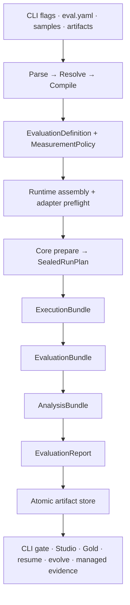
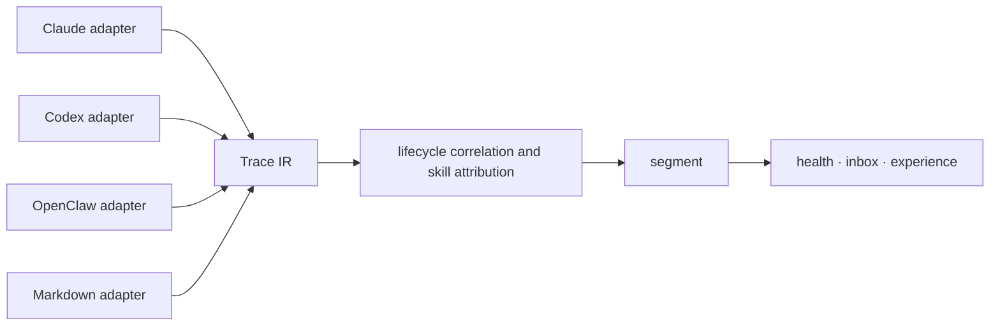

# How it works

OMK keeps one source of truth for evaluation: a host compiles local inputs into a host-neutral measurement contract, Evaluation Core seals and executes that contract, and every CLI or Studio view is projected from validated Core artifacts.



## The important boundaries

- **The host owns effects.** File discovery, Git materialization, credentials, environment access, progress text, report directories, Studio, and browser opening stay outside Core.
- **Core owns measurement meaning.** Dataset projection, Target behavior, evaluator instruments, metrics, sampling units, comparison families, analysis parameters, missing-evidence policy, budgets, and Decision policy are sealed before the first Target call.
- **Runtime identity is evidence.** Provider, model, effort, tools, sandbox, protocol, skill isolation, and fingerprint assurance are explicit. An adapter that cannot satisfy a declared capability fails before measurement instead of silently dropping it.
- **Gold is isolated.** Executors see only execution inputs. Evaluators receive only their declared evaluation projection. Gold remains analysis-only and cannot leak into generation or scoring.
- **Events are observational.** Slow, absent, or failing progress consumers cannot change authoritative Bundles or the final Report.
- **Persistence is immutable.** Each run publishes its Run Plan, Execution, Evaluation, and Analysis Bundles, and Evaluation Report as one digest-linked artifact set. Corruption or broken lineage fails explicitly.
- **Studio is a projection.** UI cards and pages can be rebuilt from Core artifacts and never become a second measurement model.

## Source dependency model

Directories under `src` express domain ownership rather than one mechanical repository-wide layering scheme. Three dependency kinds are reviewed separately:

- **Runtime implementation edges** must remain acyclic. A domain implementation may depend on facts it consumes or lower-level capabilities, but it may not create a reverse dependency through a facade, dynamic import, or utility module. The graph retains value imports into `contracts`; an audited cycle is registered by its complete domain and intra-cycle edge topology, so any new return path invalidates the registration. Non-literal dynamic imports across TypeScript and executable JavaScript sources are likewise fail-closed unless their importer, expression, and canonical source digest are explicitly registered.
- **Contract edges** share stable data shapes across domains. A bidirectional domain relationship is valid only when its return edge has been audited and registered; architecture tests reject new bidirectional relationships and stale registrations.
- **Composition edges** belong to delivery and host entry points such as `cli`, `dsh-plugin`, and `eval-hosts`. They may assemble domains and effects, while domain implementations may not import delivery composition.

`shared` is a cross-domain leaf and depends only on itself. `eval-core` is the host-neutral measurement kernel. `eval-runtime` is the lightweight service-host adoption layer: its canonical façade compiles ordinary `evaluate()` input into existing Core contracts, while its foundation assembles explicit ports and Core built-ins without owning product workflows or infrastructure. Filesystems, directories, persistence, provider runtimes, and UI remain outside Core and are assembled by hosts.

```text
eval-core ← eval-runtime ← eval-workflows
                ↑               ↑
                └── eval-hosts ──┘
                         ↑
                     CLI / DSH
```

The arrow points from consumer to dependency. `eval-runtime` may depend on Core and type-only Executor contracts; it must not import `eval-workflows`, provider implementations, or delivery surfaces. `eval-workflows` reuses Runtime foundation leaf modules instead of importing the canonical user façade or maintaining a second lifecycle implementation.

Knowledge artifact lifecycle capabilities share one ownership boundary:

```text
knowledge-artifacts/
├── contracts.ts  # artifact identity and experiment roles
├── skills/       # skill frontmatter, hard rules, and workflow definitions
├── doctor/       # static and model-assisted artifact health checks
├── authoring/    # sample generation and controlled skill evolution
├── governance/   # install records, evidence gates, promote, and rollback state
└── sources/      # canonical source fingerprints and distributable-tree identity
```

Governance consumes authenticated evaluation and observation evidence; it does not recompute Core
scores or decisions. These capabilities remain separate subdomains so that sharing one lifecycle
owner does not turn `knowledge-artifacts` into a generic utility layer.

Evaluation inputs, evaluator instruments, and Gold calibration share the workflow boundary, while effectful
runtime readiness belongs to executors:

```text
eval-workflows/
├── analysis/           # reusable workflow-owned statistical primitives
├── artifact-store/     # Core artifact persistence, discovery, and overlays
├── assertions/         # authored assertion adaptation and score layers
├── gold/               # human-gold datasets, calibration, and CLI support
├── input-compilation/  # host inputs → host-neutral measurement definition
├── inputs/             # config, sample, artifact-source resolution, and schemas
├── instruments/        # evaluator configuration and frozen prompt assets
├── projections/        # authenticated downstream views of Core artifacts
├── resume-admission/   # persisted-run integrity and resume admission
├── measurement/        # product scoring, analysis nodes, and evaluator implementations
└── orchestration/      # product orchestration, persistence, and injected Runtime consumption

executors/
├── contracts/          # executor ports, runtime identity, result, and trace facts
├── preflight/          # host tool, file, environment, and custom-command readiness
└── <provider>/         # provider-specific runtime implementations
```

Product orchestration lives in `eval-workflows/orchestration`: it consumes an injected Runtime and persists evaluation results. `createProductionEvaluationWorkflow` describes this responsibility; concrete provider selection and resource assembly belong to the delivery entry or shared host modules. This internal rename does not add a package export or a compatibility forwarding module.

The canonical Runtime entry `evaluate.ts` re-exports its existing API from internal
`evaluation/` modules. Input and evaluator capture feed Definition compilation;
preparation seals and runs the contract; reuse performs Core admission before
rescore, reanalysis or redecision. A single result-state module owns authenticated
results and prepared capabilities. Capture and compilation cannot depend on run
state, and internal modules cannot import the public façade. These modules add no
package subpaths and retain the existing identity and measurement contracts.

Artifact discovery, local and Git source resolution, and content-addressed copies belong to `knowledge-artifacts/sources`. Doctor, installation, governance and evaluation consume that shared implementation. Batch discovery that requires evaluation samples stays in `eval-workflows/inputs/batch-discovery.ts`; the source layer must not import Workflow.


`eval-workflows/instruments` and `eval-workflows/gold` do not own measurement meaning: they adapt
judge execution and Gold calibration into the instruments and analysis contracts owned by Core. Likewise,
`executors/preflight` reports environment readiness facts, while
`eval-hosts/runtime-adapter/preflight.ts` decides workflow admission from binding declarations.
These subdomains remain separate dependency-graph vertices even though they are physically grouped.

`eval-workflows` consumes an explicitly injected `EvaluationRuntimeProvider`. Product compilation
supplies Definition, Policy and run metadata through `EvaluationExecutionInput`; Workflow never
constructs a Core engine, provider adapter or resource lease. Runtime owns single-run execution and
Series preparation/execution. Workflow may orchestrate concurrent independent Series members while
Core alone owns their scheduling, retry, timeout, budget and measurement contracts.

```text
eval-hosts/
├── node/                    # shared Node resolution, registry and preflight
└── runtime-adapter/
    ├── adapters/            # concrete provider protocol bridges
    ├── evaluators/          # product evaluator factory wiring
    └── resource-leases/     # verified Node snapshots and host resource access
```

Host assembly consumes product declarations and injects Runtime capabilities into Workflow. Lower
layers cannot import `eval-hosts`, including type-only imports. Product measurement implementations
remain in `eval-workflows/measurement`; generic execution and lifecycle bridges remain in Runtime.
The obsolete Workflow Runtime directory and forwarding wrappers are removed without a 0.x compatibility
path. Correct Core/Runtime contracts take precedence over existing Workflow/CLI behavior. Legitimate
missing capabilities belong in the responsible lower layer rather than a product execution bypass.

### Source ownership and composition consumers

Source directories express ownership; `package.json#exports` selects public entrypoints. A directory
need not become a public API. This inventory records domain boundaries without forcing all domains into one pipeline.

| Owner | Public entrypoints and actual consumers | Ownership and verification boundary |
|---|---|---|
| Core / Runtime | `eval-core`, package root and `eval-runtime`; service callers and product Workflow | Core execution and measurement contracts, Runtime adoption and generic scoring; verify published packages, contracts, scheduling and cancellation |
| Workflow | `eval-samples`, `projections`; CLI, DSH, Studio and artifact evolution | Product declarations, versioned scoring/analysis, orchestration and evaluation stores; verify compilation, projections and release decisions |
| Executors | Internal calls from host adapters, judges, doctor, sample, evolve and observation analysis | Shared invocation protocols and mechanics, not an obsolete evaluation path; verify arguments, environment, traces, usage and errors |
| Knowledge artifacts | Internal consumers in CLI, Workflow, observation and governance | Artifact lifecycle and shared source resolution; verify source identity, isolated copies, installation, doctor and governance |
| Observability / Diagnosis | MCP, DSH, CLI and Studio; observation storage parses the diagnosis contract | Separate evidence, signals and diagnoses; verify provenance, coverage and stable contracts |
| Evidence | Product domains and delivery entrypoints | Cross-source storage layout and association; does not replace evaluation artifact validation or decide scores/releases |
| CLI / DSH / MCP / Studio | `omk`, `dsh-plugin`, `mcp` / `omk-mcp`, `studio` | Own entry protocols, context, identity and presentation policy; verify real commands, plugins, services and views |
| Shared | Internal leaf utilities | No domain decisions; verify atomic files, locks and basic data operations |

Composition follows actual consumers. CLI provider selection, environment classification, credential
resolution and production assembly live in `cli/lib/evaluation-composition.ts`. DSH agent context and
judge invocation live in `dsh-plugin/core-command.ts`. DSH does not obtain shared capabilities through
CLI modules. The retained `eval-hosts` boundary currently serves these shared consumers:

| Module | Actual consumers | Contract, failure and resource boundary |
|---|---|---|
| `node/preflight.ts` | CLI and DSH | Explicit compiled input, environment and project root; lazy checks propagate failures through existing admission rules |
| `node/node-cli-evaluation-resolver.ts` | CLI and DSH | Shared product request resolution; the retained request protocol name does not make it CLI entry policy |
| `node/node-sample-content-resolver.ts`, `safe-http-content-resolver.ts` | Shared resolver above | File/network content resolution and session cleanup; verify source restrictions, cancellation and content identity |
| `node/runtime-registry.ts`, `judge-provider-identity.ts` | CLI and DSH | Explicit registration and judge identity; shared registry does not select providers or read credentials on behalf of an entrypoint |
| `runtime-adapter/assembly.ts`, `composition.ts`, `builtins.ts`, `preflight.ts` | CLI and DSH via Runtime provider | Binding, registration, admission and run-resource wiring; hosts implement cleanup while Runtime controls lifecycle |
| `runtime-adapter/adapters`, `evaluators`, `resource-leases` | Composition above; DSH also uses resource interfaces | Provider bridges, evaluator wiring and resources cannot depend back on entry composition or bypass boundaries through aggregate exports |

Direct service `evaluate()` uses Runtime/Core. CLI and DSH use compilation, host assembly and injected
Runtime. Generation, repair and auxiliary analysis may directly use `ExecutorFn`. Observation facts
reach Studio through diagnosis and domain projections. Extract shared mechanics according to those
contracts. The user facade's event consumption and product run-lease wrapper do not constitute
duplicate scheduling merely because both invoke Core.

Shared hosts remain because CLI and DSH actually reuse binding, registration and resource assembly; entry-specific policy belongs to its entrypoint. Internal tests follow host adapters, Runtime, product measurement and projections. Historical Schema/instrument versions are distinct from npm 0.x compatibility and remain governed by public references and evidence-reading needs. The knowledge-content domain remains a design proposal, without placeholder implementation.

### Provider mechanics and measurement adaptation

Ordinary `ExecutorFn` calls serve generation, judges and auxiliary analysis. Measurement adapters make stricter capability, provenance and failure-evidence commitments. The current implementation separates reusable mechanics from policy; the ordinary interface must not constrain Runtime capabilities.

| Path | Shared mechanics | Contract differences retained |
|---|---|---|
| Codex CLI | Argument construction in `executors/openai/codex/cli-arguments.ts`; subprocess handling, event normalization and Trace parsing | Ordinary calls select read-only sandboxing; measured calls explicitly select sandbox, effort, strict configuration and environment inheritance, and bind executable identity |
| Claude CLI | Subprocess handling, protocol normalization, Trace and mock infrastructure | Ordinary calls pass prompt arguments and optional system text; measured calls use their own input projection, restricted setting sources and resource files, so a complete argument template is not interchangeable |
| Codex SDK | Provider protocol and Trace | Ordinary calls own a per-call isolated home; measured calls bind SDK identity and Trial resources, whose lifetime cannot be delegated to an ordinary-call wrapper |
| Claude SDK | Provider protocol, Trace and mock infrastructure | Measured calls fix setting sources and verify SDK runtime capabilities; auxiliary calls retain their own configuration and result protocol |
| OpenAI / Anthropic HTTP | Token-usage primitives; both measured HTTP adapters share an identified transport and protocol infrastructure | Ordinary calls read environment configuration and use call timeouts; measured calls inject transport/credentials, use Core cancellation and output bounds, and retain fail-closed parsing |
| Custom command | Subprocess infrastructure | Ordinary command output differs from the versioned measurement request/response exchange; concatenating wrappers does not make these one protocol |

Codex argument extraction preserves argument order, prompt bytes and each caller's empty-value handling. Environment selection, timeout, error envelopes and cleanup remain outside the argument utility. Ordinary calls own call-level timeouts; measurement follows Core attempt cancellation without adding a second measurement timeout. Workspaces remain separate per Trial, retries retain the same Trial state, and failure usage and Trace retain their declared semantics.

Any further extraction must verify arguments, environment, output, Trace, usage, cancellation, errors and cleanup together. Reuse existing shared mechanics and retain adaptation where contracts differ; fewer functions are not grounds for merging measurement identities or changing protocols. Relevant regressions live in `test/executors`, `test/eval-hosts` and `test/eval-runtime`; product scoring and statistics tests live in `test/eval-workflows/measurement`.

Evidence persistence and cross-source association have one non-decision boundary:

```text
evidence/
├── storage/  # canonical layout, names, bundles, discovery, and integrity checks
└── graph/    # doctor, eval, and observe evidence relationships
```

Evidence stores, validates, locates, and links facts. It does not score outputs, derive diagnoses,
or decide knowledge lifecycle actions. Public package entrypoints live at their owning domains'
natural `index.ts` or semantic file; `package.json#exports` is the only publication allowlist.
Internal production modules import concrete domain files rather than those package barrels.

Diagnosis and Observability have an explicit boundary. Observability produces trace, inbox, and experience facts and may read only stable types or parsers under `diagnosis/contracts`. The downstream `diagnosis/observe-producer.ts` consumes those Observability facts to derive Diagnosis. Neither side may access any other private implementation across this boundary.

## Observability subdomains

The `src/observability` root retains only the stable `experience.ts` facade. Private implementations belong to vertical subdomains:

```text
observability/
├── contracts/
├── trace/           # source-neutral IR, message classification, ingestion, adapters
├── inbox/           # observation inbox, review, and feedback projections
├── conversation/    # conversation catalog, windows, and debugger projections
├── experience/      # experience facts, report derivation, and text signals
├── skill-health/    # skill chain, health checks, and advisories
├── soft-standards/
└── view-models/     # stable presentation facades
```

Trace's `message-classification.ts` decides message origin and protocol semantics. Experience's `text-signals.ts` decides hard-rule, progress, and delivery signals. Adapters therefore do not depend backwards on downstream experience projections. Old root paths are not retained as re-exports or compatibility shims.

## Scoring and release decisions

Assertions and rubric judges remain separate evaluator instruments. Analysis derives assertion layers, judge replicates and ensembles, dimensions, composite values, Bootstrap comparison families, and agreement tables without collapsing their identities.

Missing, invalid, failed, unavailable, and not-started observations are not zero scores. Coverage remains explicit through the graph. `omk.release-decision/v7` requires complete evidence, exact Analysis binding, resolved Bootstrap Monte Carlo uncertainty, and a practical-effect confidence lower bound before returning one of `PROGRESS`, `CAUTIOUS`, `REGRESSION`, `NOISE`, `UNDERPOWERED`, or `SOLO`; configured but unmeasurable cross-judge agreement in any applicable rubric dimension gates positive comparisons as `CAUTIOUS`, and the sample-size guard compares observed comparison units with a preregistered fixed or a priori requirement. A display score or point estimate never replaces the registered Decision.

Cost, usage, duration, operational status, evidence status, conclusion status, and lineage are orthogonal facts rather than extra scoring dimensions. Independent `--repeat` runs form an Evaluation Series; cross-run stability is not inferred from one run.

See [Composite scoring](../specs/scoring.md) and [Statistical rigor](statistical-rigor.md).

## Observation pipeline: source-neutral Trace IR

`omk observe` does not disguise Codex, Claude Code, or OpenClaw logs as one another. A source adapter maps each format into the same Trace IR before attribution, segmentation, and measurement:



The IR distinguishes `message`, `tool_call`, `tool_result`, `usage`, `lifecycle`, and `unknown` events. User messages carry a `human`, `runtime`, `skill-context`, or `synthetic` origin, so injected instructions, environment context, and tool results cannot inflate human-turn metrics. Tool calls retain provider namespaces. Outcomes use `success`, `failure`, `cancelled`, and `unknown`; ambiguous outcomes remain unknown.

Identifiers have separate jobs: `rootRunId` groups a task tree, `runId` identifies a concrete task, `traceId` identifies an evidence stream, and each segment gets an independent sample ID. Every load also records an ingestion summary, so malformed, unrecognized, filtered, or partial source data cannot masquerade as complete observation coverage.
