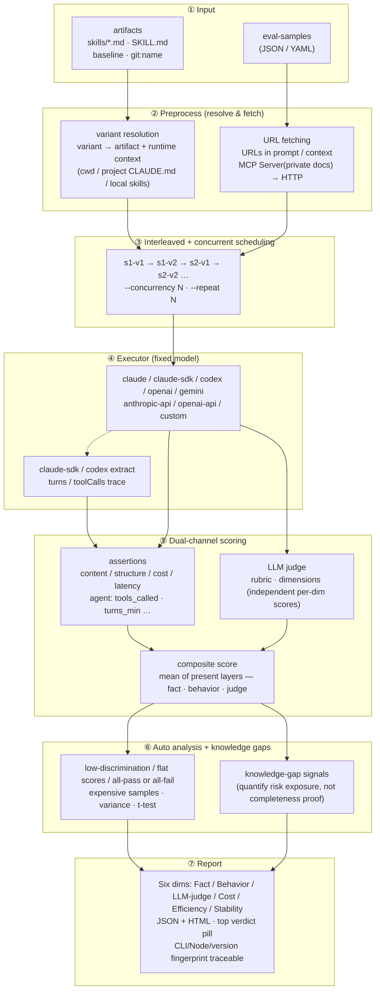

# How it works

Core idea: **fix the model and the samples, vary only the artifact and runtime context**, use interleaved scheduling to cancel time drift, score via assertions + LLM judge (dual channel), then layer on knowledge-gap signals to quantify risk exposure.

**Key design choices:**

- **Interleaved scheduling** removes time drift: different variants of the same sample are dispatched alternately rather than "all of v1 then all of v2", so model load / network jitter can't be mis-attributed to the artifact.
- **variant = artifact + runtime context**: the `cwd` (declared via `--control-cwd`/`--treatment-cwd` or eval.yaml's `cwd:` field, separate from the artifact expression) lets control groups explicitly declare the "project directory" input, separating "project-level accumulated knowledge" from "explicit artifact injection".
- **Dual-channel scoring is complementary**: assertions catch deterministic defects (must call tool X, must contain field Y); the LLM judge catches subjective quality (readability, completeness). The composite is the mean of whichever scoring layers (fact / behavior / judge) are actually present.
- **Knowledge-gap signals** are not part of the score — they are an independent tracking channel that tells you "how much risk exposure this evaluation covered", for convergence tracking, not as a completeness proof.

## Six-dim evaluation

Reports display results across six independent dimensions. The three scoring layers — Fact / Behavior / LLM-judge — are shown separately so you see **which layer regressed** instead of a single composite number:

| Dimension | Metric | Description |
|---|---|---|
| 📋 **Fact** | fact-assertion pass rate | rule-verifiable assertions like `contains` / `json_schema` / `fact_check`, mapped to 1-5 |
| 🛠️ **Behavior** | behavior-assertion pass rate | execution-compliance assertions like `tools_called` / `tool_output_contains` / `turns_max` |
| 💬 **LLM-judge** | rubric score | 1-5 scored by the judge model against a predefined rubric; subjective, catches what rules miss |
| 💰 **Cost** | total cost, input/output tokens | API cost based on token usage and model pricing |
| ⚡ **Efficiency** | average latency (ms) | end-to-end latency from request to full response |
| 🛡️ **Stability** | CV (coefficient of variation) | score consistency across repeated runs (`--repeat ≥ 2`); single-run shows `—`, **honestly acknowledging what can't be measured** |
