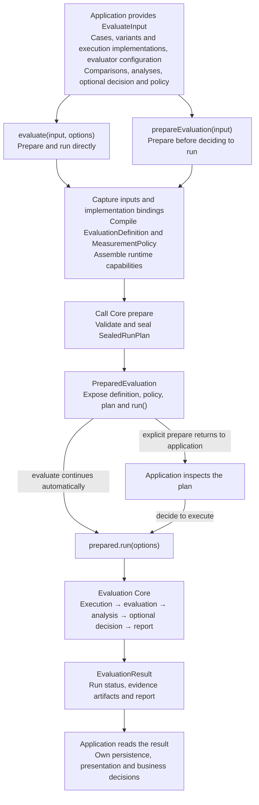

# Embed OMK in a Node.js service

Complete one version comparison: run an example without a model account, replace the simulated service and cases, then interpret the result. Use Node.js 22 or newer and ESM.

<a id="where-to-start"></a>

## 1. Get a result first

From the OMK source repository root, run:

```bash
yarn install --immutable
yarn build
node examples/eval-runtime/run.mjs
```

The example simulates two service versions with fixed answers. It needs no credentials, calls no model and does not open Studio. Open [run.mjs](https://github.com/lizhiyao/oh-my-knowledge/blob/main/examples/eval-runtime/run.mjs); the following steps all start from this file.

Its output includes:

```json
{"runStatus":"completed","estimate":0.3333333333333333,"verdict":"NOISE"}
```

These are three fields from the full output: the run completed and candidate accuracy was about 33.3 percentage points higher, but three teaching cases do not establish improvement. **A working pipeline is not sufficient release evidence.**

In an independent project, install `npm install oh-my-knowledge@next zod`, then copy the example matching your installed version. `next` is the evolving Beta channel; use the source workflow above for capabilities not yet released.

## 2. Use your service and cases

Two roles matter first:

| Name | Responsibility |
|---|---|
| `executor` | Call your service and return its actual answer. |
| `evaluator` | Check the actual answer against expected answers or rules. |

Edit these parts of the example in order:

1. **`executor.execute()`:** Replace the fixed `answers[...]` lookup with your service call. Return `{ output, usage }`, forward `signal`, and report real usage rather than the example's counters.
2. **`dataset.samples`:** Replace the three teaching cases with domain cases. `input` goes to the service; `expected` is for scoring and must not be sent to the target model. Review cases and labels first.
3. **`variants`:** Choose the two versions to compare. To measure a prompt change, make the executor consume `artifact.content` and keep the model, tools and other conditions fixed. The simulation selects fixed answers by `config.deployment`; it does not validate prompt effectiveness.
4. **Executor declarations:** Update input, configuration and output schemas, implementation versions and capabilities. A stochastic model must not copy `deterministic`; without seed control, use the sampling setting below.

```js
// Replace experiment.sampling; retain the other experiment fields.
sampling: { samplingKind: 'paired', seedCoupling: 'uncontrolled' }
```

Keep credentials and clients in the executor closure. `config` and `runtimeContext` enter the measurement record and must not contain secrets. Throw or return a stable `errorCode` on invocation failure instead of substituting an answer for ordinary scoring.

For complete model-service code to adapt, see the [integration example](./eval-runtime-scoring.md#exact-match-evaluation). Before real evaluation, configure [concurrency, timeouts and budgets](./eval-runtime-infrastructure.md#production-policy) for your service; costs come from actual service calls.

## 3. Choose a scoring method

The example uses `exact-match`: actual and expected answers must match exactly, without automatic trimming or punctuation normalization. This suits classification and fixed-format tasks.

| Your task | Scoring method |
|---|---|
| Return fixed labels or structured answers | [Exact match](./eval-runtime-scoring.md#exact-match-evaluation) |
| Judge correctness or completeness across valid phrasings | [LLM judge](./eval-runtime-scoring.md#rubric-judge-evaluation), with explicit criteria and additional model calls |
| Return retrieved or recommended items | [Retrieval metrics](./eval-runtime-scoring.md#retrieval-evaluation); use [retrieval and abstention](./eval-runtime-scoring.md#retrieval-abstention) for empty-result cases |
| Check tool usage | [Tool trajectories](./eval-runtime-scoring.md#tool-trajectory-evaluation), alongside a separate final-answer check |
| Apply business-specific rules | [Custom evaluator](./eval-runtime-scoring.md#custom-evaluator) |

When changing metrics, update metric IDs referenced by `comparisons` and `analyses`. Evaluators produce individual readings; `analyses` supplies summaries and intervals. Configure `decision` only when you need an automatic conclusion.

## 4. Run and interpret the result

Before real execution, you can split the example's `evaluate(input, options)` into two steps. Here `input` means the first object passed to `evaluate()` in the example:

```js
import { prepareEvaluation } from 'oh-my-knowledge';

const prepared = await prepareEvaluation(input);
console.log(prepared.estimatedWork);
// Inspect the plan before calling run; preparation does not execute target tasks.
const result = await prepared.run();
```

<a id="read-results"></a>
<a id="read-the-results"></a>

Read results in this order:

1. **Run state:** Handle exceptions and inspect `result.status`. Failure, cancellation or budget exhaustion is not success; a failed run may have no report.
2. **Evidence coverage:** Inspect the state and coverage in `result.analysisResults[analysisId]`. Failed calls, missing evidence and invalid output are not zero scores and must not be ignored.
3. **Difference and interval:** `estimate` is candidate minus control. A positive value does not necessarily establish improvement. Interpret conclusions within the evidence and analysis limits.
4. **Report and action:** Retain `result.artifacts` and `result.report` for your storage and UI. Runtime does not open Studio or release a version for you.

Use representative cases and a separate validation set. A positive difference on teaching cases does not justify release. See the [Runtime API](../reference/eval-runtime-api.md) for full field definitions.

## Troubleshoot

| Symptom | Next step |
|---|---|
| `EVAL_RUNTIME_INPUT_INVALID` before execution | Check schemas, referenced IDs, executor capabilities and sampling design. |
| Correct meaning but a failing score | Check whether exact matching suits the task; open-ended answers may need an LLM judge. |
| Scores without a mean or interval | Declare the corresponding metric in `analyses`; `comparisons` alone does not request analysis. |
| `sourceUnavailable`, `invalid` or `inconclusive` | Check calls, output, labels and valid sample coverage; do not fill gaps with default scores. |
| Need to stop or bound the wait | Configure [signals, progress and timeouts](./eval-runtime-infrastructure.md#run-progress). |

## Explore when needed

- [Scoring methods and complete integration code](./eval-runtime-scoring.md): exact match, LLM judges, retrieval, tool trajectories and custom rules.
- [Experiment design and evidence reuse](./eval-runtime-experiments.md): plan inspection, comparability, repeated runs, multiple metrics and rescoring.
- [Execution and storage](./eval-runtime-infrastructure.md): budgets, caches, evidence retention, cancellation and conformance checks.
- [Agent integration](./eval-runtime-agents.md): workspaces, tool access, MCP, mocks and sessions.

## Runtime integration flow

`eval-runtime` assembles application inputs and implementations into Core contracts, then drives Core execution. It does not maintain a second scoring, scheduling or decision pipeline.



`evaluate(input, options)` prepares the evaluation and calls `prepared.run(options)`. `runId`, `signal` and `onEvent` are run options; `prepareEvaluation()` fixes the measurement contract without executing target tasks. For the stages inside Core, see the [single-run evaluation flow](../explanation/architecture.md#single-run-evaluation-flow).

<details>
<summary>Previous section links</summary>

<a id="the-evaluation-vocabulary"></a>

[the-evaluation-vocabulary](./eval-runtime-scoring.md#the-evaluation-vocabulary)

<a id="names-used-in-the-code"></a>

[names-used-in-the-code](./eval-runtime-scoring.md#names-used-in-the-code)

<a id="exact-match-evaluation"></a>

[exact-match-evaluation](./eval-runtime-scoring.md#exact-match-evaluation)

<a id="retrieval-evaluation"></a>

[retrieval-evaluation](./eval-runtime-scoring.md#retrieval-evaluation)

<a id="check-retrieval-relevance-and-ranking"></a>

[check-retrieval-relevance-and-ranking](./eval-runtime-scoring.md#check-retrieval-relevance-and-ranking)

<a id="retrieval-abstention"></a>

[retrieval-abstention](./eval-runtime-scoring.md#retrieval-abstention)

<a id="mixed-retrieval-and-empty-result-evaluation"></a>

[mixed-retrieval-and-empty-result-evaluation](./eval-runtime-scoring.md#mixed-retrieval-and-empty-result-evaluation)

<a id="tool-trajectory-evaluation"></a>

[tool-trajectory-evaluation](./eval-runtime-scoring.md#tool-trajectory-evaluation)

<a id="check-whether-an-agent-called-the-required-tools"></a>

[check-whether-an-agent-called-the-required-tools](./eval-runtime-scoring.md#check-whether-an-agent-called-the-required-tools)

<a id="custom-evaluator"></a>

[custom-evaluator](./eval-runtime-scoring.md#custom-evaluator)

<a id="write-your-own-scoring-rule"></a>

[write-your-own-scoring-rule](./eval-runtime-scoring.md#write-your-own-scoring-rule)

<a id="rubric-judge-evaluation"></a>

[rubric-judge-evaluation](./eval-runtime-scoring.md#rubric-judge-evaluation)

<a id="ask-an-llm-to-score-answers-against-explicit-criteria"></a>

[ask-an-llm-to-score-answers-against-explicit-criteria](./eval-runtime-scoring.md#ask-an-llm-to-score-answers-against-explicit-criteria)

<a id="prepare-plan"></a>

[prepare-plan](./eval-runtime-experiments.md#prepare-plan)

<a id="inspect-a-plan-before-running"></a>

[inspect-a-plan-before-running](./eval-runtime-experiments.md#inspect-a-plan-before-running)

<a id="compare-runs"></a>

[compare-runs](./eval-runtime-experiments.md#compare-runs)

<a id="check-whether-two-runs-are-comparable"></a>

[check-whether-two-runs-are-comparable](./eval-runtime-experiments.md#check-whether-two-runs-are-comparable)

<a id="repeat-run-stability"></a>

[repeat-run-stability](./eval-runtime-experiments.md#repeat-run-stability)

<a id="repeat-an-evaluation-to-check-stability"></a>

[repeat-an-evaluation-to-check-stability](./eval-runtime-experiments.md#repeat-an-evaluation-to-check-stability)

<a id="reuse-stages"></a>

[reuse-stages](./eval-runtime-experiments.md#reuse-stages)

<a id="reuse-outputs-after-changing-labels-or-analysis"></a>

[reuse-outputs-after-changing-labels-or-analysis](./eval-runtime-experiments.md#reuse-outputs-after-changing-labels-or-analysis)

<a id="independent-groups"></a>

[independent-groups](./eval-runtime-experiments.md#independent-groups)

<a id="assign-samples-to-separate-version-groups"></a>

[assign-samples-to-separate-version-groups](./eval-runtime-experiments.md#assign-samples-to-separate-version-groups)

<a id="multiple-criteria"></a>

[multiple-criteria](./eval-runtime-experiments.md#multiple-criteria)

<a id="apply-multiple-release-criteria-together"></a>

[apply-multiple-release-criteria-together](./eval-runtime-experiments.md#apply-multiple-release-criteria-together)

<a id="composite-score"></a>

[composite-score](./eval-runtime-experiments.md#composite-score)

<a id="combine-metrics-into-one-score"></a>

[combine-metrics-into-one-score](./eval-runtime-experiments.md#combine-metrics-into-one-score)

<a id="executor-contract"></a>

[executor-contract](./eval-runtime-infrastructure.md#executor-contract)

<a id="service-inputs-errors-and-credentials"></a>

[service-inputs-errors-and-credentials](./eval-runtime-infrastructure.md#service-inputs-errors-and-credentials)

<a id="reference-evidence-and-host-content-storage"></a>

[reference-evidence-and-host-content-storage](./eval-runtime-infrastructure.md#reference-evidence-and-host-content-storage)

<a id="store-larger-or-sensitive-outputs-in-your-own-storage"></a>

[store-larger-or-sensitive-outputs-in-your-own-storage](./eval-runtime-infrastructure.md#store-larger-or-sensitive-outputs-in-your-own-storage)

<a id="reuse-execution-and-evaluation-results"></a>

[reuse-execution-and-evaluation-results](./eval-runtime-infrastructure.md#reuse-execution-and-evaluation-results)

<a id="use-caches-to-reduce-repeated-calls"></a>

[use-caches-to-reduce-repeated-calls](./eval-runtime-infrastructure.md#use-caches-to-reduce-repeated-calls)

<a id="run-progress"></a>

[run-progress](./eval-runtime-infrastructure.md#run-progress)

<a id="receive-progress-and-cancel-a-run"></a>

[receive-progress-and-cancel-a-run](./eval-runtime-infrastructure.md#receive-progress-and-cancel-a-run)

<a id="production-policy"></a>

[production-policy](./eval-runtime-infrastructure.md#production-policy)

<a id="set-concurrency-timeouts-retries-and-budgets"></a>

[set-concurrency-timeouts-retries-and-budgets](./eval-runtime-infrastructure.md#set-concurrency-timeouts-retries-and-budgets)

<a id="check-runtime-components"></a>

[check-runtime-components](./eval-runtime-infrastructure.md#check-runtime-components)

<a id="check-whether-your-integration-meets-omk-requirements"></a>

[check-whether-your-integration-meets-omk-requirements](./eval-runtime-infrastructure.md#check-whether-your-integration-meets-omk-requirements)

<a id="advanced-integration-and-migration"></a>

[advanced-integration-and-migration](./eval-runtime-infrastructure.md#advanced-integration-and-migration)

<a id="when-to-use-advanced-apis"></a>

[when-to-use-advanced-apis](./eval-runtime-infrastructure.md#when-to-use-advanced-apis)

<a id="content-addressed-workspaces"></a>

[content-addressed-workspaces](./eval-runtime-agents.md#content-addressed-workspaces)

<a id="give-agents-isolated-file-workspaces"></a>

[give-agents-isolated-file-workspaces](./eval-runtime-agents.md#give-agents-isolated-file-workspaces)

<a id="per-sample-tool-access"></a>

[per-sample-tool-access](./eval-runtime-agents.md#per-sample-tool-access)

<a id="per-sample-native-mcp-configuration"></a>

[per-sample-native-mcp-configuration](./eval-runtime-agents.md#per-sample-native-mcp-configuration)

<a id="attempt-scoped-mock-interception"></a>

[attempt-scoped-mock-interception](./eval-runtime-agents.md#attempt-scoped-mock-interception)

<a id="replace-selected-tool-calls-with-mock-results"></a>

[replace-selected-tool-calls-with-mock-results](./eval-runtime-agents.md#replace-selected-tool-calls-with-mock-results)

<a id="stateful-agent-sessions"></a>

[stateful-agent-sessions](./eval-runtime-agents.md#stateful-agent-sessions)

<a id="keep-a-session-for-a-multi-step-agent"></a>

[keep-a-session-for-a-multi-step-agent](./eval-runtime-agents.md#keep-a-session-for-a-multi-step-agent)

</details>
