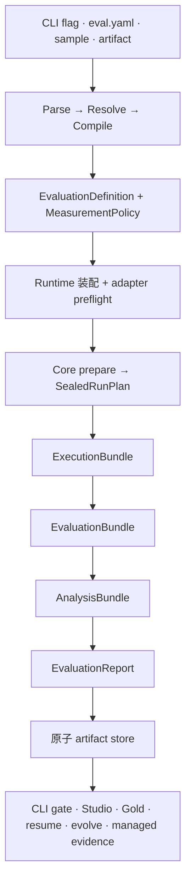

# 工作原理

OMK 的评测只有一份事实源：宿主把本机输入编译成宿主无关的测量契约，Evaluation Core 封存并执行契约，CLI 与 Studio 的所有视图都从经过校验的 Core 产物投影得到。



## 关键边界

- **宿主持有 effect。** 文件发现、Git materialization、凭证、环境读取、进度文案、报告目录、Studio 与浏览器打开都留在 Core 之外；
- **Core 持有测量语义。** Dataset projection、Target 行为、evaluator instrument、metric、sampling unit、comparison family、analysis parameter、缺失证据 policy、预算与 Decision policy 都会在第一次 Target 调用前封存；
- **Runtime identity 是证据。** Provider、model、effort、tool、sandbox、protocol、skill isolation 与 fingerprint assurance 都必须显式表达。Adapter 无法满足声明的 capability 时，会在测量前失败，不能静默丢弃能力；
- **Gold 严格隔离。** Executor 只看到 execution input；evaluator 只收到已声明的 evaluation projection；Gold 仅属于 analysis，不能泄漏到生成或评分；
- **事件只负责观测。** 进度 consumer 过慢、缺失或失败，都不能改变权威 Bundle 或最终 Report；
- **持久化不可变。** 每个 run 会把 Run Plan、Execution／Evaluation／Analysis Bundle 与 Evaluation Report 作为一组 digest-linked 产物原子发布。损坏或 lineage 断裂必须显式失败；
- **Studio 只是 projection。** UI 卡片与页面可以从 Core 产物重建，绝不成为第二套测量模型。

## 源码依赖模型

`src` 的目录表达领域所有权，不机械套用一组全仓分层。维护时需要区分三类依赖：

- **运行时实现边**必须保持无环。领域实现只能依赖它所消费的事实或更低层能力，不能借 facade、动态 import 或工具函数形成反向依赖；
- **contracts 边**允许跨领域共享稳定数据形状。双向领域关系只有经过审计并登记的 type-only contract 回边才成立，新增双向关系会被架构测试拒绝；
- **composition edge**由 `cli`、`dsh-plugin` 与 `eval-workflows/production-host` 等交付／宿主入口拥有。它们可以装配领域与 effect，领域实现不得反向 import delivery composition。

`shared` 是跨领域叶子，只依赖自身。`eval-core` 是宿主无关的测量内核。`eval-runtime` 是轻量服务宿主接入层：canonical façade 将普通 `evaluate()` 输入编译为既有 Core contract，foundation 则装配显式 port 与 Core 内建能力；两者都不持有产品 workflow 或基础设施。文件系统、目录、持久化、provider Runtime 与 UI 都在 Core 外由宿主装配。

```text
eval-core ← eval-runtime ← eval-workflows ← CLI / DSH
                ↑               ↑
        executors / FaaS   OMK 产品 workflow
```

箭头从 consumer 指向 dependency。`eval-runtime` 可以依赖 Core 与 type-only Executor contract，但不得导入 `eval-workflows`、provider implementation 或 delivery surface。`eval-workflows` 只复用 Runtime foundation 叶子模块，不导入 canonical 用户 façade，也不维护第二份生命周期实现。

知识载体生命周期能力归入同一个所有权边界：

```text
knowledge-artifacts/
├── contracts.ts  # artifact 身份与实验角色
├── skills/       # skill frontmatter、硬规则与 workflow 定义
├── doctor/       # 静态与模型辅助的 artifact 健康检查
├── authoring/    # sample 生成与受控 skill 演进
├── governance/   # 安装记录、证据门禁、promote 与 rollback 状态
└── sources/      # 规范化来源指纹与可分发目录身份
```

Governance 只消费经过认证的评测与观测证据，不重新计算 Core 分数或决定。各能力仍保持独立
子域，共享生命周期所有者不等于把 `knowledge-artifacts` 变成通用工具层。

评测输入、evaluator instrument 与 Gold 校准共享 workflow 边界；带副作用的 Runtime 就绪检查归 executors 所有：

```text
eval-workflows/
├── analysis/           # workflow 所有的可复用统计原语
├── inputs/             # 配置、sample、知识载体来源解析与 schema
├── instruments/        # 评委调用、评委 trace 与 instrument contracts
├── gold/               # human-gold 数据集、校准与 CLI 支持
├── input-compilation/  # 宿主输入 → 宿主无关测量定义
├── runtime-adapter/    # binding 装配与声明式 preflight 准入
├── projections/        # 基于认证 Core 产物的下游视图
└── production-host/    # Node 宿主组合与副作用编排

executors/
├── contracts/          # executor 端口、Runtime 身份、结果与 trace 事实
├── preflight/          # 宿主工具、文件、环境变量与自定义命令就绪检查
└── <provider>/         # provider 专属 Runtime 实现
```

`eval-workflows/instruments` 与 `eval-workflows/gold` 不拥有测量含义；它们把评委执行与 Gold 校准
适配到 Core 所拥有的 instrument 和 analysis contract。类似地，`executors/preflight` 产出环境就绪事实，
`eval-workflows/runtime-adapter/preflight.ts` 则依据 binding 声明决定 workflow 是否准入。
这些子域即使在物理目录上聚合，仍作为独立节点参与依赖图检查。

Evidence 持久化与跨来源关联属于同一个不做决策的边界：

```text
evidence/
├── storage/  # 规范布局、命名、bundle、发现与完整性检查
└── graph/    # doctor、eval 与 observe evidence 关联
```

Evidence 只保存、验证、定位和关联事实，不评分、不派生诊断，也不决定知识生命周期动作。
公开 package 入口位于所属领域的自然 `index.ts` 或语义文件，`package.json#exports` 是唯一公开清单。
内部生产模块直接依赖具体领域文件，不经这些 package barrel 跨域。

Diagnosis 与 Observability 是一个显式建模的边界：Observability 产生 trace、inbox 与 experience 事实，只能读取 `diagnosis/contracts` 的稳定类型／解析器；`diagnosis/observe-producer.ts` 作为下游 producer 消费这些 Observability 事实并派生 Diagnosis。双方都不能访问除此以外的私有实现。

## Observability 子域

`src/observability` 根目录只保留稳定的 `experience.ts` facade，私有实现按垂直子域归属：

```text
observability/
├── contracts/
├── trace/           # source-neutral IR、来源分类、ingestion、adapter
├── inbox/           # 观测收件箱、复核与反馈投影
├── conversation/    # 对话目录、窗口与调试投影
├── experience/      # 体验事实、报告派生与文本信号
├── skill-health/    # Skill chain、健康检查与建议
├── soft-standards/
└── view-models/     # 稳定的呈现 facade
```

Trace 的 `message-classification.ts` 只判断消息来源与协议语义；Experience 的 `text-signals.ts` 才判断硬规则、进展与交付信号。因此 adapter 不会反向依赖其下游的体验投影。旧根路径不保留 re-export 或兼容 shim。

## 评分与发布决定

Assertion 与 rubric 评委保持为不同 evaluator instrument。Analysis 会推导 assertion layer、judge replicate／ensemble、dimension、composite、Bootstrap comparison family 与 agreement table，但不会压平它们的身份。

Missing、invalid、failed、unavailable 与 not-started observation 都不是零分。Coverage 会沿整张图保持显式。`omk.release-decision/v2` 必须先确认 evidence 完整且 Analysis binding 精确，才能返回 `PROGRESS`、`CAUTIOUS`、`REGRESSION`、`NOISE`、`UNDERPOWERED` 或 `SOLO`；已配置但无法测量跨评委一致性时，正向比较会被 gate 为 `CAUTIOUS`。展示分数或点估计不能替代已注册 Decision。

成本、usage、duration、运行状态、证据状态、结论状态与 lineage 都是正交事实，不是额外评分维度。独立的 `--repeat` run 会组成 Evaluation Series；单次 run 不能推断跨 run 稳定性。

详见[综合分](../specs/scoring.md)与[统计严谨性](statistical-rigor.md)。

## 观测链路：source-neutral Trace IR

`omk observe` 不把 Codex、Claude Code 或 OpenClaw 的日志互相伪装成对方格式。每个来源先由独立 adapter 转换为同一套 Trace IR，再进入归因、分段和指标计算：


Trace IR 显式区分 `message`、`tool_call`、`tool_result`、`usage`、`lifecycle` 与 `unknown` event。用户消息还会标注 `human`、`runtime`、`skill-context` 或 `synthetic` 来源，避免把注入指令、环境上下文和工具结果计入真人轮次。工具调用保留 provider namespace，结果统一为 `success`、`failure`、`cancelled` 与 `unknown`；无法确定时必须保持 unknown。

不同 identifier 各司其职：`rootRunId` 聚合任务树，`runId` 标识具体任务，`traceId` 标识 evidence stream，segment 再生成独立 sample ID。每次加载还会保存 ingestion summary，确保损坏、未识别、被过滤或不完整的 source data 不能冒充完整 observation coverage。
