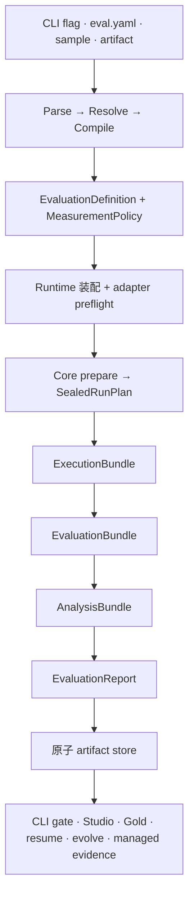

# 工作原理

OMK 的评测只有一份事实源：宿主把本机输入编译成宿主无关的测量契约，Evaluation Core 封存并执行契约，CLI 与 Studio 的所有视图都从经过校验的 Core 产物投影得到。

## 关键边界

- **宿主持有 effect。** 文件发现、Git materialization、凭证、环境读取、进度文案、报告目录、Studio 与浏览器打开都留在 Core 之外；
- **Core 持有测量语义。** Dataset projection、Target 行为、evaluator instrument、metric、sampling unit、comparison family、analysis parameter、缺失证据 policy、预算与 Decision policy 都会在第一次 Target 调用前封存；
- **Runtime identity 是证据。** Provider、model、effort、tool、sandbox、protocol、skill isolation 与 fingerprint assurance 都必须显式表达。Adapter 无法满足声明的 capability 时，会在测量前失败，不能静默丢弃能力；
- **Gold 严格隔离。** Executor 只看到 execution input；evaluator 只收到已声明的 evaluation projection；Gold 仅属于 analysis，不能泄漏到生成或评分；
- **事件只负责观测。** 进度 consumer 过慢、缺失或失败，都不能改变权威 Bundle 或最终 Report；
- **持久化不可变。** 每个 run 会把 Run Plan、Execution／Evaluation／Analysis Bundle 与 Evaluation Report 作为一组 digest-linked 产物原子发布。损坏或 lineage 断裂必须显式失败；
- **Studio 只是 projection。** UI 卡片与页面可以从 Core 产物重建，绝不成为第二套测量模型。

## 评分与发布决定

Assertion 与 rubric 评委保持为不同 evaluator instrument。Analysis 会推导 assertion layer、judge replicate／ensemble、dimension、composite、Bootstrap comparison family 与 agreement table，但不会压平它们的身份。

Missing、invalid、failed、unavailable 与 not-started observation 都不是零分。Coverage 会沿整张图保持显式。`omk.release-decision/v1` 必须先确认 evidence 完整且 Analysis binding 精确，才能返回 `PROGRESS`、`CAUTIOUS`、`REGRESSION`、`NOISE`、`UNDERPOWERED` 或 `SOLO`。展示分数或点估计不能替代已注册 Decision。

成本、usage、duration、运行状态、证据状态、结论状态与 lineage 都是正交事实，不是额外评分维度。独立的 `--repeat` run 会组成 Evaluation Series；单次 run 不能推断跨 run 稳定性。

详见[综合分](../specs/scoring.md)与[统计严谨性](statistical-rigor.md)。

## 观测链路：source-neutral Trace IR

`omk observe` 不把 Codex、Claude Code 或 OpenClaw 的日志互相伪装成对方格式。每个来源先由独立 adapter 转换为同一套 Trace IR，再进入归因、分段和指标计算：

Trace IR 显式区分 `message`、`tool_call`、`tool_result`、`usage`、`lifecycle` 与 `unknown` event。用户消息还会标注 `human`、`runtime`、`skill-context` 或 `synthetic` 来源，避免把注入指令、环境上下文和工具结果计入真人轮次。工具调用保留 provider namespace，结果统一为 `success`、`failure`、`cancelled` 与 `unknown`；无法确定时必须保持 unknown。

不同 identifier 各司其职：`rootRunId` 聚合任务树，`runId` 标识具体任务，`traceId` 标识 evidence stream，segment 再生成独立 sample ID。每次加载还会保存 ingestion summary，确保损坏、未识别、被过滤或不完整的 source data 不能冒充完整 observation coverage。
