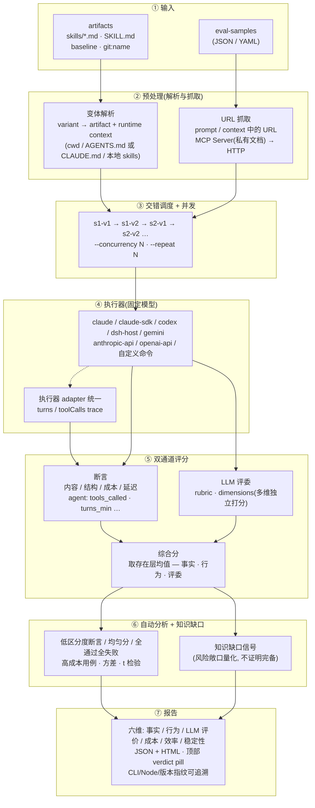
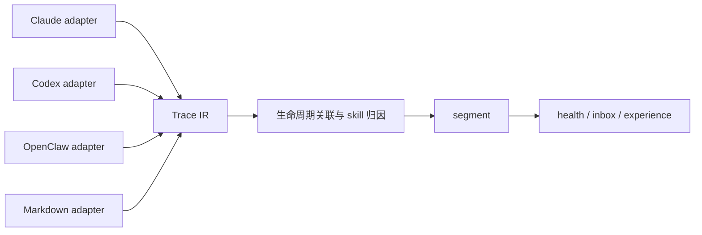

# 工作原理

核心思路：**固定模型 + 固定用例，只变 artifact 和 runtime context**，通过交错调度消除时间漂移，用断言 + LLM 评委双通道评分，再叠加知识缺口信号量化风险敞口。

**关键设计：**

- **交错调度**消除时间漂移：同一用例的不同 variant 交替发出，而非 v1 全跑完再跑 v2，避免模型负载/网络波动被错误归因给 artifact。
- **variant = artifact + runtime context**：`cwd`（用 `--control-cwd`/`--treatment-cwd` 或 eval.yaml 的 `cwd:` 字段声明，与 artifact 表达式分开）让对照组可以显式声明「项目目录」这个隐性输入，把「项目级沉淀」和「显式 artifact 注入」拆开测。
- **双通道评分互补**：断言抓确定性缺陷（必须调用某工具/必须包含某字段），LLM 评委抓主观质量（可读性/完整性）。综合分取事实 / 行为 / 评委三层里实际存在那几层的均值。
- **知识缺口信号**不是评分的一部分，而是一个独立追踪项：它告诉你「这次评测覆盖了多少风险敞口」，用于追踪收敛，而非断言知识「完备」。
- **DSH 宿主模式**由现有 DSH plugin tree 持有模型、凭证、工具与 sandbox；OMK 只创建隔离的测量 session、注入 variant 并消费 session event。`dsh-host` 是报告中的内部执行器身份，不是用户要在 `omk eval --executor` 中选择的 CLI 名称。

## 观测链路：source-neutral Trace IR

`omk observe` 不把 Codex、Claude Code 或 OpenClaw 的日志互相伪装成对方格式。每个来源先由独立 adapter 转换为同一套 Trace IR，再进入归因、分段和指标计算：

Trace IR 显式区分 `message`、`tool_call`、`tool_result`、`usage`、`lifecycle` 和 `unknown` 事件。用户消息还会标注 `human`、`runtime`、`skill-context` 或 `synthetic` 来源，避免把注入的 `AGENTS.md`、环境上下文和工具结果计入真人轮次。工具调用保留 provider namespace，调用结果统一为 `success`、`failure`、`cancelled`、`unknown` 四态。runtime 状态具有最高优先级；来源没有状态时，adapter 只能依据退出码等来源特有的明确终态证据推断 `success` 或 `failure`，无法确定的结果仍保持 `unknown`。失败率以可比较结果(`success + failure`)为分母；结果覆盖率则单独统计所有已解析状态(`success + failure + cancelled`)。

标识符也分层使用：`rootRunId` 聚合主任务及子任务，`runId` 标识具体线程，`traceId` 标识证据流，segment 再生成独立 sample ID。聚合标识不再兼任样本主键，因此主任务和子任务不会互相覆盖。

每次加载还会生成摄取摘要：源记录数、成功解析的对象记录数、格式损坏记录数、被忽略的非对象值、未识别 IR 事件数，以及按规则过滤的运行时会话数。健康报告和 inbox 会持久化这组数据；输入不完整时必须显式提示，不能把部分 trace 静默展示成完整观测。

跨任务树的规范顺序由时间线事件 ID 表达。`messageIndex` 只是单个物理 trace 内的来源定位信息，因此 session scope 按 `traceId` 分别保存 record 范围，不会把 main 与 subagent 文件中的局部序号当成同一套全局坐标。

## 六维评估指标

评测报告从六个维度独立展示结果。其中评分三层（事实 / 行为 / LLM 评价）分开展示，让你看到**是哪一层拉胯**，而不是只看到一个合成分：

| 维度 | 指标 | 说明 |
|------|------|------|
| 📋 **事实** | 事实类断言通过率 | `contains` / `json_schema` / `fact_check` 等规则可验证断言的 1-5 分映射 |
| 🛠️ **行为** | 行为类断言通过率 | `tools_called` / `tool_output_contains` / `turns_max` 等执行合规类断言 |
| 💬 **LLM 评价** | rubric 评分 | 由评委模型按预先写好的评分规则（rubric）打的 1-5 分，主观但能抓规则断言之外的「整体好不好」 |
| 💰 **成本** | 总成本、输入/输出 Token 数 | 基于 Token 消耗和模型定价的 API 费用 |
| ⚡ **效率** | 平均延迟 (ms) | 从发送请求到收到完整响应的端到端耗时 |
| 🛡️ **稳定性** | CV（变异系数） | 跨重复运行（`--repeat ≥ 2`）分数一致性；单轮评测显示 `—`，**诚实交代测不到什么** |
