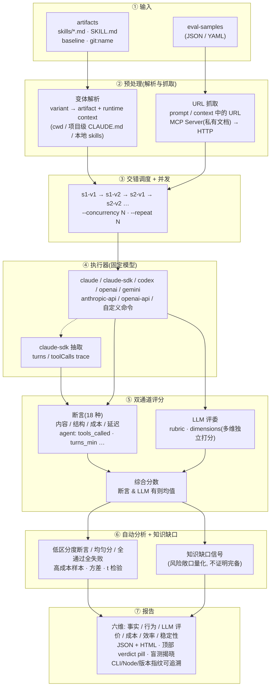

# 工作原理

核心思路：**固定模型 + 固定样本，只变 artifact 和 runtime context**，通过交错调度消除时间漂移，用断言 + LLM 评委双通道评分，再叠加知识缺口信号量化风险敞口。

**关键设计：**

- **交错调度**消除时间漂移：同一样本的不同 variant 交替发出，而非 v1 全跑完再跑 v2，避免模型负载/网络波动被错误归因给 artifact。
- **variant = artifact + runtime context**：`cwd`（用 `--control-cwd`/`--treatment-cwd` 或 eval.yaml 的 `cwd:` 字段声明，与 artifact 表达式分开）让对照组可以显式声明「项目目录」这个隐性输入，把「项目级沉淀」和「显式 artifact 注入」拆开测。
- **双通道评分互补**：断言抓确定性缺陷（必须调用某工具/必须包含某字段），LLM 评委抓主观质量（可读性/完整性），两者都存在时取均值。
- **知识缺口信号**不是评分的一部分，而是一个独立追踪项：它告诉你「这次评测覆盖了多少风险敞口」，用于追踪收敛，而非断言知识「完备」。

## 六维评估指标

评测报告从六个维度独立展示结果。其中评分三层（事实 / 行为 / LLM 评价）分开展示，让你看到**是哪一层拉胯**，而不是只看到一个合成分：

| 维度 | 指标 | 说明 |
|------|------|------|
| 📋 **事实** | 事实类断言通过率 | `contains` / `json_schema` / `fact_check` 等规则可验证断言的 1-5 分映射 |
| 🛠️ **行为** | 行为类断言通过率 | `tools_called` / `tool_output_contains` / `turns_max` 等执行合规类断言 |
| 💬 **LLM 评价** | rubric 评分 | 由评委模型按预先写好的评分规则（rubric）打的 1-5 分，主观但能抓规则断言之外的「整体好不好」 |
| 💰 **成本** | 总成本、输入/输出 Token 数 | 基于 Token 消耗和模型定价的 API 费用 |
| ⚡ **效率** | 平均延迟 (ms) | 从发送请求到收到完整响应的端到端耗时 |
| 🛡️ **稳定性** | CV（变异系数） | 跨重复运行（`--repeat ≥ 2`）分数一致性；单轮评测显示 `—`，**诚实交代测不到什么** |
