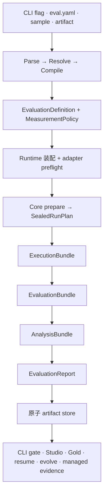

# 工作原理

OMK 的评测只有一份事实源：宿主把本机输入编译成宿主无关的测量契约，Evaluation Core 封存并执行契约，CLI 与 Studio 的所有视图都从经过校验的 Core 产物投影得到。



## 关键边界

- **宿主持有 effect。** 文件发现、Git materialization、凭证、环境读取、进度文案、报告目录、Studio 与浏览器打开都留在 Core 之外；
- **Core 持有测量语义。** Dataset projection、Target 行为、evaluator instrument、metric、sampling unit、comparison family、analysis parameter、缺失证据 policy、预算与 Decision policy 都会在第一次 Target 调用前封存；
- **Runtime identity 是证据。** Provider、model、effort、tool、sandbox、protocol、skill isolation 与 fingerprint assurance 都必须显式表达。Adapter 无法满足声明的 capability 时，会在测量前失败，不能静默丢弃能力；
- **Gold 严格隔离。** Executor 只看到 execution input；evaluator 只收到已声明的 evaluation projection；Gold 仅属于 analysis，不能泄漏到生成或评分；
- **事件只负责观测。** 进度 consumer 过慢、缺失或失败，都不能改变权威 Bundle 或最终 Report；
- **持久化不可变。** 每个 run 会把 Run Plan、Execution／Evaluation／Analysis Bundle 与 Evaluation Report 作为一组 digest-linked 产物原子发布。损坏或 lineage 断裂必须显式失败；
- **Studio 只是 projection。** UI 卡片与页面可以从 Core 产物重建，绝不成为第二套测量模型。

## 源码依赖模型

`src` 的目录表达领域所有权，不机械套用一组全仓分层。维护时需要区分三类依赖：

- **运行时实现边**必须保持无环。领域实现只能依赖它所消费的事实或更低层能力，不能借 facade、动态 import 或工具函数形成反向依赖。依赖图会保留指向 `contracts` 的 value import；已审计环按完整领域集合与环内边拓扑登记，新增任何返回路径都会使登记失效。TypeScript 与可执行 JavaScript 源码中的非字面量 dynamic import 也默认拒绝，必须按 importer、表达式与 canonical source digest 显式登记；
- **contracts 边**允许跨领域共享稳定数据形状。双向领域关系只有经过审计并登记的回边才成立，架构测试会同时拒绝新增双向关系和失效登记；
- **composition edge**由 `cli`、`dsh-plugin` 与 `eval-hosts` 等交付／宿主入口拥有。它们可以装配领域与 effect，领域实现不得反向 import delivery composition。

`shared` 是跨领域叶子，只依赖自身。`eval-core` 是宿主无关的测量内核。`eval-runtime` 是轻量服务宿主接入层：canonical façade 将普通 `evaluate()` 输入编译为既有 Core contract，foundation 则装配显式 port 与 Core 内建能力；两者都不持有产品 workflow 或基础设施。文件系统、目录、持久化、provider Runtime 与 UI 都在 Core 外由宿主装配。

```text
eval-core ← eval-runtime ← eval-workflows ← CLI / DSH
                ↑               ↑
        executors / FaaS   OMK 产品 workflow
```

箭头从 consumer 指向 dependency。`eval-runtime` 可以依赖 Core 与 type-only Executor contract，但不得导入 `eval-workflows`、provider implementation 或 delivery surface。`eval-workflows` 只复用 Runtime foundation 叶子模块，不导入 canonical 用户 façade，也不维护第二份生命周期实现。

知识载体生命周期能力归入同一个所有权边界：

```text
knowledge-artifacts/
├── contracts.ts  # artifact 身份与实验角色
├── skills/       # skill frontmatter、硬规则与 workflow 定义
├── doctor/       # 静态与模型辅助的 artifact 健康检查
├── authoring/    # sample 生成与受控 skill 演进
├── governance/   # 安装记录、证据门禁、promote 与 rollback 状态
└── sources/      # 规范化来源指纹与可分发目录身份
```

Governance 只消费经过认证的评测与观测证据，不重新计算 Core 分数或决定。各能力仍保持独立
子域，共享生命周期所有者不等于把 `knowledge-artifacts` 变成通用工具层。

评测输入、evaluator instrument 与 Gold 校准共享 workflow 边界；带副作用的 Runtime 就绪检查归 executors 所有：

```text
eval-workflows/
├── analysis/           # workflow 所有的可复用统计原语
├── artifact-store/     # Core artifact 持久化、发现与 overlay
├── assertions/         # authored assertion 适配与评分层
├── gold/               # human-gold 数据集、校准与 CLI 支持
├── input-compilation/  # 宿主输入 → 宿主无关测量定义
├── inputs/             # 配置、sample、知识载体来源解析与 schema
├── instruments/        # evaluator 配置与冻结 prompt 资产
├── projections/        # 基于认证 Core 产物的下游视图
├── resume-admission/   # 持久化 run 完整性与 resume 准入
├── measurement/        # 产品评分、analysis node 与 evaluator 实现
└── orchestration/      # 产品编排、持久化与注入的 Runtime 消费

executors/
├── contracts/          # executor 端口、Runtime 身份、结果与 trace 事实
├── preflight/          # 宿主工具、文件、环境变量与自定义命令就绪检查
└── <provider>/         # provider 专属 Runtime 实现
```

产品编排位于 `eval-workflows/orchestration`，通过注入的 Runtime 执行评测并持久化结果。`createProductionEvaluationWorkflow` 表达这一职责；具体 provider 选择和资源装配由交付入口或共用宿主模块负责。本次内部重命名不新增包导出或兼容转发模块。


`eval-workflows/instruments` 与 `eval-workflows/gold` 不拥有测量含义；它们把评委执行与 Gold 校准
适配到 Core 所拥有的 instrument 和 analysis contract。类似地，`executors/preflight` 产出环境就绪事实，
`eval-hosts/runtime-adapter/preflight.ts` 则依据 binding 声明决定 workflow 是否准入。
这些子域即使在物理目录上聚合，仍作为独立节点参与依赖图检查。

`eval-workflows` 消费显式注入的 `EvaluationRuntimeProvider`。产品编译通过
`EvaluationExecutionInput` 提供 Definition、Policy 与运行元数据；Workflow 不创建 Core engine、
provider adapter 或资源租约。单次执行和 Series 准备／执行归 Runtime。Workflow 可以并行编排
独立 Series member，调度、重试、超时、预算和测量契约仍由 Core 独占。

```text
eval-hosts/
├── node/                    # 共用 Node 解析、工厂注册与运行前检查
└── runtime-adapter/
    ├── adapters/            # 具体 provider 协议桥接
    ├── evaluators/          # 产品 evaluator 工厂接线
    └── resource-leases/     # 已验证的 Node snapshot 与宿主资源访问
```

宿主装配消费产品声明，再向 Workflow 注入 Runtime 能力。下层不得反向导入 `eval-hosts`，包括
纯类型导入。产品测量实现在 `eval-workflows/measurement`，通用执行与生命周期桥接留在 Runtime。
旧 Workflow Runtime 目录和转发包装已删除，不保留 0.x 兼容路径。Core／Runtime 的正确契约优先于
Workflow／CLI 既有行为；合理的缺失能力应在所属下层补齐，不建立产品执行旁路。

### 源码职责与装配消费者

源码目录按所有者划分；公开入口由 `package.json#exports` 决定，不要求每个目录都成为公开 API。
下表同时说明保留边界与待收敛的位置，后续结构调整仍须逐项验证，而不是把所有领域排成同一条流水线。

| 所有者 | 公开入口与实际消费者 | 归属与验证边界 |
|---|---|---|
| Core／Runtime | `eval-core`、包根及 `eval-runtime`；服务调用方与产品 Workflow | Core 约束执行和测量协议，Runtime 提供通用评分与接入；验证公开包、契约、调度和取消 |
| Workflow | `eval-samples`、`projections`；CLI、DSH、Studio、载体改进 | 产品声明、版本化评分／分析、编排与评测产物存储；验证编译、结果投影及发布判断 |
| Executors | 内部调用；宿主适配、评委、doctor、sample、evolve 与观测分析 | 复用调用协议与机制；不能整体当作旧评测路径删除；验证参数、环境、Trace、用量与错误 |
| Knowledge artifacts | 内部调用；CLI、Workflow、观测与治理 | 载体生命周期；跨生命周期的来源解析应核对是否仍错置在 Workflow，迁移前验证源身份和调用者 |
| Observability／Diagnosis | MCP、DSH、CLI 与 Studio 消费；诊断协议在观测存储边界解析 | 分开维护证据、信号与诊断；验证来源、覆盖范围和稳定协议 |
| Evidence | 各产品领域与交付入口 | 跨来源证据布局与关联；不替代 Workflow 的评测产物校验，不决定评分或发布 |
| CLI／DSH／MCP／Studio | `omk`、`dsh-plugin`、`mcp`／`omk-mcp`、`studio` | 入口协议、上下文、身份和展示策略各自拥有；验证真实命令、插件、服务与界面 |
| Shared | 内部叶子工具 | 不引入领域决策；验证文件原子性、锁与基础数据操作 |

宿主装配按真实消费者归属。CLI 的 provider 选择、环境分类、凭证解析与生产装配位于
`cli/lib/evaluation-composition.ts`；DSH 的 agent 上下文与评委调用在 `dsh-plugin/core-command.ts`。
DSH 不通过 CLI 模块获取共用能力。当前保留 `eval-hosts` 的依据是以下跨入口复用：

| 模块 | 实际消费者 | 契约、失败与资源边界 |
|---|---|---|
| `node/preflight.ts` | CLI 与 DSH | 显式接收编译结果、环境和项目根；延迟运行检查，失败按既有准入规则传播 |
| `node/node-cli-evaluation-resolver.ts` | CLI 与 DSH | 共用产品请求解析；虽保留请求协议命名，并非 CLI 入口策略 |
| `node/node-sample-content-resolver.ts`、`safe-http-content-resolver.ts` | 上述共用解析器 | 文件／网络内容解析与会话清理；验证来源限制、取消和内容身份 |
| `node/runtime-registry.ts`、`judge-provider-identity.ts` | CLI 与 DSH | 显式注册配置与评委身份；不在共用注册中替入口选择 provider 或读取凭证 |
| `runtime-adapter/assembly.ts`、`composition.ts`、`builtins.ts`、`preflight.ts` | CLI 与 DSH 经 Runtime provider 消费 | 绑定、注册、准入及运行资源接线；具体资源清理由宿主提供，生命周期由 Runtime 控制 |
| `runtime-adapter/adapters`、`evaluators`、`resource-leases` | 上述装配；DSH 复用资源接口 | provider 桥接、评分工厂接线与资源实现；不得反向依赖入口装配或通过聚合入口绕行 |

服务直接调用 `evaluate()` 时使用 Runtime／Core；CLI 与 DSH 使用编译、宿主装配和注入的
Runtime；生成、修复及辅助分析可以直接使用 `ExecutorFn`；观测事实经诊断与领域投影进入
Studio。这些路径用途不同，共用机制须按契约提取。用户 façade 的事件消费与产品运行租约也不能
仅因都调用 Core 就认定为重复调度。

结构调整优先处理入口归属与内部依赖，再按 provider 对照收敛调用机制、拆分 Runtime 大入口、
复核来源解析。测试需跟随实际所有者迁移。当前保留共用宿主不意味着其目录名和内部布局不可改；
也不意味着所有 I/O 都要移到宿主。历史 Schema／instrument 版本与 npm 0.x 兼容是不同问题，
应依据公开引用与证据读取需求决定保留或迁移。知识内容领域仍为设计稿，不以本轮整理补占位实现。

Evidence 持久化与跨来源关联属于同一个不做决策的边界：

```text
evidence/
├── storage/  # 规范布局、命名、bundle、发现与完整性检查
└── graph/    # doctor、eval 与 observe evidence 关联
```

Evidence 只保存、验证、定位和关联事实，不评分、不派生诊断，也不决定知识生命周期动作。
公开 package 入口位于所属领域的自然 `index.ts` 或语义文件，`package.json#exports` 是唯一公开清单。
内部生产模块直接依赖具体领域文件，不经这些 package barrel 跨域。

Diagnosis 与 Observability 是一个显式建模的边界：Observability 产生 trace、inbox 与 experience 事实，只能读取 `diagnosis/contracts` 的稳定类型／解析器；`diagnosis/observe-producer.ts` 作为下游 producer 消费这些 Observability 事实并派生 Diagnosis。双方都不能访问除此以外的私有实现。

## Observability 子域

`src/observability` 根目录只保留稳定的 `experience.ts` facade，私有实现按垂直子域归属：

```text
observability/
├── contracts/
├── trace/           # source-neutral IR、来源分类、ingestion、adapter
├── inbox/           # 观测收件箱、复核与反馈投影
├── conversation/    # 对话目录、窗口与调试投影
├── experience/      # 体验事实、报告派生与文本信号
├── skill-health/    # Skill chain、健康检查与建议
├── soft-standards/
└── view-models/     # 稳定的呈现 facade
```

Trace 的 `message-classification.ts` 只判断消息来源与协议语义；Experience 的 `text-signals.ts` 才判断硬规则、进展与交付信号。因此 adapter 不会反向依赖其下游的体验投影。旧根路径不保留 re-export 或兼容 shim。

## 评分与发布决定

Assertion 与 rubric 评委保持为不同 evaluator instrument。Analysis 会推导 assertion layer、judge replicate／ensemble、dimension、composite、Bootstrap comparison family 与 agreement table，但不会压平它们的身份。

Missing、invalid、failed、unavailable 与 not-started observation 都不是零分。Coverage 会沿整张图保持显式。`omk.release-decision/v7` 必须先确认 evidence 完整、Analysis binding 精确、Bootstrap 的 Monte Carlo 不确定性已经消解，且实际效应的置信区间下界达到阈值，才能返回 `PROGRESS`、`CAUTIOUS`、`REGRESSION`、`NOISE`、`UNDERPOWERED` 或 `SOLO`；任一适用 rubric 维度已配置但无法测量跨评委一致性时，正向比较会被 gate 为 `CAUTIOUS`，样本量护栏则把实际观测的比较单元数与预注册的固定下限或先验规划比较。展示分数或点估计不能替代已注册 Decision。

成本、usage、duration、运行状态、证据状态、结论状态与 lineage 都是正交事实，不是额外评分维度。独立的 `--repeat` run 会组成 Evaluation Series；单次 run 不能推断跨 run 稳定性。

详见[综合分](../specs/scoring.md)与[统计严谨性](statistical-rigor.md)。

## 观测链路：source-neutral Trace IR

`omk observe` 不把 Codex、Claude Code 或 OpenClaw 的日志互相伪装成对方格式。每个来源先由独立 adapter 转换为同一套 Trace IR，再进入归因、分段和指标计算：


Trace IR 显式区分 `message`、`tool_call`、`tool_result`、`usage`、`lifecycle` 与 `unknown` event。用户消息还会标注 `human`、`runtime`、`skill-context` 或 `synthetic` 来源，避免把注入指令、环境上下文和工具结果计入真人轮次。工具调用保留 provider namespace，结果统一为 `success`、`failure`、`cancelled` 与 `unknown`；无法确定时必须保持 unknown。

不同 identifier 各司其职：`rootRunId` 聚合任务树，`runId` 标识具体任务，`traceId` 标识 evidence stream，segment 再生成独立 sample ID。每次加载还会保存 ingestion summary，确保损坏、未识别、被过滤或不完整的 source data 不能冒充完整 observation coverage。
