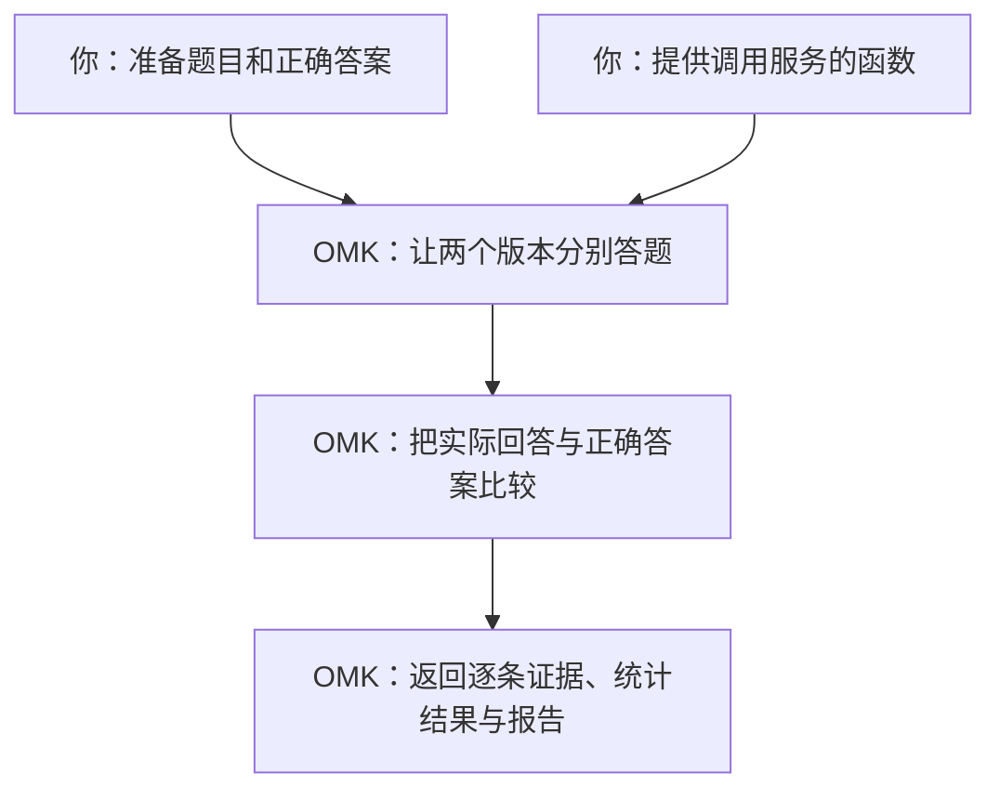
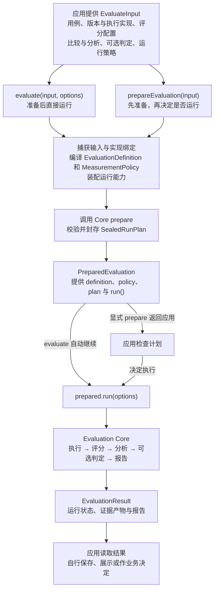

# 在代码里比较两个版本

**eval-runtime 是 OMK 给 Node.js 程序用的评测接口。** 你调用 `evaluate()`，它按你给的题目运行待测版本、给答案打分，再返回比较结果。调用你自己的问答服务、RAG 或 Agent 的代码由你提供。

下面只做一件事：比较一个问答服务的旧版和新版。先看一轮评测到底发生了什么，再运行同一个例子。

## 一轮评测是怎么回事

假设你希望服务只返回城市名。准备三道题，并事先写好正确答案：

| 题目 | 正确答案 | 旧版回答 | 新版回答 |
|---|---|---|---|
| 法国的首都是哪里？ | 巴黎 | 巴黎 ✓ | 巴黎 ✓ |
| 英国的首都是哪里？ | 伦敦 | 伦敦 ✓ | 伦敦 ✓ |
| 日本的首都是哪里？ | 东京 | 京都 ✗ | 东京 ✓ |

你准备前两列，服务运行后产生后两列。**正确答案只交给评分器，不发给待测服务。**

本例用最直接的评分规则：回答与正确答案完全相同就算答对。OMK 因此得到旧版答对 **2/3**、新版答对 **3/3**，新版高约 **33.3 个百分点**。最后还会检查差异是否有足够证据支持；只有三道题，仍不能确认新版稳定地更好。



两个名字到这里就能解释清楚：

| 代码中的名字 | 在这个例子里做什么 |
|---|---|
| `executor`（执行器） | 调用问答服务，拿到「巴黎」这样的实际回答。 |
| `evaluator`（评分器） | 检查实际回答是不是正确答案。 |

## 把这个例子跑起来

<a id="从哪里开始"></a>

需要 Node.js 22 或更高版本。在 OMK 源码仓库根目录运行：

```bash
yarn install --immutable
yarn build
node examples/eval-runtime/run.mjs
```

**这个例子用固定回答模拟上表中的两个版本，不调用模型，也不需要模型账号。** 它帮助你理解评测过程；真实服务的表现需要接入后重新测量。

命令输出一行 JSON。先看这三个字段：

| 字段和值 | 读成人话 |
|---|---|
| `runStatus: "completed"` | 这一轮执行完成了。 |
| `estimate: 0.3333333333333333` | 新版正确率减去旧版正确率，约为 33.3 个百分点。 |
| `verdict: "NOISE"` | 这次差异还不足以确认进步，也不等于两个版本效果相同。 |

`runStatus` 是示例为输出起的名字，对应返回对象里的 `result.status`。结果还带有报告 ID；报告数据由调用方保存，Runtime 不会自动打开 Studio。

<details>
<summary>展开完整可运行代码</summary>

这就是刚才运行的 [run.mjs](https://github.com/lizhiyao/oh-my-knowledge/blob/main/examples/eval-runtime/run.mjs)，无需拼接下面的讲解片段。

<<< @/../examples/eval-runtime/run.mjs{js}

</details>

## 代码里哪些地方对应这轮评测

打开 `examples/eval-runtime/run.mjs`，先找下面三个位置。这里的片段只用于对照完整文件。

**① 题目与正确答案：`dataset.samples`。** 一条记录就是一道题。

```js
{
  sampleId: 'three',
  input: { prompt: '日本的首都是哪里？' },
  expected: '东京',
}
```

**② 待测版本：`variants`。** 本例有 `baseline`（旧版）和 `candidate`（新版）。它们都用同一个 `executor`，用 `config.deployment` 选择版本。演示中的函数只是查固定回答表：

```js
output: answers[config.deployment][input.prompt]
```

OMK 会把每道题分别交给这两个版本，所以三道题一共调用这个函数六次。

**③ 评分与汇总：传给 `evaluate()` 的配置。** 这些配置各管一件事：

| 配置 | 本例表达的意思 |
|---|---|
| `evaluators` | 用 `exact-match` 检查答案是否完全相同。 |
| `comparisons` | 把 `baseline` 当对照，比较 `candidate` 的正确率。 |
| `analyses` | 计算正确率之差及其置信区间。 |
| `decision` | 根据这项分析给出 `NOISE` 等结论；可以不配置。 |

先做一个小实验：把 `answers.candidate` 中日本的答案从 `东京` 改成 `京都`，再次运行。两个版本现在都只答对两道题，`estimate` 应变成 **0**。这能帮你确认：分数来自实际返回的答案。

## 换成自己的服务时，改什么

继续使用这个文件，先替换题目和标准答案，再把 `executor.execute()` 中查表的那一行换成真正的服务调用。调用完成后返回 `{ output, usage }`：`output` 是实际回答，`usage` 是真实用量；不要沿用演示的模拟 token 数字。

若你要比较两个 **prompt**，还要让调用代码把 `artifact.content` 当作实际 prompt 使用。固定模型、工具和其他条件，只改变两个版本的 prompt。本例的查表函数没有使用 prompt 内容，所以改它的 `artifact.content` 不会改变分数。

接入时还有三件事需要与真实服务一致：

- **数据格式：** 用执行器的 `schemas` 声明输入、配置和输出的格式；修改数据后一起修改声明。
- **运行能力：** 随机模型不能照抄示例的 `deterministic`。没有模型种子控制时，声明 `stochastic`、`seedControl: 'unsupported'`，并将 `experiment.sampling` 改为 `{ samplingKind: 'paired', seedCoupling: 'uncontrolled' }`。声明支持取消，就要把 `signal` 传给真实调用。
- **凭证与失败：** 客户端和密钥放在调用函数的闭包里，不放进会被记录的 `config` 或 `runtimeContext`。调用失败应抛错或返回稳定的 `errorCode`，不要编造一个答案继续打分。

完整的模型接入写法在本页下方的[「完全匹配与模型接入代码」](#exact-match-评测)中。它使用你自己的模型客户端；部署前按服务容量设置[并发、超时和预算](#生产策略)。在独立项目安装 `npm install oh-my-knowledge@next zod`，并使用与已安装版本匹配的示例；尚未发布的能力先用源码运行。

<a id="read-results"></a>
<a id="如何解读结果"></a>

接入真实服务后，先检查 `result.status` 和有效样本覆盖，再看差值与区间。调用失败、缺少证据不能当成零分。用有代表性的题目与独立验证集测量，才能进一步判断改动有没有帮助。

## 需要其他能力时，在这里展开

到这里已经走完了一次评测。下面是同一接口的可选配置，不需要全部读完才能使用。配置代码中的 `input`、`variants` 沿用「完全匹配与模型接入代码」中的定义，客户端和存储由你的应用提供。

### 评分方法

<a id="评测术语"></a>
<a id="读懂代码中的几个名字"></a>

<details>
<summary>读懂代码中的几个名字</summary>

可以把一次评测理解为：准备题目 → 分别运行待比较版本 → 按规则评分 → 汇总差异。代码中的字段对应这些工作：

| 字段／术语 | 你要提供或得到的内容 |
|---|---|
| `artifact`（知识载体） | 被修改的 prompt、skill、agent、workflow 或空白基线。 |
| `variant`（待测版本） | 知识载体加上运行它所需的配置，例如「旧 prompt」和「新 prompt」。 |
| `dataset`／`sample`（数据集／用例） | 一组测试输入；`expected` 保存标准答案，供评分使用。 |
| `executor`（执行器） | 你编写的调用代码，接收输入并返回实际输出。 |
| `evaluator`（评分器） | 判断输出的规则，例如完全匹配、检索指标或 LLM 评委。 |
| `metric`（指标） | 一个读数的名字和含义，例如 `correct` 表示是否完全匹配。 |
| `comparison`（比较关系） | 哪个是对照版本（`control`），哪个是候选版本（`treatment`），比较哪些指标。 |
| `experiment`（实验设计） | 用例如何分配、重复运行几次、使用什么测量种子。 |
| `analysis`（统计分析） | 如何将逐条读数汇总为均值、差值或置信区间。 |
| `decision`（可选结论规则） | 根据指定分析给出结论；声明评分器本身不会自动产生发布结论。 |
| `policy`（运行限制） | 并发、超时、重试、预算和证据保留方式。 |
| `result`（结果） | 运行状态、逐条证据、统计分析、可选结论与报告。 |

执行器负责「运行」，评分器负责「评分」，分析负责「汇总」。后文的宿主指你的 Node.js 应用；Core 指 OMK 的测量引擎；封存指在执行前固定配置，以免运行中改变评分口径。`trial` 是一次计划执行，`attempt` 是其中的一次尝试，失败重试会增加尝试次数。

</details>

<a id="exact-match-评测"></a>
<a id="判断输出是否与标准答案完全一致exact-match"></a>

<details>
<summary>完全匹配与模型接入代码</summary>

当任务要求返回固定答案、分类标签或结构化数据时，可以使用「完全匹配」评分器（`exact-match`）。你为每条样本提供标准答案 `expected`，OMK 将执行器返回的 `output` 与它比较：一致记为 `true`，不一致记为 `false`，默认指标名为 `correct`。这项比较不需要调用 LLM 评委。

例如，标准答案是字符串 `"巴黎"` 时：

| 实际输出 | 是否匹配 | 原因 |
|---|---|---|
| `"巴黎"` | 是 | 与标准答案完全一致。 |
| `"法国的首都是巴黎"` | 否 | 意思正确，但输出内容不同。 |
| `"巴黎。"` | 否 | 多了句号。 |
| `" 巴黎 "` | 否 | 多了前后空格，评分器不会自动去除。 |

它适合要求精确输出的任务，例如返回 `"退款"` 或 `"咨询"` 的分类任务。允许多种正确表述的开放问答，应考虑 [Rubric 评委](#rubric-评委评测)，按明确的评分标准判断答案；需要自行去除空格、忽略大小写或提取字段后再比较时，可使用 [自定义评分器](#custom-evaluator)。

对于 JSON 输出，OMK 比较规范化后的 JSON 值：对象字段顺序不影响结果，数组元素顺序、值的类型和字符串内容仍须一致。例如，`{"a":1,"b":2}` 与 `{"b":2,"a":1}` 匹配，数字 `4` 与字符串 `"4"` 不匹配。字符串形式的 JSON 不会自动解析成对象。

下面演示如何接入模型服务、提供标准答案，并比较两个 prompt 版本的完全匹配率。`modelGateway` 和 `reportStore` 代表你自己的模型调用与报告存储代码，需要替换为实际实现。

安装 OMK 和一个运行时 schema 库。Schema 只需提供 `parse(unknown)` 方法；下面使用 Zod：

```bash
npm install oh-my-knowledge@next zod
```

### 1．接入自己的服务

执行器声明输入、配置和输出的格式，并在 `execute()` 中调用你的服务。`capabilities` 必须描述服务的真实能力；例如随机模型不能声明为确定性服务，声明支持取消时必须将 `signal` 传给实际调用。版本和 `fingerprintFacets` 用来识别实际实现，示例占位值需要替换。

```ts
import { z } from 'zod';
import { evaluate, type EvaluateInput, type Executor, type Variant } from 'oh-my-knowledge';

type Input = { prompt: string };
type Config = { deployment: string };

const executor: Executor<Input, Config, string> = {
    executorId: 'acme.answer-service/v1',
    version: '1.4.0',
    schemas: {
      input: z.object({ prompt: z.string() }).strict(),
      config: z.object({ deployment: z.string() }).strict(),
      output: z.string(),
    },
    outputClassification: 'sensitive',
    capabilities: {
      determinism: 'stochastic',
      cancellation: 'cooperative',
      concurrency: { safety: 'parallel-safe', maxInFlight: 16 },
      seedControl: 'unsupported',
      telemetry: { trace: 'unsupported', usage: 'required' },
    },
    fingerprintFacets: { deploymentRevision: 'sha256:...' },
    async execute({ input, artifact, config, runtimeContext, signal }) {
      const response = await modelGateway.generate({
        deployment: config.deployment,
        prompt: `${artifact.content ?? ''}\n${input.prompt}`,
        context: runtimeContext?.values,
        signal,
      });
      return { output: response.text, usage: response.usage };
    },
};
```

### 2．声明待比较的版本

下面只改变 prompt，两个版本使用同一模型部署和运行配置。这样才能将差异归因于 prompt；如果模型、知识库或工具也变了，需要把它们作为有意改变的条件说明。

```ts
const variants: Variant<Input, Config, string>[] = [{
  variantId: 'prompt-v1',
  artifact: {
    name: 'answer-prompt-v1',
    kind: 'prompt',
    source: 'inline',
    content: '简洁回答。',
  },
  execution: {
    executor,
    config: { deployment: 'deployment-a' },
    runtimeContext: { values: { tenant: 'evaluation' } },
  },
}, {
  variantId: 'prompt-v2',
  artifact: {
    name: 'answer-prompt-v2',
    kind: 'prompt',
    source: 'inline',
    content: '简洁、准确地回答。',
  },
  execution: {
    executor,
    config: { deployment: 'deployment-a' },
    runtimeContext: { values: { tenant: 'evaluation' } },
  },
}];
```

### 3．准备标准答案并运行

`input` 是发送给服务的内容，`expected` 是供评分使用的标准答案；不要将标准答案拼进待测 prompt。下面让两个版本回答相同的两道题（`paired`），再比较完全匹配率。两条用例只展示接线方式，真实结论需要有代表性、数量充分的评测数据。

示例服务不支持控制模型种子，因此显式设置 `seedCoupling: 'uncontrolled'`：同一条用例仍在两个版本上配对运行，但模型随机性不受控。`experiment.seed` 固定 OMK 的测量设计，不会让模型自动变成确定性服务；默认的共享种子配对不能用于这种执行器。

```ts
const input: EvaluateInput = {
  dataset: {
    datasetId: 'answer-regression',
    samples: [
      { sampleId: 'one', input: { prompt: '法国的首都是哪里？' }, expected: '巴黎' },
      { sampleId: 'two', input: { prompt: '2 + 2 等于几？' }, expected: '4' },
    ],
  },
  variants,
  evaluators: [{ evaluatorKind: 'exact-match' }],
  comparisons: [{
    comparisonId: 'prompt-v1-vs-v2',
    controlVariantId: 'prompt-v1',
    treatmentVariantIds: ['prompt-v2'],
    metricIds: ['correct'],
  }],
  analyses: [{
    analysisId: 'prompt-v1-vs-v2-correct',
    analysisKind: 'comparison-interval',
    statistic: 'mean-difference',
    comparisonId: 'prompt-v1-vs-v2',
    treatmentVariantId: 'prompt-v2',
    metricId: 'correct',
    confidence: { method: 'percentile-bootstrap', level: 0.95, resamples: 1_000 },
  }],
  decision: {
    decisionKind: 'analysis',
    analysisId: 'prompt-v1-vs-v2-correct',
  },
  experiment: {
    seed: 'release-2026-09-04',
    trials: 1,
    sampling: { samplingKind: 'paired', seedCoupling: 'uncontrolled' },
  },
  policy: {
    execution: { maxConcurrency: 4 },
    evaluation: { maxConcurrency: 4 },
  },
};
const result = await evaluate(input);

if (result.status === 'failed') throw new Error(result.error.code);
if (result.status !== 'completed') throw new Error(`评测未完成：${result.status}`);
await reportStore.put(result.report);
```

</details>

<a id="retrieval-评测"></a>
<a id="判断检索结果是否相关排序是否合理"></a>

<details>
<summary>判断检索结果是否相关、排序是否合理</summary>

检索评测回答的是「找到了多少相关文档、相关文档排得够不够靠前」，不会判断最终生成的回答质量。准备每道查询的已知相关文档 ID，再让检索执行器返回实际的有序 ID 列表。

下面的 `retrieverVariant` 需要由你按前面的接入方式定义：接收 `{ query: string }`，成功时返回 `{ output: { documents: ['refund-policy', 'other-doc'] } }`，并声明匹配的输出 schema。`/documents` 表示读取输出对象的 `documents` 字段；`/relevantDocumentIds` 表示读取 `expected` 中的同名字段。`cutoff: 10` 只检查前 10 个结果。使用 `solo` 时，执行器须为确定性执行或真实支持 OMK 传入的测量种子；能力要求详见 [API 参考](../reference/eval-runtime-api.md)。

```ts
import { evaluate, type RetrievalEvaluator } from 'oh-my-knowledge';

const retrieval: RetrievalEvaluator = {
  evaluatorKind: 'retrieval',
  evaluatorId: 'retrieval-quality',
  cutoff: 10,
  ranking: { source: 'output', pointer: '/documents' },
  relevantDocumentIdsPointer: '/relevantDocumentIds',
  metricIds: {
    recallAtK: 'recall-at-10',
    precisionAtK: 'precision-at-10',
    reciprocalRankAtK: 'reciprocal-rank-at-10',
    ndcgAtK: 'ndcg-at-10',
  },
};

const result = await evaluate({
  dataset: {
    datasetId: 'search-regression',
    samples: [{
      sampleId: 'refund-policy',
      input: { query: '退款规则是什么？' },
      expected: { relevantDocumentIds: ['refund-policy', 'billing-faq'] },
    }],
  },
  variants: [retrieverVariant],
  evaluators: [retrieval],
  comparisons: [],
  analyses: [{
    analysisId: 'mean-reciprocal-rank-at-10',
    analysisKind: 'summary',
    statistic: 'mean',
    variantId: retrieverVariant.variantId,
    metricId: 'reciprocal-rank-at-10',
  }],
  experiment: { seed: 'search-v1', sampling: { samplingKind: 'solo' } },
  policy: {},
});
```

| 指标 | 回答的问题 | 数值解读 |
|---|---|---|
| Recall@K（召回率） | 已知相关文档找全了多少？ | 前 K 条中命中的相关 ID 数除以已知相关 ID 总数。 |
| Precision@K（查准率） | 前 K 个位置有多少命中？ | 命中数除以 K；只返回 1 条正确结果，K 为 10 时仍是 `0.1`。 |
| Reciprocal Rank@K（倒数排名） | 第一条相关文档出现得够早吗？ | 第 1 名为 `1`，第 2 名为 `0.5`，前 K 条未命中为 `0`。多条用例的均值称为 MRR。 |
| nDCG@K（归一化折损累计增益） | 相关文档整体是否排在前面？ | 与理想排序比较，取值为 0～1，越高越好。 |

上例的汇总位于 `result.analysisResults['mean-reciprocal-rank-at-10']`，只请求了 MRR；需要其它指标的均值时，为其分别声明 `summary` 分析。没有任何相关文档的用例，应按下一节的弃答场景评测，不要用空标注冒充零分。

Ranking 必须是由不重复、非空字符串 ID 组成的有序数组，可来自 `output` 或 `trace`；relevant ID 始终来自 `expected`，不会传给 Executor。该预设先按 `cutoff` 截断，再以 `hits / known relevant` 计算 Recall、以 `hits / cutoff` 计算 Precision、以首个 relevant 文档的名次计算 Reciprocal Rank，并使用 binary gain 与 log2 discount 计算 nDCG。空返回 ranking 是合法的零分；重复或非法 ID、空 relevant 集合会产出 invalid evidence。Reciprocal Rank 的 mean summary 才是 MRR，不要把单个 sample 的观测称为 MRR。

</details>

<a id="retrieval-abstention"></a>
<a id="召回与空返回混合评测"></a>

<details>
<summary>召回与空返回混合评测</summary>

要同时回答「有方案时找得对吗」「没方案时能正确空返回吗」「是否推荐了明确不可用的方案」，从单文件 `examples/eval-runtime/retrieval-abstention.mjs` 开始。OMK 内置召回与弃答评分；文件中的数据准备和禁用 ID 检查是可修改的业务示例，不需要自己重写弃答评分器。

### 1．先跑通示例

使用 Node.js 22 或更高版本，在包含该示例的源码检出目录运行：

```bash
yarn install --immutable
yarn build
node examples/eval-runtime/retrieval-abstention.mjs
```

示例使用合成数据，不需要 API Key 或业务服务。独立项目只需复制这一个 `.mjs` 文件，安装包含 `AbstentionEvaluator` 的 OMK 版本及示例直接使用的 Zod：

```bash
npm install oh-my-knowledge@next zod
node retrieval-abstention.mjs
```

如果功能尚未随 npm 版本发布，先使用[主指南的源码运行方式](./eval-runtime.md)；复制新示例配合旧版安装包不会获得新增能力。

### 2．替换 `source` 数据

保持每个 `sampleId` 唯一。下面是一条已确认没有适用方案的样本：

```js
{
  sampleId: 'no-solution-001',
  input: { query: '这个问题没有适用的现有方案' },
  expected: {
    shouldAbstain: true,
    acceptableSolutionIds: [],
    forbiddenSolutionIds: ['solution-wrong'],
  },
  quality: { reviewStatus: 'reviewed' },
}
```

| 样本情况 | 填写方式 |
|---|---|
| 有适用方案 | `shouldAbstain: false`，`acceptableSolutionIds` 非空。 |
| 没有适用方案 | `shouldAbstain: true`，`acceptableSolutionIds: []`。 |
| 尚未确认答案 | `shouldAbstain: null`，或 `reviewStatus: 'pending_human_annotation'`；即使已有 AI 初始标签，也按待标注处理。 |
| 已知不可用方案 | 写入 `forbiddenSolutionIds`；为空时不参与禁用命中统计。 |

`prepareRecommendationDataset()` 默认遇到待标注就报错；演示代码显式使用 `pendingPolicy: 'exclude'`，运行结果的 `audit.excluded` 会列出排除对象和原因。正式评测可删除这个选项以恢复默认阻止行为，同时把 `sourceRevision` 改为真实数据版本。

`query` 是示例字段，不是 OMK 的固定要求。若业务数据使用 `input.prompt`，可以先映射成 `query`；也可同步修改示例的 `Row`、Executor input schema 和调用代码。期望答案、禁用标签和审核状态留在评测侧，不放入发给被测系统的 `input`。

### 3．替换 `executor.execute()`

在该函数中调用自己的检索服务，并把经过应用过滤后的**最终有序方案 ID 列表**映射为以下返回值：

| 执行结果 | 返回形式 |
|---|---|
| 成功推荐方案 | `return { output: { solutionIds: ['solution-a', 'solution-b'] } };` |
| 成功执行，但没有推荐方案 | `return { output: { solutionIds: [] } };` |
| 调用失败 | 抛出异常，或 `return { errorCode: 'recommendation-request-failed' };`；不能伪装成成功空返回。 |

向业务调用传递收到的 `signal`，并如实更新 Executor 的 `version`、`fingerprintFacets` 和 `capabilities`。示例的 `deterministic` 只描述合成检索器；当前 `solo` 配置要求被测系统确定性执行，或实际支持并消费 OMK 传入的 `seed`。无 seed 支持的随机服务不能通过照抄 `deterministic` 声明接入；需要选择支持无控随机性的测量设计，参见[公开采样契约](../reference/eval-runtime-api.md)。

按示例输出 `solutionIds` 时，`evaluators` 和 `analyses` 可直接使用。需要改为其它输出结构时，同步修改 output schema 和各评分器的绑定；JSON Pointer `/solutionIds` 表示读取输出对象的 `solutionIds` 字段。默认召回和禁用检查都取 top-3；调整范围时分别修改 retrieval 的 `cutoff`、`forbiddenIdEvaluator(3)` 的参数及相应指标名称。保留 `analyses` 中的 cohort 过滤，使各项失败覆盖数仍对应自己的适用样本群。

### 4．解读输出

原样运行示例，应排除 1 条待标注样本，并成功执行剩余 2 条。`metrics` 中的预期结果如下：

| 指标 | 含义 | 示例值／有效分母 |
|---|---|---|
| `recall-at-3` | 正向样本的已知正确方案召回比例，越高越好。 | `1`／`1` |
| `precision-at-3` | 前三项中正确方案数除以 3，越高越好。只返回 1 个正确方案仍为三分之一。 | `0.333…`／`1` |
| `rr-at-3`、`ndcg-at-3` | 首个正确方案的位置、排序质量，越高越好。`rr-at-3` 的均值即 MRR。 | 均为 `1`／`1` |
| `correct-abstention` | 应空返回样本的成功、合法响应中，空列表的比例，越高越好。 | `1`／`1` |
| `false-abstention` | 应返回方案样本的成功、合法响应中，空列表的比例，越低越好。 | `0`／`1` |
| `forbidden-hit` | 有禁用标注且响应成功、合法的样本中，前三项命中禁用 ID 的比例，越低越好。 | `0`／`2` |

每项先看 `status` 和 `coverage`：`planned` 是对应样本群的计划数，`included` 是实际参与计算的分母；`sourceUnavailable` 可能来自执行失败或缺失输出，`invalid` 表示非法证据。没有有效观测时 `value` 为 `null`，不是零分。再看 `executionCoverage` 的整体执行情况；有效响应上的百分之百不代表全部请求都成功。完整协议与限制见[内置弃答参考](../reference/eval-runtime-api.md#内置弃答与混合召回评测)。

</details>

<a id="工具轨迹评测"></a>
<a id="检查-agent-是否按要求调用工具"></a>

<details>
<summary>检查 Agent 是否按要求调用工具</summary>

例如，你希望 Agent 先搜索、再读取文档，可以检查它的工具调用记录（轨迹）。下面要求 `Search` 出现在 `Read` 之前，允许中间有其它调用。把 `trajectory` 加入 `evaluate()` 的 `evaluators`，把 `sample` 放入 `dataset.samples`。

执行器需要返回符合 `omk.source-neutral-trace/v2` 的 `trace`，不能直接传入某个模型厂商的原始日志；先由接入代码将日志转换为这个统一格式。只检查调用过程并不能证明工具成功或最终答案正确：

```ts
import { evaluate, type ToolTrajectoryEvaluator } from 'oh-my-knowledge';

const trajectory: ToolTrajectoryEvaluator = {
  evaluatorKind: 'tool-trajectory',
  evaluatorId: 'tool-trajectory',
  metricId: 'tool-trajectory-match',
  tracePointer: '',
  expectedToolNamesPointer: '/expectedToolNames',
  match: 'contains-in-order',
};

const sample = {
  sampleId: 'research-policy',
  input: { request: '检索并总结这项规则。' },
  expected: { expectedToolNames: ['Search', 'Read'] },
};
```

模式名直接描述 actual trajectory 与 expected trajectory 的关系：`exact-order` 要求序列完全相同；`same-tools` 忽略顺序；`contains-in-order` 允许额外调用，但 expected 必须保持为 subsequence；`contains-any-order` 同时允许额外调用与任意顺序。所有模式都保留重复调用 multiplicity，并区分 source-neutral 工具名的大小写。Success、failure、cancelled 与 unknown 调用全部参与；工具执行结果属于另一项 construct。空 actual 轨迹合法；空 expected 只允许 exact 模式，用于断言“不应调用工具”。如果路径和最终结果都重要，可将这个 boolean Metric 与 final-output 或 Rubric 评委 evaluator 组合。

</details>

<a id="custom-evaluator"></a>
<a id="编写自己的评分规则custom-evaluator"></a>

<details>
<summary>编写自己的评分规则（Custom Evaluator）</summary>

业务规则无法由内置评分器表达时，使用 `CustomEvaluator`，每个评分器负责一个指标。例如检查禁用 ID、字段格式，或统计输出长度。

下面统计去除前后空格后的 JavaScript 字符串长度（UTF-16 码元数，部分 emoji 会占两个或更多码元），并汇总候选版本的平均值。示例声明越短越好，只用于展示规则接入，不能把长度当成整体回答质量。替换 `evaluate()` 回调、指标定义与输入 schema 即可实现自己的规则：

```ts
import { z } from 'zod';
import { evaluate, type CustomEvaluator } from 'oh-my-knowledge';

const outputLength = {
  evaluatorKind: 'custom',
  evaluatorId: 'output-length',
  instrumentId: 'output-length-v1',
  metric: {
    metricId: 'output-length-chars',
    valueType: 'numeric',
    unit: 'characters',
    direction: 'lower-is-better',
    missingPolicyId: 'exclude/v1',
  },
  bindings: [{ bindingId: 'actual', sourceKind: 'output', pointer: '' }],
  parameters: { trim: true },
  implementation: {
    implementationId: 'acme.output-length/v1',
    version: '1.0.0',
    schemas: {
      bindings: z.object({ actual: z.string() }).strict(),
      value: z.number().int().nonnegative(),
      fingerprintFacets: { bindings: 'actual-string/v1', value: 'nonnegative-integer/v1' },
    },
    fingerprintFacets: { sourceRevision: 'sha256:...' },
    evaluate({ bindings, parameters, signal }) {
      signal.throwIfAborted();
      const actual = parameters?.trim ? bindings.actual.trim() : bindings.actual;
      return { resultKind: 'score', value: actual.length };
    },
  },
} satisfies CustomEvaluator<{ actual: string }, { trim: boolean }>;

const result = await evaluate({
  dataset: input.dataset,
  variants,
  evaluators: [outputLength],
  comparisons: [{
    comparisonId: 'prompt-v1-vs-v2',
    controlVariantId: 'prompt-v1',
    treatmentVariantIds: ['prompt-v2'],
    metricIds: ['output-length-chars'],
  }],
  analyses: [{
    analysisId: 'candidate-output-length',
    analysisKind: 'summary',
    statistic: 'mean',
    variantId: 'prompt-v2',
    metricId: 'output-length-chars',
  }],
  experiment: { seed: 'length-release-42', sampling: { samplingKind: 'paired', seedCoupling: 'uncontrolled' } },
  policy: { evaluation: { timeoutMs: 5_000 } },
});
```

查看 `result.analysisResults['candidate-output-length']` 的状态、有效观测数和均值。这里只汇总 `prompt-v2`；要对比两个版本，应声明引用同一指标的比较分析。

Bindings 是最小权限 allowlist。只有 evaluator 确实需要 gold data 时才声明 `expected` 或 `evaluation-context`；callback 无法读取未声明的 sample 字段。JSON Pointer 会在投递前进一步收窄 source。`execution-facts` 是例外：它的 pointer 必须为空，让 callback 消费完整、已经脱敏的 canonical facts projection，避免产生第二套 projection identity。Binding 与 value schema 只能校验和收窄，不能 coercion、补默认值或删除字段。

Callback 可返回 `score`、`missing`、`invalid` 或 `failed`。Score 会作为 measurement data 直接持久化，不是带 classification 的 source content；text、category 与 ranking schema 必须把它约束在安全的测量词表内，绝不能回显 answer、trace、secret 或评委解释。这类支撑材料应放入显式声明 classification 的 `CustomEvaluatorContent` evidence。Invalid value 同样使用 `CustomEvaluatorContent`；普通异常会被脱敏。不要在 callback 内自行重试或实现超时：Core 会执行已封存的并发、超时、预算、取消、计量与失败策略。Callback 必须无状态、可安全并行且协作响应 `signal`；需要有状态资源时使用 advanced 生命周期 SPI。

OMK 不会根据 `Function#toString()` 推导 provenance，因此 identity 必须显式声明。当代码、依赖、schema 或 provider 配置改变测量行为时，必须更新 `version`、schema `fingerprintFacets` 或 implementation `fingerprintFacets`。单个 custom evaluator 不得产出多个 Metric，也不代表 ensemble member。Numeric 与 boolean Metric 必须声明单调 direction；只有调用方声明兼容的具名 summary 或 interval 后，它们才会成为 analysis result。Categorical、text 与 ranking Metric 在通过 advanced API 明确选择兼容 estimator 前只保留为 evaluation evidence。比较估计值保持原始 treatment-minus-control 差值。单 analysis progress Decision 只接受 `higher-is-better`；需要分别约束不同原始有符号 effect 时，应使用显式 comparison-family criterion。

</details>

<a id="rubric-评委评测"></a>
<a id="让-llm-按明确的评分标准评价答案"></a>

<details>
<summary>让 LLM 按明确的评分标准评价答案</summary>

Rubric 就是明确写出的评分标准。开放问答允许多种正确表述时，可以让 LLM 评委按标准给出 1～5 分，而不是逐字比较答案。你提供评分标准和模型调用，OMK 负责组织评分提示、解析结果和聚合读数。

下面使用一个评委模型，对每条实际输出评分两次，再取平均，并汇总候选版本的平均分。`internalGateway` 和 `judge-model` 需要替换为真实模型接入；评分会产生额外的模型调用。正式评测前应明确各分档的含义，并用人工标注样例校准标准。

```ts
const result = await evaluate({
  dataset: input.dataset,
  variants,
  evaluators: [{
    evaluatorKind: 'rubric-judge',
    evaluatorId: 'correctness-judge',
    metricId: 'correctness-score',
    rubric: {
      criterionId: 'correctness',
      prompt: '判断答案在事实层面是否正确。',
      rubric: '完全正确为 5 分，完全错误为 1 分。',
    },
    judges: [{
      memberId: 'primary',
      model: 'judge-model',
      effort: 'low',
      replicateCount: 2,
      judge: {
        judgeId: 'acme.model-gateway/v1',
        version: '2026.09.04',
        providerCost: { reporting: 'optional' },
        fingerprintFacets: { deploymentRevision: 'sha256:...' },
        async invoke(request) {
          const response = await internalGateway.generate({
            model: request.model,
            system: request.system,
            prompt: request.prompt,
            signal: request.signal,
          });
          return { invocationStatus: 'completed', output: response.text, usage: response.usage };
        },
      },
    }],
    aggregation: { method: 'mean', missing: 'require-complete' },
  }],
  comparisons: [{
    comparisonId: 'prompt-v1-vs-v2',
    controlVariantId: 'prompt-v1',
    treatmentVariantIds: ['prompt-v2'],
    metricIds: ['correctness-score'],
  }],
  analyses: [{
    analysisId: 'candidate-correctness',
    analysisKind: 'summary',
    statistic: 'mean',
    variantId: 'prompt-v2',
    metricId: 'correctness-score',
  }],
  experiment: { seed: 'rubric-release-42', sampling: { samplingKind: 'paired', seedCoupling: 'uncontrolled' } },
  policy: {},
});
```

查看 `result.analysisResults['candidate-correctness']` 的状态、有效观测数和均值。这里只汇总 `prompt-v2`；要对比两个版本，应声明引用同一指标的比较分析。

评委 callback 只执行一次 provider 调用，不得自行重试。`replicateCount` 只重复评测，不重复 Target 执行，也不增加 Bootstrap 样本量。存在多个成员时，`mean` 会在各成员的 replicate 先求均值后赋予成员等权；`weighted-mean` 要求为每个 `memberId` 显式提供正权重，且总和为 1。`require-complete` 会在任一计划坐标不可用时排除整个 Target × Sample × Trial panel 读数。Provider failure 会保留合法的计量事实，并移除 provider 私有原因与 usage details。只有当所有 Executor 都返回 `oh-my-knowledge/eval-runtime/contracts` 中的版本化 trace 契约时，才使用 `tracePolicy: 'source-neutral'`。

</details>

### 重复评测与结果复用

<a id="prepare-plan"></a>
<a id="先检查计划再决定是否运行"></a>

<details>
<summary>先检查计划，再决定是否运行</summary>

需要 dry-run 检查、预算复核或人工审批时，先完成准备：

```ts
const prepared = await prepareEvaluation(input);

console.log(prepared.definition, prepared.policy);
console.log(prepared.planDigest, prepared.resolvedRuntimes);
console.log(prepared.estimatedWork);

const result = await prepared.run({ runId: 'approved-release-42', signal });
```

准备阶段会解析 capability 并封存完整 Core Plan，不会调用 Target 或 Evaluator。`prepared.run()` 精确执行这份不可变 Plan；准备后修改原始 input，不会改变 Definition、Policy、digest 或执行行为。`estimatedWork` 给出 retry 或提前终止前计划的 execution／evaluation coordinate，并明确标出只有运行时才能确定的 duration 与 provider cost。直接调用 `evaluate(input, options)` 与 `prepareEvaluation(input).run(options)` 保持 canonical equivalence。

</details>

<a id="compare-runs"></a>
<a id="检查两次历史测量是否可比"></a>

<details>
<summary>检查两次历史测量是否可比</summary>

需要判断两次独立 Run 是否支持精确比较时，把两份原始 result 交给 `assessComparability()`，并将每个有意变化的 Variant 显式映射成 subject：

```ts
import { assessComparability } from 'oh-my-knowledge';

const assessment = assessComparability({
  comparisonScope: 'decision',
  subjects: [{
    subjectId: 'candidate-under-test',
    leftVariantId: 'candidate',
    rightVariantId: 'candidate',
  }],
  left: previousResult,
  right: candidateResult,
});

if (assessment.comparabilityStatus !== 'compatible') {
  console.error(assessment.designStatus, assessment.evidenceQualificationStatus);
}
```

该 Assessment 不会比较分数，也不会判断候选是否进步；它只检查声明 subject 变化后，测量设计是否保持不变，以及两条 source chain 是否具备足够的认证证据。必须保留原始 result object：clone 或反序列化 artifact 无法保留进程内 Core source authority，因此会失败关闭。跨进程读回历史结果时，先用 [在新进程里读回历史结果再复用](#restore-stored-results) 的 `loadEvaluationResult()` 重新取得 source authority，再交给 `assessComparability()`。

</details>

<a id="重复运行稳定性"></a>
<a id="重复整轮评测检查结果是否稳定"></a>

<details>
<summary>重复整轮评测，检查结果是否稳定</summary>

如果一次测量看起来有提升，但你担心换一轮运行就得到不同结论，可以让 OMK 重复执行整轮评测。Evaluation Series 固定数据、评分方式和测量种子，记录每轮指定统计量的均值与波动。下面的 `repeatableInput` 需要另行准备：沿用[接入示例](#exact-match-评测)中比较的分析 ID，但使用确定性服务，或真实支持种子控制的执行器，并声明受控的种子配对设计。该接入示例的 `uncontrolled` 配置不满足跨轮精确可比性要求，直接用于 Series 会得到 `inconclusive`，不能靠反复运行得到稳定性数值。

满足这些前提后，使用下面的代码重复运行并读取结果：

```ts
import { prepareEvaluationSeries } from 'oh-my-knowledge';

const preparedSeries = await prepareEvaluationSeries({
  evaluation: repeatableInput,
  seriesInstanceId: 'release-42-repeatability',
  repeatCount: 10,
  stability: {
    sourceAnalysisId: 'prompt-v1-vs-v2-correct',
    projection: 'interval-estimate',
  },
});

// 此时尚未调用 Target 或 Evaluator。
console.log(preparedSeries.memberPlans, preparedSeries.estimatedWork);

const series = await preparedSeries.run({ signal });
if (series.status === 'failed') throw new Error(series.error.code);
if (series.status === 'cancelled') throw new Error('Series 已取消。');
if (series.stability?.analysisStatus === 'completed') {
  console.log(series.stability.value.mean);
  console.log(series.stability.value.sampleStandardDeviation);
} else {
  console.error(series.stability);
}
```

必须在执行前声明完整 `repeatCount`。OMK 只捕获一次 Evaluation 声明，预注册全部 membership，并验证每个 member 的各阶段 plan digest 保持一致，同时为其分配唯一 Run contract。Member 按顺序执行，Execution／Evaluation cache 必须禁用。失败或取消的 member 会保留真实的 partial、failed、cancelled 或 missing coverage 状态，绝不会被替换；API 也不会根据已观察值提前停止。每个 member 独立使用自己的 Run budget。

Series 的实验单位是一轮完整 Run。Trial、retry、sample 与评委 replicate 仍嵌套在 Run 内，不会增加 `runCount`。测量 seed 与其它设计条件一起保持固定，因此支持 seed 的 Executor 会在各 member 收到相同 trial seed；有意改变 Run-level seed 需要另一种实验契约。稳定性表只提供描述性统计：mean、分母为 `n - 1` 的贝塞尔校正样本方差、标准差、最小值、最大值与极差；它不会发布 release verdict、估计 iid 置信区间，也不能证明跨环境复现性。全部预注册 slot 都必须符合 evidence 门槛并可比较，否则 stability 为 inconclusive，不会静默删除失败或缺失 Run。使用 `projection: 'scalar'` 选择 scalar Analysis result；需要提取区间点估计时，必须显式使用 `interval-estimate` projection。默认只接纳完整 evidence；只有对应 missingness policy 对目标结论合理时，才显式允许 partial evidence。

`PreparedEvaluationSeries` 只能使用一次，`seriesInstanceId` 标识本次有意执行。真正开始一轮新 Series 时应使用新的值。直接调用 `evaluateSeries(input, options)` 等价于准备后运行一次。

</details>

<a id="reuse-stages"></a>
<a id="改了标注或统计方法后复用已有输出"></a>

<details>
<summary>改了标注或统计方法后，复用已有输出</summary>

修正了标准答案、调整了评分规则或统计方式时，不一定需要再次调用模型。按变化发生的位置选择下面的函数，并传入上一次运行的原始 `result`：

| 改了什么 | 调用什么 | 哪些工作会重做 |
|---|---|---|
| 标准答案或评分规则 | `rescore()` | 评分及其后的分析、结论。 |
| 统计分析方式 | `reanalyze()` | 分析及结论。 |
| 结论规则 | `redecide()` | 只重做结论。 |

如果 prompt、实际输入或执行配置变了，应重新运行 `evaluate()`。如果希望 Target 调用先跑完并沉淀，之后再决定评分口径，用 `executeEvaluation()` 停在 Execution，再用 `scoreExecutedEvaluation()` 评分，见[拆分为先执行、后评分](#staged-execute-score)。下面的 `correctedGoldDataset` 等变量代表你更新后的完整声明：

```ts
import { reanalyze, redecide, rescore } from 'oh-my-knowledge';

const rescored = await rescore(
  { ...input, dataset: correctedGoldDataset },
  originalResult,
  { runId: 'corrected-gold' },
);
const reanalyzed = await reanalyze(
  { ...input, analyses: revisedAnalyses },
  rescored,
  { runId: 'revised-analysis' },
);
const redecided = await redecide(
  { ...input, analyses: revisedAnalyses, decision: revisedDecision },
  reanalyzed,
  { runId: 'revised-decision' },
);
```

`rescore()` 复用 Execution，`reanalyze()` 复用 Execution 与 Evaluation，`redecide()` 复用 Execution、Evaluation 与 Analysis。每次调用都接收一份完整的新声明，确保默认值与 identity 在后缀运行前封存。Core 会拒绝任何属于已跳过阶段的变化；只有当前进程中的原始 canonical result object 携带所需 source authority。Run options、进度事件与预算消耗只作用于新执行的后缀；复用 bundle 保留原始 identity 与历史 evidence，不会再次计费。跨进程复用持久化结果时，先用 `loadEvaluationResult()` 通过独立 verifier 重新取得 source authority，见[在新进程里读回历史结果再复用](#restore-stored-results)；report 或 JSON clone 绝不是充分证据。

</details>

<a id="staged-execute-score"></a>
<a id="拆分为先执行后评分"></a>

<details>
<summary>拆分为先执行、后评分</summary>

Target 调用最贵时，可以让它只跑一次，之后再决定评分口径。`executeEvaluation()` 只执行 Execution stage 并返回 `ExecutedEvaluation` 句柄；`scoreExecutedEvaluation()` 接收一份完整的新声明加上该句柄，在不再次调用 Target 的前提下执行 Evaluation、Analysis、Decision 与 Report：

```ts
import {
  executeEvaluation,
  saveExecutedEvaluation,
  loadExecutedEvaluation,
  scoreExecutedEvaluation,
} from 'oh-my-knowledge';

const executed = await executeEvaluation(input, {
  runId: 'release-42-execution',
  signal,
});
console.log(executed.runId, executed.bundle.records.length);

const first = await scoreExecutedEvaluation(
  { ...input, dataset: goldV1 },
  executed,
  { runId: 'release-42-gold-v1' },
);
const second = await scoreExecutedEvaluation(
  { ...input, dataset: goldV2, evaluators: revisedEvaluators },
  executed,
  { runId: 'release-42-gold-v2' },
);
```

句柄就是 Execution stage 的已认证 evidence：它的 `runId`、`executionPlanDigest` 与 `executionInputDigest`，以及 `ExecutionBundle` 本体。`bundleOrigin` 表明这批工作是在当前进程完成的（`runtime`），还是从存储重新接纳回来的（`store`）。要在后续进程里评分，先把 envelope 持久化，再由宿主 verifier 独立认证后重新接纳：

```ts
const reference = await saveExecutedEvaluation({ executed, store: hostContentStore });

const reloaded = await loadExecutedEvaluation({
  reference,
  resolver: hostContentResolver,
  verifier: {
    verifierId: 'acme.execution-authority/v1',
    async verify({ reference: candidate }) {
      const attestation = await executionRegistry.authenticate(candidate.digest);
      return {
        verifiedExecutedDigest: candidate.digest,
        attestationDigest: attestation.digest,
        verifiedProvenanceBundleDigests: attestation.provenanceBundleDigests,
        verifiedCacheRecordDigests: attestation.cacheRecordDigests,
      };
    },
  },
});
```

envelope 使用 media type `application/vnd.omk.executed-evaluation+json;version=1`（`EXECUTED_EVALUATION_MEDIA_TYPE`），并始终以 `classification: 'gold'` 写入，因为它保存的是绝不能作为 context 回流给 Target 的 Target evidence。存储由宿主负责，OMK 只固定 envelope 结构与 digest。

准入沿用与 `rescore()` 完全相同的 Core 规则，而且刻意收窄：新声明必须逐字节复现封存的 Execution stage，Gold、Evaluator、评委 rubric、Analysis 与 Decision 内容都可以变化。因此 prompt、执行输入或执行配置一旦变化，会在任何评分工作之前被拒绝；来自 `structuredClone()`、JSON 反序列化或手工拼装的手柄同样被拒绝。这类拒绝统一是一个 `EvaluationConfigurationError`，code 为 `EVAL_RUNTIME_REUSE_INVALID`，其 `cause` 只携带脱敏来源，不含宿主错误文本。每次评分都是一个普通 Run：拥有自己的 `runId`，只产生后缀阶段的进度事件，只消耗后缀预算；被复用的 Execution bundle 保留原始 identity，不会二次计费。

复用本身不构成发布结论的依据：

- 由同一 envelope 评分出的两份结果共享 Execution stage identity，因此 `assessComparability()` 会把执行视为不变，只读你声明的 subject 变化。这是关于封存 bytes 的 identity 陈述，不是“两次评分时模型、供应商或环境表现一致”的证据。
- verifier 未认证该 envelope 的 provenance bundle 时，其 provenance status 保持 indeterminate：Report 只能声称 `unknown` provenance，声明了 Decision 时也会被门槛拦住，哪怕被评分的事实毫无变化。经过一次成功的存储往返并不会自动恢复信任。
- 只执行 Run 没有任何分数。请把 `executeEvaluation()` 视为未完成的工作：持久化句柄、完成评分并归档评分后的 `EvaluationResult`，或让句柄留在进程内。要持久化一次完整的已评分 Run，仍然使用 `saveEvaluationResult()`。

可直接运行的单文件样板 `examples/eval-runtime/staged-execute-score.mjs` 离线走完整个流程：一次合成 Target 调用，然后在同一个已持久化 envelope 上套用两套评分口径。

</details>

<a id="restore-stored-results"></a>
<a id="在新进程里读回历史结果再复用"></a>

<details>
<summary>在新进程里读回历史结果再复用</summary>

分阶段复用要求传入当前进程里的原始 `result`。历史 Run 落在另一个进程或另一台机器上时，用下面三步把它读回来，再交给 `rescore()`、`reanalyze()`、`redecide()` 或 `assessComparability()`：

1. **保存**：`saveEvaluationResult({ result, store })` 把 canonical result 写成一份 Gold 级 ContentDescriptor（media type `application/vnd.omk.evaluation-result+json;version=1`）。存储仍归宿主，OMK 只规定信封与摘要。
2. **读回**：`prepareEvaluation(input)` 用产生这份 result 的同一声明重新封存 Plan，`loadEvaluationResult({ prepared, reference, resolver, verifier })` 依次校验 reference、内容摘要与 sealed plan digest，并由 `verifier` 独立完成信任认证。
3. **复用**：返回的 result 与原始 result 等价，携带进程内 Core source authority，可直接进入分阶段复用；被复用的阶段不会再次调用 Target，也不会再次计费。

```ts
import {
  loadEvaluationResult,
  prepareEvaluation,
  rescore,
  saveEvaluationResult,
} from 'oh-my-knowledge';

const reference = await saveEvaluationResult({ result, store: hostResultStore });

const restored = await loadEvaluationResult({
  prepared: await prepareEvaluation(input),
  reference,
  resolver: hostContentResolver,
  verifier: {
    verifierId: 'acme.result-authority/v1',
    async verify({ reference: candidate, planDigest }) {
      const attestation = await resultRegistry.authenticate(candidate.digest, planDigest);
      return {
        verifiedResultDigest: candidate.digest,
        attestationDigest: attestation.digest,
        verifiedProvenanceBundleDigests: attestation.provenanceBundleDigests,
        verifiedCacheRecordDigests: attestation.cacheRecordDigests,
        verifiedPolicyExecutionDigests: attestation.policyExecutionDigests,
      };
    },
  },
});

const rescored = await rescore({ ...input, dataset: correctedGoldDataset }, restored, {
  runId: 'restored-corrected-gold',
});
```

`verifier` 是宿主的独立信任边界，不能只复算摘要：它必须认证产生这份 result 的 Runtime、provenance bundle、cache receipt 与 policy execution，并把 attestation 绑定到确切的 stored envelope digest；五个字段缺一不可，authority 不完整同样失败关闭。下列情况都在调用任何 Target 前失败关闭：reference 或内容元数据无效、内容摘要与 descriptor 不匹配、stored plan 与 `prepared` 的 sealed plan 不一致、resolver 或 verifier 调用失败、result 引用的 evidence content 无法解析，以及 Core admission 拒绝。`structuredClone()` 或 JSON 反序列化得到的对象始终失败关闭——只有 `loadEvaluationResult()` 返回的 result 才具备复用资格。

</details>

<a id="independent-groups"></a>
<a id="让不同用例分配给不同版本"></a>

<details>
<summary>让不同用例分配给不同版本</summary>

`paired` 设计让每条用例都运行两个版本。若实验要求每条用例只运行其中一个版本，改用 `independent` 并声明各版本的分配权重。下面按 `locale` 分层分配，要求数据中提供 `executionContext.locale`，且用例数量满足每组及每层的最低要求；[接入示例](#exact-match-评测)中的两条教学用例无法满足这个配置：

```ts
comparisons: [{
  comparisonId: 'prompt-v1-vs-v2',
  controlVariantId: 'prompt-v1',
  treatmentVariantIds: ['prompt-v2'],
  metricIds: ['correct'],
}],
experiment: {
  seed: 'release-2026-09-04',
  sampling: {
    samplingKind: 'independent',
    allocations: [
      { variantId: 'prompt-v1', weight: 1 },
      { variantId: 'prompt-v2', weight: 1 },
    ],
    minimumSamplesPerVariant: 20,
    minimumSamplesPerVariantPerStratum: 5,
    stratumKey: '/executionContext/locale',
  },
},
```

OMK 会在执行前确定性地为每个 sample 封存唯一 Variant。重复 trial 沿用该分组；改变 seed、weight、stratum 或 minimum 都会产生新的 randomization identity。

</details>

<a id="multiple-criteria"></a>
<a id="同时约束多个发布指标"></a>

<details>
<summary>同时约束多个发布指标</summary>

如果发布必须同时满足「正确性不能下降太多」和「安全性不能下降」，应在运行前一起声明这组比较和阈值。比较越多，单独看每个 95% 区间越容易作出错误的联合判断；`comparison-family` 会对这组区间进行多重比较校正。下面假设已定义 `correctness` 与 `safety` 评分指标：

```ts
analyses: [{
  analysisId: 'release-family',
  analysisKind: 'comparison-family',
  statistic: 'mean-difference',
  members: [
    {
      analysisId: 'v2-correctness',
      comparisonId: 'prompt-v1-vs-v2',
      treatmentVariantId: 'prompt-v2',
      metricId: 'correctness',
    },
    {
      analysisId: 'v2-safety',
      comparisonId: 'prompt-v1-vs-v2',
      treatmentVariantId: 'prompt-v2',
      metricId: 'safety',
    },
  ],
  confidence: {
    method: 'bonferroni-percentile-bootstrap',
    level: 0.95,
    resamples: 10_000,
  },
}],
decision: {
  decisionKind: 'comparison-family',
  analysisId: 'release-family',
  rule: 'all',
  criteria: [
    { analysisId: 'v2-correctness', minimumEffect: -0.01 },
    { analysisId: 'v2-safety', minimumEffect: 0 },
  ],
},
```

上例两个 member 使用 97.5% 边际区间；当边际区间过程达到其标称覆盖率时，目标是让已声明 family 的同时覆盖率至少为 95%。Percentile Bootstrap 仍是近似方法，因此这项校正不构成无条件的有限样本覆盖保证。Family record 位于 `result.analysisResults['release-family']`，每个 member 仍可通过自己的 `analysisId` 定位。成员会在执行前固定，preset 绝不会从 Bootstrap 区间伪造 p-value。

可选的 family `decision` 会指向该外层 family，并为每个 member 声明一项有界 criterion。Boundary 使用原始 treatment-minus-control effect 单位，相等视为 acceptable。使用 `rule: 'all'` 时，只有每个完整同时区间都落入各自声明的 boundary，OMK 才返回 `RELEASE`；任一区间完全落在某条 boundary 外即返回 `BLOCK`；任一区间仍跨越 boundary 则返回 not-decided。Criterion 不能缺失、重复、在看到结果后补充、加权，或折叠为 composite score。

</details>

<a id="composite-score"></a>
<a id="将多个指标合成为一个分数"></a>

<details>
<summary>将多个指标合成为一个分数</summary>

如果业务明确规定「总体质量由正确性占 70%、简洁性占 30% 构成」，可以声明加权综合分。先确认这种权衡有业务依据，再固定权重；不能用综合分掩盖必须分别达标的安全或质量要求。下面假设已经定义了这两个指标：

```ts
analyses: [{
  analysisId: 'v2-overall-quality',
  analysisKind: 'composite-comparison-interval',
  compositeMetricId: 'overall-quality',
  comparisonId: 'prompt-v1-vs-v2',
  treatmentVariantId: 'prompt-v2',
  components: [
    { metricId: 'correctness', weight: 0.7 },
    { metricId: 'conciseness', weight: 0.3 },
  ],
  aggregation: { method: 'weighted-mean', missing: 'require-complete' },
  confidence: { method: 'percentile-bootstrap', level: 0.95, resamples: 10_000 },
}],
```

每个 component 必须是 boolean Metric，或具有单调 direction 的有界 numeric Metric。OMK 会依据 sealed source Metric 将其转换到 `[0, 1]`，在实验单位内合成完整读数，最后才对 derived Metric 执行 Bootstrap。权重必须为正、按 `metricId` 唯一且严格求和为一；系统不会提供默认权重、覆盖 scale、clamp 越界值，也不会在证据缺失后重新归一化。单 Variant 质量使用带 `variantId` 的 `composite-quality-interval`；treatment-minus-control 变化使用 `composite-comparison-interval`，并由 paired 或 independent Sampling Design 决定重采样语义。Decision 通过 `analysisId` 选择其中任一结果。

</details>

### 运行与存储

<a id="executor-contract"></a>
<a id="接入服务时的输入错误与凭证约定"></a>

<details>
<summary>接入服务时的输入、错误与凭证约定</summary>

除[接入示例](#exact-match-评测)展示的值外，`executor.execute()` 还会收到 `variantId`。比较角色属于 `comparisons`，不会注入 Executor invocation。可预期的宿主失败应返回 `{ errorCode }`，其中 error code 必须稳定且不包含敏感信息；普通异常会统一成为脱敏的 `EVAL_RUNTIME_EXECUTOR_FAILED`。

Schema 只能校验并收窄。若 parser coercion、补默认值或删除 JSON 字段，OMK 会拒绝执行，因为这些行为会在同一 identity 下静默改变实际测量。需要有意变换时，应在 `execute()` 内完成，并提升 `version` 或测量相关的 `fingerprintFacets`。

Variant `config` 与 `runtimeContext` 会序列化进入 sealed Definition，因此只应放入可重放、非敏感的测量输入。凭证、client 与进程内资源应保留在 Executor closure 中，绝不能进入 Definition。

</details>

<a id="reference-证据与宿主内容存储"></a>
<a id="把较大或敏感的输出保存在自己的存储中"></a>

<details>
<summary>把较大或敏感的输出保存在自己的存储中</summary>

默认会将实际输出、调用记录和评分依据直接保存在运行结果中（`full`）。如果内容太大，或应由自己的存储服务控制访问，可选择 `reference`：你负责保存和读取内容，OMK 在结果中保留可校验的引用。评分时需要读取引用内容，因此同时提供 `contentStore` 和 `contentResolver`。下面的 `objectStore` 需要替换为你的存储实现：

```ts
import { checkContentStore, type ContentResolver, type ContentStore } from 'oh-my-knowledge';

const contentStore: ContentStore = {
  async put(request) {
    // 验证 request.digest，持久化 canonical JSON 值，再返回 descriptor。
    return objectStore.putVerified(request);
  },
};

const contentResolver: ContentResolver = {
  async resolve(descriptor) {
    return objectStore.resolveVerified(descriptor);
  },
};

const storageCheck = await checkContentStore({ contentStore, contentResolver });
if (!storageCheck.conformant) throw new Error('内容存储未通过一致性检查。');

const result = await evaluate({
  ...input,
  policy: {
    ...input.policy,
    evidence: {
      output: 'reference',
      trace: 'digest',
      evaluatorEvidence: 'reference',
      maximumClassification: 'sensitive',
    },
  },
  infrastructure: { contentStore, contentResolver },
});
```

`checkContentStore()` 会写入两次相同的固定 public probe，再回读一次；稳定 reason code 不会保留 payload 或宿主异常文本。`full` 内联 canonical JSON 值，`reference` 持久化该值并记录经过验证的 descriptor，`digest` 只保留 canonical value digest，`none` 则省略该项捕获；output、trace 与 `evaluatorEvidence` 可以分别选择。内容超过 `maximumClassification` 时会失败关闭。Evaluator 把 output 或 trace 声明为输入后，对应 capture 必须保留为 `full` 或 `reference`；reference 输入还必须提供 resolver。OMK 会在 prepare 阶段、任何 Target 调用之前校验这些依赖。Store 实现与 credential 绝不进入 Definition；返回的 descriptor 会进入 run artifact，因此可选 `uri` 必须是稳定、opaque 且不含 credential 的 locator，不能是物理路径或 signed URL。授权与大小限制仍由宿主负责。

检查默认最多等待每个操作 5 秒；若存储服务使用不同的本地 SLO，可显式设置 `timeoutMs`。Content port 不暴露取消能力，因此 timeout 后停止底层操作仍由宿主负责。

</details>

<a id="复用执行与评价结果"></a>
<a id="使用缓存减少重复调用"></a>

<details>
<summary>使用缓存，减少重复调用</summary>

多次运行相同任务时，可以分别复用系统输出（执行缓存）或评分结果（评价缓存）。它们默认不开启，需要你提供缓存存储。执行缓存只适用于可验证身份的确定性执行器，不能直接拿来复用随机模型输出；如果只改了评分或分析，先看[分阶段复用](#reuse-stages)。

下面的 `cacheableInput` 是你为确定性执行器准备的评测声明，不能直接使用随机模型配置。缓存和部署认证服务也由你的应用提供；OMK 负责生成缓存键、校验记录并保留命中来源：

```ts
import type {
  EvaluationCache,
  ExecutionCache,
  ExecutorIdentityVerifier,
} from 'oh-my-knowledge';

const executionCache: ExecutionCache = durableExecutionCache;
const evaluationCache: EvaluationCache = durableEvaluationCache;
const executorIdentityVerifier: ExecutorIdentityVerifier = {
  verifierId: 'acme.signed-deployment-registry/v1',
  async verify({ executor, declaredIdentity }) {
    const attestation = await deploymentRegistry.verifyCallable({
      implementation: executor,
      declaredIdentity,
    });
    return { attestationDigest: attestation.digest };
  },
};

const cached = await evaluate({
  ...cacheableInput,
  policy: {
    ...cacheableInput.policy,
    cache: { execution: 'reuse', evaluation: 'reuse' },
  },
  infrastructure: {
    executionCache,
    evaluationCache,
    executorIdentityVerifier,
  },
});
```

`execution: 'reuse'` 表示命中时复用，miss 时执行并写入；它只适用于声明为 deterministic 的 Executor，并且必须由独立认证器把捕获的实际 callable、依赖和部署配置绑定到稳定 attestation。`checkExecutor()` 只检查行为一致性，不会把自报身份升级为 verified；认证器也不能只复述 `declaredIdentity`。`execution: 'replay-only'` 不写入，任一 miss 都会在调用 Target 前失败，适合显式离线重放。`evaluation: 'reuse'` 独立复用已完成的评价记录。

缺少所需 cache port 或透明 Execution 复用所需的认证器时，`prepareEvaluation()` 会失败关闭。缓存实现和 credential 不进入 Definition；缓存 entry 类型是公开的 `ExecutionCacheEntry` 与 `EvaluationCacheEntry`，但调用方不应自行放宽或重写 Core 的验证规则。不同实现、workspace、工具策略、评测输入或测量策略会通过 sealed identity 失效相应缓存。

</details>

<a id="run-progress"></a>
<a id="接收进度与取消运行"></a>

<details>
<summary>接收进度与取消运行</summary>

在 `evaluate()` 的第二个参数中接收进度事件，并传入用于取消的信号。下面的 `controller` 应由你的取消按钮或请求生命周期持有；需要取消时调用 `controller.abort()`。

```ts
const controller = new AbortController();
const running = evaluate(input, {
  signal: controller.signal,
  onEvent(event) { console.log(event); },
});
const result = await running;
```

进度事件用于观察，可能丢失；最终结论以返回的 `result` 为准。它不适合作为必须逐条保留的审计日志。

`runId`、`signal`、`onEvent`、`eventWriter`、`clock`、报告 annotation／summary 与 `eventBufferCapacity` 都属于可选的第二个 `EvaluationRunOptions` 参数，不属于测量声明。`onEvent` 是 best-effort 进度观察器。已投递事件保持顺序，但慢观察器不会反向阻塞测量：有界 Core stream 会丢弃最旧的待处理进度并保留较新的事件，因此序号允许出现缺口。`eventBufferCapacity` 控制这项内存上界，默认值为 256。观察器失败时，OMK 完成清理后抛出 `EvaluationEventConsumptionError`，其中保留终态 `runResult`，并由 canonical façade 隐去宿主回调的原始异常。持久事件投递同样留在 canonical façade 上：在测量声明里写明 `policy.eventDelivery`，再传入 `eventWriter`，写入器就会按顺序逐条收到事件。**完整性只由 `writerMode: 'required'` 保证**：写入失败即整次运行失败。`optional`＋`ignore` 下，该阶段首次写入失败会静默停止持久投递，run 仍然完成，结果里也没有任何字段报告这次截断，因此不是审计级配置。两种错配都会在调用任何 Target 之前失败关闭：delivery 为 `disabled` 却传入写入器，以及声明 `required` 却未注入写入器。取消只由调用方传入的 `AbortSignal` 控制。

</details>

<a id="生产策略"></a>
<a id="设置并发超时重试和预算"></a>

<details>
<summary>设置并发、超时、重试和预算</summary>

接入真实服务后，按服务容量和费用设置 `policy`。`execution` 限制待测系统的调用，`evaluation` 限制评分器或评委的调用，两者分别设置。下面的数值仅展示配置方式，应根据你的服务调整；`maxAttempts: 3` 包含第一次调用和最多两次重试。预算根据已上报用量检查，并发调用可能使最终成本超过设定值。

```ts
policy: {
  execution: {
    maxConcurrency: 8,
    timeoutMs: 30_000,
    retry: {
      maxAttempts: 3,
      retryableErrorCodes: ['rate-limit', 'timeout'],
      backoff: {
        backoffKind: 'exponential',
        initialDelayMs: 250,
        maxDelayMs: 5_000,
      },
    },
  },
  evaluation: {
    maxConcurrency: 4,
    timeoutMs: 10_000,
    retry: {
      maxAttempts: 2,
      retryableErrorCodes: ['judge-rate-limit'],
      backoff: { backoffKind: 'fixed', initialDelayMs: 200 },
    },
  },
  failure: { failureMode: 'failure-threshold', maxFailures: 2 },
  budget: {
    run: {
      maxInvocations: 1_000,
      maxActiveDurationMs: 300_000,
      maxWallClockMs: 600_000,
      maxProviderCost: { amount: 20, currency: 'USD' },
    },
    execution: { maxInvocations: 800, maxProviderCost: { amount: 12, currency: 'USD' } },
    evaluation: { maxInvocations: 200, maxProviderCost: { amount: 8, currency: 'USD' } },
    coordinate: { maxInvocations: 4 },
    attempt: { maxProviderCost: { amount: 0.25, currency: 'USD' } },
    onUnreportedProviderCost: 'fail-run',
  },
  evidence: { maximumClassification: 'sensitive' },
},
```

`maxAttempts` 包含第一次尝试。只有显式列出的宿主稳定错误码可以重试；普通抛错仍会脱敏，绝不被静默归类为可重试。`none` 立即重试，`fixed` 使用固定 delay，`exponential` 从 `initialDelayMs` 增长到可选的 `maxDelayMs`。`continue` 与 `fail-fast` 不接受 `maxFailures`；`failure-threshold` 必须声明它，并在已完成的失败数超过 threshold 后停止接纳后续 scheduling block。

预算采用分层且可审计的模型。`run` 同时覆盖 execution 与 evaluation；`execution` 和 `evaluation` 分别限制对应 stage；`coordinate` 作用于每个 Target／Sample／Trial 坐标；`attempt` 限制一次 attempt 上报的 provider cost。Invocation 数量包含 retry。`maxActiveDurationMs` 累加已完成 attempt 的执行时长；仅属于 run 的 `maxWallClockMs` 使用单调时钟计量完整经过时间，包括排队与 backoff。同一 run 中配置的所有 provider-cost limit 必须使用相同的三位大写货币代码。

Canonical façade 固定采用 Core 的 `bounded-overshoot` admission。它会在接纳新工作前检查已累计上报成本，但这不是调用前的硬性金额上限：已经接纳的并发调用仍可能让最终金额超过 limit，签名预算摘要会如实记录 overshoot。Provider cost 缺失时需要失败关闭，可设置 `onUnreportedProviderCost: 'fail-run'`；默认 `mark-unverifiable` 会保留 run，同时把成本验证标为 indeterminate。Attempt cost 同样根据调用结束后的上报 usage 判断；attempt 时长由 stage `timeoutMs` 控制，不属于 attempt budget。

默认值为 execution／evaluation 并发 4、无 timeout、不重试、failure `continue`、`run.maxInvocations` 10,000、无其它 budget limit、`onUnreportedProviderCost: 'mark-unverifiable'`，以及 maximum classification `gold`。

</details>

<a id="检查-runtime-组件"></a>
<a id="检查接入代码是否符合-omk-要求"></a>

<details>
<summary>检查接入代码是否符合 OMK 要求</summary>

写好执行器或评分器后，用 `checkRuntime()` 检查成功、失败、取消和资源清理等行为是否符合 OMK 的要求。它会实际调用被检查的组件，应使用专门的测试输入和可丢弃资源。下面的三类输入需要由你准备：一条成功、一条返回预期错误码、一条可验证取消行为。

```ts
import { checkRuntime } from 'oh-my-knowledge';

const runtimeCheck = await checkRuntime({
  runtimeKind: 'executor',
  variant: variants[1],
  success: { input: successInput, expected: expectedOutput },
  failure: { input: failureInput, expectedErrorCode: 'model-unavailable' },
  cancellation: { input: longRunningInput },
});

if (!runtimeCheck.conformant) console.error(runtimeCheck.checks);
```

`runtimeKind` 判别字段还可以选择 `evaluator`、`judge`、`cache`、`content-store` 或 `workspace-provider`。`checkExecutor()` 与 `checkContentStore()` 继续作为复用既有探针的聚焦入口。无效声明会以 `EVAL_RUNTIME_INPUT_INVALID` 拒绝；宿主行为不符合契约时返回带稳定 reason code 的 `conformant: false`。检查通过不会把自报 Runtime identity 升级为已认证，也不证明模型 provider 的质量；随后仍应通过真实 `evaluate()` 验证预期组件组合。

若实现忽略取消信号，cancellation case 仍必须自行保证有界；进程内检查无法 containment 恶意代码。Evaluation cache、Custom Evaluator 与 Judge 检查会经 Core 运行重叠调用；execution cache 只按 Core 当前的串行读取路径检查，不声称更多保证。Cache 与 ContentStore 检查会写入数据，因此应使用可丢弃资源，并为 cache 提供唯一 `probeNamespace`。Workspace 检查会观察 lease 隔离、retry 复用与清理，但不能证明物理删除或 sandbox；`timeoutMs` 会限制检查等待清理的时间，但无法停止 provider 底层 promise。Judge 检查最多执行四次 provider 调用并可能产生费用，因此必须显式设置 `allowExternalCalls: true`；每个 `publicProbeText` 都会发送给 provider，只能包含无害的 public data。结果会返回实际 invocation 数与 provider-cost 汇总。稳定结果不会保留 probe payload、provider exception 文本、prompt、模型 output、cache entry、workspace root、locator 或 credential。

</details>

<a id="高级接入与迁移"></a>
<a id="何时需要高级-api"></a>

<details>
<summary>何时需要高级 API</summary>

多数业务接入使用包根的 `evaluate()` 和[评分方法](#评分方法)中的评分器即可。只有需要自己管理组件生命周期、分阶段装配运行环境或接入更底层的测量能力时，才使用高级入口。已有代码如果使用下面这些底层函数，应从 `advanced` 子路径导入：

```ts
import {
  createEvaluationRuntime,
  createExactMatchDefinition,
  createJsonExecutorAdapter,
  runEvaluation,
} from 'oh-my-knowledge/eval-runtime/advanced';
```

显式子路径 `oh-my-knowledge/eval-runtime` 与包根暴露同一套 canonical façade。自定义 port（包括 subprocess command Executor adapter）、分阶段宿主装配或旧 `ExecutorFn` bridge 使用 `oh-my-knowledge/eval-runtime/advanced`；版本化 wire schema 使用 `oh-my-knowledge/eval-runtime/contracts`；多指标图、自定义 Analysis Runtime、artifact 重放、跨进程 transported comparability 或自定义 comparability policy 使用 `oh-my-knowledge/eval-core`。跨进程读回历史 result 再做分阶段复用属于 canonical façade，见[在新进程里读回历史结果再复用](#restore-stored-results)。`eval-workflows` 只依赖 runtime foundation 叶子模块，不依赖任一用户 façade。`package.json#exports` 之外的深路径均为私有实现。

可运行的[最小示例](https://github.com/lizhiyao/oh-my-knowledge/tree/main/examples/eval-runtime)与 packed-package fixture 会在 clean host 中验证 canonical API。

</details>

### Agent 接入

<a id="内容寻址-workspace"></a>
<a id="为-agent-提供相互隔离的文件工作区"></a>

<details>
<summary>为 Agent 提供相互隔离的文件工作区</summary>

如果 Agent 要读取代码仓库或修改文件，需要让不同用例使用各自的工作区，避免前一次修改影响后一次评分。用 `WorkspaceDescriptor` 记录文件快照的内容摘要，用 `WorkspaceProvider` 创建工作目录并在结束后清理。下面的 `cas` 代表你自己的快照存储和工作目录管理实现；示例摘要需要替换成真实内容摘要。

本地路径只交给执行器，不放进 `runtimeContext`，以便同一份文件内容在不同机器上仍有相同身份：

```ts
import type {
  Executor,
  WorkspaceDescriptor,
  WorkspaceProvider,
} from 'oh-my-knowledge';

const workspace: WorkspaceDescriptor = {
  resourceId: 'support-repository',
  digest: `sha256:${'a'.repeat(64)}`,
  mediaType: 'application/vnd.acme.source-tree',
  classification: 'sensitive',
  size: 184_320,
};

const workspaceProvider: WorkspaceProvider = {
  providerId: 'acme.cas-overlay/v1',
  version: '2.1.0',
  fingerprintFacets: { materializer: 'overlayfs-v2' },
  async open({ descriptor, runId, trialId }) {
    // 返回可写、trial 私有 overlay 前，必须验证 descriptor.digest。
    const root = await cas.createOverlay(descriptor, { runId, trialId });
    return { root, close: () => cas.removeOverlay(root) };
  },
};

const executor: Executor<{ task: string }, undefined, string> = {
  executorId: 'acme.workspace-agent/v1',
  version: '1.0.0',
  schemas: { input: z.object({ task: z.string() }), output: z.string() },
  workspaceProvider,
  async execute({ input, workspace, signal }) {
    if (workspace === undefined) return { errorCode: 'workspace-required' };
    return { output: await agent.run(input.task, { cwd: workspace.root, signal }) };
  },
};

const variant = {
  variantId: 'workspace-agent',
  artifact: { name: 'agent', kind: 'agent', source: 'inline', content: '...' },
  execution: { executor, workspace },
};
```

不同 sample 需要不同 snapshot 时，使用 `{ default, bySampleId }`，其中 `null` override 表示该 sample 显式不使用 workspace。OMK 会在执行前封存 descriptor 与 provider identity，为每个 Target × Sample × Trial 打开一份新 lease，只在该 trial 的 retry 间复用，并在所有终态路径关闭。物理 root 不会成为测量 identity 或自动 evidence。Provider 必须完成有界的本地资源获取并自行验证内容；OMK 不发现文件、locator 或 credential。可写 lease 用于隔离测量，不是不可信代码的 sandbox。

</details>

<a id="按用例约束工具访问"></a>

<details>
<summary>按用例约束工具访问</summary>

如果有些用例只允许搜索和读取、有些用例不允许调用任何工具，可以按用例配置允许使用的工具。先确认 Agent 后端能够严格执行这份列表，再声明支持并转发 `allowedTools`。OMK 不会代替后端拦截调用：

```ts
const executor: Executor<{ task: string }, undefined, string> = {
  executorId: 'acme.tool-restricted-agent/v1',
  version: '1.0.0',
  schemas: { input: z.object({ task: z.string() }), output: z.string() },
  capabilities: {
    toolPolicy: 'allow-list',
    cancellation: 'cooperative',
  },
  async execute({ input, allowedTools, signal }) {
    return {
      output: await agent.run(input.task, {
        tools: allowedTools,
        signal,
      }),
    };
  },
};

const variant = {
  variantId: 'restricted-agent',
  artifact: { name: 'agent', kind: 'agent', source: 'inline', content: '...' },
  execution: {
    executor,
    allowedTools: {
      default: ['Read', 'Search'],
      bySampleId: {
        offline: [],
        unrestricted: null,
      },
    },
  },
};
```

直接传入数组时，该列表适用于所有 sample。在 plan 中，`[]` 表示禁用全部工具，`null` 表示为该 sample 有意恢复 Executor runtime 默认值。OMK 会为 canonical identity 排序，始终隔离不同 Sample 的列表，并在一个 Trial 的 retry 间传递同一份不可变列表；OMK 本身既不发现工具，也不执行 provider 调用限制。Executor 必须把 `allowedTools` 转换为后端的准确约束；如果后端只能近似执行、忽略或扩大列表，就绝不能声明 `toolPolicy: 'allow-list'`。Variant 请求列表而 Executor 缺少 capability 时，`prepareEvaluation()` 会失败关闭。

</details>

<a id="按用例选择原生-mcp-配置"></a>

<details>
<summary>按用例选择原生 MCP 配置</summary>

MCP 是 Agent 连接外部工具服务的协议。如果不同用例需要连接不同的 MCP 服务，用描述符标识配置版本，由你提供的 `mcpConfigProvider` 读取真正的配置与凭证。OMK 不会自动查找本机 MCP 配置。下面的 `secretStore` 是你的凭证存储；摘要和大小应按实际配置计算：

```ts
const executor: Executor<{ task: string }, undefined, string> = {
  executorId: 'acme.mcp-agent/v1',
  version: '1.0.0',
  schemas: { input: z.object({ task: z.string() }), output: z.string() },
  capabilities: { mcp: 'native-config' },
  mcpConfigProvider: {
    providerId: 'acme.secret-store/v1',
    version: '1.0.0',
    async open({ descriptor }) {
      const config = await secretStore.readJson(descriptor.resourceId);
      return { config, close: () => secretStore.release(descriptor.resourceId) };
    },
  },
  async execute({ input, mcpConfig, signal }) {
    return { output: await agent.run(input.task, { mcp: mcpConfig?.config, signal }) };
  },
};

const variant = {
  variantId: 'mcp-agent',
  artifact: { name: 'agent', kind: 'agent', source: 'inline', content: '...' },
  execution: {
    executor,
    mcpConfig: {
      default: {
        resourceId: 'mcp-config-a',
        digest: 'sha256:<canonical-json-digest>',
        size: 123,
        mediaType: 'application/json',
        classification: 'secret',
      },
      bySampleId: { offline: null },
    },
  },
};
```

OMK 会验证 provider 返回值的 canonical JSON digest 与 byte size，为每个 Trial 打开一份新 lease，只在该 Trial 的 retry 间复用，并在所有终态路径关闭。原生配置只对选中用例的 Executor invocation 或 session 可见，OMK 不会把它写入 result 或 error；Executor 自己也不能通过 output 或 trace 返回 secret。逐 sample descriptor 变化只会失效选择该 descriptor 的 coordinate；provider identity 变化则会保守失效使用该 Executor 的全部 coordinate。Runtime 有意不发现 MCP 文件，也不选择 provider 默认值；产品层 discovery 与 Workflow 到 Runtime 的装配属于 `eval-workflows`。

</details>

<a id="按-attempt-隔离-mock-interception"></a>
<a id="用模拟结果替换指定工具调用"></a>

<details>
<summary>用模拟结果替换指定工具调用</summary>

例如，评测退款 Agent 时希望返回固定的查询结果、又不访问真实业务接口，可以让支持拦截的后端使用 `execution.mockInterception`。Mock 就是为指定工具调用提供预先准备的模拟响应。它可以直接接收一个 secret `MockInterceptionDescriptor`，也可以使用 `{ default, bySampleId }`，其中 `null` 表示为该 sample 禁用 interception。Executor 必须成对声明 `capabilities.mockInterception: 'pre-tool-call'` 与 `mockInterceptionProvider`：

```ts
const executor: Executor<string, undefined, string> = {
  executorId: 'acme.mockable-agent/v1',
  version: '1.0.0',
  schemas: { input: z.string(), output: z.string() },
  capabilities: { mockInterception: 'pre-tool-call' },
  mockInterceptionProvider: {
    providerId: 'acme.mock-provider/v1',
    version: '1.0.0',
    async open({ descriptor, signal }) {
      const plan = await mockStore.readAndVerify(descriptor, signal);
      const matcher = createMatcher(plan);
      return {
        intercept: ({ callId, toolName, input, signal: callSignal }) =>
          matcher.intercept({ callId, toolName, input, signal: callSignal }),
        close: () => matcher.close(),
      };
    },
  },
  async execute({ input, signal, mockInterception }) {
    return { output: await agent.run(input, { signal, mockInterception }) };
  },
};
```

Descriptor media type 固定为 `application/vnd.omk.mock-interception-plan+json`；其 digest-bound plan 必须覆盖 strictness、first-match 规则顺序和有序返回 payload descriptor。Provider 负责加载 plan，并在返回 lease 前校验 digest、byte size、media type 与 classification。Runtime 为每个 attempt 打开一份新 lease，retry 也不复用，因此返回序列和命中状态会重置。Runtime 校验 `mocked`、`pass-through` 与 `denied` decision，等待 Target 调用 settle 后再清理，并对 provider failure 脱敏。Interception 生效时产生的 output 与 trace 会保守标记为 `secret`。Strict miss 必须返回 `denied`，绝不能静默调用真实工具。`checkExecutor()` 暂不认证 interception，应通过真实 Evaluation 验证。

</details>

<a id="有状态-agent-session"></a>
<a id="为多步-agent-保留一次评测内的会话"></a>

<details>
<summary>为多步 Agent 保留一次评测内的会话</summary>

Agent 需要在一次任务内保留多步状态或复用会话句柄时，使用 `SessionExecutor`。不同用例和计划执行各自创建会话；失败重试沿用本次会话。无状态的一次请求继续使用`Executor`。`Executor` 继续表示简洁的无状态 `omk.invoke/v1` 接口；`EvaluationExecutor` 是 Variant 接受的联合类型，`InvokeExecutor` 是无状态形态的显式名称：

```ts
import type { SessionExecutor } from 'oh-my-knowledge';

const agentExecutor: SessionExecutor<{ task: string }, undefined, string> = {
  protocol: 'session',
  executorId: 'acme.research-agent/v1',
  version: '1.0.0',
  schemas: {
    input: z.object({ task: z.string() }).strict(),
    output: z.string(),
  },
  capabilities: {
    cancellation: 'cooperative',
    concurrency: { safety: 'parallel-safe' },
    telemetry: { trace: 'unsupported', usage: 'optional' },
  },
  async openSession({ runId, trialId, input }) {
    const handle = agentClient.createLocalHandle({ runId, trialId, task: input.task });
    return {
      async execute({ attemptId, signal }) {
        const response = await handle.run({ idempotencyKey: `${runId}:${attemptId}`, signal });
        return { output: response.text, usage: response.usage };
      },
      close: () => handle.close(),
    };
  },
};
```

OMK 会为每个 Target × Sample × Trial 打开一个新的 `ExecutorSession` object，并拒绝跨 trial 或 Run 复用同一个 object。Retry 会以新的 `ExecutorSessionAttempt` 调用同一 session。`attemptId` 在对应测量坐标内稳定，但可能在另一个 Run 中重复，因此 provider 幂等键必须用 `runId`（或等价的 provider session scope）限定命名空间；远端提交状态不明确时要失败关闭。`ExecutorSessionContext` 包含 `runId`、`trialId`、Variant 最小投影与 execution context，不包含 Gold、evaluation context 或 analysis membership。成功、失败、timeout 或取消后，`close()` 都只运行一次。`openSession()` 与 `close()` 必须是有界的本地生命周期工作；打开 session 是未计量的资源获取，不得执行模型推理或其它计费 attempt 工作。这个生命周期是临时测量边界，不是产品用户的持久 conversation store。

</details>

<a id="runtime-接入流程"></a>

<details>
<summary>Runtime 接入流程</summary>

`eval-runtime` 把应用提供的输入与实现装配为 Core 契约，再驱动 Core 运行。它不维护第二套评分、调度或判定流程。



`evaluate(input, options)` 等价于准备后调用 `prepared.run(options)`。`runId`、`signal`、`onEvent` 等属于运行选项；`prepareEvaluation()` 固定评测契约，不执行被测任务。Core 内部各阶段见[单次评测流程](../explanation/architecture.md#单次评测流程)。

</details>
