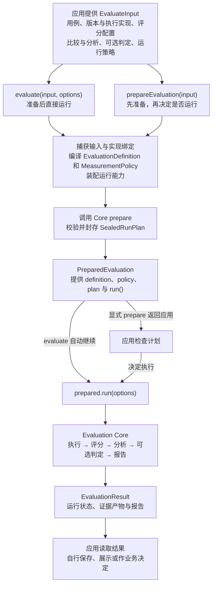

# 在 Node.js 服务中嵌入 OMK

这篇指南带你完成一次版本比较：先跑一个无需模型账号的示例，再换成自己的服务和用例，最后读懂结果。需要 Node.js 22 或更高版本，使用 ESM。

<a id="从哪里开始"></a>

## 1．先跑出一份结果

在 OMK 源码仓库根目录运行：

```bash
yarn install --immutable
yarn build
node examples/eval-runtime/run.mjs
```

示例使用固定答案模拟两个服务版本，不调用模型、不需要凭证，也不会启动 Studio。打开 [run.mjs](https://github.com/lizhiyao/oh-my-knowledge/blob/main/examples/eval-runtime/run.mjs)，后续操作都从这一个文件开始。

输出应包含：

```json
{"runStatus":"completed","estimate":0.3333333333333333,"verdict":"NOISE"}
```

这是完整输出中的三个字段：流程完成，候选版本的正确率高约 33.3 个百分点，但三条教学用例不足以确认进步。**跑通流程不等于有充分证据发布。**

独立项目安装 `npm install oh-my-knowledge@next zod`，再复制与你安装版本匹配的示例文件。`next` 是持续迭代的 Beta；若使用尚未发布的源码能力，请沿用上面的源码运行方式。

## 2．换成自己的服务和用例

先理解两个角色：

| 名称 | 负责什么 |
|---|---|
| `executor`（执行器） | 调用你的服务，返回实际答案。 |
| `evaluator`（评分器） | 根据标准答案或规则检查实际答案。 |

在示例文件中按顺序修改以下位置：

1. **`executor.execute()`：** 将固定的 `answers[...]` 查询替换为自己的服务调用。返回 `{ output, usage }`，把收到的 `signal` 传给服务，并上报真实用量，不能沿用演示数字。
2. **`dataset.samples`：** 将三条教学题替换为领域用例；`input` 是发送给服务的内容，`expected` 是供评分使用的答案，不要把它发送给被测模型。先人工复核用例与标注。
3. **`variants`：** 指定要比较的两个版本。若要测 prompt 改动，应让执行器实际使用 `artifact.content`，并保持模型、工具和其他条件一致；原演示只根据 `config.deployment` 返回固定答案，不是在验证 prompt 效果。
4. **执行器声明：** 同步修改输入、配置、输出的 schema，以及实现版本和能力声明。随机模型不能照抄 `deterministic`；没有种子控制能力时，使用下方的采样设置。

```js
// 替换示例的 experiment.sampling；其它 experiment 字段保留。
sampling: { samplingKind: 'paired', seedCoupling: 'uncontrolled' }
```

凭证和客户端放在执行器闭包中；`config` 与 `runtimeContext` 会进入评测记录，不放密钥。遇到调用失败应抛错或返回稳定的 `errorCode`，不要返回一个假答案让评分器按普通输出打分。

需要可照着改的完整模型服务代码，见[接入示例](./eval-runtime-scoring.md#exact-match-评测)。准备真实评测前，按服务容量配置[并发、超时和预算](./eval-runtime-infrastructure.md#生产策略)，费用以实际服务调用为准。

## 3．选择适合的评分方法

示例使用 `exact-match`：实际答案与标准答案完全相同才算正确，不自动去空格或忽略标点。它适合分类和固定格式任务。

| 你的任务 | 评分方法 |
|---|---|
| 返回固定标签或结构化答案 | [完全匹配](./eval-runtime-scoring.md#exact-match-评测) |
| 回答允许不同表述，需要判断正确性或完整性 | [LLM 评委](./eval-runtime-scoring.md#rubric-评委评测)，需要明确准则及额外模型调用 |
| 返回检索或推荐列表 | [检索指标](./eval-runtime-scoring.md#retrieval-评测)；需要空返回时看[召回与弃答](./eval-runtime-scoring.md#retrieval-abstention) |
| 检查工具使用过程 | [工具轨迹](./eval-runtime-scoring.md#工具轨迹评测)，同时另行检查最终答案 |
| 有业务专用规则 | [自定义评分器](./eval-runtime-scoring.md#custom-evaluator) |

改换指标后，同步更新 `comparisons` 和 `analyses` 引用的指标 ID。评分器产生逐条读数，`analyses` 才负责汇总和区间；只有需要自动判定时才配置 `decision`。

## 4．运行并读懂结果

真实执行前，可以把示例中的 `evaluate(input, options)` 拆成两步；这里的 `input` 指示例传给 `evaluate()` 的第一个对象：

```js
import { prepareEvaluation } from 'oh-my-knowledge';

const prepared = await prepareEvaluation(input);
console.log(prepared.estimatedWork);
// 检查计划后再调用；准备阶段不执行被测任务。
const result = await prepared.run();
```

<a id="read-results"></a>
<a id="如何解读结果"></a>

读结果按这个顺序：

1. **运行状态：** 处理异常，并检查 `result.status`。失败、取消或预算耗尽不能当成成功，失败时报告可能不存在。
2. **证据覆盖：** 查看 `result.analysisResults[analysisId]` 的状态和覆盖情况；调用失败、缺失和非法输出不是零分，也不能忽略。
3. **差异与区间：** `estimate` 是候选减对照的差值，正值仍不一定能确认进步。只在证据和分析允许的范围内解读结论。
4. **报告与后续动作：** 保留 `result.artifacts` 和 `result.report`，供自己的存储和界面使用。Runtime 不自动打开 Studio，也不会替你发布版本。

用代表性用例验证，保留独立验证集；不要只因教学示例出现正向差异就发布。需要完整字段解释，查 [Runtime API](../reference/eval-runtime-api.md)。

## 遇到问题先查这里

| 现象 | 下一步 |
|---|---|
| 运行前报 `EVAL_RUNTIME_INPUT_INVALID` | 核对 schema、引用 ID、执行器能力与采样设计。 |
| 答案意思正确，却被判错 | 检查完全匹配是否适合任务；开放回答可换 LLM 评委。 |
| 有分数，却没有均值或置信区间 | 检查 `analyses` 是否声明了对应指标，单独配置 `comparisons` 不会自动分析。 |
| `sourceUnavailable`、`invalid` 或 `inconclusive` | 检查调用、输出、标注与有效样本覆盖，不要用默认分数填补。 |
| 需要停止运行或避免长时间等待 | 接入 [signal、进度回调与超时](./eval-runtime-infrastructure.md#run-progress)。 |

## 按需深入

- [评分方法与完整接入代码](./eval-runtime-scoring.md)：完全匹配、LLM 评委、检索、工具轨迹与自定义规则。
- [实验设计与证据复用](./eval-runtime-experiments.md)：计划检查、可比性、重复评测、多指标与重评分。
- [运行与存储](./eval-runtime-infrastructure.md)：预算、缓存、证据保存、取消和组件检查。
- [Agent 接入](./eval-runtime-agents.md)：工作区、工具访问、MCP、mock 与会话。

## Runtime 接入流程

`eval-runtime` 把应用提供的输入与实现装配为 Core 契约，再驱动 Core 运行。它不维护第二套评分、调度或判定流程。



`evaluate(input, options)` 等价于准备后调用 `prepared.run(options)`。`runId`、`signal`、`onEvent` 等属于运行选项；`prepareEvaluation()` 固定评测契约，不执行被测任务。Core 内部各阶段见[单次评测流程](../explanation/architecture.md#单次评测流程)。

<details>
<summary>旧章节链接</summary>

<a id="评测术语"></a>

[评测术语](./eval-runtime-scoring.md#评测术语)

<a id="读懂代码中的几个名字"></a>

[读懂代码中的几个名字](./eval-runtime-scoring.md#读懂代码中的几个名字)

<a id="exact-match-评测"></a>

[exact-match-评测](./eval-runtime-scoring.md#exact-match-评测)

<a id="判断输出是否与标准答案完全一致exact-match"></a>

[判断输出是否与标准答案完全一致exact-match](./eval-runtime-scoring.md#判断输出是否与标准答案完全一致exact-match)

<a id="retrieval-评测"></a>

[retrieval-评测](./eval-runtime-scoring.md#retrieval-评测)

<a id="判断检索结果是否相关排序是否合理"></a>

[判断检索结果是否相关排序是否合理](./eval-runtime-scoring.md#判断检索结果是否相关排序是否合理)

<a id="retrieval-abstention"></a>

[retrieval-abstention](./eval-runtime-scoring.md#retrieval-abstention)

<a id="召回与空返回混合评测"></a>

[召回与空返回混合评测](./eval-runtime-scoring.md#召回与空返回混合评测)

<a id="工具轨迹评测"></a>

[工具轨迹评测](./eval-runtime-scoring.md#工具轨迹评测)

<a id="检查-agent-是否按要求调用工具"></a>

[检查-agent-是否按要求调用工具](./eval-runtime-scoring.md#检查-agent-是否按要求调用工具)

<a id="custom-evaluator"></a>

[custom-evaluator](./eval-runtime-scoring.md#custom-evaluator)

<a id="编写自己的评分规则custom-evaluator"></a>

[编写自己的评分规则custom-evaluator](./eval-runtime-scoring.md#编写自己的评分规则custom-evaluator)

<a id="rubric-评委评测"></a>

[rubric-评委评测](./eval-runtime-scoring.md#rubric-评委评测)

<a id="让-llm-按明确的评分标准评价答案"></a>

[让-llm-按明确的评分标准评价答案](./eval-runtime-scoring.md#让-llm-按明确的评分标准评价答案)

<a id="prepare-plan"></a>

[prepare-plan](./eval-runtime-experiments.md#prepare-plan)

<a id="先检查计划再决定是否运行"></a>

[先检查计划再决定是否运行](./eval-runtime-experiments.md#先检查计划再决定是否运行)

<a id="compare-runs"></a>

[compare-runs](./eval-runtime-experiments.md#compare-runs)

<a id="检查两次历史测量是否可比"></a>

[检查两次历史测量是否可比](./eval-runtime-experiments.md#检查两次历史测量是否可比)

<a id="重复运行稳定性"></a>

[重复运行稳定性](./eval-runtime-experiments.md#重复运行稳定性)

<a id="重复整轮评测检查结果是否稳定"></a>

[重复整轮评测检查结果是否稳定](./eval-runtime-experiments.md#重复整轮评测检查结果是否稳定)

<a id="reuse-stages"></a>

[reuse-stages](./eval-runtime-experiments.md#reuse-stages)

<a id="改了标注或统计方法后复用已有输出"></a>

[改了标注或统计方法后复用已有输出](./eval-runtime-experiments.md#改了标注或统计方法后复用已有输出)

<a id="independent-groups"></a>

[independent-groups](./eval-runtime-experiments.md#independent-groups)

<a id="让不同用例分配给不同版本"></a>

[让不同用例分配给不同版本](./eval-runtime-experiments.md#让不同用例分配给不同版本)

<a id="multiple-criteria"></a>

[multiple-criteria](./eval-runtime-experiments.md#multiple-criteria)

<a id="同时约束多个发布指标"></a>

[同时约束多个发布指标](./eval-runtime-experiments.md#同时约束多个发布指标)

<a id="composite-score"></a>

[composite-score](./eval-runtime-experiments.md#composite-score)

<a id="将多个指标合成为一个分数"></a>

[将多个指标合成为一个分数](./eval-runtime-experiments.md#将多个指标合成为一个分数)

<a id="executor-contract"></a>

[executor-contract](./eval-runtime-infrastructure.md#executor-contract)

<a id="接入服务时的输入错误与凭证约定"></a>

[接入服务时的输入错误与凭证约定](./eval-runtime-infrastructure.md#接入服务时的输入错误与凭证约定)

<a id="reference-证据与宿主内容存储"></a>

[reference-证据与宿主内容存储](./eval-runtime-infrastructure.md#reference-证据与宿主内容存储)

<a id="把较大或敏感的输出保存在自己的存储中"></a>

[把较大或敏感的输出保存在自己的存储中](./eval-runtime-infrastructure.md#把较大或敏感的输出保存在自己的存储中)

<a id="复用执行与评价结果"></a>

[复用执行与评价结果](./eval-runtime-infrastructure.md#复用执行与评价结果)

<a id="使用缓存减少重复调用"></a>

[使用缓存减少重复调用](./eval-runtime-infrastructure.md#使用缓存减少重复调用)

<a id="run-progress"></a>

[run-progress](./eval-runtime-infrastructure.md#run-progress)

<a id="接收进度与取消运行"></a>

[接收进度与取消运行](./eval-runtime-infrastructure.md#接收进度与取消运行)

<a id="生产策略"></a>

[生产策略](./eval-runtime-infrastructure.md#生产策略)

<a id="设置并发超时重试和预算"></a>

[设置并发超时重试和预算](./eval-runtime-infrastructure.md#设置并发超时重试和预算)

<a id="检查-runtime-组件"></a>

[检查-runtime-组件](./eval-runtime-infrastructure.md#检查-runtime-组件)

<a id="检查接入代码是否符合-omk-要求"></a>

[检查接入代码是否符合-omk-要求](./eval-runtime-infrastructure.md#检查接入代码是否符合-omk-要求)

<a id="高级接入与迁移"></a>

[高级接入与迁移](./eval-runtime-infrastructure.md#高级接入与迁移)

<a id="何时需要高级-api"></a>

[何时需要高级-api](./eval-runtime-infrastructure.md#何时需要高级-api)

<a id="内容寻址-workspace"></a>

[内容寻址-workspace](./eval-runtime-agents.md#内容寻址-workspace)

<a id="为-agent-提供相互隔离的文件工作区"></a>

[为-agent-提供相互隔离的文件工作区](./eval-runtime-agents.md#为-agent-提供相互隔离的文件工作区)

<a id="按用例约束工具访问"></a>

[按用例约束工具访问](./eval-runtime-agents.md#按用例约束工具访问)

<a id="按用例选择原生-mcp-配置"></a>

[按用例选择原生-mcp-配置](./eval-runtime-agents.md#按用例选择原生-mcp-配置)

<a id="按-attempt-隔离-mock-interception"></a>

[按-attempt-隔离-mock-interception](./eval-runtime-agents.md#按-attempt-隔离-mock-interception)

<a id="用模拟结果替换指定工具调用"></a>

[用模拟结果替换指定工具调用](./eval-runtime-agents.md#用模拟结果替换指定工具调用)

<a id="有状态-agent-session"></a>

[有状态-agent-session](./eval-runtime-agents.md#有状态-agent-session)

<a id="为多步-agent-保留一次评测内的会话"></a>

[为多步-agent-保留一次评测内的会话](./eval-runtime-agents.md#为多步-agent-保留一次评测内的会话)

</details>
